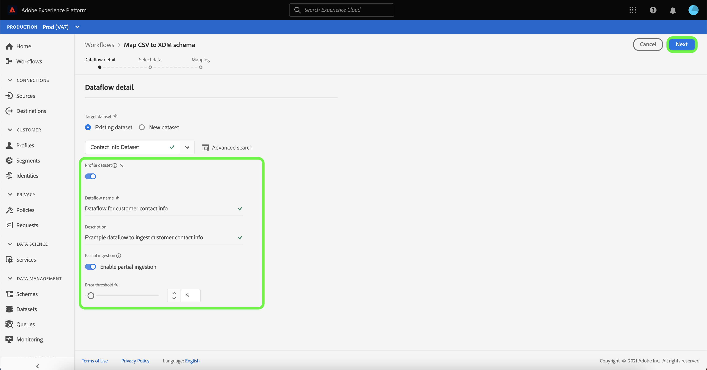
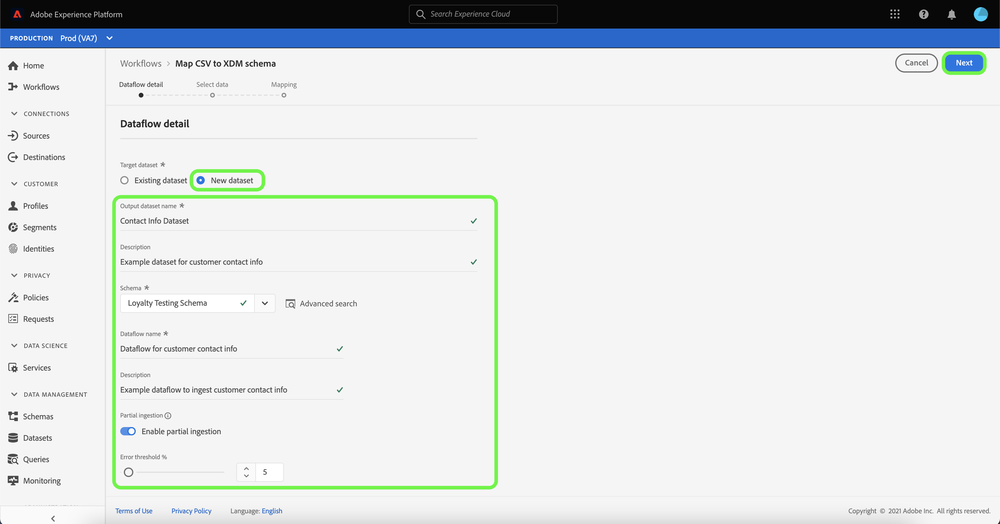
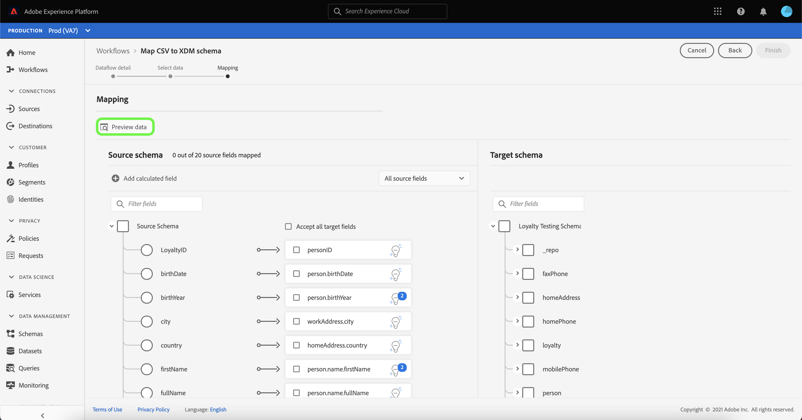
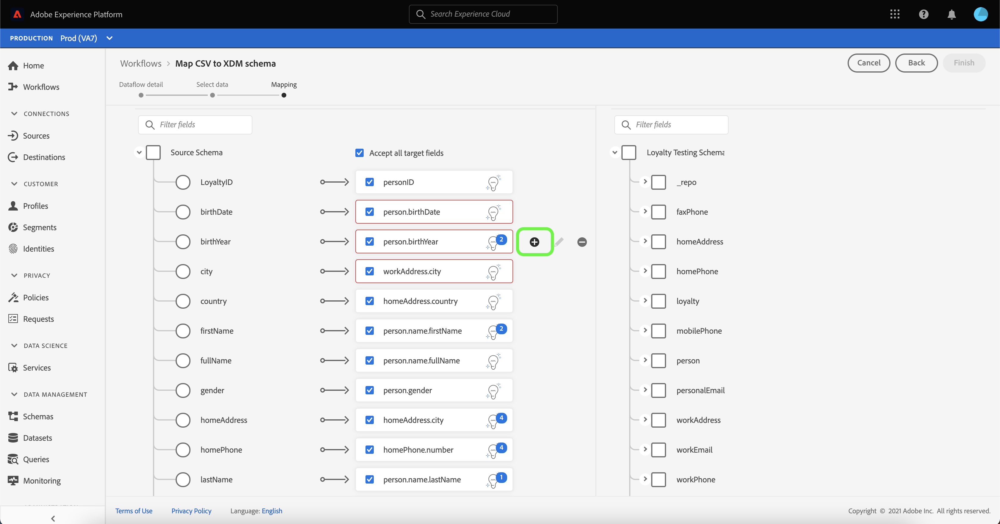

# Creare un connettore di origine per il caricamento di file locale nell’interfaccia utente

Questa esercitazione fornisce i passaggi necessari per creare un connettore di origine per il caricamento di file locali per acquisire file locali in Platform utilizzando l’interfaccia utente di .

## Introduzione

Questa esercitazione richiede una buona comprensione dei seguenti componenti di Platform:

* [[!DNL Experience Data Model (XDM)] Sistema](../../../../../xdm/home.md): Il framework standardizzato tramite il quale Platform organizza i dati sulla customer experience.
   * [Nozioni di base sulla composizione](../../../../../xdm/schema/composition.md) dello schema: Scopri i blocchi di base degli schemi XDM, inclusi i principi chiave e le best practice nella composizione dello schema.
   * [Esercitazione](../../../../../xdm/tutorials/create-schema-ui.md) dell’Editor di schema: Scopri come creare schemi personalizzati utilizzando l’interfaccia utente dell’Editor di schema.
* [[!DNL Real-time Customer Profile]](../../../../../profile/home.md): Fornisce un profilo di consumatore unificato e in tempo reale basato su dati aggregati provenienti da più origini.

## Caricare file locali in Platform

Nell’interfaccia utente di Platform, seleziona **[!UICONTROL Origini]** dalla barra di navigazione a sinistra per accedere all’area di lavoro [!UICONTROL Origini]. La schermata [!UICONTROL Catalogo] visualizza una varietà di sorgenti per le quali è possibile creare un account.

Puoi selezionare la categoria appropriata dal catalogo sul lato sinistro dello schermo. In alternativa, è possibile trovare la sorgente specifica con cui si desidera lavorare utilizzando l’opzione di ricerca.

Sotto la categoria [!UICONTROL Sistema locale], selezionare **[!UICONTROL Caricamento file locale]**, quindi selezionare **[!UICONTROL Configura]**.

### Utilizzare un set di dati esistente

La pagina [!UICONTROL Dettaglio flusso di dati] ti consente di selezionare se desideri acquisire i dati CSV in un set di dati esistente o in un nuovo set di dati.

Per acquisire i dati CSV in un set di dati esistente, seleziona **[!UICONTROL Set di dati esistente]**. Puoi recuperare un set di dati esistente utilizzando l’opzione [!UICONTROL Ricerca avanzata] oppure scorrendo l’elenco dei set di dati esistenti nel menu a discesa.

Con un set di dati selezionato, fornisci un nome per il flusso di dati e una descrizione facoltativa.

Durante questo processo, puoi anche abilitare [!UICONTROL Diagnostica errori] e [!UICONTROL Acquisizione parziale]. [!UICONTROL La ] diagnostica degli errori consente di generare messaggi di errore dettagliati per tutti i record errati presenti nel flusso di dati, mentre l’ [!UICONTROL acquisizione ] parziale consente di acquisire i dati contenenti errori, fino a una determinata soglia definita manualmente. Per ulteriori informazioni, consulta la [panoramica sull’acquisizione parziale dei batch](../../../../../ingestion/batch-ingestion/partial.md) .

### Utilizzare un nuovo set di dati

Per acquisire i dati CSV in un nuovo set di dati, seleziona **[!UICONTROL Nuovo set di dati]** e fornisci un nome del set di dati di output e una descrizione facoltativa. Quindi, seleziona uno schema da mappare utilizzando l&#39;opzione [!UICONTROL Ricerca avanzata] oppure scorrendo l&#39;elenco degli schemi esistenti nel menu a discesa.

Con uno schema selezionato, fornisci un nome per il flusso di dati e una descrizione facoltativa, quindi applica le impostazioni [!UICONTROL Diagnostica errori] e [!UICONTROL Acquisizione parziale] desiderate per il flusso di dati. Al termine, seleziona **[!UICONTROL Avanti]**.

### Seleziona dati

Viene visualizzato il passaggio [!UICONTROL Seleziona dati] , che fornisce un’interfaccia per caricare i file locali e visualizzarne in anteprima la struttura e il contenuto. Seleziona **[!UICONTROL Scegli file]** per caricare un file CSV dal sistema locale. In alternativa, puoi trascinare e rilasciare il file CSV da caricare nel pannello [!UICONTROL Trascina e rilascia i file] .

>[!TIP]
>
>Solo i file CSV sono attualmente supportati dal caricamento di file locale. La dimensione massima del file per ciascun file è 1 GB.

Una volta caricato il file, l’interfaccia di anteprima si aggiorna per visualizzare il contenuto e la struttura del file.

A seconda del file, è possibile selezionare un delimitatore di colonna, ad esempio tabulazioni, virgole, barre verticali o un delimitatore di colonna personalizzato per i dati di origine. Seleziona la freccia a discesa **[!UICONTROL Delimitatore]** , quindi seleziona il delimitatore appropriato dal menu.

Al termine, seleziona **[!UICONTROL Avanti]**.

### Mappatura

Viene visualizzato il passaggio [!UICONTROL Mapping] , che fornisce un’interfaccia per mappare i campi di origine dallo schema di origine ai campi XDM di destinazione appropriati nello schema di destinazione.

#### Anteprima dati

Seleziona **[!UICONTROL Anteprima dati]** per visualizzare i risultati della mappatura di fino a 100 righe di dati di esempio dal set di dati selezionato.

Durante l’anteprima, la colonna Identity ha la priorità come primo campo, in quanto rappresenta le informazioni chiave necessarie per la convalida dei risultati della mappatura. Al termine, selezionare **[!UICONTROL Chiudi]**.

#### Aggiungi campo calcolato

I campi calcolati consentono la creazione di valori in base agli attributi nello schema di input. Questi valori possono quindi essere assegnati agli attributi nello schema di destinazione e ricevere un nome e una descrizione per facilitarne il riferimento.

Selezionare il pulsante **[!UICONTROL Aggiungi campo calcolato]** per continuare.

Viene visualizzato il pannello [!UICONTROL Crea campo calcolato] . La finestra di dialogo a sinistra contiene i campi, le funzioni e gli operatori supportati nei campi calcolati. Seleziona una delle schede per iniziare ad aggiungere funzioni, campi o operatori all’editor di espressioni.

| Scheda | Descrizione |
| --------- | ----------- |
| Funzione | Nella scheda Funzioni sono elencate le funzioni disponibili per la trasformazione dei dati. Per ulteriori informazioni sulle funzioni che è possibile utilizzare all&#39;interno dei campi calcolati, leggere la guida sulle funzioni [Preparazione dati (mappatore)](../../../../../data-prep/functions.md). |
| Campo | Nella scheda Campi sono elencati i campi e gli attributi disponibili nello schema di origine. |
| Operatore | La scheda operatori elenca gli operatori disponibili per la trasformazione dei dati. |

Seleziona l’editor di espressioni per aggiungere manualmente campi, funzioni e operatori. Dopo aver creato un campo calcolato, selezionare **[!UICONTROL Salva]** per continuare.

#### Struttura di mappatura dello schema di origine del filtro

Per filtrare lo schema di origine, selezionare **[!UICONTROL Tutti i campi di origine]**, quindi selezionare il campo specifico da mappare dal menu a discesa.

Nella tabella seguente sono visualizzate le opzioni di ordinamento per la struttura dello schema di origine:

| Campi di origine | Descrizione |
| --- | --- |
| [!UICONTROL Tutti i campi di origine] | Questa opzione visualizza tutti i campi di origine dello schema di origine. Questa opzione è visualizzata per impostazione predefinita. |
| [!UICONTROL Campi obbligatori] | Questa opzione filtra lo schema di origine per visualizzare solo i campi necessari per completare la mappatura. |
| [!UICONTROL Campi di identità] | Questa opzione filtra lo schema di origine per visualizzare solo i campi contrassegnati per l’identità. |
| [!UICONTROL Campi mappati] | Questa opzione filtra lo schema di origine per visualizzare solo i campi che sono già stati mappati. |
| [!UICONTROL Campi non mappati] | Questa opzione filtra lo schema di origine per visualizzare solo i campi che devono ancora essere mappati. |
| [!UICONTROL Campi con raccomandazione] | Questa opzione filtra lo schema di origine per visualizzare solo i campi che contengono consigli di mappatura. |

#### Raccomandazioni intelligenti

Platform fornisce automaticamente raccomandazioni intelligenti per i campi mappati automaticamente in base allo schema o al set di dati di destinazione selezionato. Puoi regolare manualmente le regole di mappatura in base ai tuoi casi d’uso.

Per accettare tutti i valori di mappatura di generazione automatica, seleziona **[!UICONTROL Accetta tutti i campi di destinazione]**.

A volte, per lo schema di origine sono disponibili più consigli. In questo caso, la scheda di mappatura visualizza la raccomandazione più importante, seguita da un cerchio blu che contiene il numero di raccomandazioni aggiuntive disponibili. Selezionando l’icona della lampadina viene visualizzato un elenco dei consigli aggiuntivi. Potete scegliere una delle raccomandazioni alternative selezionando la casella di controllo accanto alla raccomandazione a cui desiderate eseguire la mappatura.

In alternativa, puoi scegliere di mappare manualmente lo schema di origine sullo schema di destinazione. A questo scopo, passa il puntatore del mouse sullo schema di origine da mappare, quindi seleziona l’icona più (`+`).

Viene visualizzato il puntatore **[!UICONTROL Mappatura origine a campo di destinazione]** . Da qui puoi selezionare il campo da mappare, seguito da **[!UICONTROL Salva]** per aggiungere la nuova mappatura.

Al termine, selezionare **[!UICONTROL Finished]**.

## Monitorare l’acquisizione di dati

Una volta mappato e creato il file CSV, puoi monitorare i dati che vengono acquisiti tramite il dashboard di monitoraggio. Per ulteriori informazioni, consulta l’esercitazione sui flussi di dati [sorgenti di monitoraggio nell’interfaccia utente](../../../../../dataflows/ui/monitor-sources.md).

## Passaggi successivi

Seguendo questa esercitazione, hai mappato correttamente un file CSV flat in uno schema XDM e lo hai acquisito in Platform. Questi dati possono ora essere utilizzati dai servizi a valle [!DNL Platform] come [!DNL Real-time Customer Profile]. Per ulteriori informazioni, consulta la panoramica di [[!DNL Real-time Customer Profile]](../../../../../profile/home.md) .
