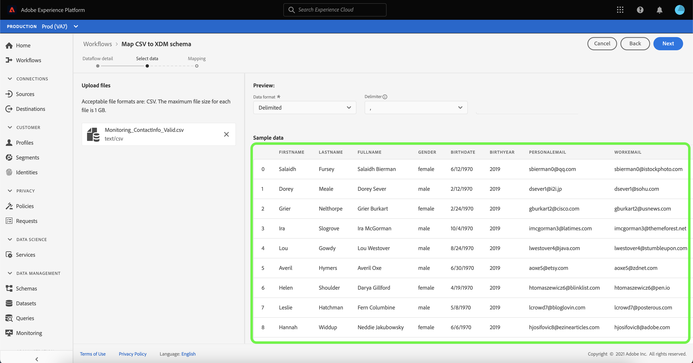

# Creare un connettore di origine per il caricamento di file locale nell’interfaccia utente

Questa esercitazione fornisce i passaggi necessari per creare un connettore di origine per il caricamento di file locali per acquisire file locali in Platform utilizzando l’interfaccia utente di .

## Introduzione

Questa esercitazione richiede una buona comprensione dei seguenti componenti di Platform:

* [[!DNL Experience Data Model (XDM)] Sistema](../../../../../xdm/home.md): Il framework standardizzato tramite il quale Platform organizza i dati sulla customer experience.
   * [Nozioni di base sulla composizione dello schema](../../../../../xdm/schema/composition.md): Scopri i blocchi di base degli schemi XDM, inclusi i principi chiave e le best practice nella composizione dello schema.
   * [Esercitazione sull’Editor di schema](../../../../../xdm/tutorials/create-schema-ui.md): Scopri come creare schemi personalizzati utilizzando l’interfaccia utente dell’Editor di schema.
* [[!DNL Real-time Customer Profile]](../../../../../profile/home.md): Fornisce un profilo di consumatore unificato e in tempo reale basato su dati aggregati provenienti da più origini.

## Caricare file locali in Platform

Nell’interfaccia utente di Platform, seleziona **[!UICONTROL Origini]** dalla barra di navigazione a sinistra per accedere al [!UICONTROL Origini] workspace. La [!UICONTROL Catalogo] in questa schermata vengono visualizzate diverse origini per le quali è possibile creare un account.

Puoi selezionare la categoria appropriata dal catalogo sul lato sinistro dello schermo. In alternativa, è possibile trovare la sorgente specifica con cui si desidera lavorare utilizzando l’opzione di ricerca.

Sotto la [!UICONTROL Sistema locale] categoria, seleziona **[!UICONTROL Caricamento file locale]**, quindi seleziona **[!UICONTROL Aggiungi dati]**.

### Utilizzare un set di dati esistente

La [!UICONTROL Dettaglio flusso di dati] consente di selezionare se si desidera acquisire i dati CSV in un set di dati esistente o in un nuovo set di dati.

Per acquisire i dati CSV in un set di dati esistente, seleziona **[!UICONTROL Set di dati esistente]**. Puoi recuperare un set di dati esistente utilizzando [!UICONTROL Ricerca avanzata] o scorrendo l’elenco dei set di dati esistenti nel menu a discesa.

Con un set di dati selezionato, fornisci un nome per il flusso di dati e una descrizione facoltativa.

Durante questo processo, puoi anche abilitare [!UICONTROL Diagnostica degli errori] e [!UICONTROL Acquisizione parziale]. [!UICONTROL Diagnostica degli errori] consente la generazione dettagliata dei messaggi di errore per tutti i record errati che si verificano nel flusso di dati, mentre [!UICONTROL Acquisizione parziale] consente di acquisire dati contenenti errori, fino a una determinata soglia definita manualmente. Consulta la sezione [panoramica dell’acquisizione parziale in batch](../../../../../ingestion/batch-ingestion/partial.md) per ulteriori informazioni.

### Utilizzare un nuovo set di dati

Per acquisire i dati CSV in un nuovo set di dati, seleziona **[!UICONTROL Nuovo set di dati]** e quindi fornisci il nome di un set di dati di output e una descrizione facoltativa. Quindi, seleziona uno schema a cui eseguire il mapping utilizzando [!UICONTROL Ricerca avanzata] oppure scorrendo l’elenco degli schemi esistenti nel menu a discesa.

Con uno schema selezionato, fornisci un nome per il flusso di dati e una descrizione facoltativa, quindi applica il [!UICONTROL Diagnostica degli errori] e [!UICONTROL Acquisizione parziale] impostazioni desiderate per il flusso di dati. Al termine, seleziona **[!UICONTROL Successivo]**.

### Seleziona dati

La [!UICONTROL Seleziona dati] viene visualizzato un passaggio che fornisce un’interfaccia per caricare i file locali e visualizzarne l’anteprima di struttura e contenuti. Seleziona **[!UICONTROL Scegliere i file]** per caricare un file CSV dal sistema locale. In alternativa, puoi trascinare e rilasciare il file CSV da caricare nel [!UICONTROL Trascinamento di file] pannello.

>[!TIP]
>
>Solo i file CSV sono attualmente supportati dal caricamento di file locale. La dimensione massima del file per ciascun file è 1 GB.

Una volta caricato il file, l’interfaccia di anteprima si aggiorna per visualizzare il contenuto e la struttura del file.

A seconda del file, è possibile selezionare un delimitatore di colonna, ad esempio tabulazioni, virgole, barre verticali o un delimitatore di colonna personalizzato per i dati di origine. Seleziona la **[!UICONTROL Delimitatore]** freccia a discesa, quindi selezionare il delimitatore appropriato dal menu.

Al termine, seleziona **[!UICONTROL Successivo]**.

## Mappatura

La [!UICONTROL Mappatura] viene visualizzato un passaggio che fornisce un&#39;interfaccia per mappare i campi di origine dallo schema di origine ai campi XDM di destinazione appropriati nello schema di destinazione.

In base alle tue esigenze, puoi scegliere di mappare direttamente i campi oppure utilizzare le funzioni di preparazione dei dati per trasformare i dati di origine in valori calcolati o calcolati. Per i passaggi completi sull&#39;utilizzo dell&#39;interfaccia di mappatura, vedi [Guida all’interfaccia utente della preparazione dei dati](../../../../../data-prep/ui/mapping.md).

Una volta pronti i set di mappatura, seleziona **[!UICONTROL Fine]** e consente di creare alcuni momenti per il nuovo flusso di dati.

## Monitorare l’acquisizione di dati

Una volta mappato e creato il file CSV, puoi monitorare i dati che vengono acquisiti tramite il dashboard di monitoraggio. Per ulteriori informazioni, consulta l’esercitazione su [monitoraggio dei flussi di dati di origini nell’interfaccia utente](../../../../../dataflows/ui/monitor-sources.md).

## Passaggi successivi

Seguendo questa esercitazione, hai mappato correttamente un file CSV flat in uno schema XDM e lo hai acquisito in Platform. Questi dati possono ora essere utilizzati da downstream [!DNL Platform] servizi quali [!DNL Real-time Customer Profile]. Consulta la panoramica di [[!DNL Real-time Customer Profile]](../../../../../profile/home.md) per ulteriori informazioni.
