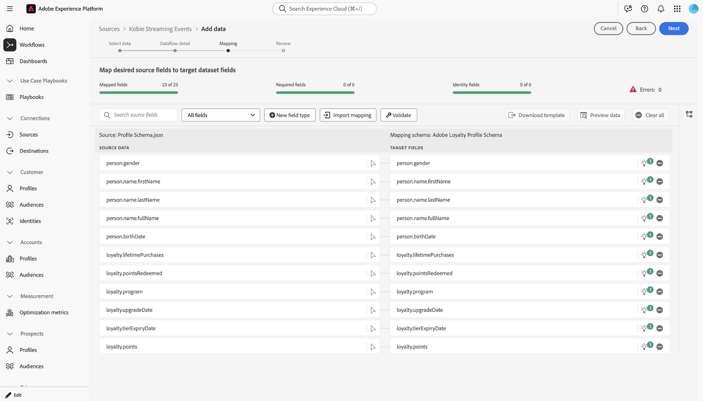
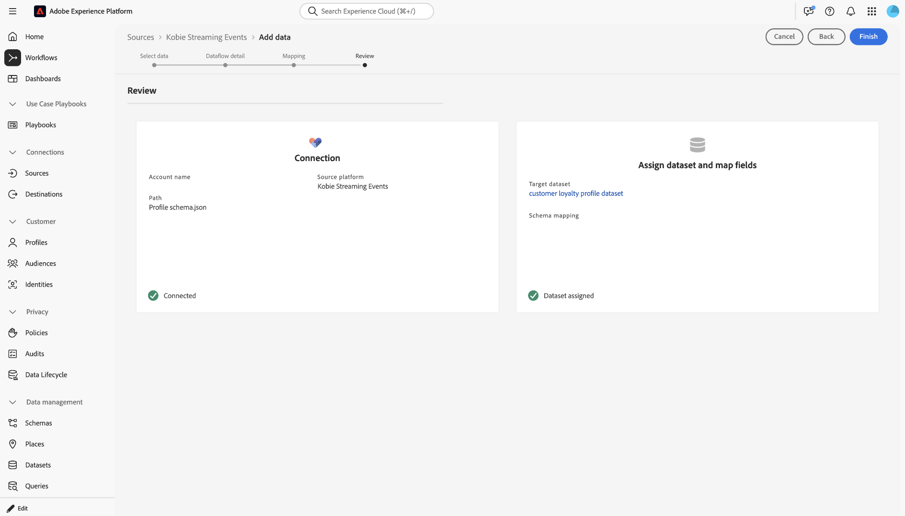

# Trasmetti dati da [!DNL Kobie Streaming Events] ad Experience Platform utilizzando l&#39;interfaccia utente

[!DNL Kobie Alchemy Loyalty Cloud (KALC)] è una piattaforma MACH altamente configurabile, sicura e scalabile che si adatta alla tua strategia di fidelizzazione, accelerando il time-to-value, migliorando l&#39;efficienza e salvaguardando il tuo marchio con la governance di livello enterprise. Grazie alle integrazioni ottimizzate tra CDP, CRM, CMS e altro ancora, [!DNL KALC] consente agli addetti al marketing di distribuire personalizzazioni in tempo reale su ogni canale, fornendo al contempo la flessibilità e la tracciabilità necessarie per evolvere con la crescita della fedeltà al marchio.

Leggi questa guida per scoprire come connettere e inviare in streaming i dati da [!DNL Kobie Streaming Events] a Adobe Experience Platform utilizzando l&#39;area di lavoro origini nell&#39;interfaccia utente.

>[!IMPORTANT]
>
>Per informazioni sulla configurazione e la mappatura dei prerequisiti, contattare direttamente il rappresentante [!DNL Kobie Client Services].

## Introduzione

Questo tutorial richiede una buona conoscenza dei seguenti componenti di Experience Platform:

* [[!DNL Experience Data Model (XDM)] Sistema](../../../../../xdm/home.md): framework standardizzato tramite il quale Experience Platform organizza i dati sull&#39;esperienza del cliente.
   * [Nozioni di base sulla composizione dello schema](../../../../../xdm/schema/composition.md): scopri i blocchi predefiniti di base degli schemi XDM, inclusi i principi chiave e le best practice nella composizione dello schema.
   * [Esercitazione sull&#39;editor di schemi](../../../../../xdm/tutorials/create-schema-ui.md): scopri come creare schemi personalizzati utilizzando l&#39;interfaccia utente dell&#39;editor di schemi.
* [[!DNL Real-Time Customer Profile]](../../../../../profile/home.md): fornisce un profilo consumer unificato e in tempo reale basato su dati aggregati provenienti da più origini.

## Navigare nel catalogo delle origini

Nell&#39;interfaccia utente di Experience Platform, selezionare **[!UICONTROL Sources]** dal menu di navigazione a sinistra per accedere all&#39;area di lavoro *[!UICONTROL Sources]*. Selezionare la categoria appropriata nel pannello *[!UICONTROL Categories]*. In alternativa, utilizza la barra di ricerca per passare all’origine specifica che desideri utilizzare.

Per eseguire lo streaming dei dati da [!DNL Kobie], selezionare la scheda di origine **[!UICONTROL Kobie Streaming Events]** in *[!UICONTROL Loyalty]*, quindi selezionare **[!UICONTROL Add data]**.

>[!TIP]
>
>Le origini nel catalogo origini visualizzano l&#39;opzione **[!UICONTROL Set up]** quando una determinata origine non dispone ancora di un account autenticato. Una volta creato un account autenticato, questa opzione diventa **[!UICONTROL Add data]**.

## Selezionare i dati

Quindi, utilizza l&#39;interfaccia *[!UICONTROL Select data]* per caricare un file JSON di esempio per definire lo schema di origine. Durante questo passaggio, puoi utilizzare l’interfaccia di anteprima per visualizzare la struttura del file del payload. Al termine, selezionare **[!UICONTROL Next]**.

## Dettagli del flusso di dati

Quindi, devi fornire informazioni relative al set di dati e al flusso di dati.

### Dettagli set di dati

Un set di dati è un costrutto di archiviazione e gestione per una raccolta di dati, in genere una tabella, che contiene uno schema (colonne/campi) e record (righe). I dati acquisiti correttamente in Experience Platform vengono memorizzati nel data lake come set di dati.

Durante questo passaggio, puoi utilizzare un set di dati esistente o crearne uno nuovo.

>[!NOTE]
>
>Indipendentemente dal fatto che si utilizzi un set di dati esistente o si crei un nuovo set di dati, è necessario assicurarsi che il set di dati sia **abilitato per l&#39;acquisizione del profilo**.

+++Seleziona per i passaggi per abilitare l’acquisizione del profilo, la diagnostica degli errori e l’acquisizione parziale.

Se il set di dati è abilitato per Real-Time Customer Profile, durante questo passaggio puoi attivare/disattivare **[!UICONTROL Profile dataset]** per abilitare i dati per l&#39;acquisizione del profilo. È inoltre possibile utilizzare questo passaggio per abilitare **[!UICONTROL Error diagnostics]** e **[!UICONTROL Partial ingestion]**.

* **[!UICONTROL Error diagnostics]**: selezionare **[!UICONTROL Error diagnostics]** per indicare all&#39;origine di produrre diagnostica degli errori a cui fare successivamente riferimento durante il monitoraggio dell&#39;attività del set di dati e dello stato del flusso di dati.
* **[!UICONTROL Partial ingestion]**: l&#39;acquisizione in batch parziale consente di acquisire dati contenenti errori, fino a una determinata soglia configurabile. Questa funzione consente di acquisire correttamente in Experience Platform tutti i dati accurati, mentre tutti i dati errati vengono raggruppati separatamente con informazioni sul motivo della validità.

+++

### Dettagli del flusso di dati

Una volta configurato il set di dati, devi quindi fornire dettagli sul flusso di dati, tra cui un nome, una descrizione facoltativa e le configurazioni degli avvisi.

| Configurazioni del flusso di dati | Descrizione |
| --- | --- |
| Nome flusso di dati | Nome del flusso di dati. Per impostazione predefinita, viene utilizzato il nome del file che si sta importando. |
| Descrizione | (Facoltativo) Breve descrizione del flusso di dati. |
| Avvisi | Experience Platform può generare avvisi basati su eventi a cui gli utenti possono abbonarsi; queste opzioni consentono a un flusso di dati in esecuzione di attivarli.  Per ulteriori informazioni, leggere la [panoramica degli avvisi](../../alerts.md) <ul><li>**Inizio esecuzione flusso di dati origini**: selezionare questo avviso per ricevere una notifica all&#39;inizio dell&#39;esecuzione del flusso di dati.</li><li>**Esecuzione del flusso di dati origini completata**: selezionare questo avviso per ricevere una notifica se il flusso di dati termina senza errori.</li><li>**Errore di esecuzione del flusso di dati di origini**: selezionare questo avviso per ricevere una notifica se l&#39;esecuzione del flusso di dati termina con errori.</li></ul> |

{style="table-layout:auto"}

## Mappatura

Utilizza l’interfaccia di mappatura per mappare i dati di origine sui campi dello schema appropriati prima di acquisire i dati in Experience Platform. Per ulteriori informazioni, leggere la [guida alla mappatura nell&#39;interfaccia utente](../../../../../data-prep/ui/mapping.md).

## Rivedi

Viene visualizzato il passaggio *[!UICONTROL Review]*, che consente di rivedere i dettagli del flusso di dati prima che venga creato. I dettagli sono raggruppati nelle seguenti categorie:

* **[!UICONTROL Connection]**: mostra il nome dell&#39;account, la piattaforma di origine e il nome di origine.
* **[!UICONTROL Assign dataset and map fields]**: mostra il set di dati di destinazione e lo schema a cui il set di dati aderisce.

Dopo aver confermato che i dettagli sono corretti, selezionare **[!UICONTROL Finish]**.

## Recuperare l’URL dell’endpoint di streaming

Una volta creata la connessione, viene visualizzata la pagina dei dettagli delle origini. Questa pagina mostra i dettagli della connessione appena creata, inclusi i flussi di dati, l’ID e l’URL dell’endpoint di streaming eseguiti in precedenza.

## Monitorare il flusso di dati

Una volta creato il flusso di dati, puoi monitorare i dati che vengono acquisiti tramite di esso per visualizzare informazioni su tassi di acquisizione, successo ed errori. Per ulteriori informazioni su come monitorare il flusso di dati, consulta l&#39;esercitazione su [account di monitoraggio e flussi di dati nell&#39;interfaccia utente](../../monitor-streaming.md).
