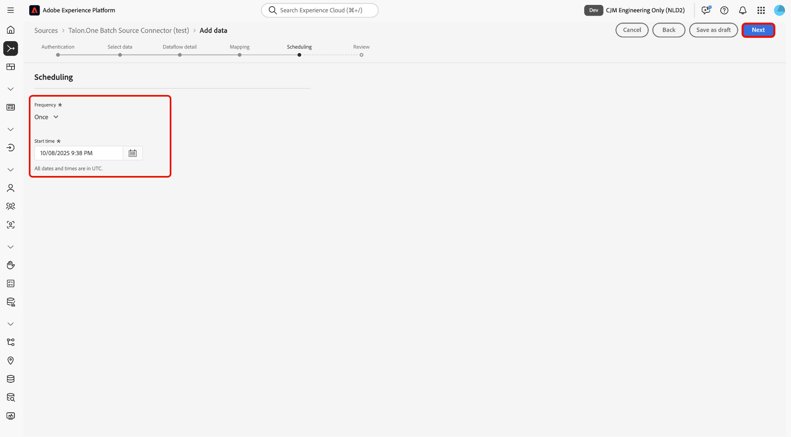

# Acquisire dati batch da [!DNL Talon.One] in Experience Platform utilizzando l&#39;interfaccia utente

>[!AVAILABILITY]
>
>L&#39;origine [!DNL Talon.One] è in versione beta. Leggi i [termini e condizioni](../../../../home.md#terms-and-conditions) nella panoramica delle origini per ulteriori informazioni sull&#39;utilizzo di origini con etichetta beta.

Leggi questo tutorial per scoprire come acquisire dati batch dall&#39;account [!DNL Talon.One] in Adobe Experience Platform utilizzando l&#39;area di lavoro origini nell&#39;interfaccia utente.

## Introduzione

Questo tutorial richiede una buona conoscenza dei seguenti componenti di Experience Platform:

* [[!DNL Experience Data Model (XDM)] Sistema](../../../../../xdm/home.md): framework standardizzato tramite il quale Experience Platform organizza i dati sull&#39;esperienza del cliente.
   * [Nozioni di base sulla composizione dello schema](../../../../../xdm/schema/composition.md): scopri i blocchi predefiniti di base degli schemi XDM, inclusi i principi chiave e le best practice nella composizione dello schema.
   * [Esercitazione sull&#39;editor di schemi](../../../../../xdm/tutorials/create-schema-ui.md): scopri come creare schemi personalizzati utilizzando l&#39;interfaccia utente dell&#39;editor di schemi.
* [[!DNL Real-Time Customer Profile]](../../../../../profile/home.md): fornisce un profilo consumer unificato e in tempo reale basato su dati aggregati provenienti da più origini.

>[!IMPORTANT]
>
>Leggi la [[!DNL Talon.One] panoramica](../../../../connectors/loyalty/talon-one.md) per scoprire i passaggi necessari per completare i prerequisiti prima di collegare l&#39;account ad Experience Platform.

## Navigare nel catalogo delle origini

Nell&#39;interfaccia utente di Experience Platform, seleziona **[!UICONTROL Origini]** dal menu di navigazione a sinistra per accedere all&#39;area di lavoro *[!UICONTROL Origini]*. Seleziona la categoria appropriata nel pannello *[!UICONTROL Categorie]*. In alternativa, utilizza la barra di ricerca per passare all’origine specifica che desideri utilizzare.

Per acquisire i dati da [!DNL Talon.One], selezionare la scheda di origine **[!UICONTROL Connettore Source Batch Talon.One]** in *[!UICONTROL Fedeltà]*, quindi selezionare **[!UICONTROL Aggiungi dati]**.

>[!TIP]
>
>Le origini nel catalogo delle origini visualizzano l&#39;opzione **[!UICONTROL Configura]** quando un&#39;origine specificata non dispone ancora di un account autenticato. Una volta creato un account autenticato, questa opzione diventa **[!UICONTROL Aggiungi dati]**.

### Crea un nuovo account

Per creare un nuovo account per l&#39;origine [!DNL Talon.One], selezionare **[!UICONTROL Nuovo account]** e fornire un nome e una descrizione facoltativa per l&#39;account. Quindi, fornisci il tuo dominio [!DNL Talon.One] e la tua chiave API di gestione [!UICONTROL Talon.One]. Al termine, selezionare **[!UICONTROL Connetti all&#39;origine]** e attendere alcuni istanti prima di stabilire la connessione.

### Usa un account esistente

Per utilizzare un account esistente, selezionare **[!UICONTROL Account esistente]** e selezionare l&#39;account [!DNL Talon.One] che si desidera utilizzare dall&#39;interfaccia account.

## Selezionare i dati

Dopo aver eseguito l&#39;autenticazione, fornire i valori per **applicationId** e **sessionType**. Durante questo passaggio, puoi utilizzare le funzionalità di anteprima per controllare la struttura dei dati. Al termine, selezionare **[!UICONTROL Avanti]** per continuare.

## Configurare i dettagli del set di dati e del flusso di dati

Quindi, devi fornire informazioni relative al set di dati e al flusso di dati.

### Dettagli del set di dati

Un set di dati è un costrutto di archiviazione e gestione per una raccolta di dati, in genere una tabella, che contiene uno schema (colonne/campi) e record (righe). I dati acquisiti correttamente in Experience Platform vengono memorizzati nel data lake come set di dati.

Durante questo passaggio, puoi utilizzare un set di dati esistente o crearne uno nuovo.

>[!NOTE]
>
>Indipendentemente dal fatto che si utilizzi un set di dati esistente o si crei un nuovo set di dati, è necessario assicurarsi che il set di dati sia **abilitato per l&#39;acquisizione del profilo**.

+++Seleziona per i passaggi per abilitare l’acquisizione del profilo, la diagnostica degli errori e l’acquisizione parziale.

Se il set di dati è abilitato per Real-Time Customer Profile, durante questo passaggio puoi attivare/disattivare **[!UICONTROL il set di dati profilo]** per abilitare i dati per l&#39;acquisizione del profilo. È inoltre possibile utilizzare questo passaggio per abilitare **[!UICONTROL Diagnostica errori]** e **[!UICONTROL Acquisizione parziale]**.

* **[!UICONTROL Diagnostica errori]**: selezionare **[!UICONTROL Diagnostica errori]** per indicare all&#39;origine di produrre diagnostica errori a cui fare successivamente riferimento durante il monitoraggio dell&#39;attività del set di dati e dello stato del flusso di dati.
* **[!UICONTROL Acquisizione parziale]**: l&#39;acquisizione parziale in batch consente di acquisire dati contenenti errori, fino a una determinata soglia configurabile. Questa funzione consente di acquisire correttamente in Experience Platform tutti i dati accurati, mentre tutti i dati errati vengono raggruppati separatamente con informazioni sul motivo della validità.

+++

## Dettagli del flusso di dati

Una volta configurato il set di dati, devi quindi fornire dettagli sul flusso di dati, tra cui un nome, una descrizione facoltativa e le configurazioni degli avvisi.

| Configurazioni del flusso di dati | Descrizione |
| --- | --- |
| Nome flusso di dati | Nome del flusso di dati. Per impostazione predefinita, viene utilizzato il nome del file che si sta importando. |
| Descrizione | (Facoltativo) Breve descrizione del flusso di dati. |
| Avvisi | Experience Platform può generare avvisi basati su eventi a cui gli utenti possono abbonarsi; queste opzioni consentono a un flusso di dati in esecuzione di attivarli.  Per ulteriori informazioni, leggere la [panoramica degli avvisi](../../alerts.md) <ul><li>**Inizio esecuzione flusso di dati origini**: selezionare questo avviso per ricevere una notifica all&#39;inizio dell&#39;esecuzione del flusso di dati.</li><li>**Esecuzione del flusso di dati origini completata**: selezionare questo avviso per ricevere una notifica se il flusso di dati termina senza errori.</li><li>**Errore di esecuzione del flusso di dati di origini**: selezionare questo avviso per ricevere una notifica se l&#39;esecuzione del flusso di dati termina con errori.</li></ul> |

{style="table-layout:auto"}

## Mappatura

Con i dettagli del set di dati e del flusso di dati configurati, ora puoi procedere con la mappatura dei campi di dati di origine ai campi XDM di destinazione appropriati. Utilizza l’interfaccia di mappatura per mappare i dati di origine sui campi dello schema appropriati prima di acquisire i dati in Experience Platform. Per ulteriori informazioni, leggere la [guida alla mappatura nell&#39;interfaccia utente](../../../../../data-prep/ui/mapping.md).

>[!IMPORTANT]
>
>Per ulteriori informazioni sulla mappatura dei dati di origine [!DNL Talon.One], leggere la [[!DNL Talon.One] panoramica](../../../../connectors/loyalty/talon-one.md#mapping).

## Pianificare l’acquisizione del flusso di dati

Viene visualizzato il passaggio [!UICONTROL Pianificazione]. Utilizza l’interfaccia per configurare una pianificazione di acquisizione in modo da acquisire automaticamente i dati di origine selezionati utilizzando le mappature configurate. Per impostazione predefinita, la pianificazione è impostata su `Once`. Per regolare la frequenza di acquisizione, seleziona **[!UICONTROL Frequenza]**, quindi scegli un&#39;opzione dal menu a discesa.

>[!TIP]
>
>L’intervallo e la retrocompilazione non sono visibili durante un’acquisizione una tantum.

Se imposti la frequenza di acquisizione su `Minute`, `Hour`, `Day` o `Week`, devi impostare un intervallo per stabilire un intervallo di tempo impostato tra ogni acquisizione. Ad esempio, se la frequenza di acquisizione è impostata su `Day` e l&#39;intervallo è impostato su `15`, il flusso di dati verrà pianificato in modo da acquisire i dati ogni 15 giorni.

Durante questo passaggio, puoi anche abilitare **backfill** e definire una colonna per l&#39;acquisizione incrementale dei dati. La retrocompilazione viene utilizzata per acquisire i dati storici, mentre la colonna definita per l’acquisizione incrementale consente di distinguere i nuovi dati dai dati esistenti.

Per ulteriori informazioni sulle configurazioni di pianificazione, consulta la tabella seguente.

| Configurazione pianificazione | Descrizione |
| --- | --- |
| Frequenza | Configura la frequenza per indicare la frequenza con cui deve essere eseguito il flusso di dati. Puoi impostare la frequenza su: <ul><li>**Una volta**: imposta la frequenza su `once` per creare un&#39;acquisizione unica. Le configurazioni di intervallo e backfill non sono disponibili quando crei un flusso di dati di acquisizione una tantum. Per impostazione predefinita, la frequenza di pianificazione è impostata su una volta.</li><li>**Minuti**: imposta la frequenza su `minute` per pianificare il flusso di dati in modo da acquisire i dati al minuto.</li><li>**Ora**: imposta la frequenza su `hour` per pianificare il flusso di dati per acquisire i dati su base oraria.</li><li>**Giorno**: imposta la frequenza su `day` per pianificare il flusso di dati in modo da acquisire i dati su base giornaliera.</li><li>**Settimana**: imposta la frequenza su `week` per pianificare il flusso di dati in modo da acquisire i dati su base settimanale.</li></ul> |
| Intervallo | Dopo aver selezionato una frequenza, puoi configurare l’impostazione dell’intervallo per stabilire l’intervallo di tempo tra ogni acquisizione. Ad esempio, se imposti la frequenza su giorno e configuri l’intervallo su 15, il flusso di dati verrà eseguito ogni 15 giorni. Impossibile impostare l&#39;intervallo su zero. Il valore dell&#39;intervallo minimo accettato per ciascuna frequenza è il seguente:<ul><li>**Una volta**: n/d</li><li>**Minuto**: 15</li><li>**Ora**: 1</li><li>**Giorno**: 1</li><li>**Settimana**: 1</li></ul> |
| Ora di inizio | La marca temporale per l’esecuzione prevista, presentata in fuso orario UTC. |
| Retrocompilazione | La retrocompilazione determina quali dati vengono inizialmente acquisiti. Se la retrocompilazione è abilitata, tutti i file correnti nel percorso specificato verranno acquisiti durante la prima acquisizione pianificata. Se la retrocompilazione è disattivata, verranno acquisiti solo i file caricati tra la prima esecuzione dell’acquisizione e l’ora di inizio. I file caricati prima dell’ora di inizio non verranno acquisiti. |

## Rivedi

Viene visualizzato il passaggio *[!UICONTROL Rivedi]*, che consente di rivedere i dettagli del flusso di dati prima che venga creato. I dettagli sono raggruppati nelle seguenti categorie:

* **[!UICONTROL Connessione]**: mostra il nome dell&#39;account, la piattaforma di origine e il nome dell&#39;origine.
* **[!UICONTROL Assegna set di dati e mappa campi]**: mostra il set di dati di destinazione e lo schema a cui il set di dati è conforme.

Dopo aver confermato che i dettagli sono corretti, selezionare **[!UICONTROL Fine]**.

## Monitorare il flusso di dati

Una volta creato il flusso di dati, puoi monitorare i dati che vengono acquisiti tramite di esso per visualizzare informazioni su tassi di acquisizione, successo ed errori. Per ulteriori informazioni su come monitorare il flusso di dati, consulta l&#39;esercitazione su [account di monitoraggio e flussi di dati nell&#39;interfaccia utente](../../../../../dataflows/ui/monitor-sources.md).