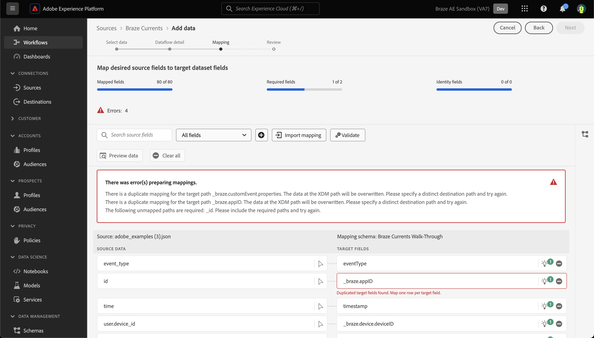

# Crea una connessione sorgente [!DNL Braze Currents] nell&#39;interfaccia utente

>[!NOTE]
>
>L&#39;origine [!DNL Braze Currents] è in versione beta. Per ulteriori informazioni sull&#39;utilizzo di origini con etichetta beta, leggere la [panoramica delle origini](../../../../home.md#terms-and-conditions).

[!DNL Braze] potenzia in tempo reale le interazioni incentrate sul cliente tra consumatori e marchi. [!DNL Braze Currents] è un flusso di dati in tempo reale di eventi di coinvolgimento dalla piattaforma Braze che rappresenta l&#39;esportazione più solida ma granulare della piattaforma [!DNL Braze].

Leggi il seguente tutorial per scoprire come inserire i dati degli eventi di coinvolgimento dal tuo account [!DNL Braze] a Adobe Experience Platform nell&#39;interfaccia utente.

## Prerequisiti

Per completare i passaggi descritti in questa guida, è necessario:

* Accesso a [Adobe Experience Platform](https://platform.adobe.com) e autorizzazione per la creazione di una nuova connessione di origine streaming.
* Accesso a [[!DNL Braze] dashboard](https://dashboard.braze.com/sign_in), licenza [Current Connector](https://www.braze.com/docs/user_guide/data_and_analytics/braze_currents) non utilizzata e autorizzazioni per la creazione di un connettore. Per ulteriori informazioni, leggere i [requisiti per configurare [!DNL Currents]](https://www.braze.com/docs/user_guide/data_and_analytics/braze_currents/setting_up_currents/#requirements).

## Introduzione

Questo tutorial richiede una buona conoscenza dei seguenti componenti di Adobe Experience Platform:

* [[!DNL Experience Data Model (XDM)] Sistema](../../../../../xdm/home.md): framework standardizzato tramite il quale [!DNL Experience Platform] organizza i dati sull&#39;esperienza del cliente.
   * [Nozioni di base sulla composizione dello schema](../../../../../xdm/schema/composition.md): scopri i blocchi predefiniti di base degli schemi XDM, inclusi i principi chiave e le best practice nella composizione dello schema.
   * [Esercitazione sull&#39;editor di schemi](../../../../../xdm/tutorials/create-schema-ui.md): scopri come creare schemi personalizzati utilizzando l&#39;interfaccia utente dell&#39;editor di schemi.
* [[!DNL Real-Time Customer Profile]](../../../../../profile/home.md): fornisce un profilo consumer unificato e in tempo reale basato su dati aggregati provenienti da più origini.

Questo tutorial richiede anche una buona conoscenza di [[!DNL Braze] Current](https://www.braze.com/docs/user_guide/data_and_analytics/braze_currents).

Se disponi già di una connessione [!DNL Braze], puoi saltare il resto del documento e passare all&#39;esercitazione [configurazione di un flusso di dati](../../dataflow/marketing-automation.md).

## Creare uno schema XDM

>[!TIP]
>
>Se questa è la prima volta che crei una connessione [!DNL Braze Currents], devi creare uno schema Experience Data Model (XDM). Se hai già creato uno schema per [!DNL Braze Currents], puoi saltare questo passaggio e passare a [connettere il tuo account a Experience Platform](#connect).

Nell&#39;interfaccia utente di Platform, utilizza la barra di navigazione a sinistra, quindi seleziona **[!UICONTROL Schemi]** per accedere all&#39;area di lavoro [!UICONTROL Schemi]. Selezionare **[!UICONTROL Crea schema]**, quindi **[!UICONTROL Evento esperienza]**. Per continuare, selezionare **[!UICONTROL Avanti]**.

Immetti un nome e una descrizione per lo schema. Quindi, utilizza il pannello [!UICONTROL Composizione] per configurare gli attributi dello schema. In [!UICONTROL Gruppi di campi], seleziona **[!UICONTROL Aggiungi]** e aggiungi il gruppo di campi [!UICONTROL Evento utente corrente brasatura]. Al termine, selezionare **[!UICONTROL Salva]**.

Per ulteriori informazioni sugli schemi, leggere la guida a [creazione di schemi nell&#39;interfaccia utente](../../../../../xdm/tutorials/create-schema-ui.md).

## Connetti il tuo account [!DNL Braze] a Experience Platform {#connect}

Nell&#39;interfaccia utente di Platform, seleziona **[!UICONTROL Origini]** dal menu di navigazione a sinistra per accedere all&#39;area di lavoro [!UICONTROL Origini]. Puoi selezionare la categoria appropriata dal catalogo sul lato sinistro dello schermo. In alternativa, è possibile trovare l’origine specifica che si desidera utilizzare utilizzando l’opzione di ricerca.

Nella categoria *Marketing Automation*, selezionare **[!UICONTROL Braze Current]**, quindi selezionare **[!UICONTROL Add data]**.

Quindi, carica il [file di esempio Braze Currents](https://github.com/Appboy/currents-examples/blob/master/sample-data/Adobe/adobe_examples.json) fornito. Questo file contiene tutti i possibili campi che Braze potrebbe inviare come parte di un evento.

Una volta caricato il file, devi fornire i dettagli del flusso di dati, incluse le informazioni sul set di dati e lo schema a cui stai eseguendo la mappatura.  Se è la prima volta che connetti un’origine Braze Currents, crea un nuovo set di dati.  In caso contrario, puoi utilizzare qualsiasi set di dati esistente che faccia riferimento allo schema Braze.  Se crei un nuovo set di dati, utilizza lo schema creato nella sezione precedente.

Quindi, configura la mappatura per i dati utilizzando l’interfaccia di mappatura.

La mappatura presenterà i seguenti problemi che devono essere risolti.

Nei dati di origine, *id* verrà mappato in modo errato a *_braze.appID*. È necessario modificare il campo di mappatura di destinazione in *_id* al livello radice dello schema. Quindi, assicurati che *properties.is_amp* sia mappato a *_braze.messaging.email.isAMP*.

Eliminare quindi il mapping *time* su *timestamp*, quindi selezionare l&#39;icona di aggiunta (`+`) e selezionare **[!UICONTROL Aggiungi campo calcolato]**. Nella casella fornita, inserisci *time \* 1000* e seleziona **[!UICONTROL Salva]**.

Una volta aggiunto il nuovo campo calcolato, seleziona **[!UICONTROL Mappa campo di destinazione]** accanto al nuovo campo di origine e mappalo su *timestamp* al livello principale dello schema. Selezionare **[!UICONTROL Convalida]** per assicurarsi di non avere altri errori.

>[!IMPORTANT]
>
>I timestamp di brasatura non sono espressi in millisecondi, ma in secondi. Affinché i timestamp in Experience Platform vengano rispecchiati accuratamente, è necessario creare campi calcolati in millisecondi. Un calcolo di &quot;tempo * 1000&quot; convertirà correttamente in millisecondi, adatto per la mappatura a un campo marca temporale in Experience Platform.
>
>

Al termine, selezionare **[!UICONTROL Avanti]**. Utilizzare la pagina Revisione per confermare i dettagli del flusso di dati, quindi selezionare **[!UICONTROL Fine]**.

### Raccogli le credenziali richieste

Una volta creata la connessione, è necessario raccogliere i seguenti valori delle credenziali, che verranno quindi forniti nel dashboard Braze per inviare i dati ad Experience Platform. Per ulteriori informazioni, leggere la [!DNL Braze] [guida per l&#39;esplorazione di Correnti](https://www.braze.com/docs/user_guide/data_and_analytics/braze_currents/setting_up_currents/#step-2-navigate-to-currents).

| Campo | Descrizione |
| --- | --- |
| ID client | L’ID client associato alla sorgente dell’Experience Platform. |
| Segreto client | Il segreto client associato alla tua origine Experience Platform. |
| ID tenant | L’ID tenant associato alla tua origine Experience Platform. |
| Nome sandbox | La sandbox associata alla sorgente di Experience Platform. |
| ID flusso di dati | L’ID del flusso di dati associato alla sorgente di Experience Platform. |
| Endpoint di streaming | L’endpoint di streaming associato alla sorgente di Experience Platform. **Nota**: [!DNL Braze] converte automaticamente questo elemento nell&#39;endpoint di streaming batch. |

### Configura [!DNL Braze Currents] per inviare dati all&#39;origine dati in streaming

All&#39;interno di [!DNL Braze Dashboard], passa a Integrations partner **->** Data Export, quindi seleziona **[!DNL Create New Current]**. Verrà richiesto di specificare un nome per il connettore, le informazioni di contatto per le notifiche sul connettore e le credenziali elencate in precedenza. Selezionare gli eventi che si desidera ricevere, configurare eventuali esclusioni/trasformazioni di campi e selezionare **[!DNL Launch Current]**.

## Passaggi successivi

Seguendo questa esercitazione, hai stabilito una connessione al tuo account [!DNL Braze]. Ora puoi continuare con l&#39;esercitazione successiva e [configurare un flusso di dati per inserire dati di sistema di automazione marketing in [!DNL Platform]](../../dataflow/marketing-automation.md).
