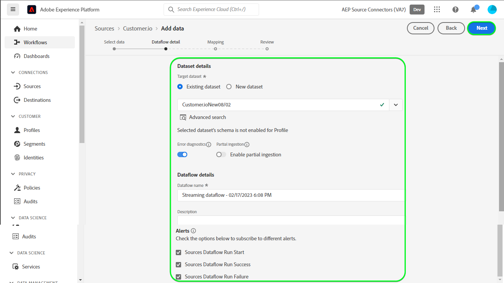

# Crea una connessione di origine [!DNL Customer.io] e un flusso di dati nell&#39;interfaccia utente

>[!NOTE]
>
>L&#39;origine [!DNL Customer.io] è in versione beta. Per ulteriori informazioni sull&#39;utilizzo di origini con etichetta beta, leggere la [panoramica delle origini](../../../../home.md#terms-and-conditions).

Questo tutorial illustra i passaggi per la creazione di una connessione di origine [!DNL Customer.io] e di un flusso di dati tramite l&#39;interfaccia utente di Adobe Experience Platform.

## Introduzione {#getting-started}

Questo tutorial richiede una buona conoscenza dei seguenti componenti di Experience Platform:

* [[!DNL Experience Data Model (XDM)] Sistema](../../../../../xdm/home.md): framework standardizzato tramite il quale [!DNL Experience Platform] organizza i dati sull&#39;esperienza del cliente.
   * [Nozioni di base sulla composizione dello schema](../../../../../xdm/schema/composition.md): scopri i blocchi predefiniti di base degli schemi XDM, inclusi i principi chiave e le best practice nella composizione dello schema.
   * [Esercitazione sull&#39;editor di schemi](../../../../../xdm/tutorials/create-schema-ui.md): scopri come creare schemi personalizzati utilizzando l&#39;interfaccia utente dell&#39;editor di schemi.
* [[!DNL Real-Time Customer Profile]](../../../../../profile/home.md): fornisce un profilo consumer unificato e in tempo reale basato su dati aggregati provenienti da più origini.

## Prerequisiti {#prerequisites}

Nella sezione seguente vengono fornite informazioni sui prerequisiti da completare prima di creare una connessione di origine [!DNL Customer.io].

### JSON di esempio per definire lo schema di origine per [!DNL Customer.io] {#prerequisites-json-schema}

Prima di creare una connessione di origine [!DNL Customer.io], è necessario specificare uno schema di origine. Puoi utilizzare il codice JSON seguente.

```
{
  "event_id": "01E4C4CT6YDC7Y5M7FE1GWWPQJ",
  "object_type": "customer",
  "metric": "subscribed",
  "timestamp": 1613063089,
  "data": {
    "customer_id": "42",
    "email_address": "test@example.com",
    "identifiers": {
      "id": "42",
      "email": "test@example.com",
      "cio_id": "d9c106000001"
    }
  }
}
```

### Crea uno schema di Platform per [!DNL Customer.io] {#create-platform-schema}

Devi anche assicurarti di creare uno schema Platform da utilizzare per la tua origine. Consulta il tutorial su [creazione di uno schema di Platform](../../../../../xdm/schema/composition.md) per i passaggi completi sulla creazione di uno schema.


## Connetti il tuo account [!DNL Customer.io] {#connect-account}

Nell&#39;interfaccia utente di Platform, seleziona **[!UICONTROL Origini]** dal menu di navigazione a sinistra per accedere all&#39;area di lavoro [!UICONTROL Origini] e visualizzare un catalogo delle origini disponibili in Experience Platform.

Utilizza il menu *[!UICONTROL Categorie]* per filtrare le origini per categoria. In alternativa, immettere un nome di origine nella barra di ricerca per trovare un&#39;origine specifica dal catalogo.

Vai alla categoria [!UICONTROL Automazione marketing] per visualizzare la scheda di origine [!DNL Customer.io]. Per iniziare, selezionare **[!UICONTROL Aggiungi dati]**.


## Selezionare i dati {#select-data}

Viene visualizzato il passaggio **[!UICONTROL Seleziona dati]**, che fornisce un&#39;interfaccia per la selezione dei dati da inserire in Platform.

* La parte sinistra dell’interfaccia è un browser che ti consente di visualizzare i flussi di dati disponibili all’interno del tuo account;
* La parte destra dell’interfaccia consente di visualizzare in anteprima fino a 100 righe di dati da un file JSON.

Seleziona **[!UICONTROL Carica file]** per caricare un file JSON dal sistema locale. In alternativa, puoi trascinare e rilasciare il file JSON da caricare nel pannello [!UICONTROL Trascina i file].


Una volta caricato il file, l’interfaccia di anteprima si aggiorna e mostra un’anteprima dello schema caricato. L’interfaccia di anteprima consente di esaminare il contenuto e la struttura di un file. È inoltre possibile utilizzare l&#39;utilità [!UICONTROL Cerca campo] per accedere a elementi specifici dallo schema.

Al termine, selezionare **[!UICONTROL Avanti]**.


## Dettaglio del flusso di dati {#dataflow-detail}

Viene visualizzato il passaggio **Dettagli flusso di dati** che fornisce le opzioni per utilizzare un set di dati esistente o stabilirne uno nuovo per il flusso di dati, nonché l&#39;opportunità di fornire un nome e una descrizione per il flusso di dati. Durante questo passaggio, puoi anche configurare le impostazioni per l’acquisizione del profilo, la diagnostica degli errori, l’acquisizione parziale e gli avvisi.

Al termine, selezionare **[!UICONTROL Avanti]**.



## Mappatura {#mapping}

Viene visualizzato il passaggio [!UICONTROL Mappatura] che fornisce un&#39;interfaccia per mappare i campi sorgente dallo schema sorgente ai campi XDM di destinazione appropriati nello schema di destinazione.

Platform fornisce consigli intelligenti per campi mappati automaticamente in base allo schema o al set di dati di destinazione selezionato. Puoi regolare manualmente le regole di mappatura in base ai tuoi casi d’uso. In base alle tue esigenze, puoi scegliere di mappare i campi direttamente o utilizzare le funzioni di preparazione dati per trasformare i dati sorgente in modo da derivare valori calcolati o calcolati. Per i passaggi completi sull&#39;utilizzo dell&#39;interfaccia mapper e dei campi calcolati, consulta la [guida dell&#39;interfaccia utente della preparazione dati](../../../../../data-prep/ui/mapping.md).

Tutte le mappature elencate di seguito sono obbligatorie e devono essere configurate prima di procedere alla fase [!UICONTROL Revisione].

| Campo di destinazione | Descrizione |
| --- | --- |
| `object_type` | Il tipo di oggetto, fare riferimento alla documentazione [!DNL Customer.io] [events](https://customer.io/docs/webhooks/#events) per i tipi supportati. |
| `id` | Identificatore dell&#39;oggetto. |
| `email` | Indirizzo e-mail associato all’oggetto. |
| `event_id` | L’identificatore univoco dell’evento. |
| `cio_id` | Identificatore [!DNL Customer.io] dell&#39;evento. |
| `metric` | Il tipo di evento. Per ulteriori informazioni, consulta la documentazione [!DNL Customer.io] [events](https://customer.io/docs/webhooks/#events) per i tipi supportati. |
| `timestamp` | La marca temporale in cui si è verificato l’evento. |

>[!IMPORTANT]
>
>Non mappare `cio_id` durante l&#39;esecuzione del webhook [!DNL Customer.io] in `test mode`, in quanto non vi saranno campi associati inviati da [!DNL Customer.io].

Una volta mappati correttamente i dati di origine, seleziona **[!UICONTROL Avanti]**.


## Controlla {#review}

Viene visualizzato il passaggio **[!UICONTROL Rivedi]**, che consente di rivedere il nuovo flusso di dati prima che venga creato. I dettagli sono raggruppati nelle seguenti categorie:

* **[!UICONTROL Connessione]**: mostra il tipo di origine, il percorso pertinente del file di origine scelto e la quantità di colonne all&#39;interno di tale file di origine.
* **[!UICONTROL Assegna set di dati e mappa i campi]**: mostra in quale set di dati vengono acquisiti i dati di origine, incluso lo schema a cui il set di dati aderisce.

Dopo aver rivisto il flusso di dati, seleziona **[!UICONTROL Fine]** e attendi che venga creato un po&#39; di tempo.


## Ottieni l’URL dell’endpoint di streaming {#get-streaming-endpoint}

Una volta creato il flusso di dati di streaming, ora puoi recuperare l’URL dell’endpoint di streaming. Questo endpoint verrà utilizzato per abbonarsi al webhook, consentendo alla tua origine di streaming di comunicare con Experience Platform.

Per creare l&#39;URL utilizzato per configurare il webhook in [!DNL Customer.io], è necessario recuperare quanto segue:

* **[!UICONTROL ID flusso di dati]**
* **[!UICONTROL Endpoint di streaming]**

Per recuperare l&#39;**[!UICONTROL ID flusso di dati]** e l&#39;**[!UICONTROL endpoint di streaming]**, vai alla pagina [!UICONTROL Attività flusso di dati] del flusso di dati appena creato e copia i dettagli dalla parte inferiore del pannello [!UICONTROL Proprietà].


Dopo aver recuperato l&#39;endpoint di streaming e l&#39;ID del flusso di dati, generare un URL in base al seguente pattern: ```{STREAMING_ENDPOINT}?x-adobe-flow-id={DATAFLOW_ID}```. Ad esempio, un URL del webhook costruito potrebbe avere l&#39;aspetto seguente: ``https://dcs.adobedc.net/collection/febc116d22ba0ea2868e9c93b199375302afb8a589617700991bb8f3f0341ad7?x-adobe-flow-id=439b3fc4-3042-4a3a-b5e0-a494898d3fb0``

## Configurare il webhook di reporting in [!DNL Customer.io] {#set-up-webhook}

Dopo aver creato l&#39;URL del webhook, è possibile configurare il webhook di reporting utilizzando l&#39;interfaccia utente [!DNL Customer.io]. Per i passaggi sulla configurazione dei webhook di reporting, leggi la [[!DNL Customer.io] guida](https://customer.io/docs/webhooks/#setup) sulla configurazione dei webhook.

Nell&#39;interfaccia utente di [!DNL Customer.io], immettere l&#39;[URL webhook](#get-streaming-endpoint-url) nel campo [!DNL WEBHOOK ENDPOINT].


>[!TIP]
>
>Puoi abbonarti a diversi eventi per il tuo webhook di reporting. Ogni messaggio di evento verrà acquisito in Platform quando viene soddisfatto il criterio di attivazione di un evento di azione [!DNL Customer.io]. Per ulteriori informazioni sui diversi eventi, consulta la [[!DNL Customer.io] documentazione eventi](https://customer.io/docs/webhooks/#events).

## Passaggi successivi {#next-steps}

Seguendo questa esercitazione hai configurato correttamente un flusso di dati in streaming per portare i tuoi dati di [!DNL Customer.io] all&#39;Experience Platform. Per monitorare i dati che vengono acquisiti, consulta la guida su [monitoraggio dei flussi di dati in streaming tramite l&#39;interfaccia utente di Platform](../../monitor-streaming.md).

## Risorse aggiuntive {#additional-resources}

Le sezioni seguenti forniscono ulteriori risorse a cui fare riferimento quando si utilizza l&#39;origine [!DNL Customer.io].

### Guardrail {#guardrails}

Per informazioni sui guardrail, fare riferimento alla [[!DNL Customer.io] pagina timeout ed errori](https://customer.io/docs/webhooks/#timeouts-and-failures).

### Convalida {#validation}

Per verificare la corretta configurazione dell&#39;origine e l&#39;acquisizione di [!DNL Customer.io] messaggi, effettua le seguenti operazioni:

* È possibile controllare la pagina [!DNL Customer.io] **[!UICONTROL Registri attività]** per identificare gli eventi acquisiti da [!DNL Customer.io].


* Nell&#39;interfaccia utente di Platform, selezionare **[!UICONTROL Visualizza flussi di dati]** accanto al menu della scheda [!DNL Customer.io] nel catalogo delle origini. Selezionare **[!UICONTROL Anteprima set di dati]** per verificare i dati acquisiti per gli eventi selezionati in [!DNL Customer.io].


