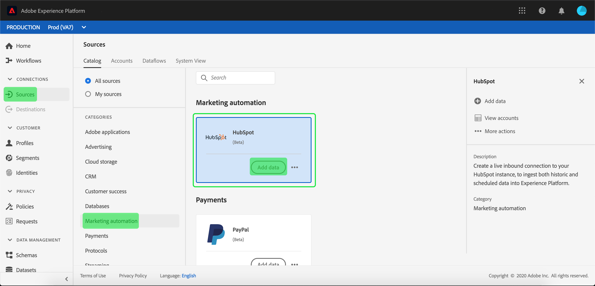

# Creare un connettore [!DNL HubSpot] sorgente nell’interfaccia utente

>[!NOTE]
> Il [!DNL HubSpot] connettore è in versione beta. Per ulteriori informazioni sull&#39;utilizzo dei connettori con etichetta beta, consulta la panoramica  Origini.

I connettori di origine in Adobe Experience Platform consentono di trasferire i dati esternamente originati su base programmata. Questa esercitazione fornisce i passaggi necessari per creare un connettore [!DNL HubSpot] sorgente utilizzando l&#39;interfaccia [!DNL Platform] utente.

## Introduzione

Questa esercitazione richiede una buona conoscenza dei seguenti componenti di Adobe Experience Platform:

* [Sistema](../../../../../xdm/home.md)XDM (Experience Data Model): Il framework standard con cui [!DNL Experience Platform] organizzare i dati relativi all&#39;esperienza del cliente.
   * [Nozioni di base sulla composizione](../../../../../xdm/schema/composition.md)dello schema: Scoprite i componenti di base degli schemi XDM, inclusi i principi chiave e le procedure ottimali nella composizione dello schema.
   * [Esercitazione](../../../../../xdm/tutorials/create-schema-ui.md)sull&#39;Editor di schema: Scoprite come creare schemi personalizzati utilizzando l&#39;interfaccia utente dell&#39;Editor di schema.
* [Profilo](../../../../../profile/home.md)cliente in tempo reale: Fornisce un profilo di consumo unificato e in tempo reale basato su dati aggregati provenienti da più origini.

Se disponete già di una connessione di [!DNL HubSpot] base, potete ignorare il resto del documento e passare all&#39;esercitazione sulla [configurazione di un flusso di dati](../../dataflow/marketing-automation.md)di automazione marketing.

### Raccogli credenziali richieste

Per accedere al tuo [!DNL HubSpot] account su [!DNL Platform], devi fornire i seguenti valori:

| Credenziali | Descrizione |
| ---------- | ----------- |
| `clientId` | L&#39;ID client associato all&#39; [!DNL HubSpot] applicazione. |
| `clientSecret` | Il segreto client associato all&#39; [!DNL HubSpot] applicazione. |
| `accessToken` | Token di accesso ottenuto durante l&#39;autenticazione iniziale dell&#39;integrazione OAuth. |
| `refreshToken` | Token di aggiornamento ottenuto durante l&#39;autenticazione iniziale dell&#39;integrazione OAuth. |

Per ulteriori informazioni su come iniziare, consulta questo documento HubSpot.

## Collegamento dell&#39; [!DNL HubSpot] account

Dopo aver raccolto le credenziali richieste, è possibile seguire i passaggi descritti di seguito per creare una nuova connessione di base in entrata a cui collegare l&#39; [!DNL HubSpot] account [!DNL Platform].

Accedete ad [Adobe Experience Platform](https://platform.adobe.com) , quindi selezionate **[!UICONTROL Sources]** dalla barra di navigazione a sinistra per accedere all&#39; *[!UICONTROL Sources]* area di lavoro. La *[!UICONTROL Catalog]* schermata mostra una serie di origini con cui è possibile creare connessioni di base in entrata e ogni origine mostra il numero di connessioni di base esistenti ad esse associate.

Sotto la *[!UICONTROL Marketing automation]* categoria, selezionate **[!UICONTROL HubSpot]** per esporre una barra delle informazioni sul lato destro dello schermo. La barra delle informazioni fornisce una breve descrizione della sorgente selezionata e le opzioni per collegarsi alla sorgente o visualizzare la documentazione. Per creare una nuova connessione di base in entrata, selezionare **[!UICONTROL Add data]**.

Viene *[!UICONTROL Connect to HubSpot]* visualizzata la pagina. In questa pagina è possibile utilizzare credenziali nuove o già esistenti.

### Nuovo account

Se si utilizzano nuove credenziali, selezionare **[!UICONTROL New account]**. Nel modulo di input che viene visualizzato, fornire alla connessione di base un nome, una descrizione facoltativa e [!DNL HubSpot] le credenziali. Al termine, selezionare **[!UICONTROL Connect]** e quindi concedere un po&#39; di tempo per stabilire la nuova connessione di base.

### Account esistente

Per collegare un account esistente, selezionate l&#39; [!DNL HubSpot] account con cui desiderate connettervi, quindi selezionate **[!UICONTROL Next]** per continuare.

## Passaggi successivi

Seguendo questa esercitazione hai stabilito una connessione di base all&#39; [!DNL HubSpot] account. Ora puoi continuare con l&#39;esercitazione successiva e [configurare un flusso di dati per portare i dati del sistema di automazione di marketing nella piattaforma](../../dataflow/marketing-automation.md).