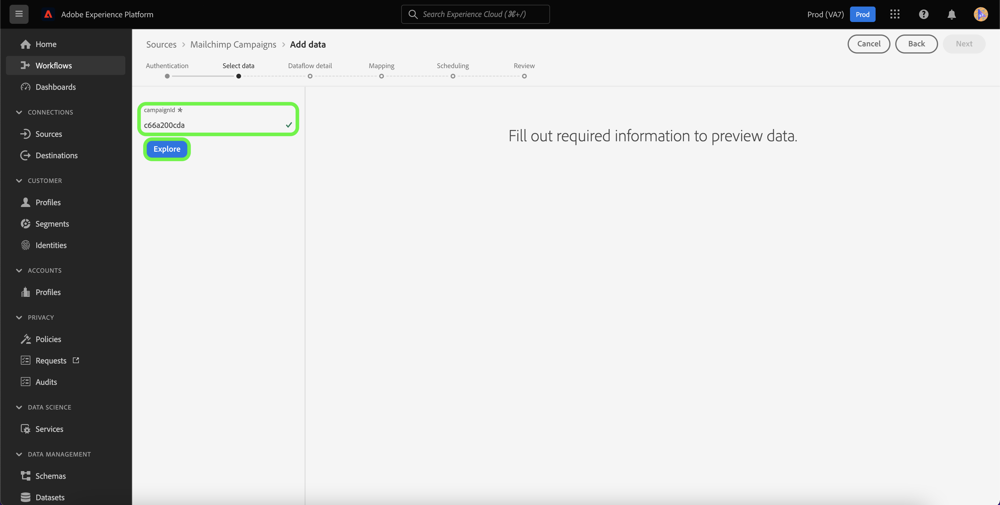
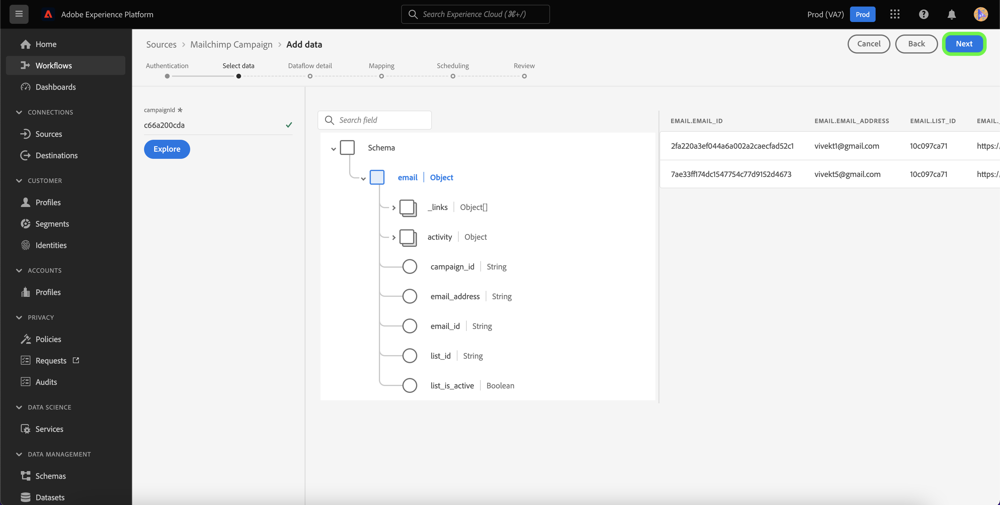

# Creare un [!DNL Mailchimp Campaigns] connessione sorgente tramite l’interfaccia utente di Platform

Questo tutorial descrive i passaggi necessari per creare [!DNL Mailchimp] connettore di origine da acquisire [!DNL Mailchimp Campaigns] dati a Adobe Experience Platform tramite l’interfaccia utente.

## Introduzione

Questa guida richiede una buona conoscenza dei seguenti componenti di Adobe Experience Platform:

* [Sorgenti](../../../../home.md): Platform consente di acquisire dati da varie origini, consentendoti allo stesso tempo di strutturare, etichettare e migliorare i dati in arrivo tramite [!DNL Platform] servizi.
* [Sandbox](../../../../../sandboxes/home.md): Platform fornisce sandbox virtuali che permettono di suddividere una singola istanza Platform in ambienti virtuali separati, utili per le attività di sviluppo e aggiornamento delle applicazioni di esperienza digitale.

## Raccogli le credenziali richieste

Per portare il tuo [!DNL Mailchimp Campaigns] dati a Platform, devi innanzitutto fornire le credenziali di autenticazione appropriate che corrispondono al tuo [!DNL Mailchimp] account.

Il [!DNL Mailchimp Campaigns] La sorgente supporta sia l’autenticazione di base sia il codice di aggiornamento OAuth 2. Per ulteriori informazioni su questi tipi di autenticazione, consulta le tabelle seguenti.

### Codice di aggiornamento OAuth 2

| Credenziali  | Descrizione |
| --- | --- |
| Domain | L’URL principale utilizzato per connettersi all’API MailChimp. Il formato dell’URL principale è `https://{DC}.api.mailchimp.com`, dove `{DC}` rappresenta il datacenter che corrisponde al tuo account. |
| URL test di autorizzazione | L’URL del test di autorizzazione viene utilizzato per convalidare le credenziali durante la connessione [!DNL Mailchimp] su Platform. Se non viene specificato, le credenziali vengono controllate automaticamente durante il passaggio di creazione della connessione di origine. |
| Token di accesso | Il token di accesso corrispondente utilizzato per autenticare l’origine. Questo è richiesto per l’autenticazione basata su OAuth. |

Per ulteriori informazioni sull&#39;utilizzo di OAuth 2 per l&#39;autenticazione [!DNL Mailchimp] da un account a Platform, consulta questa [[!DNL Mailchimp] documento sull’utilizzo di OAuth 2](https://mailchimp.com/developer/marketing/guides/access-user-data-oauth-2/).

### Autenticazione di base

| Credenziali  | Descrizione |
| --- | --- |
| Domain | L’URL principale utilizzato per connettersi all’API MailChimp. Il formato dell’URL principale è `https://{DC}.api.mailchimp.com`, dove `{DC}` rappresenta il datacenter che corrisponde al tuo account. |
| Nome utente | Il nome utente che corrisponde all&#39;account MailChimp. Questa opzione è necessaria per l’autenticazione di base. |
| Password | La password che corrisponde all&#39;account MailChimp. Questa opzione è necessaria per l’autenticazione di base. |

## Connetti [!DNL Mailchimp Campaigns] account per Platform

Nell’interfaccia utente di Platform, seleziona **[!UICONTROL Sorgenti]** dalla barra di navigazione a sinistra per accedere al [!UICONTROL Sorgenti] Workspace. Il [!UICONTROL Catalogo] Nella schermata vengono visualizzate diverse origini con cui è possibile creare un account.

Puoi selezionare la categoria appropriata dal catalogo sul lato sinistro dello schermo. In alternativa, è possibile trovare l’origine specifica che si desidera utilizzare utilizzando l’opzione di ricerca.

Sotto [!UICONTROL Automazione del marketing] categoria, seleziona **[!UICONTROL Campagna Mailchimp]**, quindi selezionare **[!UICONTROL Aggiungi dati]**.

Il **[!UICONTROL Connetti account Mailchimp Campaigns]** viene visualizzata. In questa pagina puoi scegliere se accedere a un account esistente o se crearne uno nuovo.

### Account esistente

Per utilizzare un account esistente, seleziona la [!DNL Mailchimp Campaigns] account con cui vuoi creare un nuovo flusso di dati, quindi seleziona **[!UICONTROL Successivo]** per procedere.

### Nuovo account

Se stai creando un nuovo account, seleziona **[!UICONTROL Nuovo account]** e quindi fornisci un nome e una descrizione per il tuo [!DNL Mailchimp Campaigns] dettagli della connessione sorgente.

#### Autenticazione tramite OAuth 2

Per utilizzare OAuth 2, seleziona [!UICONTROL Codice di aggiornamento OAuth 2], fornisci i valori per il dominio, l’URL del test di autorizzazione e il token di accesso, quindi seleziona **[!UICONTROL Connetti all&#39;origine]**. Consenti la convalida delle credenziali per alcuni istanti, quindi seleziona **[!UICONTROL Successivo]** per procedere.

#### Autenticazione tramite autenticazione di base

Per utilizzare l’autenticazione di base, seleziona [!UICONTROL Autenticazione di base], fornisci i valori per dominio, nome utente e password, quindi seleziona **[!UICONTROL Connetti all&#39;origine]**. Consenti la convalida delle credenziali per alcuni istanti, quindi seleziona **[!UICONTROL Successivo]** per procedere.

### Seleziona [!DNL Mailchimp Campaigns] dati

Una volta autenticata l’origine, devi quindi fornire `campaignId` che corrisponde al tuo [!DNL Mailchimp Campaigns] account.

Il giorno [!UICONTROL Seleziona dati] , immettere il `campaignId` e quindi seleziona **[!UICONTROL Esplora]**.

La pagina si aggiorna in una struttura di schema interattivo che consente di esplorare e ispezionare la gerarchia dei dati. Seleziona **[!UICONTROL Successivo]** per procedere.

## Passaggi successivi

Con [!DNL Mailchimp] account autenticato e il tuo [!DNL Mailchimp Campaigns] Selezionati, ora puoi iniziare a creare un flusso di dati per portare i dati in Platform. Per i passaggi dettagliati su come creare un flusso di dati, consulta la documentazione su [creazione di un flusso di dati per portare i dati di automazione marketing su Platform](../../dataflow/marketing-automation.md).
