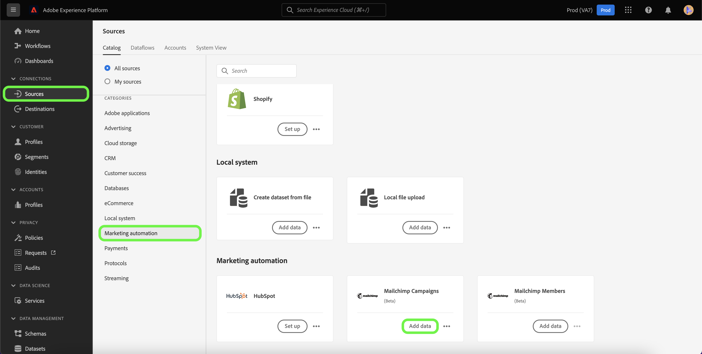

# Crea una connessione di origine [!DNL Mailchimp Campaigns] tramite l&#39;interfaccia utente di Platform

Questo tutorial descrive i passaggi per la creazione di un connettore di origine [!DNL Mailchimp] per acquisire i dati di [!DNL Mailchimp Campaigns] in Adobe Experience Platform tramite l&#39;interfaccia utente.

## Introduzione

Questa guida richiede una buona conoscenza dei seguenti componenti di Adobe Experience Platform:

* [Origini](../../../../home.md): Platform consente di acquisire dati da varie origini e allo stesso tempo di strutturare, etichettare e migliorare i dati in arrivo tramite i servizi [!DNL Platform].
* [Sandbox](../../../../../sandboxes/home.md): Platform fornisce sandbox virtuali che suddividono una singola istanza Platform in ambienti virtuali separati, utili per le attività di sviluppo e aggiornamento delle applicazioni di esperienza digitale.

## Raccogli le credenziali richieste

Per portare i dati di [!DNL Mailchimp Campaigns] in Platform, devi prima fornire le credenziali di autenticazione appropriate che corrispondono al tuo account di [!DNL Mailchimp].

L&#39;origine [!DNL Mailchimp Campaigns] supporta sia il codice di aggiornamento OAuth 2 che l&#39;autenticazione di base. Per ulteriori informazioni su questi tipi di autenticazione, vedere le tabelle seguenti.

### Codice di aggiornamento OAuth 2

| Credenziali | Descrizione |
| --- | --- |
| Dominio | L’URL principale utilizzato per connettersi all’API MailChimp. Il formato dell&#39;URL principale è `https://{DC}.api.mailchimp.com`, dove `{DC}` rappresenta il datacenter che corrisponde al tuo account. |
| URL test di autorizzazione | L&#39;URL del test di autorizzazione viene utilizzato per convalidare le credenziali durante la connessione di [!DNL Mailchimp] a Platform. Se non viene specificato, le credenziali vengono controllate automaticamente durante il passaggio di creazione della connessione di origine. |
| Token di accesso | Il token di accesso corrispondente utilizzato per autenticare l’origine. Questo è richiesto per l’autenticazione basata su OAuth. |

Per ulteriori informazioni sull&#39;utilizzo di OAuth 2 per autenticare l&#39;account [!DNL Mailchimp] in Platform, consulta questo [[!DNL Mailchimp] documento sull&#39;utilizzo di OAuth 2](https://mailchimp.com/developer/marketing/guides/access-user-data-oauth-2/).

### Autenticazione di base

| Credenziali | Descrizione |
| --- | --- |
| Dominio | L’URL principale utilizzato per connettersi all’API MailChimp. Il formato dell&#39;URL principale è `https://{DC}.api.mailchimp.com`, dove `{DC}` rappresenta il datacenter che corrisponde al tuo account. |
| Nome utente | Il nome utente che corrisponde all&#39;account MailChimp. Questa opzione è necessaria per l’autenticazione di base. |
| Password | La password che corrisponde all&#39;account MailChimp. Questa opzione è necessaria per l’autenticazione di base. |

## Connetti l&#39;account [!DNL Mailchimp Campaigns] a Platform

Nell&#39;interfaccia utente di Platform, seleziona **[!UICONTROL Origini]** dalla barra di navigazione a sinistra per accedere all&#39;area di lavoro [!UICONTROL Origini]. Nella schermata [!UICONTROL Catalogo] sono visualizzate diverse origini con cui è possibile creare un account.

Puoi selezionare la categoria appropriata dal catalogo sul lato sinistro dello schermo. In alternativa, è possibile trovare l’origine specifica che si desidera utilizzare utilizzando l’opzione di ricerca.

Nella categoria [!UICONTROL Marketing automation], selezionare **[!UICONTROL Mailchimp Campaign]**, quindi **[!UICONTROL Add data]**.

Viene visualizzata la pagina **[!UICONTROL Connetti account campagne Mailchimp]**. In questa pagina puoi scegliere se accedere a un account esistente o se crearne uno nuovo.

### Account esistente

Per utilizzare un account esistente, seleziona l&#39;account [!DNL Mailchimp Campaigns] con cui vuoi creare un nuovo flusso di dati, quindi seleziona **[!UICONTROL Successivo]** per continuare.

### Nuovo account

Se stai creando un nuovo account, seleziona **[!UICONTROL Nuovo account]**, quindi fornisci un nome e una descrizione per i dettagli della connessione di origine di [!DNL Mailchimp Campaigns].

#### Autenticazione tramite OAuth 2

Per utilizzare OAuth 2, seleziona [!UICONTROL Codice di aggiornamento OAuth 2], fornisci i valori per il tuo dominio, l&#39;URL del test di autorizzazione e il token di accesso, quindi seleziona **[!UICONTROL Connetti all&#39;origine]**. Consenti la convalida delle credenziali per alcuni istanti, quindi seleziona **[!UICONTROL Avanti]** per continuare.

#### Autenticazione tramite autenticazione di base

Per utilizzare l&#39;autenticazione di base, selezionare [!UICONTROL Autenticazione di base], specificare i valori per il dominio, il nome utente e la password, quindi selezionare **[!UICONTROL Connetti all&#39;origine]**. Consenti la convalida delle credenziali per alcuni istanti, quindi seleziona **[!UICONTROL Avanti]** per continuare.

### Seleziona dati [!DNL Mailchimp Campaigns]

Una volta autenticata l&#39;origine, è necessario fornire `campaignId` che corrisponde all&#39;account [!DNL Mailchimp Campaigns].

Nella pagina [!UICONTROL Seleziona dati], immetti `campaignId` e seleziona **[!UICONTROL Esplora]**.

La pagina si aggiorna in una struttura di schema interattivo che consente di esplorare e ispezionare la gerarchia dei dati. Seleziona **[!UICONTROL Avanti]** per procedere.

## Passaggi successivi

Con l&#39;account [!DNL Mailchimp] autenticato e i dati di [!DNL Mailchimp Campaigns] selezionati, ora puoi iniziare a creare un flusso di dati per portare i dati su Platform. Per i passaggi dettagliati su come creare un flusso di dati, consulta la documentazione su [creazione di un flusso di dati per portare i dati di automazione marketing su Platform](../../dataflow/marketing-automation.md).
