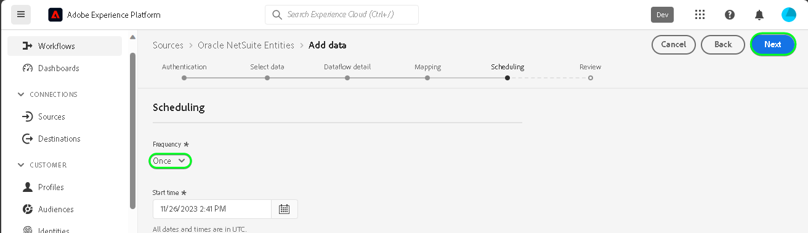

# Creare un [!DNL Oracle NetSuite Entities] connessione sorgente nell’interfaccia utente

>[!NOTE]
>
>Il [!DNL Oracle NetSuite Entities] sorgente in versione beta. Consulta la [panoramica sulle origini](../../../../home.md#terms-and-conditions) per ulteriori informazioni sull’utilizzo di fonti etichettate beta.

Leggi il seguente tutorial per scoprire come estrarre i dati di contatti e clienti dal tuo [!DNL Oracle NetSuite Entities] Adobe Experience Platform nell’interfaccia utente.

## Introduzione {#getting-started}

Questo tutorial richiede una buona conoscenza dei seguenti componenti di Experience Platform:

* [[!DNL Experience Data Model (XDM)] Sistema](../../../../../xdm/home.md): il quadro standardizzato mediante il quale [!DNL Experience Platform] organizza i dati sull’esperienza del cliente.
   * [Nozioni di base sulla composizione dello schema](../../../../../xdm/schema/composition.md): scopri gli elementi di base degli schemi XDM, compresi i principi chiave e le best practice nella composizione dello schema.
   * [Esercitazione sull’editor di schemi](../../../../../xdm/tutorials/create-schema-ui.md): scopri come creare schemi personalizzati utilizzando l’interfaccia utente dell’Editor di schema.
* [[!DNL Real-Time Customer Profile]](../../../../../profile/home.md): fornisce un profilo consumer unificato e in tempo reale basato su dati aggregati provenienti da più origini.

Se disponi già di un [!DNL Oracle NetSuite] account, puoi saltare il resto di questo documento e passare all’esercitazione su [configurazione di un flusso di dati](../../dataflow/marketing-automation.md).

>[!TIP]
>
>Leggi le [[!DNL Oracle NetSuite] panoramica](../../../../connectors/marketing-automation/oracle-netsuite.md) per informazioni su come recuperare le credenziali di autenticazione.

## Connetti [!DNL Oracle NetSuite Activities] account {#connect-account}

Nell’interfaccia utente di Platform, seleziona **[!UICONTROL Sorgenti]** dalla barra di navigazione a sinistra per accedere al [!UICONTROL Sorgenti] Workspace. Puoi selezionare la categoria appropriata dal catalogo sul lato sinistro dello schermo. In alternativa, è possibile trovare l’origine specifica che si desidera utilizzare utilizzando l’opzione di ricerca.

Sotto *Marketing Automation* categoria, seleziona **[!DNL Oracle NetSuite Entities]** e quindi selezionare **[!UICONTROL Aggiungi dati]**.

Il **[!UICONTROL Connessione dell&#39;account Oracle NetSuite Entities]** viene visualizzata. In questa pagina è possibile utilizzare nuove credenziali o credenziali esistenti.

>[!IMPORTANT]
>
>Il token di aggiornamento scade dopo sette giorni. Una volta scaduto il token, devi creare l’account su Experienci Platform con il token aggiornato. Se non crei un nuovo account con il token aggiornato, è possibile che venga visualizzato il seguente messaggio di errore: `The request could not be processed. Error from flow provider: The request could not be processed. Rest call failed with client error, status code 401 Unauthorized, please check your activity settings.`

### Account esistente {#existing-account}

Per utilizzare un account esistente, seleziona la [!DNL Oracle NetSuite Entities] account con cui vuoi creare un nuovo flusso di dati, quindi seleziona **[!UICONTROL Successivo]** per procedere.

### Nuovo account {#new-account}

Se stai creando un nuovo account, seleziona **[!UICONTROL Nuovo account]** e quindi fornisci un nome, una descrizione facoltativa e le tue credenziali. Al termine, seleziona **[!UICONTROL Connetti all&#39;origine]** e quindi lascia un po’ di tempo per stabilire la nuova connessione.

### Selezionare i dati

Quindi, seleziona il tipo di oggetto da acquisire in Experience Platform.

| Tipo di entità | Descrizione |
| --- | --- |
| Contatto | Recupera i nomi dei contatti, le e-mail, i numeri di telefono ed eventuali campi personalizzati relativi ai contatti associati ai clienti. |
| Cliente | Recupera dati cliente specifici, inclusi dettagli quali nomi, indirizzi e identificatori chiave del cliente. |

>[!BEGINTABS]

>[!TAB Contatto]

>[!TAB Cliente]

>[!ENDTABS]

## Passaggi successivi {#next-steps}

Seguendo questa esercitazione, hai stabilito una connessione con il tuo [!DNL Oracle NetSuite Entities] account. Ora puoi continuare con l’esercitazione successiva e [configurare un flusso di dati per inserire i dati di automazione marketing in Platform](../../dataflow/marketing-automation.md).

## Risorse aggiuntive {#additional-resources}

Le sezioni seguenti forniscono ulteriori risorse a cui puoi fare riferimento quando utilizzi il [!DNL Oracle NetSuite Entities] sorgente.

### Mappatura {#mapping}

Platform fornisce consigli intelligenti per campi mappati automaticamente in base allo schema o al set di dati di destinazione selezionato. Puoi regolare manualmente le regole di mappatura in base ai tuoi casi d’uso. In base alle tue esigenze, puoi scegliere di mappare i campi direttamente o utilizzare le funzioni di preparazione dati per trasformare i dati sorgente in modo da derivare valori calcolati o calcolati. Per i passaggi completi sull’utilizzo dell’interfaccia mapper e dei campi calcolati, vedi la [Guida dell’interfaccia utente per la preparazione dati](../../../../../data-prep/ui/mapping.md).

>[!NOTE]
>
>I campi visualizzati dipendono dalle sottoscrizioni [!DNL Oracle NetSuite] l&#39;account ha accesso a. Ad esempio, se non hai accesso alla fatturazione, non visualizzerai i campi relativi alla fatturazione.

### Pianificazione {#scheduling}

Durante la pianificazione di [!DNL Oracle NetSuite Entities] flusso di dati per l’acquisizione, seleziona la seguente configurazione di frequenza e intervallo:

| Frequenza | Interval |
| --- | --- |
| `Once` | 1 |

Durante il recupero dei dati, [!DNL Oracle NetSuite] risponde con la data dell’ultima modifica o creazione come formato data invece di una marca temporale. Pertanto, la pianificazione è limitata a un giorno.

Dopo aver fornito i valori per la pianificazione, seleziona **[!UICONTROL Successivo]**.

