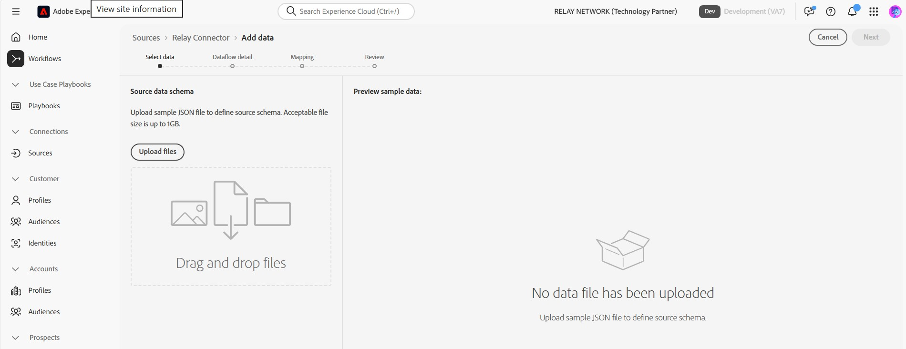
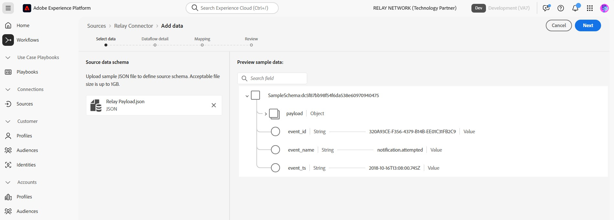

# Collegare Relay ad Experience Platform nell’interfaccia utente

>[!NOTE]
>
>L&#39;origine [!DNL Relay Connector] è in versione beta. Per ulteriori informazioni sull&#39;utilizzo di origini con etichetta beta, leggere la [panoramica delle origini](../../../../home.md#terms-and-conditions).

Con [!DNL Relay Connector] puoi offrire esperienze personalizzate ai tuoi clienti nei momenti più significativi del loro percorso, aiutandoti a creare relazioni più solide e a promuovere una maggiore fedeltà e valore creando una connessione in entrata per lo streaming degli eventi dall&#39;integrazione di [!DNL Relay Network] in Adobe Experience Platform.

Leggi questa guida per scoprire come utilizzare [!DNL Relay Connector] nell&#39;area di lavoro origini dell&#39;interfaccia utente di Experience Platform.

>[!IMPORTANT]
>
>Questa pagina della documentazione è gestita dal team *[!DNL Relay Network]*. Per eventuali richieste di informazioni o richieste di aggiornamento, contattaci direttamente all&#39;indirizzo *[[!DNL Relay Network]](https://www.relaynetwork.com/) o invia un&#39;e-mail a [info@relaynetwork.com](mailto:info@relaynetwork.com)*.

## Connetti l&#39;origine [!DNL Relay Connector]

Nell&#39;interfaccia utente di Experience Platform, seleziona **[!UICONTROL Origini]** dalla barra di navigazione a sinistra per accedere all&#39;area di lavoro [!UICONTROL Origini]. Nella schermata [!UICONTROL Catalogo] sono visualizzate diverse origini con cui è possibile creare un account. Puoi selezionare la categoria appropriata dal catalogo sul lato sinistro dello schermo o utilizzare l’opzione di ricerca per trovare un’origine specifica.

Nella categoria *[!UICONTROL Marketing automation]*, selezionare la scheda di origine [!DNL Relay Connector] e selezionare **[!UICONTROL Aggiungi dati]**.

>[!TIP]
>
>Le origini nel catalogo delle origini visualizzano l&#39;opzione **[!UICONTROL Configura]** quando non esiste alcun account autenticato. Una volta autenticato un account, questa opzione diventa **[!UICONTROL Aggiungi dati]**.

### Selezionare i dati

Viene visualizzata l&#39;interfaccia **[!UICONTROL Origine connettore di inoltro Connect]**. Utilizza l&#39;interfaccia *[!UICONTROL Seleziona dati]* per sfogliare o specificare lo schema dei dati di origine. In alternativa, puoi caricare un file JSON di esempio per definire lo schema sorgente.

>[!NOTE]
>
>Le dimensioni del file accettabili sono fino a 1 GB.

Dopo il caricamento dei dati, puoi utilizzare la sezione [!UICONTROL Anteprima dati di esempio] per visualizzare l&#39;anteprima dei dati.

### Dettagli del flusso di dati

Quindi, utilizza l&#39;interfaccia *[!UICONTROL Dettagli flusso di dati]* per fornire un **nome** e una **descrizione opzionale** per il flusso di dati. Selezionare inoltre il **[!UICONTROL set di dati di destinazione]** che si desidera utilizzare. Puoi creare un nuovo set di dati o utilizzare un set di dati esistente.

### Mappatura

Puoi mappare i campi sorgente ai campi dello schema XDM utilizzando la funzionalità di mappatura automatica, che corrisponde ai campi in base ai loro nomi, oppure puoi creare mappature personalizzate per un controllo più preciso. Se necessario, puoi anche applicare trasformazioni quali concatenazione, formattazione o ridenominazione per garantire che i dati si adattino perfettamente allo schema di destinazione. Per ulteriori informazioni sulla mappatura, leggere la [Guida dell&#39;interfaccia utente della preparazione dati](../../../../../data-prep/ui/mapping.md).

>[!TIP]
>
>Per informazioni dettagliate sui tipi di eventi e i valori dei dati che Relay invierà all&#39;origine, leggere la documentazione di [[!DNL Relay Network] Eventi push](https://docs.relaynetwork.com/docs/push-events). Queste informazioni sono utili per progettare in modo appropriato lo schema **Eventi esperienza**.

### Rivedi

Rivedi infine tutte le configurazioni, inclusi **origine, set di dati e mappature**. Al termine, selezionare **Fine** per creare il flusso di dati.

### Recuperare l’URL dell’endpoint di streaming

Dopo aver creato il flusso di dati, troverai l&#39;*URL endpoint di streaming* e altri dettagli correlati nella sezione **Proprietà** sul lato destro della pagina del flusso di dati.

Utilizzare questi valori per configurare il webhook nella **console di inoltro**. Per istruzioni dettagliate sulla configurazione del push, consulta la documentazione Relay: [Configurazione dell&#39;API push](https://docs.relaynetwork.com/docs/configuring-the-push-api).

## Risorse aggiuntive

* [Creare una nuova specifica di connessione utilizzando l&#39;API del servizio Flusso](https://experienceleague.adobe.com/it/docs/experience-platform/sources/sdk/streaming-sdk/create)
* [Connetti alla tua origine tramite l&#39;interfaccia utente](https://experienceleague.adobe.com/it/docs/experience-platform/sources/sdk/streaming-sdk/submit#test-your-source-using-the-ui)
