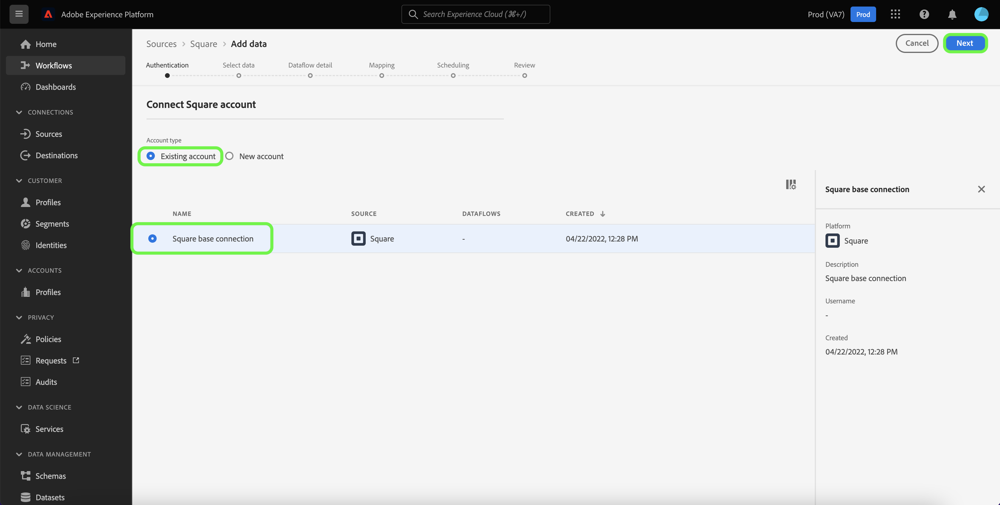

# Crea una connessione sorgente [!DNL Square] nell&#39;interfaccia utente

Questo tutorial illustra i passaggi per la creazione di un connettore di origine [!DNL Square] tramite l&#39;interfaccia utente di Platform.

## Introduzione

Questo tutorial richiede una buona conoscenza dei seguenti componenti di Adobe Experience Platform:

* [[!DNL Experience Data Model (XDM)] Sistema](../../../../../xdm/home.md): framework standardizzato tramite il quale [!DNL Experience Platform] organizza i dati sull&#39;esperienza del cliente.
   * [Nozioni di base sulla composizione dello schema](../../../../../xdm/schema/composition.md): scopri i blocchi predefiniti di base degli schemi XDM, inclusi i principi chiave e le best practice nella composizione dello schema.
   * [Esercitazione sull&#39;editor di schemi](../../../../../xdm/tutorials/create-schema-ui.md): scopri come creare schemi personalizzati utilizzando l&#39;interfaccia utente dell&#39;editor di schemi.
* [[!DNL Real-Time Customer Profile]](../../../../../profile/home.md): fornisce un profilo consumer unificato e in tempo reale basato su dati aggregati provenienti da più origini.

### Raccogli le credenziali richieste

Per accedere alla piattaforma dell&#39;account [!DNL Square], è necessario fornire i seguenti valori:

| Credenziali | Descrizione |
| --- | --- |
| Host | URL dell&#39;istanza [!DNL Square]. |
| ID client | ID client associato all&#39;account [!DNL Square]. |
| Segreto client | Il segreto client associato al tuo account [!DNL Square]. |
| Token di accesso | Il token di accesso viene utilizzato per autenticare l&#39;account [!DNL Square] con autenticazione OAuth 2.0. Il token di accesso può essere ottenuto da [!DNL Square]. |
| Aggiorna token | Il token di aggiornamento viene utilizzato per generare nuovi token di accesso dopo la scadenza del token di accesso corrente. Il token di aggiornamento può essere ottenuto da [!DNL Square]. |

Per ulteriori informazioni su queste credenziali e su come ottenerle, consulta la [[!DNL Square] documentazione su OAuth](https://developer.squareup.com/docs/oauth-api/receive-and-manage-tokens).

Dopo aver raccolto le credenziali richieste, puoi seguire i passaggi seguenti per collegare l&#39;account [!DNL Square] a Platform.

## Connetti il tuo account [!DNL Square]

Nell&#39;interfaccia utente di Platform, seleziona **[!UICONTROL Origini]** dal menu di navigazione a sinistra per accedere all&#39;area di lavoro [!UICONTROL Origini]. Nella schermata [!UICONTROL Catalogo] sono visualizzate diverse origini con cui è possibile creare un account.

Puoi selezionare la categoria appropriata dal catalogo sul lato sinistro dello schermo. In alternativa, è possibile trovare l’origine specifica che si desidera utilizzare utilizzando l’opzione di ricerca.

Nella categoria [!UICONTROL Pagamenti], selezionare **[!UICONTROL Quadrato]**, quindi **[!UICONTROL Aggiungi dati]**.

Viene visualizzata la pagina **[!UICONTROL Connetti a Square]**. In questa pagina è possibile utilizzare nuove credenziali o credenziali esistenti.

### Account esistente

Per utilizzare un account esistente, seleziona l&#39;account [!DNL Square] con cui vuoi creare un nuovo flusso di dati, quindi seleziona **[!UICONTROL Successivo]** per continuare.

### Nuovo account

Se stai creando un nuovo account, seleziona **[!UICONTROL Nuovo account]**, quindi fornisci un nome, una descrizione facoltativa e i valori appropriati per le credenziali di [!DNL Square]. Al termine, selezionare **[!UICONTROL Connetti all&#39;origine]** e quindi attendere un po&#39; di tempo per stabilire la nuova connessione.

## Passaggi successivi

Seguendo questa esercitazione, hai autenticato e creato una connessione di origine tra l&#39;account [!DNL Square] e Platform. Ora puoi continuare con l&#39;esercitazione successiva e [creare un flusso di dati per inserire i dati dei pagamenti in Platform](../../dataflow/payments.md).
