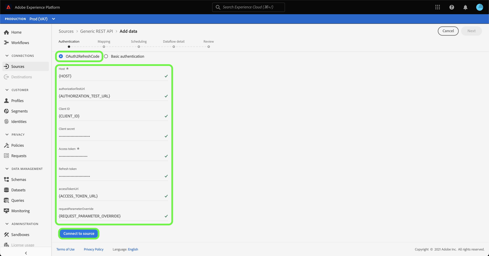

# Crea un [!DNL Generic REST API] connessione sorgente nell’interfaccia utente

>[!NOTE]
>
> La [!DNL Generic REST API] la sorgente è in versione beta. Consulta la sezione [Panoramica delle origini](../../../../home.md#terms-and-conditions) per ulteriori informazioni sull’utilizzo dei connettori con etichetta beta.

Questa esercitazione fornisce i passaggi per la creazione di un [!DNL Generic REST API] connettore di origine tramite l’interfaccia utente di Adobe Experience Platform.

## Introduzione

Questa esercitazione richiede una buona comprensione dei seguenti componenti di Platform:

* [Origini](../../../../home.md): L’Experience Platform consente di acquisire dati da varie sorgenti e allo stesso tempo di strutturare, etichettare e migliorare i dati in arrivo tramite i servizi Platform.
* [Sandbox](../../../../../sandboxes/home.md): Experience Platform fornisce sandbox virtuali che suddividono una singola istanza di Platform in ambienti virtuali separati per sviluppare e sviluppare applicazioni di esperienza digitale.

### Raccogli credenziali richieste

Per accedere al tuo [!DNL Generic REST API] account su Platform, devi fornire credenziali valide per il tipo di autenticazione desiderato. L’API REST generica supporta sia il codice di aggiornamento OAuth 2 che l’autenticazione di base. Per informazioni sulle credenziali per i due tipi di autenticazione supportati, vedere le tabelle seguenti.

#### Codice di aggiornamento OAuth 2

| Credenziali | Descrizione |
| --- | --- |
| Host | L&#39;URL host della sorgente a cui stai effettuando la richiesta. Questo valore è obbligatorio e non può essere bypassato utilizzando l&#39;override del parametro di richiesta. |
| URL del test di autorizzazione | (Facoltativo) L&#39;URL del test di autorizzazione viene utilizzato per convalidare le credenziali durante la creazione di una connessione di base. Se non viene fornito, le credenziali vengono automaticamente controllate durante il passaggio di creazione della connessione di origine. |
| ID client | (Facoltativo) L&#39;ID client associato al tuo account utente. |
| Segreto client | (Facoltativo) Il segreto client associato al tuo account utente. |
| Token di accesso | Credenziale di autenticazione principale utilizzata per accedere all’applicazione. Il token di accesso rappresenta l’autorizzazione dell’applicazione per accedere a specifici aspetti dei dati di un utente. Questo valore è obbligatorio e non può essere bypassato utilizzando l&#39;override del parametro di richiesta. |
| Aggiorna token | (Facoltativo) Token utilizzato per generare un nuovo token di accesso quando il token di accesso è scaduto. |
| URL token di accesso | (Facoltativo) L&#39;endpoint URL utilizzato per recuperare il token di accesso. |
| Sostituzione del parametro di richiesta | (Facoltativo) Proprietà che consente di specificare i parametri delle credenziali da ignorare. |

#### Autenticazione di base

| Credenziali | Descrizione |
| --- | --- |
| Host | L&#39;URL host della sorgente a cui stai effettuando la richiesta. |
| Nome utente | Nome utente corrispondente al tuo account utente. |
| Password | Password corrispondente al tuo account utente. |

## Collegare l’account API REST generico

Nell’interfaccia utente di Platform, seleziona **[!UICONTROL Origini]** dalla navigazione a sinistra per accedere al [!UICONTROL Origini] workspace. La [!UICONTROL Catalogo] in questa schermata vengono visualizzate diverse sorgenti con cui è possibile creare un account.

Puoi selezionare la categoria appropriata dal catalogo sul lato sinistro dello schermo. In alternativa, è possibile trovare la sorgente specifica con cui si desidera lavorare utilizzando la barra di ricerca.

Sotto la [!UICONTROL Protocolli] categoria, seleziona **[!UICONTROL API REST generica]** quindi seleziona **[!UICONTROL Aggiungi dati]**.

La **[!UICONTROL Connetti a API REST generico]** viene visualizzata la pagina . In questa pagina è possibile utilizzare le nuove credenziali o le credenziali esistenti.

### Account esistente

Per collegare un account esistente, seleziona l’account API REST generico con cui desideri connetterti, quindi seleziona **[!UICONTROL Successivo]** per procedere.

### Nuovo account

Se stai creando un nuovo account, seleziona **[!UICONTROL Nuovo account]**, quindi fornisci un nome e una descrizione delle opzioni per il nuovo [!DNL Generic REST API] conto.

#### Autenticazione tramite codice di aggiornamento OAuth 2

[!DNL Generic REST API] supporta sia il codice di aggiornamento OAuth 2 che l’autenticazione di base. Per eseguire l’autenticazione utilizzando un’autenticazione OAuth2, seleziona **[!UICONTROL OAuth2RefreshCode]**, fornire le credenziali OAuth 2 e quindi selezionare **[!UICONTROL Connetti alla sorgente]**.

#### Autenticazione tramite autenticazione di base

Per utilizzare l&#39;autenticazione di base, seleziona **[!UICONTROL Autenticazione di base]**, fornisci il tuo host, nome utente e password, quindi seleziona **[!UICONTROL Connetti alla sorgente]**.

## Passaggi successivi

Seguendo questa esercitazione, hai stabilito una connessione al tuo account API REST generico. Ora puoi passare all’esercitazione successiva e [configurare un flusso di dati per l’importazione di dati in Platform](../../dataflow/protocols.md).
