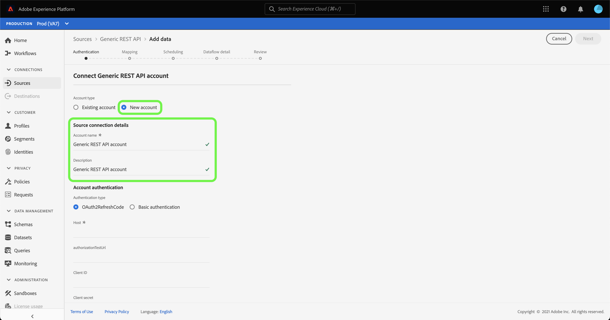

# Creare un [!DNL Generic REST API] connessione sorgente nell’interfaccia utente

>[!NOTE]
>
> Il [!DNL Generic REST API] sorgente in versione beta. Consulta la [Panoramica sulle origini](../../../../home.md#terms-and-conditions) per ulteriori informazioni sull’utilizzo di connettori con etichetta beta.

Questo tutorial descrive i passaggi necessari per creare [!DNL Generic REST API] connettore di origine che utilizza l’interfaccia utente di Adobe Experience Platform.

## Introduzione

Questo tutorial richiede una buona conoscenza dei seguenti componenti di Platform:

* [Sorgenti](../../../../home.md): un Experience Platform consente di acquisire dati da varie origini, consentendoti allo stesso tempo di strutturare, etichettare e migliorare i dati in arrivo tramite i servizi di Platform.
* [Sandbox](../../../../../sandboxes/home.md): Experience Platform fornisce sandbox virtuali che permettono di suddividere una singola istanza Platform in ambienti virtuali separati, utili per le attività di sviluppo e aggiornamento delle applicazioni di esperienza digitale.

### Raccogli le credenziali richieste

Per accedere al tuo [!DNL Generic REST API] su Platform, devi fornire credenziali valide per il tipo di autenticazione desiderato. L’API REST generica supporta sia il codice di aggiornamento OAuth 2 che l’autenticazione di base. Per informazioni sulle credenziali per i due tipi di autenticazione supportati, vedere le tabelle seguenti.

#### Codice di aggiornamento OAuth 2

| Credenziali | Descrizione |
| --- | --- |
| Host | L’URL host dell’origine a cui stai effettuando la richiesta. Questo valore è obbligatorio e non può essere ignorato utilizzando la sostituzione del parametro della richiesta. |
| URL test di autorizzazione | (Facoltativo) L’URL del test di autorizzazione viene utilizzato per convalidare le credenziali durante la creazione di una connessione di base. Se non vengono fornite, le credenziali vengono controllate automaticamente durante il passaggio di creazione della connessione di origine. |
| ID client | (Facoltativo) L’ID client associato al tuo account utente. |
| Segreto client | (Facoltativo) Il segreto client associato al tuo account utente. |
| Token di accesso | Credenziali di autenticazione primarie utilizzate per accedere all&#39;applicazione. Il token di accesso rappresenta l’autorizzazione dell’applicazione ad accedere ad aspetti particolari dei dati di un utente. Questo valore è obbligatorio e non può essere ignorato utilizzando la sostituzione del parametro della richiesta. |
| Aggiorna token | (Facoltativo) Token utilizzato per generare un nuovo token di accesso, se il token di accesso è scaduto. |
| URL token di accesso | (Facoltativo) L’endpoint URL utilizzato per recuperare il token di accesso. |
| Sostituzione parametro richiesta | (Facoltativo) Proprietà che consente di specificare i parametri delle credenziali da ignorare. |

#### Autenticazione di base

| Credenziali | Descrizione |
| --- | --- |
| Host | L’URL host dell’origine a cui stai effettuando la richiesta. |
| Nome utente | Il nome utente che corrisponde al tuo account utente. |
| Password | La password che corrisponde al tuo account utente. |

## Connettere l’account API REST generico

Nell’interfaccia utente di Platform, seleziona **[!UICONTROL Sorgenti]** dalla barra di navigazione a sinistra per accedere al [!UICONTROL Sorgenti] Workspace. Il [!UICONTROL Catalogo] Nella schermata vengono visualizzate diverse origini con cui è possibile creare un account.

Puoi selezionare la categoria appropriata dal catalogo sul lato sinistro dello schermo. In alternativa, è possibile trovare la fonte specifica che si desidera utilizzare utilizzando la barra di ricerca.

Sotto [!UICONTROL Protocoli] categoria, seleziona **[!UICONTROL API REST generica]** e quindi seleziona **[!UICONTROL Aggiungi dati]**.

Il **[!UICONTROL Connessione all’API REST generica]** viene visualizzata. In questa pagina è possibile utilizzare nuove credenziali o credenziali esistenti.

### Account esistente

Per collegare un account esistente, seleziona l’account API REST generico con cui desideri connetterti, quindi fai clic su **[!UICONTROL Successivo]** per procedere.

### Nuovo account

Se stai creando un nuovo account, seleziona **[!UICONTROL Nuovo account]** e quindi fornisci un nome e una descrizione dell’opzione per il nuovo [!DNL Generic REST API] account.

#### Autenticazione tramite codice di aggiornamento OAuth 2

[!DNL Generic REST API] supporta sia il codice di aggiornamento OAuth 2 che l’autenticazione di base. Per eseguire l’autenticazione tramite un’autenticazione OAuth2, seleziona **[!UICONTROL OAuth2RefreshCode]**, fornisci le tue credenziali OAuth 2 e quindi seleziona **[!UICONTROL Connetti all&#39;origine]**.

#### Autenticazione tramite autenticazione di base

Per utilizzare l’autenticazione di base, seleziona **[!UICONTROL Autenticazione di base]**, fornire l&#39;host, il nome utente e la password, quindi selezionare **[!UICONTROL Connetti all&#39;origine]**.

## Passaggi successivi

Seguendo questa esercitazione, hai stabilito una connessione all’account API REST generico. Ora puoi continuare con l’esercitazione successiva e [configurare un flusso di dati per inserire i dati in Platform](../../dataflow/protocols.md).
