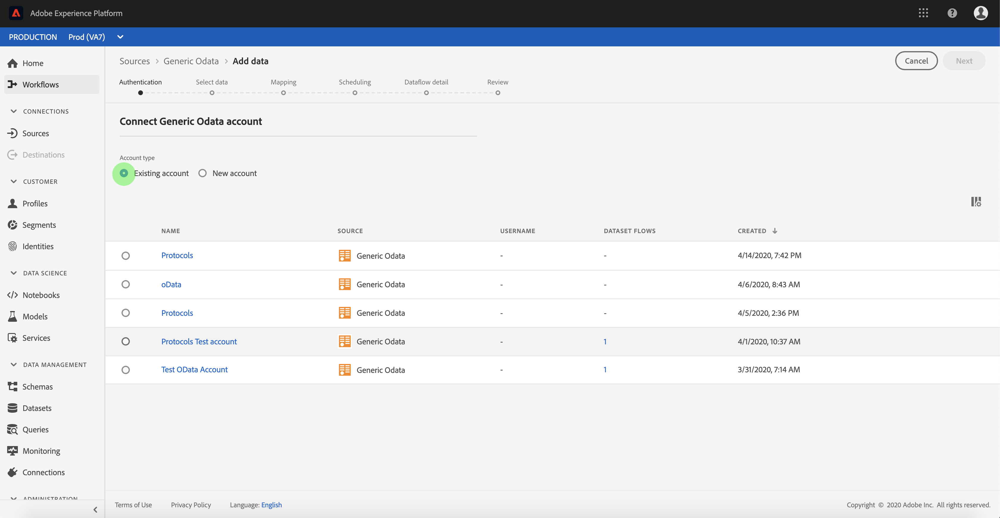

# Creare un connettore sorgente OData generico nell’interfaccia utente

> [!NOTE]
> Il connettore OData generico è in versione beta. Per ulteriori informazioni sull&#39;utilizzo dei connettori con etichetta beta, consulta la panoramica  Origini.

I connettori di origine in  Adobe Experience Platform consentono di trasferire i dati esternamente originati su base programmata. Questa esercitazione fornisce i passaggi per la creazione di un connettore sorgente generico Open Data Protocol (in seguito denominato &quot;OData&quot;) tramite l&#39;interfaccia utente di Platform.

## Introduzione

Questa esercitazione richiede una conoscenza approfondita dei seguenti componenti del  Adobe Experience Platform:

* [Sistema](../../../../../xdm/home.md)XDM (Experience Data Model): Framework standard con cui  Experience Platform organizza i dati sull&#39;esperienza dei clienti.
   * [Nozioni di base sulla composizione](../../../../../xdm/schema/composition.md)dello schema: Scoprite i componenti di base degli schemi XDM, inclusi i principi chiave e le procedure ottimali nella composizione dello schema.
   * [Esercitazione](../../../../../xdm/tutorials/create-schema-ui.md)sull&#39;Editor di schema: Scoprite come creare schemi personalizzati utilizzando l&#39;interfaccia utente dell&#39;Editor di schema.
* [Profilo](../../../../../profile/home.md)cliente in tempo reale: Fornisce un profilo di consumo unificato e in tempo reale basato su dati aggregati provenienti da più origini.

Se si dispone già di una connessione OData valida, è possibile ignorare il resto del documento e procedere all&#39;esercitazione sulla [configurazione di un flusso di dataset di protocolli](../../dataflow/protocols.md)

### Raccogli credenziali richieste

Per accedere al tuo account OData in Platform, devi fornire i seguenti valori:

| Credenziali | Descrizione |
| ---------- | ----------- |
| `url` | L&#39;URL principale del servizio OData. |

Per ulteriori informazioni su come iniziare, consulta [questo documento](https://www.odata.org/getting-started/basic-tutorial/)OData.

## Collegamento dell&#39;account OData

Dopo aver raccolto le credenziali richieste, puoi seguire i passaggi descritti di seguito per creare un nuovo account OData per la connessione ad Platform.

Accedete a <a href="https://platform.adobe.com" target="_blank">Adobe Experience Platform</a> , quindi selezionate **Origini** dalla barra di navigazione a sinistra per accedere all&#39;area di lavoro *Origini* . Nella schermata *Catalogo* sono visualizzate diverse sorgenti per le quali potete creare un account in ingresso. Ciascuna origine mostra il numero di conti e flussi di dati esistenti ad essi associati.

Potete selezionare la categoria appropriata dal catalogo sul lato sinistro dello schermo. In alternativa, è possibile trovare l&#39;origine specifica con cui si desidera lavorare utilizzando l&#39;opzione di ricerca.

Nella categoria *Protocolli* , selezionare OData **** generico per esporre una barra delle informazioni sul lato destro dello schermo. La barra delle informazioni fornisce una breve descrizione della sorgente selezionata e le opzioni per collegarsi alla sorgente o visualizzare la documentazione. Per creare una nuova connessione in entrata, selezionate **Connetti sorgente**.

Viene visualizzata la pagina *Connetti a OData* generico. In questa pagina è possibile utilizzare credenziali nuove o già esistenti.

### Nuovo account

Se si utilizzano nuove credenziali, selezionare **Nuovo account**. Nel modulo di input visualizzato, specificare un nome, una descrizione facoltativa e le credenziali OData per la connessione. Al termine, selezionate **Connect** , quindi concedete un po&#39; di tempo per la creazione del nuovo account.

### Account esistente

Per collegare un account esistente, selezionate l&#39;account OData con cui desiderate connettervi, quindi selezionate **Avanti** per continuare.

## Passaggi successivi

Seguendo questa esercitazione hai stabilito una connessione al tuo account OData. Ora puoi continuare con l&#39;esercitazione successiva e [configurare un flusso di dataset per portare i dati dei protocolli in Platform](../../dataflow/protocols.md).