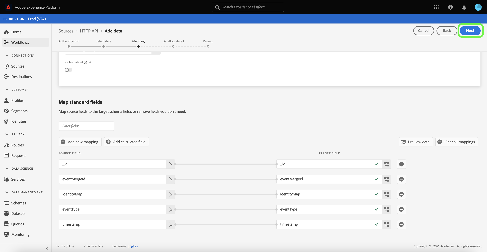
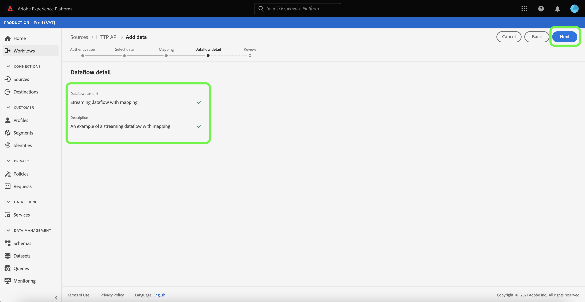

# Creare un [!DNL HTTP API] connessione in streaming tramite l’interfaccia utente

Questa esercitazione descrive i passaggi per la creazione di una connessione a un&#39;origine di streaming mediante [!UICONTROL Sorgenti] Workspace.

## Introduzione

Questo tutorial richiede una buona conoscenza dei seguenti componenti di Adobe Experience Platform:

- [[!DNL Experience Data Model (XDM)] Sistema](../../../../../xdm/home.md): il quadro standardizzato mediante il quale [!DNL Experience Platform] organizza i dati sull’esperienza del cliente.
   - [Nozioni di base sulla composizione dello schema](../../../../../xdm/schema/composition.md): scopri gli elementi di base degli schemi XDM, compresi i principi chiave e le best practice nella composizione dello schema.
   - [Esercitazione sull’editor di schemi](../../../../../xdm/tutorials/create-schema-ui.md): scopri come creare schemi personalizzati utilizzando l’interfaccia utente dell’Editor di schema.
- [[!DNL Real-Time Customer Profile]](../../../../../profile/home.md): fornisce un profilo consumer unificato e in tempo reale basato su dati aggregati provenienti da più origini.

## Creare una connessione in streaming

Nell’interfaccia utente di Platform, seleziona **[!UICONTROL Sorgenti]** dalla barra di navigazione a sinistra per accedere al [!UICONTROL Sorgenti] Workspace. Il [!UICONTROL Catalogo] Nella schermata vengono visualizzate diverse origini con cui è possibile creare un account.

Puoi selezionare la categoria appropriata dal catalogo sul lato sinistro dello schermo. In alternativa, è possibile trovare l’origine specifica che si desidera utilizzare utilizzando l’opzione di ricerca.

Sotto **[!UICONTROL Streaming]** categoria, seleziona **[!UICONTROL API HTTP]** e quindi seleziona **[!UICONTROL Aggiungi dati]**.

Il **[!UICONTROL Connetti account API HTTP]** viene visualizzata. In questa pagina è possibile utilizzare nuove credenziali o credenziali esistenti.

### Account esistente

Per utilizzare un account esistente, seleziona l’account API HTTP con cui desideri creare un nuovo flusso di dati, quindi seleziona **[!UICONTROL Successivo]** per procedere.

### Nuovo account

Se stai creando un nuovo account, seleziona **[!UICONTROL Nuovo account]**. Nel modulo di input visualizzato, fornisci un nome account e una descrizione facoltativa. È inoltre possibile specificare le seguenti proprietà di configurazione:

- **[!UICONTROL Autenticazione]:** Questa proprietà determina se la connessione in streaming richiede o meno l&#39;autenticazione. L’autenticazione garantisce che i dati vengano raccolti da fonti attendibili. Se hai a che fare con informazioni personali (PII, Personally Identifiable Information), devi attivare questa proprietà. Per impostazione predefinita, questa proprietà è disattivata.
- **[!UICONTROL Compatibile con XDM]:** Questa proprietà indica se la connessione in streaming invierà eventi compatibili con gli schemi XDM. Per impostazione predefinita, questa proprietà è disattivata.

Al termine, seleziona **[!UICONTROL Connetti all&#39;origine]** e quindi seleziona **[!UICONTROL Successivo]** per procedere.

## Selezionare i dati

Dopo aver creato la connessione API HTTP, il **[!UICONTROL Seleziona dati]** viene visualizzata un&#39;interfaccia per caricare e visualizzare in anteprima i dati.

Seleziona **[!UICONTROL Carica file]** per caricare i dati. In alternativa, puoi trascinare e rilasciare i dati nel [!UICONTROL Trascinare i file] dell&#39;interfaccia.

Con i dati caricati, puoi utilizzare il lato destro dell’interfaccia per visualizzare in anteprima la gerarchia dei file. Seleziona **[!UICONTROL Successivo]** per procedere.

## Mappare i campi dati su uno schema XDM

Il [!UICONTROL Mappatura] viene visualizzato un passaggio che fornisce un’interfaccia per mappare i dati di origine su un set di dati di Platform.

I file Parquet devono essere conformi a XDM e non richiedono la configurazione manuale della mappatura, mentre i file CSV richiedono di configurare esplicitamente la mappatura, ma consentono di scegliere quali campi dati di origine mappare. I file JSON, se contrassegnati come reclamo XDM, non richiedono la configurazione manuale. Tuttavia, se non è contrassegnato come conforme a XDM, sarà necessario configurare esplicitamente la mappatura.

Scegli un set di dati per i dati in entrata da acquisire in. Puoi utilizzare un set di dati esistente o crearne uno nuovo.

### Creare un nuovo set di dati

Per creare un nuovo set di dati, seleziona **[!UICONTROL Nuovo set di dati]**. Nel modulo visualizzato, fornisci il nome, una descrizione facoltativa e lo schema di destinazione per il set di dati. Se si seleziona un [!DNL Profile]dello schema abilitato, puoi scegliere se anche il set di dati deve essere [!DNL Profile]-abilitato.

### Usa un set di dati esistente

Per utilizzare un set di dati esistente, seleziona **[!UICONTROL Set di dati esistente]**. Nella maschera visualizzata selezionare il set di dati che si desidera utilizzare. Dopo aver selezionato un set di dati, puoi scegliere se il set di dati deve essere [!DNL Profile]-abilitato.

### Mappare i campi standard

In base alle tue esigenze, puoi scegliere di mappare i campi direttamente o utilizzare le funzioni di preparazione dati per trasformare i dati sorgente in modo da derivare valori calcolati o calcolati. Per i passaggi completi sull’utilizzo dell’interfaccia mapper e dei campi calcolati, vedi la [Guida dell’interfaccia utente per la preparazione dati](../../../../../data-prep/ui/mapping.md).

Per aggiungere un nuovo campo di origine, seleziona **[!UICONTROL Aggiungi nuova mappatura]**.

Viene visualizzata una nuova coppia di campi sorgente e di destinazione. Per aggiungere un nuovo campo di origine, selezionare l&#39;icona freccia accanto al [!UICONTROL Seleziona campo di origine] barra di input.

Il [!UICONTROL Seleziona attributi] Il pannello consente di esplorare la gerarchia dei file e selezionare un campo di origine specifico da mappare a un campo XDM di destinazione. Dopo aver selezionato il campo sorgente da mappare, seleziona **[!UICONTROL Seleziona]** per procedere.

Con un campo sorgente selezionato, ora puoi identificare il campo XDM di destinazione appropriato a cui eseguire il mapping. Seleziona l’icona schema nella sezione del campo di destinazione.

Il [!UICONTROL Mappa campo di origine su campo di destinazione] viene visualizzata una finestra che fornisce un’interfaccia per esplorare lo schema del set di dati di destinazione. Seleziona il campo di destinazione che corrisponde al campo di origine, quindi seleziona **[!UICONTROL Seleziona]** per procedere.

Una volta mappati tutti i campi sorgente ai relativi campi XDM di destinazione appropriati, seleziona **[!UICONTROL Successivo]**

## Dettaglio del flusso di dati

Il **[!UICONTROL Dettagli del flusso di dati]** viene visualizzato il passaggio. In questa pagina puoi fornire dettagli per il flusso di dati creato assegnando un nome e una descrizione facoltativa.

Dopo aver fornito i dettagli per il flusso di dati, seleziona **[!UICONTROL Successivo]**.

## Revisione

Il **[!UICONTROL Revisione]** viene visualizzato un passaggio che consente di rivedere i dettagli del flusso di dati prima di crearlo. I dettagli sono raggruppati nelle seguenti categorie:

- **[!UICONTROL Connessione]**: mostra il nome dell’account, la piattaforma di origine e il nome dell’origine.
- **[!UICONTROL Assegnare set di dati e mappare i campi]**: mostra il set di dati di destinazione e lo schema a cui aderisce il set di dati.

Dopo aver confermato la correttezza dei dettagli, seleziona **[!UICONTROL Fine]**.

## Ottieni URL endpoint di streaming

Una volta creata la connessione, viene visualizzata la pagina dei dettagli delle origini. Questa pagina mostra i dettagli della connessione appena creata, inclusi i flussi di dati, l’ID e l’URL dell’endpoint di streaming eseguiti in precedenza.

## Passaggi successivi

Seguendo questa esercitazione, hai creato una connessione HTTP in streaming, che consente di utilizzare l’endpoint in streaming per accedere a diversi [!DNL Data Ingestion] API. Per istruzioni su come creare una connessione in streaming nell’API, leggi [tutorial sulla creazione di una connessione in streaming](../../../api/create/streaming/http.md).

Per informazioni su come inviare dati a Platform in streaming, leggi l’esercitazione su [streaming di dati di serie temporali](../../../../../ingestion/tutorials/streaming-time-series-data.md) o il tutorial su [dati di registrazione streaming](../../../../../ingestion/tutorials/streaming-record-data.md).
