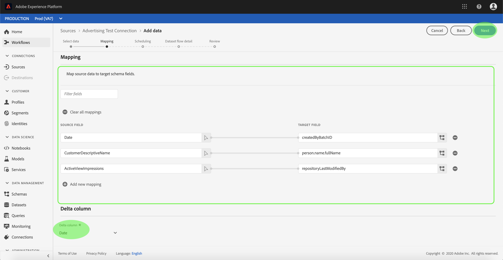
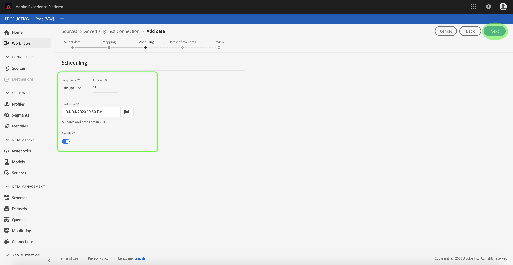
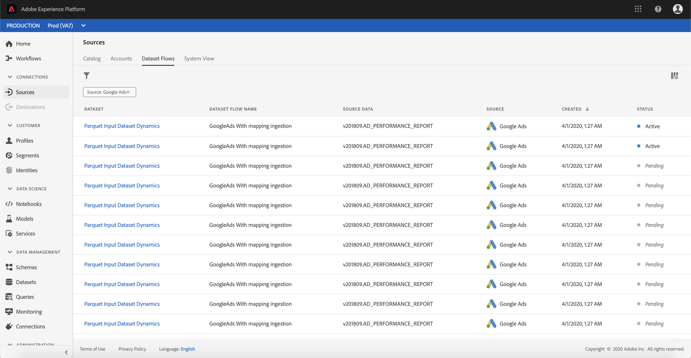
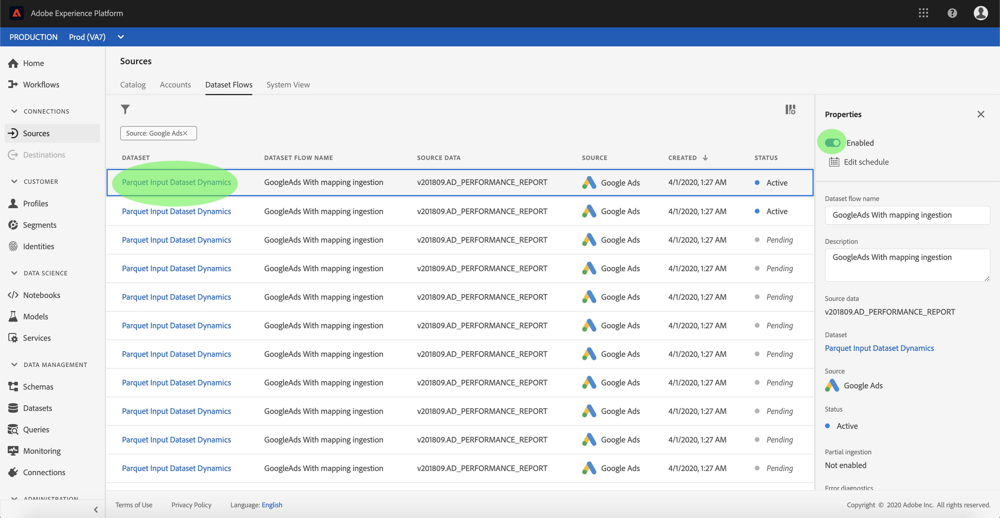

# Configurare un flusso di dati per un connettore pubblicitario nell&#39;interfaccia utente

Un flusso di dati è un&#39;attività pianificata che recupera e assimila dati da un&#39;origine a un set di dati di Adobe Experience Platform . Questa esercitazione fornisce i passaggi per configurare un nuovo flusso di dati utilizzando l&#39;account pubblicitario.

## Introduzione

Questa esercitazione richiede una conoscenza approfondita dei seguenti componenti del  Adobe Experience Platform:

- [Sistema](../../../../xdm/home.md)XDM (Experience Data Model): Il framework standard con cui [!DNL Experience Platform] organizzare i dati relativi all&#39;esperienza del cliente.
   - [Nozioni di base sulla composizione](../../../../xdm/schema/composition.md)dello schema: Scoprite i componenti di base degli schemi XDM, inclusi i principi chiave e le procedure ottimali nella composizione dello schema.
   - [Esercitazione](../../../../xdm/tutorials/create-schema-ui.md)sull&#39;Editor di schema: Scoprite come creare schemi personalizzati utilizzando l&#39;interfaccia utente dell&#39;Editor di schema.
- [Profilo](../../../../profile/home.md)cliente in tempo reale: Fornisce un profilo di consumo unificato e in tempo reale basato su dati aggregati provenienti da più origini.

Inoltre, questa esercitazione richiede che sia già stato creato un account pubblicitario. Un elenco di esercitazioni per la creazione di diversi connettori di pagamento nell&#39;interfaccia utente è disponibile nella panoramica [dei connettori](../../../home.md)sorgente.

## Seleziona dati

Dopo aver creato l&#39;account pubblicitario, viene visualizzato il *[!UICONTROL Select data]* passaggio che fornisce un&#39;interfaccia interattiva per esplorare la gerarchia dei file.

- La metà sinistra dell&#39;interfaccia è un browser di directory che visualizza i file e le directory del server.
- La metà destra dell&#39;interfaccia consente di visualizzare in anteprima fino a 100 righe di dati da un file compatibile.

Selezionate la directory da utilizzare, quindi selezionate **[!UICONTROL Next]**.

## Mappatura dei campi dati su uno schema XDM

Viene visualizzato il *[!UICONTROL Mapping]* passaggio che fornisce un&#39;interfaccia interattiva per mappare i dati di origine a un [!DNL Platform] dataset.

Scegliere un set di dati in entrata in cui assimilare i dati. È possibile utilizzare un set di dati esistente o crearne uno nuovo.

### Utilizzare un dataset esistente

Per assimilare i dati in un dataset esistente, selezionare **[!UICONTROL Use existing dataset]**, quindi fare clic sull&#39;icona del dataset.

Viene visualizzata *[!UICONTROL Select dataset]* la finestra di dialogo. Trovare il set di dati che si desidera utilizzare, selezionarlo, quindi fare clic **[!UICONTROL Continue]**.

### Utilizza un nuovo set di dati

Per assimilare i dati in un nuovo dataset, selezionare **[!UICONTROL Create new dataset]** e immettere un nome e una descrizione per il dataset nei campi forniti.

Durante questo processo, potete anche abilitare *[!UICONTROL Partial ingestion]* e *[!UICONTROL Error diagnostics]*. L&#39;abilitazione *[!UICONTROL Partial ingestion]* consente di acquisire i dati contenenti errori, fino a una certa soglia che è possibile impostare. L&#39;attivazione [!UICONTROL Error diagnostics] fornisce dettagli su eventuali dati errati che vengono inseriti separatamente in batch. Per ulteriori informazioni, consultate la panoramica sull’assimilazione [parziale dei](../../../../ingestion/batch-ingestion/partial.md)batch.

Al termine, fare clic sull&#39;icona dello schema.

Viene visualizzata *[!UICONTROL Select schema]* la finestra di dialogo. Selezionare lo schema che si desidera applicare al nuovo dataset, quindi fare clic su **[!DNL Done]**.

In base alle esigenze, è possibile scegliere di mappare direttamente i campi oppure utilizzare le funzioni di mappatura per trasformare i dati di origine in modo da derivare i valori calcolati o calcolati. Per ulteriori informazioni sulla mappatura dei dati e sulle funzioni di mappatura, consulta l’esercitazione sulla [mappatura dei dati CSV ai campi](../../../../ingestion/tutorials/map-a-csv-file.md)dello schema XDM.

La *[!UICONTROL Mapping]* schermata consente anche di impostare *[!UICONTROL Delta column]*. Quando si crea il flusso di dati, è possibile impostare qualsiasi campo di marca temporale come base per decidere quali record acquisire nelle assimilazioni incrementali pianificate.

Una volta mappati i dati di origine, fai clic su **[!UICONTROL Next]**.

## Pianificare le esecuzioni dell&#39;assimilazione

Viene visualizzato il *[!UICONTROL Scheduling]* passaggio che consente di configurare una pianificazione di assimilazione per l&#39;acquisizione automatica dei dati di origine selezionati tramite le mappature configurate. Nella tabella seguente sono riportati i diversi campi configurabili per la pianificazione:

| Campo | Descrizione |
| --- | --- |
| Frequenza | Le frequenze selezionabili sono: Minuto, Ora, Giorno e Settimana. |
| Intervallo | Un numero intero che imposta l&#39;intervallo per la frequenza selezionata. |
| Ora di inizio | Una marca temporale UTC per la quale si verificherà la prima assimilazione. |
| Backfill | Un valore booleano che determina i dati inizialmente acquisiti. Se *[!UICONTROL Backfill]* è abilitata, tutti i file correnti nel percorso specificato verranno acquisiti durante la prima assimilazione pianificata. Se *[!UICONTROL Backfill]* è disattivato, verranno trasferiti solo i file caricati tra la prima esecuzione dell&#39;assimilazione e il *[!UICONTROL Start time*] . I file caricati prima di *[!UICONTROL Start time]* non verranno acquisiti. |

I flussi di dati sono progettati per l&#39;acquisizione automatica dei dati su base programmata. Se desiderate effettuare il caricamento solo una volta in questo flusso di lavoro, potete farlo configurando il **[!UICONTROL Frequency]** pulsante &quot;Giorno&quot; e applicando un numero molto elevato per il **[!UICONTROL Interval]**, ad esempio 10000 o simile.

Immettete i valori per la pianificazione e fate clic su **[!UICONTROL Next]**.

## Denominate il flusso di dati

Viene visualizzato il *[!UICONTROL Dataset flow detail]* passaggio in cui è necessario specificare un nome e una descrizione facoltativa per il flusso di dati. Selezionate **[!UICONTROL Next]** al termine.

## Controlla il flusso dei dataset

Viene visualizzato il *[!UICONTROL Review]* passaggio che consente di rivedere il nuovo flusso di dati prima della creazione. I dettagli sono raggruppati nelle seguenti categorie:

- *[!UICONTROL Connection]*: Mostra il tipo di origine, il percorso pertinente del file di origine scelto e la quantità di colonne all&#39;interno del file di origine.
- *[!UICONTROL Assign dataset & map fields]*: Mostra il set di dati in cui vengono acquisiti i dati di origine, incluso lo schema a cui il set di dati aderisce.
- *[!UICONTROL Scheduling]*: Mostra il periodo, la frequenza e l’intervallo attivi della pianificazione di assimilazione.

Dopo aver rivisto il flusso di dati, fai clic su **[!UICONTROL Finish]** e consenti la creazione del flusso di dati.

## Monitorare il flusso dei dataset

Una volta creato il flusso di set di dati, è possibile monitorare i dati che vengono acquisiti attraverso di esso. Per ulteriori informazioni su come monitorare i flussi di dataset, vedere l&#39;esercitazione sugli [account e sui flussi](../monitor.md)di dataset.

## Passaggi successivi

Seguendo questa esercitazione, hai creato con successo un flusso di dataset per inserire i dati da un sistema di automazione marketing e hai acquisito informazioni sul monitoraggio dei set di dati. I dati in entrata possono ora essere utilizzati dai [!DNL Platform] servizi a valle come [!DNL Real-time Customer Profile] e [!DNL Data Science Workspace]. Per ulteriori informazioni, consulta i documenti seguenti:

- [Panoramica del profilo cliente in tempo reale](../../../../profile/home.md)
- [Panoramica di Analysis Workspace](../../../../data-science-workspace/home.md)

## Appendice

Le sezioni seguenti forniscono informazioni aggiuntive sull&#39;utilizzo dei connettori di origine.

### Disattivazione di un flusso di dati

Quando viene creato un flusso di dati, esso diventa immediatamente attivo e acquisisce i dati in base alla pianificazione assegnata. È possibile disattivare un flusso di dataset attivo in qualsiasi momento seguendo le istruzioni riportate di seguito.

Nella *[!UICONTROL Dataset Flows]* schermata, selezionare il nome del flusso di dati che si desidera disattivare.

La *[!UICONTROL Properties]* colonna viene visualizzata sul lato destro dello schermo. Questo pannello contiene un pulsante di **[!UICONTROL Enabled]** attivazione/disattivazione. Fate clic sull’interruttore per disattivare il flusso di dati. La stessa opzione può essere utilizzata per riattivare un flusso di dati dopo che è stato disabilitato.

### Attivare i dati in entrata per la [!DNL Profile] popolazione

I dati in entrata provenienti dal connettore di origine possono essere utilizzati per arricchire e compilare [!DNL Real-time Customer Profile] i dati. Per ulteriori informazioni sulla compilazione [!DNL Real-time Customer Profile] dei dati, consulta l’esercitazione sulla popolazione [di](../profile.md)profili.
