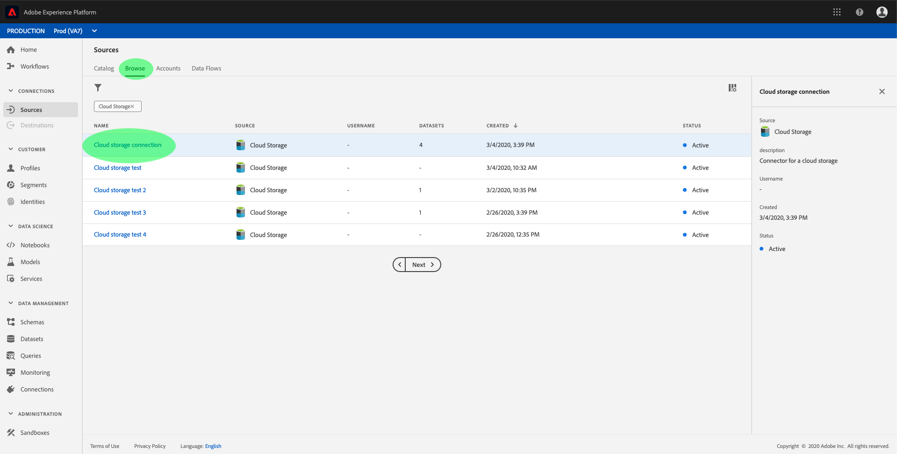

# Configurare un flusso di dati per una connessione batch di archiviazione cloud nell’interfaccia utente

Un flusso di dati è un’attività pianificata che recupera e acquisisce dati da un’origine a un [!DNL Platform] set di dati. Questa esercitazione fornisce i passaggi per configurare un nuovo flusso di dati utilizzando l&#39;account di archiviazione cloud.

## Introduzione

Questa esercitazione richiede una buona comprensione dei seguenti componenti di Adobe Experience Platform:

* [[!DNL Experience Data Model (XDM)] Sistema](../../../../../xdm/home.md): Il quadro standardizzato [!DNL Experience Platform] organizza i dati sulla customer experience.
   * [Nozioni di base sulla composizione dello schema](../../../../../xdm/schema/composition.md): Scopri i blocchi di base degli schemi XDM, inclusi i principi chiave e le best practice nella composizione dello schema.
   * [Esercitazione sull’Editor di schema](../../../../../xdm/tutorials/create-schema-ui.md): Scopri come creare schemi personalizzati utilizzando l’interfaccia utente dell’Editor di schema.
* [[!DNL Real-time Customer Profile]](../../../../../profile/home.md): Fornisce un profilo di consumatore unificato e in tempo reale basato su dati aggregati provenienti da più origini.

Inoltre, questa esercitazione richiede l’utilizzo di un account di archiviazione cloud stabilito. Un elenco di esercitazioni per la creazione di diversi account di archiviazione cloud nell’interfaccia utente è disponibile nella sezione [panoramica dei connettori sorgente](../../../../home.md).

### Formati di file supportati

[!DNL Experience Platform] supporta i seguenti formati di file da acquisire da archivi esterni:

* Valori separati da delimitatore (DSV): Qualsiasi valore a carattere singolo può essere utilizzato come delimitatore per i file di dati in formato DSV.
* [!DNL JavaScript Object Notation] (JSON): I file di dati in formato JSON devono essere conformi a XDM.
* [!DNL Apache Parquet]: I file di dati in formato parquet devono essere conformi a XDM.
* File compressi: I file JSON e delimitati possono essere compressi come segue: `bzip2`, `gzip`, `deflate`, `zipDeflate`, `tarGzip`e `tar`.

## Seleziona dati

Dopo aver creato l&#39;account di archiviazione cloud, la **[!UICONTROL Seleziona dati]** viene visualizzato un passaggio che fornisce un&#39;interfaccia per esplorare la gerarchia dei file di archiviazione cloud.

* La parte sinistra dell&#39;interfaccia è un browser delle directory, che visualizza i file e le directory di archiviazione cloud.
* La parte destra dell’interfaccia ti consente di visualizzare in anteprima fino a 100 righe di dati da un file compatibile.

Selezionando una cartella elencata è possibile scorrere la gerarchia delle cartelle in cartelle più profonde. È possibile selezionare una singola cartella per acquisire tutti i file presenti nella cartella in modo ricorsivo. Quando si acquisisce un&#39;intera cartella, è necessario assicurarsi che tutti i file presenti nella cartella condividano lo stesso schema.

Dopo aver selezionato un file o una cartella compatibile, selezionare il formato di dati corrispondente dal [!UICONTROL Selezionare il formato dati] menu a discesa.

Nella tabella seguente viene visualizzato il formato dati appropriato per i tipi di file supportati:

| Tipo di file | Formato dati |
| --- | --- |
| CSV | [!UICONTROL Delimitato] |
| JSON | [!UICONTROL JSON] |
| Parquet | [!UICONTROL Parquet XDM] |

Seleziona **[!UICONTROL JSON]** e attendi alcuni secondi per la compilazione dell&#39;interfaccia di anteprima.

>[!NOTE]
>
>A differenza dei tipi di file delimitati e JSON, i file in formato Parquet non sono disponibili per l’anteprima.

L’interfaccia di anteprima ti consente di esaminare il contenuto e la struttura di un file. Per impostazione predefinita, l’interfaccia di anteprima visualizza il primo file nella cartella selezionata.

Per visualizzare un’anteprima di un file diverso, seleziona l’icona di anteprima accanto al nome del file da esaminare.

Dopo aver esaminato il contenuto e la struttura dei file nella cartella, seleziona **[!UICONTROL Successivo]** per acquisire tutti i file nella cartella in modo ricorsivo.

Se preferisci selezionare un file specifico, seleziona il file da acquisire e quindi seleziona **[!UICONTROL Successivo]**.

### Impostare un delimitatore personalizzato per i file delimitati

È possibile impostare un delimitatore personalizzato durante l’acquisizione di file delimitati. Seleziona la **[!UICONTROL Delimitatore]** quindi selezionate un delimitatore dal menu a discesa. Nel menu vengono visualizzate le opzioni più utilizzate per i delimitatori, inclusa una virgola (`,`), una scheda (`\t`) e una tubazione (`|`). Se preferisci utilizzare un delimitatore personalizzato, seleziona **[!UICONTROL Personalizzato]** e immetti un delimitatore a carattere singolo nella barra di input a comparsa.

Dopo aver selezionato il formato dati e impostato il delimitatore, seleziona **[!UICONTROL Successivo]**.

### Inserire file compressi

È possibile acquisire file JSON compressi o delimitati specificandone il tipo di compressione.

In [!UICONTROL Seleziona dati] seleziona un file compresso da acquisire, quindi seleziona il tipo di file appropriato e se è conforme o meno a XDM. Quindi, seleziona **[!UICONTROL Tipo di compressione]** quindi selezionare il tipo di file compresso appropriato per i dati di origine.

Con un tipo di file compresso identificato, selezionare **[!UICONTROL Successivo]** per procedere.

## Mappatura di campi dati su uno schema XDM

La **[!UICONTROL Mappatura]** viene visualizzato un passaggio che fornisce un&#39;interfaccia interattiva per mappare i dati di origine su un [!DNL Platform] set di dati. I file di origine formattati in Parquet devono essere conformi a XDM e non richiedono la configurazione manuale della mappatura, mentre i file CSV richiedono la configurazione esplicita della mappatura, ma consentono di scegliere quali campi di dati di origine mappare. I file JSON, se contrassegnati come reclamo XDM, non richiedono la configurazione manuale. Tuttavia, se non è contrassegnato come conforme a XDM, sarà necessario configurare esplicitamente la mappatura.

Scegli un set di dati in entrata in cui acquisire i dati. Puoi utilizzare un set di dati esistente o crearne uno nuovo.

**Utilizzare un set di dati esistente**

Per acquisire dati in un set di dati esistente, seleziona **[!UICONTROL Set di dati esistente]**, quindi seleziona l’icona del set di dati .

La **[!UICONTROL Seleziona set di dati]** viene visualizzata la finestra di dialogo . Trova il set di dati che desideri utilizzare, selezionalo, quindi fai clic su **[!UICONTROL Continua]**.

**Utilizzare un nuovo set di dati**

Per acquisire dati in un nuovo set di dati, seleziona **[!UICONTROL Nuovo set di dati]** e immetti un nome e una descrizione per il set di dati nei campi forniti. Per aggiungere uno schema, è possibile immettere un nome di schema esistente nella **[!UICONTROL Seleziona schema]** finestra di dialogo. In alternativa, puoi selezionare la **[!UICONTROL Ricerca avanzata schema]** per cercare uno schema appropriato.

Durante questo passaggio, puoi abilitare il set di dati per [!DNL Real-time Customer Profile] e crea una visualizzazione olistica degli attributi e dei comportamenti di un&#39;entità. I dati di tutti i set di dati abilitati verranno inclusi in [!DNL Profile] e le modifiche vengono applicate al salvataggio del flusso di dati.

Attiva/disattiva la **[!UICONTROL Set di dati del profilo]** per abilitare il set di dati di destinazione per [!DNL Profile].

La **[!UICONTROL Seleziona schema]** viene visualizzata la finestra di dialogo . Seleziona lo schema da applicare al nuovo set di dati, quindi seleziona **[!UICONTROL Fine]**.

In base alle tue esigenze, puoi scegliere di mappare direttamente i campi oppure utilizzare le funzioni di preparazione dei dati per trasformare i dati di origine in valori calcolati o calcolati. Per ulteriori informazioni sulle funzioni di mappatura e sui campi calcolati, consulta la [Guida alle funzioni di preparazione dei dati](../../../../../data-prep/functions.md) o [guida ai campi calcolati](../../../../../data-prep/calculated-fields.md).

Per i file JSON, oltre a mappare direttamente i campi su altri campi, è possibile mappare direttamente gli oggetti su altri oggetti e array su altri array. È inoltre possibile visualizzare in anteprima e mappare tipi di dati complessi, ad esempio gli array in file JSON, utilizzando un connettore di origine dell&#39;archiviazione cloud.

Non è possibile eseguire la mappatura tra tipi diversi. Ad esempio, non è possibile associare un oggetto a una matrice o un campo a un oggetto.

>[!TIP]
>
>Platform fornisce consigli intelligenti per i campi mappati automaticamente in base allo schema o al set di dati di destinazione selezionato. Puoi regolare manualmente le regole di mappatura in base ai tuoi casi d’uso.

Seleziona **[!UICONTROL Anteprima dati]** per visualizzare i risultati della mappatura di fino a 100 righe di dati di esempio dal set di dati selezionato.

Durante l’anteprima, la colonna Identity ha la priorità come primo campo, in quanto rappresenta le informazioni chiave necessarie per la convalida dei risultati della mappatura.

Una volta mappati i dati di origine, seleziona **[!UICONTROL Chiudi]**.

## Pianifica esecuzioni di acquisizione

La **[!UICONTROL Pianificazione]** viene visualizzato un passaggio che consente di configurare una pianificazione dell’acquisizione per l’acquisizione automatica dei dati di origine selezionati utilizzando le mappature configurate. La tabella seguente illustra i diversi campi configurabili per la pianificazione:

| Campo | Descrizione |
| --- | --- |
| Frequenza | Le frequenze selezionabili includono `Once`, `Minute`, `Hour`, `Day`e `Week`. |
| Intervallo | Un numero intero che imposta l&#39;intervallo per la frequenza selezionata. |
| Ora di inizio | Una marca temporale UTC che indica quando è impostata la prima acquisizione. |
| Backfill | Un valore booleano che determina i dati inizialmente acquisiti. Se **[!UICONTROL Backfill]** è attivato, tutti i file correnti nel percorso specificato verranno acquisiti durante la prima acquisizione pianificata. Se **[!UICONTROL Backfill]** è disabilitato, verranno acquisiti solo i file caricati tra la prima esecuzione dell’acquisizione e l’ora di inizio. I file caricati prima dell’ora di inizio non vengono acquisiti. |

I flussi di dati sono progettati per acquisire automaticamente i dati su base pianificata. Inizia selezionando la frequenza di acquisizione. Quindi, impostare l&#39;intervallo per indicare il periodo tra due esecuzioni di flusso. Il valore dell&#39;intervallo deve essere un numero intero diverso da zero e deve essere impostato su maggiore o uguale a 15.

Per impostare l’ora di inizio per l’acquisizione, regola la data e l’ora visualizzate nella casella dell’ora di inizio. In alternativa, puoi selezionare l’icona del calendario per modificare il valore dell’ora di inizio. L&#39;ora di inizio deve essere maggiore o uguale all&#39;ora corrente in UTC.

Specifica i valori per la pianificazione e seleziona **[!UICONTROL Successivo]**.

>[!NOTE]
>
>Per l’acquisizione batch, ogni flusso di dati successivo seleziona i file da acquisire dalla sorgente in base ai relativi **ultima modifica** timestamp. Ciò significa che i flussi di dati batch selezionano i file dall’origine nuovi o modificati dall’ultima esecuzione del flusso di dati.

### Configurare un flusso di dati di acquisizione una tantum

Per impostare l’acquisizione una tantum, seleziona la freccia a discesa della frequenza e seleziona **[!UICONTROL Una volta]**. Puoi continuare a apportare modifiche a un set di flussi di dati per un’acquisizione di frequenza una tantum, purché l’ora di inizio rimanga in futuro. Una volta trascorso l’orario di inizio, il valore della frequenza una tantum non può più essere modificato. **[!UICONTROL Intervallo]** e **[!UICONTROL Backfill]** non sono visibili quando si imposta un flusso di dati di acquisizione una tantum.

>[!IMPORTANT]
>
>Si consiglia vivamente di pianificare il flusso di dati per l’inserimento una tantum quando si utilizza il [Connettore FTP](../../../../connectors/cloud-storage/ftp.md).

Dopo aver fornito i valori appropriati alla pianificazione, seleziona **[!UICONTROL Successivo]**.

## Fornire i dettagli del flusso di dati

La **[!UICONTROL Dettaglio flusso di dati]** viene visualizzato un passaggio che ti consente di assegnare un nome e una breve descrizione del nuovo flusso di dati.

Durante questo processo, puoi anche abilitare **[!UICONTROL Acquisizione parziale]** e **[!UICONTROL Diagnostica degli errori]**. Abilitazione **[!UICONTROL Acquisizione parziale]** consente di acquisire dati contenenti errori, fino a una determinata soglia che è possibile impostare. Abilitazione **[!UICONTROL Diagnostica degli errori]** fornirà dettagli su eventuali dati errati che vengono forniti separatamente in batch. Per ulteriori informazioni, consulta la sezione [panoramica dell’acquisizione parziale in batch](../../../../../ingestion/batch-ingestion/partial.md).

Immetti i valori per il flusso di dati e seleziona **[!UICONTROL Successivo]**.

## Controlla il tuo flusso di dati

La **[!UICONTROL Revisione]** viene visualizzato un passaggio che consente di rivedere il nuovo flusso di dati prima della creazione. I dettagli sono raggruppati nelle seguenti categorie:

* **[!UICONTROL Connessione]**: Mostra il tipo di origine, il percorso pertinente del file di origine scelto e la quantità di colonne all&#39;interno del file di origine.
* **[!UICONTROL Assegna set di dati e campi mappa]**: Mostra il set di dati in cui vengono acquisiti i dati di origine, incluso lo schema a cui il set di dati aderisce.
* **[!UICONTROL Pianificazione]**: Mostra il periodo, la frequenza e l’intervallo attivi della pianificazione dell’acquisizione.

Dopo aver esaminato il flusso di dati, fai clic su **[!UICONTROL Fine]** e lascia un certo tempo per la creazione del flusso di dati.

## Monitorare il flusso di dati

Una volta creato il flusso di dati, puoi monitorare i dati che vengono acquisiti tramite di esso per visualizzare informazioni sui tassi di acquisizione, sul successo e sugli errori. Per ulteriori informazioni su come monitorare il flusso di dati, consulta l’esercitazione su [monitoraggio di account e flussi di dati nell’interfaccia utente](../../monitor.md).

## Elimina il flusso di dati

È possibile eliminare i flussi di dati che non sono più necessari o che sono stati creati in modo errato utilizzando **[!UICONTROL Elimina]** funzione disponibile nella **[!UICONTROL Flussi di dati]** workspace. Per ulteriori informazioni su come eliminare i flussi di dati, consulta l’esercitazione su [eliminazione dei flussi di dati nell’interfaccia utente](../../delete.md).

## Passaggi successivi

Seguendo questa esercitazione, hai creato correttamente un flusso di dati per inserire dati da un archivio cloud esterno e hai acquisito informazioni sul monitoraggio dei set di dati. Per ulteriori informazioni sulla creazione di flussi di dati, è possibile completare l&#39;apprendimento guardando il video sottostante. Inoltre, i dati in arrivo possono ora essere utilizzati da downstream [!DNL Platform] servizi quali [!DNL Real-time Customer Profile] e [!DNL Data Science Workspace]. Per ulteriori informazioni, consulta i seguenti documenti:

* [[!DNL Real-time Customer Profile] panoramica](../../../../../profile/home.md)
* [[!DNL Data Science Workspace] panoramica](../../../../../data-science-workspace/home.md)

>[!WARNING]
>
> La [!DNL Platform] L’interfaccia utente mostrata nel video seguente è obsoleta. Fai riferimento alla documentazione precedente per le ultime schermate e funzionalità dell’interfaccia utente.

>[!VIDEO](https://video.tv.adobe.com/v/29695?quality=12&learn=on)

## Appendice

Le sezioni seguenti forniscono informazioni aggiuntive per l’utilizzo dei connettori sorgente.

### Disattiva un flusso di dati

Quando un flusso di dati viene creato, diventa immediatamente attivo e acquisisce i dati in base alla pianificazione specificata. Puoi disattivare un flusso di dati attivo in qualsiasi momento seguendo le istruzioni riportate di seguito.

All&#39;interno di **[!UICONTROL Origini]** area di lavoro, fai clic su **[!UICONTROL Sfoglia]** scheda . Quindi, fai clic sul nome dell&#39;account associato al flusso di dati attivo che desideri disattivare.

La **[!UICONTROL Attività di origine]** viene visualizzata la pagina . Seleziona il flusso di dati attivo dall’elenco per aprirlo. **[!UICONTROL Proprietà]** sul lato destro dello schermo, che contiene un **[!UICONTROL Abilitato]** pulsante di attivazione/disattivazione. Fai clic sull’interruttore per disattivare il flusso di dati. La stessa opzione può essere utilizzata per riattivare un flusso di dati dopo che è stato disabilitato.

### Attiva dati in entrata per [!DNL Profile] popolazione

I dati in entrata provenienti dal connettore di origine possono essere utilizzati per arricchire e popolare il tuo [!DNL Real-time Customer Profile] dati. Per ulteriori informazioni sulla compilazione dei [!DNL Real-time Customer Profile] data, consulta l’esercitazione su [Popolazione del profilo](../../profile.md).
