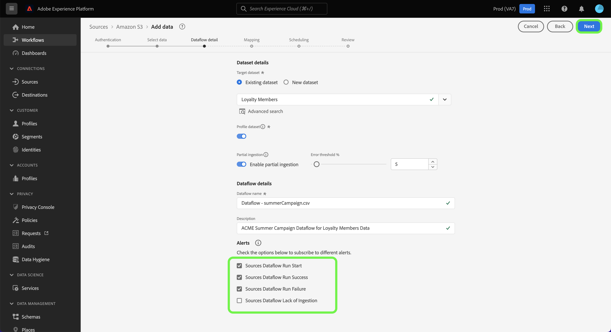
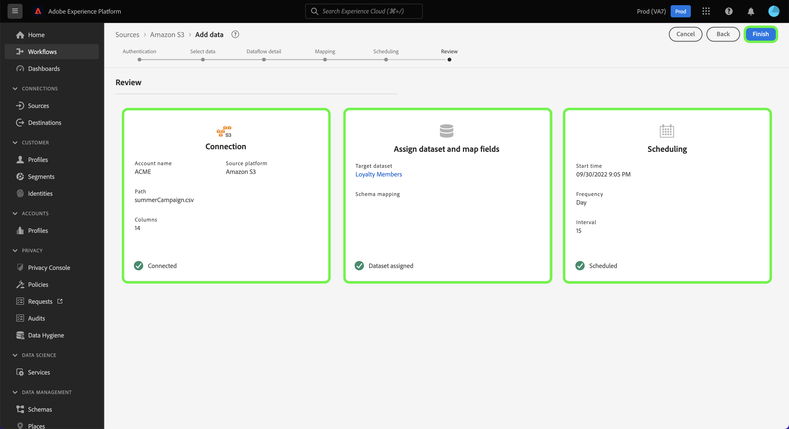

# Configurare un flusso di dati per l’acquisizione di dati batch da un’origine di archiviazione cloud nell’interfaccia utente

Questa esercitazione fornisce passaggi su come configurare un flusso di dati per trasferire i dati batch dall&#39;origine di archiviazione cloud a Adobe Experience Platform.

## Introduzione

>[!NOTE]
>
>Per creare un flusso di dati per trasferire dati batch da un archivio cloud, è necessario disporre già dell&#39;accesso a un&#39;origine di archiviazione cloud autenticata. Se non hai accesso, vai alla [panoramica di origini](../../../../home.md#cloud-storage) per un elenco delle origini di archiviazione cloud con cui è possibile creare un account.

Questa esercitazione richiede una comprensione approfondita dei seguenti componenti dell&#39;Experience Platform:

* [[!DNL Experience Data Model (XDM)] Sistema](../../../../../xdm/home.md): Il framework standardizzato in base al quale l’Experience Platform organizza i dati sulla customer experience.
   * [Nozioni di base sulla composizione dello schema](../../../../../xdm/schema/composition.md): Scopri i blocchi di base degli schemi XDM, inclusi i principi chiave e le best practice nella composizione dello schema.
   * [Esercitazione sull’Editor di schema](../../../../../xdm/tutorials/create-schema-ui.md): Scopri come creare schemi personalizzati utilizzando l’interfaccia utente dell’Editor di schema.
* [[!DNL Real-time Customer Profile]](../../../../../profile/home.md): Fornisce un profilo di consumatore unificato e in tempo reale basato su dati aggregati provenienti da più origini.

### Formati di file supportati

Le origini di archiviazione cloud per i dati batch supportano i seguenti formati di file per l’acquisizione:

* Valori separati da delimitatore (DSV): Qualsiasi valore a carattere singolo può essere utilizzato come delimitatore per i file di dati in formato DSV.
* [!DNL JavaScript Object Notation] (JSON): I file di dati in formato JSON devono essere conformi a XDM.
* [!DNL Apache Parquet]: I file di dati in formato parquet devono essere conformi a XDM.
* File compressi: I file JSON e delimitati possono essere compressi come segue: `bzip2`, `gzip`, `deflate`, `zipDeflate`, `tarGzip`e `tar`.

## Aggiungi dati

Dopo aver creato l&#39;account di archiviazione cloud, la **[!UICONTROL Aggiungi dati]** viene visualizzato un passaggio che fornisce un’interfaccia per esplorare la gerarchia dei file di archiviazione cloud e selezionare la cartella o il file specifico che si desidera portare in Platform.

* La parte sinistra dell&#39;interfaccia è un browser delle directory, che mostra la gerarchia dei file di archiviazione cloud.
* La parte destra dell’interfaccia consente di visualizzare in anteprima fino a 100 righe di dati da una cartella o un file compatibile.

Selezionare la cartella principale per accedere alla gerarchia delle cartelle. Da qui puoi selezionare una singola cartella per acquisire tutti i file della cartella in modo ricorsivo. Quando si acquisisce un&#39;intera cartella, è necessario assicurarsi che tutti i file presenti in tale cartella condividano lo stesso formato e lo stesso schema di dati.

Dopo aver selezionato una cartella, l’interfaccia corretta viene aggiornata a un’anteprima del contenuto e della struttura del primo file nella cartella selezionata.

Durante questo passaggio, puoi effettuare diverse configurazioni ai tuoi dati, prima di procedere. Per prima cosa, seleziona **[!UICONTROL Formato dati]** quindi seleziona il formato dati appropriato per il file nel pannello a discesa che viene visualizzato.

Nella tabella seguente sono visualizzati i formati di dati appropriati per i tipi di file supportati:

| Tipo di file | Formato dati |
| --- | --- |
| CSV | [!UICONTROL Delimitato] |
| JSON | [!UICONTROL JSON] |
| Parquet | [!UICONTROL Parquet XDM] |

### Selezionare un delimitatore di colonna

Dopo aver configurato il formato dei dati, è possibile impostare un delimitatore di colonna durante l’acquisizione di file delimitati. Seleziona la **[!UICONTROL Delimitatore]** quindi selezionate un delimitatore dal menu a discesa. Nel menu vengono visualizzate le opzioni più utilizzate per i delimitatori, inclusa una virgola (`,`), una scheda (`\t`) e una tubazione (`|`).

Se preferisci utilizzare un delimitatore personalizzato, seleziona **[!UICONTROL Personalizzato]** e immetti un delimitatore a carattere singolo nella barra di input a comparsa.

### Inserire file compressi

È inoltre possibile acquisire file JSON compressi o delimitati specificandone il tipo di compressione.

In [!UICONTROL Seleziona dati] seleziona un file compresso da acquisire, quindi seleziona il tipo di file appropriato e se è conforme o meno a XDM. Quindi, seleziona **[!UICONTROL Tipo di compressione]** quindi selezionare il tipo di file compresso appropriato per i dati di origine.

Per portare un file specifico in Platform, seleziona una cartella e quindi il file da acquisire. Durante questo passaggio, puoi anche visualizzare in anteprima il contenuto di altri file all’interno di una determinata cartella utilizzando l’icona di anteprima accanto al nome di un file.

Al termine, seleziona **[!UICONTROL Successivo]**.

## Fornire i dettagli del flusso di dati

La [!UICONTROL Dettaglio flusso di dati] consente di selezionare se si desidera utilizzare un set di dati esistente o un nuovo set di dati. Durante questo processo puoi anche configurare i dati da acquisire in Profilo e abilitare impostazioni come [!UICONTROL Diagnostica degli errori], [!UICONTROL Acquisizione parziale]e [!UICONTROL Avvisi].

### Utilizzare un set di dati esistente

Per acquisire dati in un set di dati esistente, seleziona **[!UICONTROL Set di dati esistente]**. Puoi recuperare un set di dati esistente utilizzando [!UICONTROL Ricerca avanzata] o scorrendo l’elenco dei set di dati esistenti nel menu a discesa. Dopo aver selezionato un set di dati, fornisci un nome e una descrizione per il flusso di dati.

### Utilizzare un nuovo set di dati

Per acquisire in un nuovo set di dati, seleziona **[!UICONTROL Nuovo set di dati]** e quindi fornisci il nome di un set di dati di output e una descrizione facoltativa. Quindi, seleziona uno schema a cui eseguire il mapping utilizzando [!UICONTROL Ricerca avanzata] oppure scorrendo l’elenco degli schemi esistenti nel menu a discesa. Dopo aver selezionato uno schema, fornisci un nome e una descrizione per il flusso di dati.

### Abilita diagnostica profili ed errori

Quindi, seleziona la **[!UICONTROL Set di dati del profilo]** attiva per abilitare il set di dati per Profilo. Ciò ti consente di creare una visualizzazione olistica degli attributi e dei comportamenti di un’entità. I dati di tutti i set di dati abilitati per il profilo verranno inclusi in Profilo e le modifiche verranno applicate al momento del salvataggio del flusso di dati.

[!UICONTROL Diagnostica degli errori] consente la generazione dettagliata dei messaggi di errore per tutti i record errati che si verificano nel flusso di dati, mentre [!UICONTROL Acquisizione parziale] consente di acquisire dati contenenti errori, fino a una determinata soglia definita manualmente. Consulta la sezione [panoramica dell’acquisizione parziale in batch](../../../../../ingestion/batch-ingestion/partial.md) per ulteriori informazioni.

### Abilitare gli avvisi

Puoi abilitare gli avvisi per ricevere notifiche sullo stato del flusso di dati. Seleziona un avviso dall’elenco per abbonarti e ricevere le notifiche sullo stato del flusso di dati. Per ulteriori informazioni sugli avvisi, consulta la guida su [iscrizione agli avvisi sorgente tramite l’interfaccia utente](../../alerts.md).

Al termine della fornitura dei dettagli al flusso di dati, seleziona **[!UICONTROL Successivo]**.

## Mappatura di campi dati su uno schema XDM

La [!UICONTROL Mappatura] viene visualizzato un passaggio che fornisce un&#39;interfaccia per mappare i campi di origine dallo schema di origine ai campi XDM di destinazione appropriati nello schema di destinazione.

Platform fornisce consigli intelligenti per i campi mappati automaticamente in base allo schema o al set di dati di destinazione selezionato. Puoi regolare manualmente le regole di mappatura in base ai tuoi casi d’uso. In base alle tue esigenze, puoi scegliere di mappare direttamente i campi oppure utilizzare le funzioni di preparazione dei dati per trasformare i dati di origine in valori calcolati o calcolati. Per i passaggi completi sull’utilizzo dell’interfaccia di mappatura e dei campi calcolati, consulta la sezione [Guida all’interfaccia utente della preparazione dei dati](../../../../../data-prep/ui/mapping.md).

Una volta mappati correttamente i dati di origine, seleziona **[!UICONTROL Successivo]**.

## Pianifica esecuzioni di acquisizione

>[!IMPORTANT]
>
>Si consiglia vivamente di pianificare il flusso di dati per l’inserimento una tantum quando si utilizza il [Origine FTP](../../../../connectors/cloud-storage/ftp.md).

La [!UICONTROL Pianificazione] viene visualizzato un passaggio che consente di configurare una pianificazione dell’acquisizione per l’acquisizione automatica dei dati di origine selezionati utilizzando le mappature configurate. Per impostazione predefinita, la pianificazione è impostata su `Once`. Per regolare la frequenza di acquisizione, seleziona **[!UICONTROL Frequenza]** quindi selezionate un&#39;opzione dal menu a discesa.

>[!TIP]
>
>L’intervallo e il backfill non sono visibili durante un’acquisizione una tantum.

Se imposti la frequenza di acquisizione su `Minute`, `Hour`, `Day`oppure `Week`, quindi devi impostare un intervallo per stabilire un intervallo di tempo impostato tra ogni acquisizione. Ad esempio, una frequenza di acquisizione impostata su `Day` e un intervallo impostato su `15` significa che il flusso di dati è pianificato per l’acquisizione dei dati ogni 15 giorni.

Durante questo passaggio, puoi anche abilitare **backfill** e definire una colonna per l’assimilazione incrementale dei dati. Il backfill viene utilizzato per acquisire i dati storici, mentre la colonna definita per l’acquisizione incrementale consente di differenziare i nuovi dati dai dati esistenti.

Vedi la tabella seguente per ulteriori informazioni sulle configurazioni di pianificazione.

| Campo | Descrizione |
| --- | --- |
| Frequenza | Frequenza con cui avviene un’acquisizione. Le frequenze selezionabili includono `Once`, `Minute`, `Hour`, `Day`e `Week`. |
| Intervallo | Un numero intero che imposta l&#39;intervallo per la frequenza selezionata. Il valore dell&#39;intervallo deve essere un numero intero diverso da zero e deve essere impostato su maggiore o uguale a 15. |
| Ora di inizio | Una marca temporale UTC che indica quando è impostata la prima acquisizione. L’ora di inizio deve essere maggiore o uguale all’ora UTC corrente. |
| Backfill | Un valore booleano che determina i dati inizialmente acquisiti. Se il backfill è abilitato, tutti i file correnti nel percorso specificato verranno acquisiti durante la prima acquisizione pianificata. Se il backfill è disabilitato, verranno acquisiti solo i file caricati tra la prima esecuzione dell’acquisizione e l’ora di inizio. I file caricati prima dell’ora di inizio non vengono acquisiti. |

>[!NOTE]
>
>Per l’acquisizione batch, ogni flusso di dati successivo seleziona i file da acquisire dalla sorgente in base ai relativi **ultima modifica** timestamp. Ciò significa che i flussi di dati batch selezionano i file dall&#39;origine nuovi o modificati dall&#39;ultima esecuzione del flusso. Inoltre, è necessario assicurarsi che vi sia un intervallo di tempo sufficiente tra il caricamento dei file e un&#39;esecuzione di flusso pianificato, perché i file che non sono completamente caricati sul tuo account di archiviazione cloud prima che il tempo di esecuzione del flusso pianificato potrebbe non essere raccolto per l&#39;acquisizione.

Al termine della configurazione della pianificazione dell’acquisizione, seleziona **[!UICONTROL Successivo]**.

## Controlla il tuo flusso di dati

La **[!UICONTROL Revisione]** viene visualizzato un passaggio che consente di rivedere il nuovo flusso di dati prima della creazione. I dettagli sono raggruppati nelle seguenti categorie:

* **[!UICONTROL Connessione]**: Mostra il tipo di origine, il percorso pertinente del file di origine scelto e la quantità di colonne all&#39;interno del file di origine.
* **[!UICONTROL Assegna set di dati e campi mappa]**: Mostra il set di dati in cui vengono acquisiti i dati di origine, incluso lo schema a cui il set di dati aderisce.
* **[!UICONTROL Pianificazione]**: Mostra il periodo, la frequenza e l’intervallo attivi della pianificazione dell’acquisizione.

Dopo aver esaminato il flusso di dati, fai clic su **[!UICONTROL Fine]** e lascia un certo tempo per la creazione del flusso di dati.

## Passaggi successivi

Seguendo questa esercitazione, hai creato correttamente un flusso di dati per inserire dati da un archivio cloud esterno e hai acquisito informazioni sul monitoraggio dei set di dati. Per ulteriori informazioni sulla creazione di flussi di dati, è possibile completare l&#39;apprendimento guardando il video sottostante. Inoltre, i dati in arrivo possono ora essere utilizzati da downstream [!DNL Platform] servizi quali [!DNL Real-time Customer Profile] e [!DNL Data Science Workspace]. Per ulteriori informazioni, consulta i seguenti documenti:

* [[!DNL Real-time Customer Profile] panoramica](../../../../../profile/home.md)
* [[!DNL Data Science Workspace] panoramica](../../../../../data-science-workspace/home.md)

>[!WARNING]
>
> La [!DNL Platform] L’interfaccia utente mostrata nel video seguente è obsoleta. Fai riferimento alla documentazione precedente per le ultime schermate e funzionalità dell’interfaccia utente.

>[!VIDEO](https://video.tv.adobe.com/v/29695?quality=12&learn=on)

## Appendice

Le sezioni seguenti forniscono informazioni aggiuntive per l’utilizzo dei connettori sorgente.

## Monitorare il flusso di dati

Una volta creato il flusso di dati, puoi monitorare i dati che vengono acquisiti tramite di esso per visualizzare informazioni sui tassi di acquisizione, sul successo e sugli errori. Per ulteriori informazioni su come monitorare il flusso di dati, visita l’esercitazione su [monitoraggio di account e flussi di dati nell’interfaccia utente](../../monitor.md).

## Aggiornare il flusso di dati

Per aggiornare le configurazioni per la pianificazione, la mappatura e le informazioni generali dei flussi di dati, visita l’esercitazione su [aggiornamento dei flussi di dati di origini nell’interfaccia utente](../../update-dataflows.md)

## Elimina il flusso di dati

È possibile eliminare i flussi di dati che non sono più necessari o che sono stati creati in modo errato utilizzando **[!UICONTROL Elimina]** funzione disponibile nella **[!UICONTROL Flussi di dati]** workspace. Per ulteriori informazioni su come eliminare i flussi di dati, visita l’esercitazione su [eliminazione dei flussi di dati nell’interfaccia utente](../../delete.md).