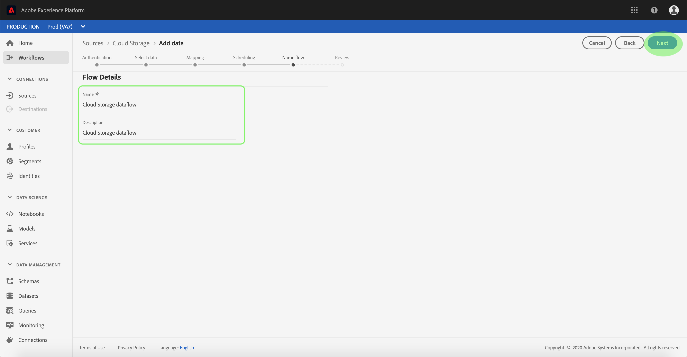

# Configurare un flusso di dati per un connettore batch di archiviazione cloud nell&#39;interfaccia utente

Un flusso di dati è un&#39;attività pianificata che recupera e trasferisce dati da un&#39;origine a un [!DNL Platform] set di dati. Questa esercitazione fornisce i passaggi per configurare un nuovo flusso di dati utilizzando il connettore di base per l&#39;archiviazione cloud.

## Introduzione

Questa esercitazione richiede una conoscenza approfondita dei seguenti componenti del  Adobe Experience Platform:

* [Sistema](../../../../../xdm/home.md)XDM (Experience Data Model): Il framework standard con cui [!DNL Experience Platform] organizzare i dati relativi all&#39;esperienza del cliente.
   * [Nozioni di base sulla composizione](../../../../../xdm/schema/composition.md)dello schema: Scoprite i componenti di base degli schemi XDM, inclusi i principi chiave e le procedure ottimali nella composizione dello schema.
   * [Esercitazione](../../../../../xdm/tutorials/create-schema-ui.md)sull&#39;Editor di schema: Scoprite come creare schemi personalizzati utilizzando l&#39;interfaccia utente dell&#39;Editor di schema.
* [Profilo](../../../../../profile/home.md)cliente in tempo reale: Fornisce un profilo di consumo unificato e in tempo reale basato su dati aggregati provenienti da più origini.

Inoltre, questa esercitazione richiede che sia già stato creato un connettore di archiviazione cloud. Un elenco di esercitazioni per la creazione di diversi connettori di archiviazione cloud nell&#39;interfaccia utente è disponibile nella panoramica [dei connettori](../../../../home.md)sorgente.

### Formati di file supportati

[!DNL Experience Platform] supporta i seguenti formati di file da acquisire da archivi esterni:

* Valori separati da delimitatore (DSV): Il supporto per i file di dati in formato DSV è attualmente limitato ai valori separati da virgola. Il valore delle intestazioni dei campi all&#39;interno dei file formattati DSV deve essere costituito solo da caratteri alfanumerici e caratteri di sottolineatura. In futuro verrà fornito il supporto per i file DSV generali.
* [!DNL JavaScript Object Notation] (JSON): I file di dati in formato JSON devono essere conformi allo standard XDM.
* [!DNL Apache Parquet]: I file di dati in formato parquet devono essere conformi allo standard XDM.

## Seleziona dati

Dopo aver creato il connettore per l&#39;archiviazione cloud, viene visualizzato il *[!UICONTROL Select data]* passaggio che fornisce un&#39;interfaccia interattiva per esplorare la gerarchia di archiviazione cloud.

* La metà sinistra dell&#39;interfaccia è un browser di directory che visualizza i file e le directory del server.
* La metà destra dell&#39;interfaccia consente di visualizzare in anteprima fino a 100 righe di dati da un file compatibile.

Facendo clic su una cartella elencata potete scorrere la gerarchia delle cartelle in cartelle più profonde. Dopo aver selezionato un file o una cartella compatibile, viene visualizzato il **[!UICONTROL Select data format]** menu a discesa, in cui è possibile scegliere un formato per visualizzare i dati nella finestra di anteprima.

Una volta completata la finestra di anteprima, potete fare clic **[!UICONTROL Next]** per caricare tutti i file nella cartella selezionata. Se desiderate caricare il file in un file specifico, selezionatelo dall’elenco prima di fare clic **[!UICONTROL Next]**.

>[!NOTE] I formati di file supportati includono CSV, JSON e Parquet. I file JSON e Parquet devono essere conformi allo standard XDM.

## Mappatura dei campi dati su uno schema XDM

Viene visualizzato il *[!UICONTROL Mapping]* passaggio che fornisce un&#39;interfaccia interattiva per mappare i dati di origine a un [!DNL Platform] dataset. I file sorgente formattati in JSON o Parquet devono essere conformi a XDM e non devono essere configurati manualmente. I file CSV, al contrario, richiedono la configurazione esplicita della mappatura, ma consentono di scegliere quali campi di dati di origine mappare.

Scegliere un set di dati in entrata in cui assimilare i dati. È possibile utilizzare un set di dati esistente o crearne uno nuovo.

**Utilizzare un dataset esistente**

Per assimilare i dati in un dataset esistente, selezionare **[!UICONTROL Use existing dataset]**, quindi fare clic sull&#39;icona del dataset.

Viene visualizzata la finestra di dialogo _Seleziona set di dati_ . Trovare il set di dati che si desidera utilizzare, selezionarlo, quindi fare clic **[!UICONTROL Continue]**.

**Utilizza un nuovo set di dati**

Per assimilare i dati in un nuovo dataset, selezionare **[!UICONTROL Create new dataset]** e immettere un nome e una descrizione per il dataset nei campi forniti. Quindi, fare clic sull&#39;icona dello schema.

Viene visualizzata la finestra di dialogo _Seleziona schema_ . Selezionare lo schema che si desidera applicare al nuovo dataset, quindi fare clic su **[!UICONTROL Done]**.

In base alle esigenze, è possibile scegliere di mappare direttamente i campi oppure utilizzare le funzioni di mappatura per trasformare i dati di origine in modo da derivare i valori calcolati o calcolati. Per ulteriori informazioni sulla mappatura dei dati e sulle funzioni di mappatura, consulta l’esercitazione sulla [mappatura dei dati CSV ai campi](../../../../../ingestion/tutorials/map-a-csv-file.md)dello schema XDM.

Una volta mappati i dati di origine, fai clic su **[!UICONTROL Next]**.

## Pianificare le esecuzioni dell&#39;assimilazione

Viene visualizzato il *[!UICONTROL Scheduling]* passaggio che consente di configurare una pianificazione di assimilazione per l&#39;acquisizione automatica dei dati di origine selezionati tramite le mappature configurate. Nella tabella seguente sono riportati i diversi campi configurabili per la pianificazione:

| Campo | Descrizione |
| --- | --- |
| Frequenza | Le frequenze selezionabili sono: Minuto, Ora, Giorno e Settimana. |
| Intervallo | Un numero intero che imposta l&#39;intervallo per la frequenza selezionata. |
| Ora di inizio | Una marca temporale UTC per la quale si verificherà la prima assimilazione. |
| Backfill | Un valore booleano che determina i dati inizialmente acquisiti. Se *[!UICONTROL Backfill]* è abilitata, tutti i file correnti nel percorso specificato verranno acquisiti durante la prima assimilazione pianificata. Se *[!UICONTROL Backfill]* è disattivato, verranno assimilati solo i file caricati tra la prima esecuzione dell&#39;assimilazione e l&#39; *[!UICONTROL Start time]* assimilazione. I file caricati prima di *[!UICONTROL Start time]* non verranno acquisiti. |

I flussi di dati sono progettati per l&#39;acquisizione automatica dei dati su base programmata. Se desiderate effettuare il caricamento solo una volta in questo flusso di lavoro, potete farlo configurando il **[!UICONTROL Frequency]** pulsante &quot;Giorno&quot; e applicando un numero molto elevato per il **[!UICONTROL Interval]**, ad esempio 10000 o simile.

Immettete i valori per la pianificazione e fate clic su **Avanti**.

## Denominazione del flusso di dati

Viene visualizzato il *[!UICONTROL Name flow]* passaggio che consente di assegnare un nome e una breve descrizione al nuovo flusso di dati.

Immettete i valori per il flusso di dati e fate clic su **[!UICONTROL Next]**.

### Controllare il flusso di dati

Viene visualizzato il *[!UICONTROL Review]* passaggio che consente di rivedere il nuovo flusso di dati prima della creazione. I dettagli sono raggruppati nelle seguenti categorie:

* *[!UICONTROL Source details]*: Mostra il tipo di origine, il percorso pertinente del file di origine scelto e la quantità di colonne all&#39;interno del file di origine.
* *[!UICONTROL Target details]*: Mostra il set di dati in cui vengono acquisiti i dati di origine, incluso lo schema a cui il set di dati aderisce.
* *[!UICONTROL Schedule details]*: Mostra il periodo, la frequenza e l’intervallo attivi della pianificazione di assimilazione.

Dopo aver rivisto il flusso di dati, fai clic su **[!UICONTROL Finish]** e consenti la creazione del flusso di dati.

## Monitorare il flusso di dati

Una volta creato il flusso di dati per l&#39;archiviazione cloud, potete monitorare i dati che vengono acquisiti tramite di esso. Per ulteriori informazioni sul monitoraggio dei set di dati, consulta l’esercitazione sul [monitoraggio dei flussi di dati](../../../../../ingestion/quality/monitor-data-flows.md).

## Passaggi successivi

Seguendo questa esercitazione, hai creato con successo un flusso di dati per l&#39;inserimento di dati da un archivio cloud esterno e hai acquisito informazioni sul monitoraggio dei set di dati. I dati in entrata possono ora essere utilizzati dai [!DNL Platform] servizi a valle come [!DNL Real-time Customer Profile] e [!DNL Data Science Workspace]. Per ulteriori informazioni, consulta i documenti seguenti:

* [Panoramica del profilo cliente in tempo reale](../../../../../profile/home.md)
* [Panoramica di Analysis Workspace](../../../../../data-science-workspace/home.md)

## Appendice

Le sezioni seguenti forniscono informazioni aggiuntive sull&#39;utilizzo dei connettori di origine.

### Disattivazione di un flusso di dati

Quando un flusso di dati viene creato, diventa immediatamente attivo e i dati vengono acquisiti in base alla pianificazione specificata. Puoi disattivare un flusso di dati attivo in qualsiasi momento seguendo le istruzioni riportate di seguito.

Nell’area di *[!UICONTROL Sources]* lavoro, fate clic sulla **[!UICONTROL Browse]** scheda. Quindi, fare clic sul nome dell&#39;account associato al flusso di dati attivo che si desidera disattivare.

Viene *[!UICONTROL Source activity]* visualizzata la pagina. Selezionate il flusso di dati attivo dall’elenco per aprire la relativa *[!UICONTROL Properties]* colonna sul lato destro dello schermo, che contiene un pulsante di **[!UICONTROL Enabled]** attivazione/disattivazione. Fate clic sull’interruttore per disattivare il flusso di dati. La stessa opzione può essere utilizzata per riattivare un flusso di dati dopo che è stato disabilitato.

### Attivare i dati in entrata per la [!DNL Profile] popolazione

I dati in entrata provenienti dal connettore di origine possono essere utilizzati per arricchire e compilare [!DNL Real-time Customer Profile] i dati. Per ulteriori informazioni sulla compilazione dei [!DNL Profile] dati del cliente reale, consulta l’esercitazione sulla popolazione [del](../../profile.md)profilo.
