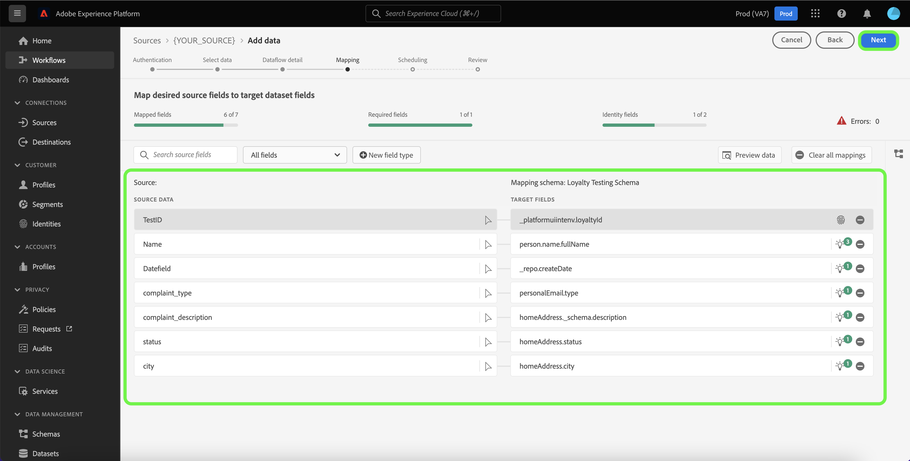

# Creare un flusso di dati utilizzando un’origine CRM nell’interfaccia utente

Un flusso di dati è un’attività pianificata che recupera e acquisisce dati da un’origine a un set di dati in Adobe Experience Platform. Questa esercitazione fornisce passaggi su come creare un flusso di dati per un’origine CRM (Customer Relationship Management) utilizzando l’interfaccia utente di Platform.

>[!NOTE]
>
>Per creare un flusso di dati, devi già disporre di un account autenticato con un&#39;origine CRM. Un elenco di esercitazioni per la creazione di diversi account di origine CRM nell&#39;interfaccia utente è disponibile in [panoramica di origini](../../../home.md#crm).

## Introduzione

Questa esercitazione richiede una buona comprensione dei seguenti componenti di Platform:

* [Origini](../../../home.md): Platform consente l’acquisizione di dati da varie sorgenti e allo stesso tempo di strutturare, etichettare e migliorare i dati in arrivo tramite [!DNL Platform] servizi.
* [[!DNL Experience Data Model (XDM)] Sistema](../../../../xdm/home.md): Il framework standardizzato in base al quale l’Experience Platform organizza i dati sulla customer experience.
   * [Nozioni di base sulla composizione dello schema](../../../../xdm/schema/composition.md): Scopri i blocchi di base degli schemi XDM, inclusi i principi chiave e le best practice nella composizione dello schema.
   * [Esercitazione sull’Editor di schema](../../../../xdm/tutorials/create-schema-ui.md): Scopri come creare schemi personalizzati utilizzando l’interfaccia utente dell’Editor di schema.
* [[!DNL Real-Time Customer Profile]](../../../../profile/home.md): Fornisce un profilo di consumatore unificato e in tempo reale basato su dati aggregati provenienti da più origini.
* [[!DNL Data Prep]](../../../../data-prep/home.md): Consente ai data engineer di mappare, trasformare e convalidare i dati da e verso Experience Data Model (XDM).

## Aggiungi dati

Dopo aver creato il tuo account di origine CRM, **[!UICONTROL Aggiungi dati]** viene visualizzato un passaggio che fornisce un&#39;interfaccia per esplorare la gerarchia di tabelle dell&#39;account CRM.

* La metà sinistra dell&#39;interfaccia è un browser, che visualizza un elenco di tabelle di dati contenute nel tuo account. L’interfaccia include anche un’opzione di ricerca che ti consente di identificare rapidamente i dati di origine che intendi utilizzare.
* La metà destra dell’interfaccia è un pannello di anteprima che consente di visualizzare in anteprima fino a 100 righe di dati.

>[!NOTE]
>
>L’opzione per i dati dell’origine di ricerca è disponibile per tutte le origini basate su tabelle, ad eccezione di Adobe Analytics, [!DNL Amazon Kinesis]e [!DNL Azure Event Hubs].

Una volta trovati i dati di origine, seleziona la tabella, quindi seleziona **[!UICONTROL Successivo]**.

## Fornire i dettagli del flusso di dati

La [!UICONTROL Dettaglio flusso di dati] consente di selezionare se si desidera utilizzare un set di dati esistente o un nuovo set di dati. Durante questo processo, puoi anche configurare le impostazioni per [!UICONTROL Set di dati del profilo], [!UICONTROL Diagnostica degli errori], [!UICONTROL Acquisizione parziale]e [!UICONTROL Avvisi].

### Utilizzare un set di dati esistente

Per acquisire dati in un set di dati esistente, seleziona **[!UICONTROL Set di dati esistente]**. Puoi recuperare un set di dati esistente utilizzando [!UICONTROL Ricerca avanzata] o scorrendo l’elenco dei set di dati esistenti nel menu a discesa. Dopo aver selezionato un set di dati, fornisci un nome e una descrizione per il flusso di dati.

### Utilizzare un nuovo set di dati

Per acquisire in un nuovo set di dati, seleziona **[!UICONTROL Nuovo set di dati]** e quindi fornisci il nome di un set di dati di output e una descrizione facoltativa. Quindi, seleziona uno schema a cui eseguire il mapping utilizzando [!UICONTROL Ricerca avanzata] oppure scorrendo l’elenco degli schemi esistenti nel menu a discesa. Dopo aver selezionato uno schema, fornisci un nome e una descrizione per il flusso di dati.

### Abilita [!DNL Profile] e diagnostica degli errori

Quindi, seleziona la **[!UICONTROL Set di dati del profilo]** attiva/disattiva il set di dati per [!DNL Profile]. Ciò ti consente di creare una visualizzazione olistica degli attributi e dei comportamenti di un’entità. Dati da tutti [!DNL Profile]I set di dati abilitati verranno inclusi in [!DNL Profile] e le modifiche vengono applicate al salvataggio del flusso di dati.

[!UICONTROL Diagnostica degli errori] consente la generazione dettagliata dei messaggi di errore per tutti i record errati che si verificano nel flusso di dati, mentre [!UICONTROL Acquisizione parziale] consente di acquisire dati contenenti errori, fino a una determinata soglia definita manualmente. Consulta la sezione [panoramica dell’acquisizione parziale in batch](../../../../ingestion/batch-ingestion/partial.md) per ulteriori informazioni.

### Abilitare gli avvisi

Puoi abilitare gli avvisi per ricevere notifiche sullo stato del flusso di dati. Seleziona un avviso dall’elenco per abbonarti e ricevere le notifiche sullo stato del flusso di dati. Per ulteriori informazioni sugli avvisi, consulta la guida su [iscrizione agli avvisi sorgente tramite l’interfaccia utente](../alerts.md).

Al termine della fornitura dei dettagli al flusso di dati, seleziona **[!UICONTROL Successivo]**.

## Mappatura di campi dati su uno schema XDM

La [!UICONTROL Mappatura] viene visualizzato un passaggio che fornisce un&#39;interfaccia per mappare i campi di origine dallo schema di origine ai campi XDM di destinazione appropriati nello schema di destinazione.

Platform fornisce consigli intelligenti per i campi mappati automaticamente in base allo schema o al set di dati di destinazione selezionato. Puoi regolare manualmente le regole di mappatura in base ai tuoi casi d’uso. In base alle tue esigenze, puoi scegliere di mappare direttamente i campi oppure utilizzare le funzioni di preparazione dei dati per trasformare i dati di origine in valori calcolati o calcolati. Per i passaggi completi sull’utilizzo dell’interfaccia di mappatura e dei campi calcolati, consulta la sezione [Guida all’interfaccia utente della preparazione dei dati](../../../../data-prep/ui/mapping.md).

>[!NOTE]
>
>Se utilizzi [!DNL Salesforce] come parte di Adobe Real-time Customer Data Platform B2B Edition, si prega di fare riferimento al [[!DNL Salesforce] documento di mappatura del campo](../../../connectors/adobe-applications/mapping/salesforce.md) guida sulla mappatura [!DNL Salesforce] i campi di origine ai campi di destinazione XDM appropriati.

Una volta mappati correttamente i dati di origine, seleziona **[!UICONTROL Successivo]**.

## Pianifica esecuzioni di acquisizione

La [!UICONTROL Pianificazione] viene visualizzato un passaggio che consente di configurare una pianificazione dell’acquisizione per l’acquisizione automatica dei dati di origine selezionati utilizzando le mappature configurate. Per impostazione predefinita, la pianificazione è impostata su `Once`. Per regolare la frequenza di acquisizione, seleziona **[!UICONTROL Frequenza]** quindi selezionate un&#39;opzione dal menu a discesa.

>[!TIP]
>
>L’intervallo e il backfill non sono visibili durante un’acquisizione una tantum.

Se imposti la frequenza di acquisizione su `Minute`, `Hour`, `Day`oppure `Week`, quindi devi impostare un intervallo per stabilire un intervallo di tempo impostato tra ogni acquisizione. Ad esempio, una frequenza di acquisizione impostata su `Day` e un intervallo impostato su `15` significa che il flusso di dati è pianificato per l’acquisizione dei dati ogni 15 giorni.

Durante questo passaggio, puoi anche abilitare **backfill** e definire una colonna per l’assimilazione incrementale dei dati. Il backfill viene utilizzato per acquisire i dati storici, mentre la colonna definita per l’acquisizione incrementale consente di differenziare i nuovi dati dai dati esistenti.

Vedi la tabella seguente per ulteriori informazioni sulle configurazioni di pianificazione.

| Campo | Descrizione |
| --- | --- |
| Frequenza | Frequenza con cui avviene un’acquisizione. Le frequenze selezionabili includono `Once`, `Minute`, `Hour`, `Day`e `Week`. |
| Intervallo | Un numero intero che imposta l&#39;intervallo per la frequenza selezionata. Il valore dell&#39;intervallo deve essere un numero intero diverso da zero e deve essere impostato su maggiore o uguale a 15. |
| Ora di inizio | Una marca temporale UTC che indica quando è impostata la prima acquisizione. L’ora di inizio deve essere maggiore o uguale all’ora UTC corrente. |
| Backfill | Un valore booleano che determina i dati inizialmente acquisiti. Se il backfill è abilitato, tutti i file correnti nel percorso specificato verranno acquisiti durante la prima acquisizione pianificata. Se il backfill è disabilitato, verranno acquisiti solo i file caricati tra la prima esecuzione dell’acquisizione e l’ora di inizio. I file caricati prima dell’ora di inizio non vengono acquisiti. |
| Carica dati incrementali per | Opzione con un set filtrato di campi dello schema di origine di tipo, data o ora. Questo campo viene utilizzato per distinguere tra dati nuovi ed esistenti. I dati incrementali verranno acquisiti in base al timestamp della colonna selezionata. |

## Controlla il tuo flusso di dati

La **[!UICONTROL Revisione]** viene visualizzato un passaggio che consente di rivedere il nuovo flusso di dati prima della creazione. I dettagli sono raggruppati nelle seguenti categorie:

* **[!UICONTROL Connessione]**: Mostra il tipo di origine, il percorso pertinente del file di origine scelto e la quantità di colonne all&#39;interno del file di origine.
* **[!UICONTROL Assegna set di dati e campi mappa]**: Mostra il set di dati in cui vengono acquisiti i dati di origine, incluso lo schema a cui il set di dati aderisce.
* **[!UICONTROL Pianificazione]**: Mostra il periodo, la frequenza e l’intervallo attivi della pianificazione dell’acquisizione.

Dopo aver esaminato il flusso di dati, seleziona **[!UICONTROL Fine]** e lascia un certo tempo per la creazione del flusso di dati.

## Monitorare il flusso di dati

Una volta creato il flusso di dati, puoi monitorare i dati che vengono acquisiti tramite di esso per visualizzare informazioni sui tassi di acquisizione, sul successo e sugli errori. Per ulteriori informazioni su come monitorare il flusso di dati, consulta l’esercitazione su [monitoraggio di account e flussi di dati nell’interfaccia utente](../monitor.md).

## Elimina il flusso di dati

È possibile eliminare i flussi di dati che non sono più necessari o che sono stati creati in modo errato utilizzando **[!UICONTROL Elimina]** funzione disponibile nella **[!UICONTROL Flussi di dati]** workspace. Per ulteriori informazioni su come eliminare i flussi di dati, consulta l’esercitazione su [eliminazione dei flussi di dati nell’interfaccia utente](../delete.md).

## Passaggi successivi

Seguendo questa esercitazione, hai creato correttamente un flusso di dati per trasferire i dati dall’origine CRM a Platform. I dati in arrivo possono ora essere utilizzati da downstream [!DNL Platform] servizi quali [!DNL Real-Time Customer Profile] e [!DNL Data Science Workspace]. Per ulteriori informazioni, consulta i seguenti documenti:

* [Panoramica di [!DNL Real-Time Customer Profile]](../../../../profile/home.md)
* [Panoramica di [!DNL Data Science Workspace]](../../../../data-science-workspace/home.md)

>[!WARNING]
>
> L’interfaccia utente della piattaforma mostrata nel video seguente è obsoleta. Fai riferimento alla documentazione precedente per le ultime schermate e funzionalità dell’interfaccia utente.
>
>[!VIDEO](https://video.tv.adobe.com/v/29711?quality=12&learn=on)
