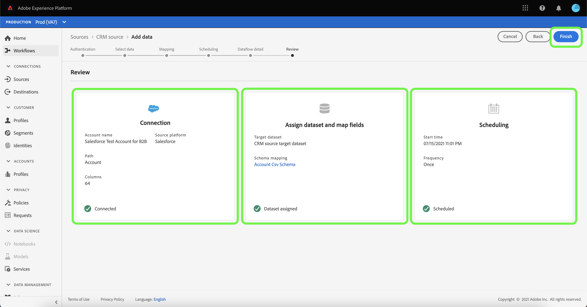

# Configurare un flusso di dati per un connettore CRM nell&#39;interfaccia utente

Un flusso di dati è un&#39;attività pianificata che recupera e trasferisce dati da un&#39;origine a un [!DNL Platform] set di dati. Questa esercitazione fornisce i passaggi per configurare un nuovo flusso di dati utilizzando il connettore CRM.

## Introduzione

Questa esercitazione richiede una conoscenza approfondita dei seguenti componenti del  Adobe Experience Platform:

* [Sistema](../../../../xdm/home.md)XDM (Experience Data Model): Il framework standard con cui [!DNL Experience Platform] organizzare i dati relativi all&#39;esperienza del cliente.
   * [Nozioni di base sulla composizione](../../../../xdm/schema/composition.md)dello schema: Scoprite i componenti di base degli schemi XDM, inclusi i principi chiave e le procedure ottimali nella composizione dello schema.
   * [Esercitazione](../../../../xdm/tutorials/create-schema-ui.md)sull&#39;Editor di schema: Scoprite come creare schemi personalizzati utilizzando l&#39;interfaccia utente dell&#39;Editor di schema.
* [Profilo](../../../../profile/home.md)cliente in tempo reale: Fornisce un profilo di consumo unificato e in tempo reale basato su dati aggregati provenienti da più origini.

Inoltre, questa esercitazione richiede che sia già stato creato un connettore CRM. Un elenco di esercitazioni per la creazione di diversi connettori CRM nell&#39;interfaccia utente è disponibile nella panoramica [dei connettori](../../../home.md)sorgente.

## Seleziona dati

Dopo aver creato il connettore CRM, viene visualizzato il passaggio *Seleziona dati* , che fornisce un&#39;interfaccia interattiva per esplorare la gerarchia dei file.

* La metà sinistra dell&#39;interfaccia è un browser di directory che visualizza i file e le directory del server.
* La metà destra dell&#39;interfaccia consente di visualizzare in anteprima fino a 100 righe di dati da un file compatibile.

Selezionare la directory che si desidera utilizzare, quindi fare clic **[!UICONTROL Next]**.

## Mappatura dei campi dati su uno schema XDM

Viene visualizzato il passaggio *Mapping* , che fornisce un&#39;interfaccia interattiva per mappare i dati di origine a un [!DNL Platform] dataset.

Scegliere un set di dati in entrata in cui assimilare i dati. È possibile utilizzare un set di dati esistente o crearne uno nuovo.

### Utilizzare un dataset esistente

Per assimilare i dati in un dataset esistente, selezionare **[!UICONTROL Use existing dataset]**, quindi fare clic sull&#39;icona del dataset.

Viene visualizzata la finestra di dialogo _Seleziona set di dati_ . Trovare il set di dati che si desidera utilizzare, selezionarlo, quindi fare clic **[!UICONTROL Continue]**.

### Utilizza un nuovo set di dati

Per assimilare i dati in un nuovo dataset, selezionare **[!UICONTROL Create new dataset]** e immettere un nome e una descrizione per il dataset nei campi forniti. Quindi, fare clic sull&#39;icona dello schema.

Viene visualizzata la finestra di dialogo _Seleziona schema_ . Selezionare lo schema che si desidera applicare al nuovo dataset, quindi fare clic su **[!UICONTROL Done]**.

In base alle esigenze, è possibile scegliere di mappare direttamente i campi oppure utilizzare le funzioni di mappatura per trasformare i dati di origine in modo da derivare i valori calcolati o calcolati. Per ulteriori informazioni sulla mappatura dei dati e sulle funzioni di mappatura, consulta l’esercitazione sulla [mappatura dei dati CSV ai campi](../../../../ingestion/tutorials/map-a-csv-file.md)dello schema XDM.

Una volta mappati i dati di origine, fai clic su **[!UICONTROL Next]**.

## Pianificare le esecuzioni dell&#39;assimilazione

Viene visualizzato il *[!UICONTROL Scheduling]* passaggio che consente di configurare una pianificazione di assimilazione per l&#39;acquisizione automatica dei dati di origine selezionati tramite le mappature configurate. Nella tabella seguente sono riportati i diversi campi configurabili per la pianificazione:

| Campo | Descrizione |
| --- | --- |
| Frequenza | Le frequenze selezionabili sono: Una volta, Minuto, Ora, Giorno e Settimana. |
| Intervallo | Un numero intero che imposta l&#39;intervallo per la frequenza selezionata. |
| Ora di inizio | Una marca temporale UTC che indica quando è impostata la prima assimilazione |
| Backfill | Un valore booleano che determina i dati inizialmente acquisiti. Se *Backfill* è abilitato, tutti i file correnti nel percorso specificato verranno acquisiti durante la prima assimilazione pianificata. Se *Backfill* è disattivato, verranno acquisiti solo i file caricati tra la prima esecuzione dell&#39;assimilazione e l&#39;ora *di* inizio. I file caricati prima dell&#39;ora *di* inizio non vengono acquisiti. |
| Colonna Delta | Opzione con un set filtrato di campi dello schema di origine di tipo, data o ora. Questo campo è utilizzato per distinguere tra dati nuovi ed esistenti. I dati incrementali verranno acquisiti in base alla marca temporale della colonna selezionata. |

I flussi di dati sono progettati per l&#39;acquisizione automatica dei dati su base programmata. Per iniziare, selezionate la frequenza di assimilazione. Quindi, impostare l&#39;intervallo per specificare il periodo tra due esecuzioni di flusso. Il valore dell&#39;intervallo deve essere un numero intero diverso da zero e deve essere impostato su maggiore o uguale a 15.

Per impostare l’ora di inizio dell’assimilazione, regolate la data e l’ora visualizzate nella casella Ora di inizio. In alternativa, potete selezionare l&#39;icona del calendario per modificare il valore dell&#39;ora di inizio. L&#39;ora di inizio deve essere maggiore o uguale all&#39;ora UTC corrente.

Selezionare **[!UICONTROL Load incremental data by]** per assegnare la colonna delta. Questo campo consente di distinguere tra dati nuovi ed esistenti.

### Impostazione di un flusso di dati per l’assimilazione una tantum

Per impostare l’inserimento una tantum, selezionate la freccia a discesa di frequenza e selezionate **[!UICONTROL Once]**.

>[!TIP] **[!UICONTROL Interval]** e non **[!UICONTROL Backfill]** sono visibili durante un&#39;assimilazione una tantum.

Dopo aver fornito i valori appropriati alla pianificazione, selezionare **[!UICONTROL Next]**.

## Denominazione del flusso di dati

Viene visualizzato il passaggio del flusso *di* nomi, in cui è necessario specificare un nome e una descrizione facoltativa per il flusso di dati. Al termine fai clic su **[!UICONTROL Next]** (Continua).

## Controllare il flusso di dati

Viene visualizzato il passaggio *Revisione* , che consente di rivedere il nuovo flusso di dati prima della creazione. I dettagli sono raggruppati nelle seguenti categorie:

* *[!UICONTROL Connection details]*: Mostra il tipo di origine, il percorso pertinente del file di origine scelto e la quantità di colonne all&#39;interno del file di origine.
* *[!UICONTROL Mapping details]*: Mostra il set di dati in cui vengono acquisiti i dati di origine, incluso lo schema a cui il set di dati aderisce.
* *[!UICONTROL Schedule details]*: Mostra il periodo, la frequenza e l’intervallo attivi della pianificazione di assimilazione.

Dopo aver rivisto il flusso di dati, fai clic su **[!UICONTROL Finish]** e consenti la creazione del flusso di dati.

## Monitorare ed eliminare il flusso di dati

Una volta creato il flusso di dati, potete monitorare i dati che vengono acquisiti tramite di esso. Per ulteriori informazioni su come monitorare ed eliminare il flusso di dati, consulta l’esercitazione sul [monitoraggio e l’eliminazione dei flussi di dati](../monitor.md).

## Passaggi successivi

Seguendo questa esercitazione, hai creato con successo un flusso di dati per l&#39;immissione di dati da un CRM e hai acquisito informazioni sul monitoraggio dei set di dati. Per saperne di più sulla creazione di flussi di dati, puoi completare l’apprendimento guardando il video sottostante. Inoltre, i dati in entrata possono ora essere utilizzati dai [!DNL Platform] servizi a valle come [!DNL Real-time Customer Profile] e [!DNL Data Science Workspace]. Per ulteriori informazioni, consulta i documenti seguenti:

* [Panoramica del profilo cliente in tempo reale](../../../../profile/home.md)
* [Panoramica di Analysis Workspace](../../../../data-science-workspace/home.md)

>[!WARNING]
>
> L’ [!DNL Platform] interfaccia utente mostrata nel video seguente è obsoleta. Per informazioni sulle ultime funzionalità e videate dell’interfaccia, consulta la documentazione precedente.

>[!VIDEO](https://video.tv.adobe.com/v/29711?quality=12&learn=on)

## Appendice

Le sezioni seguenti forniscono informazioni aggiuntive sull&#39;utilizzo dei connettori di origine.

### Disattivazione di un flusso di dati

Quando un flusso di dati viene creato, diventa immediatamente attivo e i dati vengono acquisiti in base alla pianificazione specificata. Puoi disattivare un flusso di dati attivo in qualsiasi momento seguendo le istruzioni riportate di seguito.

Nella *[!UICONTROL authenticaton]* schermata, selezionare il nome della connessione di base associata al flusso di dati che si desidera disattivare.

Viene visualizzata la pagina Attività __ di origine. Selezionate il flusso di dati attivo dall’elenco per aprire la relativa *[!UICONTROL Properties]* colonna sul lato destro dello schermo, che contiene un pulsante di **[!UICONTROL Enabled]** attivazione/disattivazione. Fate clic sull’interruttore per disattivare il flusso di dati. La stessa opzione può essere utilizzata per riattivare un flusso di dati dopo che è stato disabilitato.

### Attivare i dati in entrata per la [!DNL Profile] popolazione

I dati in entrata provenienti dal connettore di origine possono essere utilizzati per arricchire e compilare [!DNL Real-time Customer Profile] i dati. Per ulteriori informazioni sulla compilazione [!DNL Real-time Customer Profile] dei dati, consulta l’esercitazione sulla popolazione [di](../profile.md)profili.