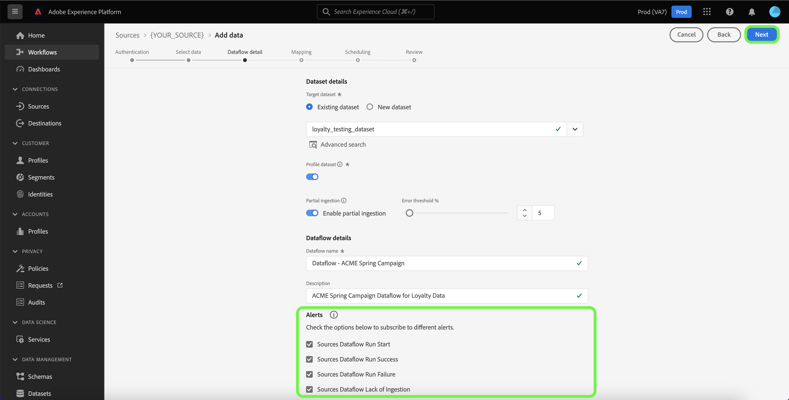

# Creare un flusso di dati utilizzando un’origine di successo del cliente nell’interfaccia utente

Un flusso di dati è un’attività pianificata che recupera e acquisisce dati da un’origine a un set di dati in Adobe Experience Platform. Questo tutorial illustra come creare un flusso di dati per un’origine di successo del cliente utilizzando l’interfaccia utente di Platform.

>[!NOTE]
>
>* Per creare un flusso di dati, è necessario disporre già di un account autenticato con un’origine di successo del cliente. Un elenco di esercitazioni per la creazione di diversi account di origine di successo dei clienti nell&#39;interfaccia utente è disponibile nella [panoramica sulle origini](../../../home.md#customer-success).
>* Ad Experience Platform, per acquisire i dati, i fusi orari per tutte le origini batch basate su tabelle devono essere configurati in formato UTC.

## Introduzione

Questo tutorial richiede una buona conoscenza dei seguenti componenti di Platform:

* [Origini](../../../home.md): Platform consente di acquisire dati da varie origini e allo stesso tempo di strutturare, etichettare e migliorare i dati in arrivo tramite i servizi [!DNL Platform].
* [[!DNL Experience Data Model (XDM)] Sistema](../../../../xdm/home.md): framework standardizzato in base al quale Experience Platform organizza i dati sull&#39;esperienza del cliente.
   * [Nozioni di base sulla composizione dello schema](../../../../xdm/schema/composition.md): scopri i blocchi predefiniti di base degli schemi XDM, inclusi i principi chiave e le best practice nella composizione dello schema.
   * [Esercitazione sull&#39;editor di schemi](../../../../xdm/tutorials/create-schema-ui.md): scopri come creare schemi personalizzati utilizzando l&#39;interfaccia utente dell&#39;editor di schemi.
* [[!DNL Real-Time Customer Profile]](../../../../profile/home.md): fornisce un profilo consumer unificato e in tempo reale basato su dati aggregati provenienti da più origini.
* [[!DNL Data Prep]](../../../../data-prep/home.md): consente ai data engineer di mappare, trasformare e convalidare i dati da e verso Experience Data Model (XDM).

## Aggiungi dati

Dopo aver creato l&#39;account di origine per il completamento dell&#39;operazione con i clienti, viene visualizzato il passaggio **[!UICONTROL Aggiungi dati]** che fornisce un&#39;interfaccia per esplorare la gerarchia delle tabelle dell&#39;account di origine per il completamento dell&#39;operazione con i clienti.

* La metà sinistra dell’interfaccia è un browser che visualizza un elenco di tabelle di dati contenute nell’account. L’interfaccia include anche un’opzione di ricerca che consente di identificare rapidamente i dati di origine che intendi utilizzare.
* La metà destra dell’interfaccia è un pannello di anteprima che consente di visualizzare fino a 100 righe di dati in anteprima.

>[!NOTE]
>
>L&#39;opzione di ricerca dei dati di origine è disponibile per tutte le origini basate su tabelle ad eccezione di Adobe Analytics, [!DNL Amazon Kinesis] e [!DNL Azure Event Hubs].

Una volta trovati i dati di origine, selezionare la tabella, quindi selezionare **[!UICONTROL Avanti]**.

## Fornisci i dettagli del flusso di dati

La pagina [!UICONTROL Dettagli flusso di dati] consente di scegliere se utilizzare un set di dati esistente o nuovo. Durante questo processo, puoi anche configurare le impostazioni per [!UICONTROL Set di dati profilo], [!UICONTROL Diagnostica errori], [!UICONTROL Acquisizione parziale] e [!UICONTROL Avvisi].

### Usa un set di dati esistente

Per acquisire dati in un set di dati esistente, seleziona **[!UICONTROL Set di dati esistente]**. Puoi recuperare un set di dati esistente utilizzando l&#39;opzione [!UICONTROL Ricerca avanzata] oppure scorrendo l&#39;elenco dei set di dati esistenti nel menu a discesa. Dopo aver selezionato un set di dati, fornisci un nome e una descrizione per il flusso di dati.

### Utilizza un nuovo set di dati

Per acquisire in un nuovo set di dati, seleziona **[!UICONTROL Nuovo set di dati]**, quindi fornisci un nome per il set di dati di output e una descrizione facoltativa. Quindi, seleziona uno schema a cui mappare utilizzando l&#39;opzione [!UICONTROL Ricerca avanzata] o scorrendo l&#39;elenco degli schemi esistenti nel menu a discesa. Dopo aver selezionato uno schema, fornisci un nome e una descrizione per il flusso di dati.

### Abilita [!DNL Profile] e diagnostica errori

Quindi, seleziona il **[!UICONTROL Set di dati profilo]** per abilitare il set di dati per [!DNL Profile]. Questo consente di creare una vista olistica degli attributi e dei comportamenti di un’entità. I dati di tutti i set di dati abilitati per [!DNL Profile] verranno inclusi in [!DNL Profile] e le modifiche verranno applicate al momento del salvataggio del flusso di dati.

[!UICONTROL Diagnostica errori] consente la generazione di messaggi di errore dettagliati per eventuali record errati che si verificano nel flusso di dati, mentre [!UICONTROL L&#39;acquisizione parziale] consente di acquisire dati contenenti errori, fino a una determinata soglia definita manualmente. Per ulteriori informazioni, consulta la [panoramica sull&#39;acquisizione batch parziale](../../../../ingestion/batch-ingestion/partial.md).

### Abilita avvisi

Puoi abilitare gli avvisi per ricevere notifiche sullo stato del flusso di dati. Seleziona un avviso dall’elenco per abbonarti e ricevere notifiche sullo stato del flusso di dati. Per ulteriori informazioni sugli avvisi, consulta la guida su [abbonamento agli avvisi di origini tramite l&#39;interfaccia utente](../alerts.md).

Dopo aver fornito i dettagli al flusso di dati, seleziona **[!UICONTROL Avanti]**.

## Mappare i campi dati su uno schema XDM

Viene visualizzato il passaggio [!UICONTROL Mappatura] che fornisce un&#39;interfaccia per mappare i campi sorgente dallo schema sorgente ai campi XDM di destinazione appropriati nello schema di destinazione.

Platform fornisce consigli intelligenti per campi mappati automaticamente in base allo schema o al set di dati di destinazione selezionato. Puoi regolare manualmente le regole di mappatura in base ai tuoi casi d’uso. In base alle tue esigenze, puoi scegliere di mappare i campi direttamente o utilizzare le funzioni di preparazione dati per trasformare i dati sorgente in modo da derivare valori calcolati o calcolati. Per i passaggi completi sull&#39;utilizzo dell&#39;interfaccia mapper e dei campi calcolati, consulta la [guida dell&#39;interfaccia utente della preparazione dati](../../../../data-prep/ui/mapping.md).

Una volta mappati correttamente i dati di origine, seleziona **[!UICONTROL Avanti]**.

## Pianificazione esecuzioni dell’acquisizione

Viene visualizzato il passaggio [!UICONTROL Pianificazione], che consente di configurare una pianificazione di acquisizione per acquisire automaticamente i dati di origine selezionati utilizzando le mappature configurate. Per impostazione predefinita, la pianificazione è impostata su `Once`. Per regolare la frequenza di acquisizione, seleziona **[!UICONTROL Frequenza]**, quindi scegli un&#39;opzione dal menu a discesa.

>[!TIP]
>
>L’intervallo e la retrocompilazione non sono visibili durante un’acquisizione una tantum.

Se imposti la frequenza di acquisizione su `Minute`, `Hour`, `Day` o `Week`, devi impostare un intervallo per stabilire un intervallo di tempo impostato tra ogni acquisizione. Ad esempio, se la frequenza di acquisizione è impostata su `Day` e l&#39;intervallo è impostato su `15`, il flusso di dati verrà pianificato in modo da acquisire i dati ogni 15 giorni.

Durante questo passaggio, puoi anche abilitare **backfill** e definire una colonna per l&#39;acquisizione incrementale dei dati. La retrocompilazione viene utilizzata per acquisire i dati storici, mentre la colonna definita per l’acquisizione incrementale consente di distinguere i nuovi dati dai dati esistenti.

Per ulteriori informazioni sulle configurazioni di pianificazione, consulta la tabella seguente.

| Configurazione pianificazione | Descrizione |
| --- | --- |
| Frequenza | Configura la frequenza per indicare la frequenza con cui deve essere eseguito il flusso di dati. Puoi impostare la frequenza su: <ul><li>**Una volta**: imposta la frequenza su `once` per creare un&#39;acquisizione unica. Le configurazioni di intervallo e backfill non sono disponibili quando crei un flusso di dati di acquisizione una tantum. Per impostazione predefinita, la frequenza di pianificazione è impostata su una volta.</li><li>**Minuti**: imposta la frequenza su `minute` per pianificare il flusso di dati in modo da acquisire i dati al minuto.</li><li>**Ora**: imposta la frequenza su `hour` per pianificare il flusso di dati per acquisire i dati su base oraria.</li><li>**Giorno**: imposta la frequenza su `day` per pianificare il flusso di dati in modo da acquisire i dati su base giornaliera.</li><li>**Settimana**: imposta la frequenza su `week` per pianificare il flusso di dati in modo da acquisire i dati su base settimanale.</li></ul> |
| Intervallo | Dopo aver selezionato una frequenza, puoi configurare l’impostazione dell’intervallo per stabilire l’intervallo di tempo tra ogni acquisizione. Ad esempio, se imposti la frequenza su giorno e configuri l’intervallo su 15, il flusso di dati verrà eseguito ogni 15 giorni. Impossibile impostare l&#39;intervallo su zero. Il valore dell&#39;intervallo minimo accettato per ciascuna frequenza è il seguente:<ul><li>**Una volta**: n/d</li><li>**Minuto**: 15</li><li>**Ora**: 1</li><li>**Giorno**: 1</li><li>**Settimana**: 1</li></ul> |
| Ora di inizio | La marca temporale per l’esecuzione prevista, presentata in fuso orario UTC. |
| Retrocompilazione | La retrocompilazione determina quali dati vengono inizialmente acquisiti. Se la retrocompilazione è abilitata, tutti i file correnti nel percorso specificato verranno acquisiti durante la prima acquisizione pianificata. Se la retrocompilazione è disattivata, verranno acquisiti solo i file caricati tra la prima esecuzione dell’acquisizione e l’ora di inizio. I file caricati prima dell’ora di inizio non verranno acquisiti. |
| Carica dati incrementali per | Opzione con un set filtrato di campi dello schema di origine di tipo, data o ora. Per caricare correttamente i dati incrementali, il campo selezionato per **[!UICONTROL Carica dati incrementali da]** deve avere i valori data-ora nel fuso orario UTC. Tutte le origini batch basate su tabelle selezionano i dati incrementali confrontando un valore di timestamp della colonna delta con il tempo UTC della finestra di esecuzione del flusso corrispondente e quindi copiando i dati dall&#39;origine, se vengono trovati nuovi dati all&#39;interno della finestra di tempo UTC. |

## Verifica il flusso di dati

Viene visualizzato il passaggio **[!UICONTROL Rivedi]**, che consente di rivedere il nuovo flusso di dati prima che venga creato. I dettagli sono raggruppati nelle seguenti categorie:

* **[!UICONTROL Connessione]**: mostra il tipo di origine, il percorso pertinente del file di origine scelto e la quantità di colonne all&#39;interno di tale file di origine.
* **[!UICONTROL Assegna set di dati e mappa i campi]**: mostra in quale set di dati vengono acquisiti i dati di origine, incluso lo schema a cui il set di dati aderisce.
* **[!UICONTROL Pianificazione]**: mostra il periodo, la frequenza e l&#39;intervallo attivi della pianificazione di acquisizione.

Dopo aver rivisto il flusso di dati, seleziona **[!UICONTROL Fine]** e attendi che venga creato un po&#39; di tempo.

## Monitorare il flusso di dati

Una volta creato il flusso di dati, puoi monitorare i dati che vengono acquisiti tramite di esso per visualizzare informazioni su tassi di acquisizione, successo ed errori. Per ulteriori informazioni su come monitorare il flusso di dati, consulta l&#39;esercitazione su [account di monitoraggio e flussi di dati nell&#39;interfaccia utente](../monitor.md).

## Eliminare il flusso di dati

È possibile eliminare i flussi di dati non più necessari o creati in modo errato utilizzando la funzione **[!UICONTROL Elimina]** disponibile nell&#39;area di lavoro **[!UICONTROL Flussi di dati]**. Per ulteriori informazioni su come eliminare i flussi di dati, vedere l&#39;esercitazione sull&#39;eliminazione di [flussi di dati nell&#39;interfaccia utente](../delete.md).

## Passaggi successivi

Seguendo questa esercitazione, hai creato correttamente un flusso di dati per portare i dati dall’origine del successo del cliente a Platform. I dati in arrivo possono ora essere utilizzati da servizi [!DNL Platform] downstream come [!DNL Real-Time Customer Profile] e [!DNL Data Science Workspace]. Per ulteriori informazioni, consulta i seguenti documenti:

* [Panoramica di [!DNL Real-Time Customer Profile]](../../../../profile/home.md)
* [Panoramica di [!DNL Data Science Workspace]](../../../../data-science-workspace/home.md)

>[!WARNING]
>
> L’interfaccia utente di Platform mostrata nel video seguente non è aggiornata. Per le schermate e le funzionalità più recenti dell’interfaccia utente, consulta la documentazione precedente.
>
>[!VIDEO](https://video.tv.adobe.com/v/29711?quality=12&learn=on)