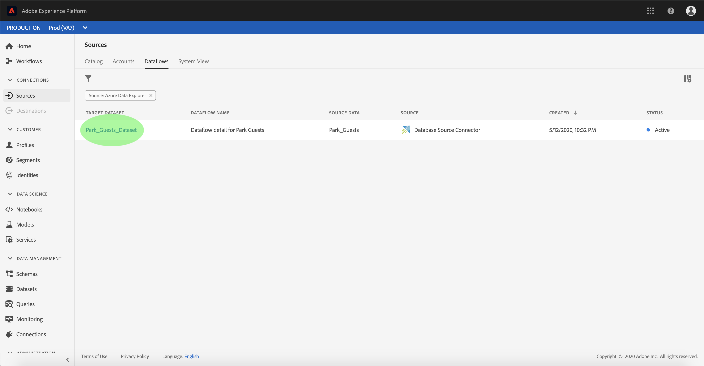
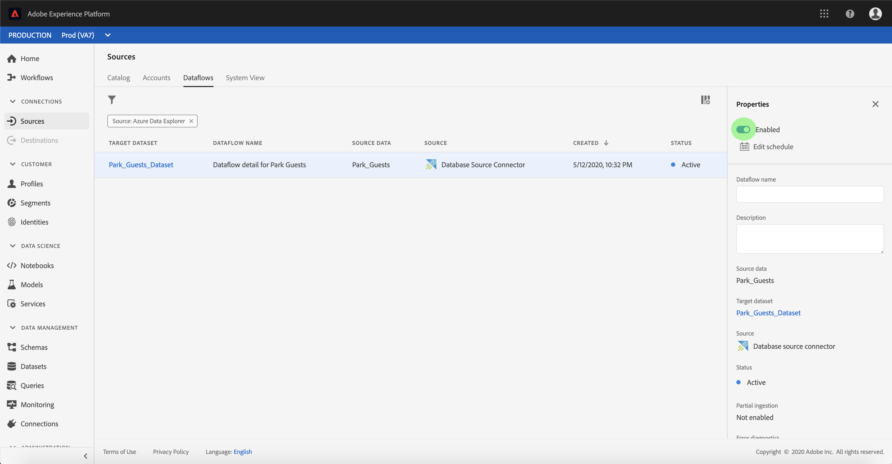

# Configurare un flusso di dati per un connettore di database nell&#39;interfaccia utente

Un flusso di dati è un&#39;attività pianificata che recupera e trasferisce dati da un&#39;origine a un set di dati Platform. Questa esercitazione fornisce i passaggi per configurare un nuovo flusso di dati utilizzando il connettore di base del database.

## Introduzione

Questa esercitazione richiede una conoscenza approfondita dei seguenti componenti del  Adobe Experience Platform:

- [Sistema](../../../../xdm/home.md)XDM (Experience Data Model): Framework standard con cui  Experience Platform organizza i dati sull&#39;esperienza dei clienti.
   - [Nozioni di base sulla composizione](../../../../xdm/schema/composition.md)dello schema: Scoprite i componenti di base degli schemi XDM, inclusi i principi chiave e le procedure ottimali nella composizione dello schema.
   - [Esercitazione](../../../../xdm/tutorials/create-schema-ui.md)sull&#39;Editor di schema: Scoprite come creare schemi personalizzati utilizzando l&#39;interfaccia utente dell&#39;Editor di schema.
- [Profilo](../../../../profile/home.md)cliente in tempo reale: Fornisce un profilo di consumo unificato e in tempo reale basato su dati aggregati provenienti da più origini.

Inoltre, questa esercitazione richiede che sia già stato creato un connettore per il database. Un elenco di esercitazioni per la creazione di diversi connettori di database nell&#39;interfaccia utente è disponibile nella panoramica [dei connettori](../../../home.md)sorgente.

## Seleziona dati

Dopo aver creato il connettore del database, viene visualizzato il *[!UICONTROL Select data]* passaggio che fornisce un&#39;interfaccia interattiva per esplorare la gerarchia del database.

- La metà sinistra dell&#39;interfaccia è un browser, che visualizza l&#39;elenco dei database dell&#39;account.
- La metà destra dell&#39;interfaccia consente di visualizzare un&#39;anteprima di fino a 100 righe di dati.

Selezionate il database da utilizzare, quindi fate clic su **[!UICONTROL Next]**.

## Mappatura dei campi dati su uno schema XDM

Viene visualizzato il passaggio *Mapping* , che fornisce un&#39;interfaccia interattiva per mappare i dati di origine a un set di dati Platform.

Scegliere un set di dati in entrata in cui assimilare i dati. È possibile utilizzare un set di dati esistente o crearne uno nuovo.

### Utilizzare un dataset esistente

Per assimilare i dati in un dataset esistente, selezionare **[!UICONTROL Existing dataset]**, quindi fare clic sull&#39;icona del dataset.

Viene visualizzata *[!UICONTROL Select dataset]* la finestra di dialogo. Trovare il set di dati che si desidera utilizzare, selezionarlo, quindi fare clic **[!UICONTROL Continue]**.

### Utilizza un nuovo set di dati

Per assimilare i dati in un nuovo dataset, selezionare **[!UICONTROL New dataset]** e immettere un nome e una descrizione per il dataset nei campi forniti.

È possibile allegare un campo dello schema digitando un nome dello schema nella barra di **[!UICONTROL Select schema]** ricerca. Potete anche selezionare l&#39;icona a discesa per visualizzare un elenco degli schemi esistenti. In alternativa, potete selezionare **[!UICONTROL Advanced search]** a una schermata gli schemi esistenti, con i rispettivi dettagli.

Viene visualizzata la finestra di dialogo *[!UICONTROL Select schema] . Selezionare lo schema che si desidera applicare al nuovo dataset, quindi fare clic su **[!UICONTROL Done]**.

In base alle esigenze, è possibile scegliere di mappare direttamente i campi oppure utilizzare le funzioni di mappatura per trasformare i dati di origine in modo da derivare i valori calcolati o calcolati. Per ulteriori informazioni sulla mappatura dei dati e sulle funzioni di mappatura, consulta l’esercitazione sulla [mappatura dei dati CSV ai campi](../../../../ingestion/tutorials/map-a-csv-file.md)dello schema XDM.

Una volta mappati i dati di origine, fai clic su **[!UICONTROL Next]**.

## Pianificare le esecuzioni dell&#39;assimilazione

Viene visualizzato il *[!UICONTROL Scheduling]* passaggio che consente di configurare una pianificazione di assimilazione per l&#39;acquisizione automatica dei dati di origine selezionati tramite le mappature configurate. Nella tabella seguente sono riportati i diversi campi configurabili per la pianificazione:

| Campo | Descrizione |
| --- | --- |
| Frequenza | Le frequenze selezionabili sono: Minuto, Ora, Giorno e Settimana. |
| Intervallo | Un numero intero che imposta l&#39;intervallo per la frequenza selezionata. |
| Ora di inizio | Una marca temporale UTC per la quale si verificherà la prima assimilazione. |
| Backfill | Un valore booleano che determina i dati inizialmente acquisiti. Se *Backfill* è abilitato, tutti i file correnti nel percorso specificato verranno acquisiti durante la prima assimilazione pianificata. Se *Backfill* è disattivato, verranno acquisiti solo i file caricati tra la prima esecuzione dell&#39;assimilazione e l&#39;ora *di* inizio. I file caricati prima dell&#39;ora *di* inizio non vengono acquisiti. |
| Colonna Delta | Opzione con un set filtrato di campi dello schema di origine di tipo, data o ora. Questo campo è utilizzato per distinguere tra dati nuovi ed esistenti. I dati incrementali verranno acquisiti in base alla marca temporale della colonna selezionata. |

I flussi di dati sono progettati per l&#39;acquisizione automatica dei dati su base programmata. Se desiderate effettuare il caricamento solo una volta in questo flusso di lavoro, potete farlo configurando il **[!UICONTROL Frequency]** pulsante &quot;Giorno&quot; e applicando un numero molto elevato per il **[!UICONTROL Interval]**, ad esempio 10000 o simile.

Specificare i valori per la pianificazione e selezionare **[!UICONTROL Next]**.

## Denominazione del flusso di dati

Viene visualizzato il *[!UICONTROL dataflow detail]* passaggio in cui è necessario specificare un nome e una descrizione facoltativa per il flusso di dati. Selezionate **[!UICONTROL Next]** al termine.

## Controllare il flusso di dati

Viene visualizzato il *[!UICONTROL Review]* passaggio che consente di rivedere il nuovo flusso di dati prima della creazione. I dettagli sono raggruppati nelle seguenti categorie:

- *Connessione*: Mostra il tipo di origine, il percorso pertinente del file di origine scelto e la quantità di colonne all&#39;interno del file di origine.
- *Assegna campi* dataset e mappa: Mostra il set di dati in cui vengono acquisiti i dati di origine, incluso lo schema a cui il set di dati aderisce.
- *Pianificazione*: Mostra il periodo, la frequenza e l’intervallo attivi della pianificazione di assimilazione.

Dopo aver rivisto il flusso di dati, fai clic su **[!UICONTROL Finish]** e consenti la creazione del flusso di dati.

## Monitorare il flusso di dati

Una volta creato il flusso di dati, potete monitorare i dati che vengono acquisiti tramite di esso. Per ulteriori informazioni su come monitorare i flussi di dati, consulta l’esercitazione sugli [account e i flussi di dati](../monitor.md).

## Passaggi successivi

Seguendo questa esercitazione, è stato creato un flusso di dati per inserire i dati da un database esterno e ottenere informazioni dettagliate sul monitoraggio dei set di dati. I dati in entrata possono ora essere utilizzati dai servizi Platform a valle, come Profilo cliente in tempo reale e Data Science Workspace. Per ulteriori informazioni, consulta i documenti seguenti:

- [Panoramica del profilo cliente in tempo reale](../../../../profile/home.md)
- [Panoramica di Analysis Workspace](../../../../data-science-workspace/home.md)

## Appendice

Le sezioni seguenti forniscono informazioni aggiuntive sull&#39;utilizzo dei connettori di origine.

### Disattivazione di un flusso di dati

Quando un flusso di dati viene creato, diventa immediatamente attivo e i dati vengono acquisiti in base alla pianificazione specificata. Puoi disattivare un flusso di dati attivo in qualsiasi momento seguendo le istruzioni riportate di seguito.

Nell’area di *[!UICONTROL Sources]* lavoro, selezionate la **[!UICONTROL Dataflowss]** scheda. Quindi, selezionate il flusso di dati da disattivare.

La *[!UICONTROL Properties]* colonna viene visualizzata sul lato destro dello schermo, con un pulsante di **[!UICONTROL Enabled]** attivazione/disattivazione. Selezionate l’opzione per disattivare il flusso di dati. La stessa opzione può essere utilizzata per riattivare un flusso di dati dopo che è stato disabilitato.

### Attivare i dati in entrata per la [!DNL Profile] popolazione

I dati in entrata provenienti dal connettore di origine possono essere utilizzati per arricchire e compilare [!DNL Real-time Customer Profile] i dati. Per ulteriori informazioni sulla compilazione [!DNL Real-time Customer Profile] dei dati, consulta l’esercitazione sulla popolazione [di](../profile.md)profili.