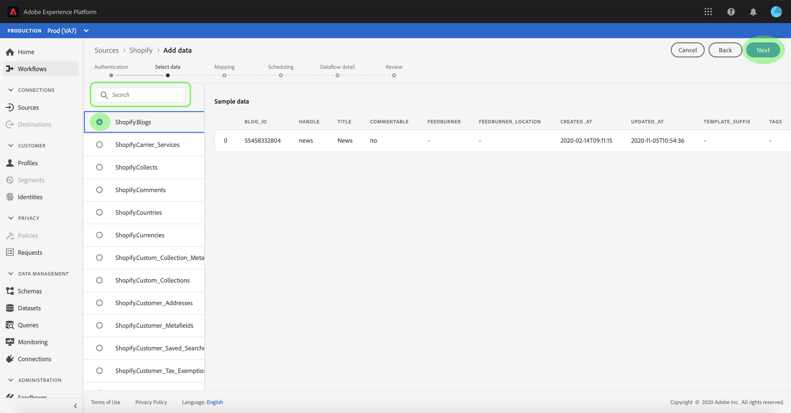

# Configurare un flusso di dati per una connessione eCommerce nell’interfaccia utente

Un flusso di dati è un&#39;attività pianificata che recupera e trasferisce dati da un&#39;origine a un set di dati [!DNL Platform]. Questa esercitazione fornisce i passaggi per configurare un nuovo flusso di dati utilizzando l&#39;account **[!UICONTROL eCommerce]**.

## Introduzione

Questa esercitazione richiede una buona conoscenza dei seguenti componenti di Adobe Experience Platform:

- [[!DNL Experience Data Model (XDM)] Sistema](../../../../xdm/home.md): Il framework standard con cui  [!DNL Experience Platform] organizzare i dati relativi all&#39;esperienza dei clienti.
   - [Nozioni di base sulla composizione](../../../../xdm/schema/composition.md) dello schema: Scoprite i componenti di base degli schemi XDM, inclusi i principi chiave e le procedure ottimali nella composizione dello schema.
   - [Esercitazione](../../../../xdm/tutorials/create-schema-ui.md) sull&#39;Editor di schema: Scoprite come creare schemi personalizzati utilizzando l&#39;interfaccia utente dell&#39;Editor di schema.
- [[!DNL Real-time Customer Profile]](../../../../profile/home.md): Fornisce un profilo di consumo unificato e in tempo reale basato su dati aggregati provenienti da più origini.

Inoltre, questa esercitazione richiede che sia già stato creato un account **[!UICONTROL eCommerce]**. Un elenco di esercitazioni per la creazione di diversi **[!UICONTROL eCommerce]** connettori nell&#39;interfaccia utente è disponibile nella [panoramica dei connettori sorgente](../../../home.md).

## Seleziona dati

Dopo aver creato l&#39;account **[!UICONTROL eCommerce]**, viene visualizzato il passaggio **[!UICONTROL Select data]**, che fornisce un&#39;interfaccia interattiva per esplorare la gerarchia dei file.

- La metà sinistra dell&#39;interfaccia è un browser di directory che visualizza i file e le directory del server.
- La metà destra dell&#39;interfaccia consente di visualizzare in anteprima fino a 100 righe di dati da un file compatibile.

È possibile utilizzare l&#39;opzione **[!UICONTROL Search]** nella parte superiore della pagina per identificare rapidamente i dati di origine che si intende utilizzare.

>[!NOTE]
>
>L&#39;opzione per i dati dell&#39;origine di ricerca è disponibile per tutti i connettori sorgente basati su tabelle, ad eccezione dei connettori Analytics, Classifications, Event Hubs e Kinesis.

Una volta trovati i dati di origine, seleziona la directory, quindi seleziona **[!UICONTROL Next]**.

## Mappatura dei campi dati su uno schema XDM

Viene visualizzato il passaggio **[!UICONTROL Mapping]**, che fornisce un&#39;interfaccia interattiva per mappare i dati di origine su un set di dati [!DNL Platform].

Scegliere un set di dati in entrata in cui assimilare i dati. È possibile utilizzare un set di dati esistente o crearne uno nuovo.

### Utilizzare un dataset esistente

Per assimilare i dati in un dataset esistente, selezionare **[!UICONTROL Use existing dataset]**, quindi fare clic sull&#39;icona del dataset.

Viene visualizzata la finestra di dialogo **[!UICONTROL Select dataset]**. Trovare il set di dati che si desidera utilizzare, selezionarlo, quindi fare clic su **[!UICONTROL Continue]**.

### Utilizza un nuovo set di dati

Per inserire i dati in un nuovo dataset, selezionare **[!UICONTROL Create new dataset]** e immettere un nome e una descrizione per il dataset nei campi forniti.

È possibile allegare un campo dello schema immettendo un nome dello schema nella barra di ricerca **[!UICONTROL Select schema]**. Potete anche selezionare l&#39;icona a discesa per visualizzare un elenco degli schemi esistenti. In alternativa, potete selezionare **[!UICONTROL Advanced search]** per accedere alla schermata degli schemi esistenti, inclusi i rispettivi dettagli.

Durante questo passaggio, potete abilitare il dataset per [!DNL Real-time Customer Profile] e creare una visualizzazione olistica degli attributi e dei comportamenti di un&#39;entità. I dati di tutti i set di dati abilitati saranno inclusi in [!DNL Profile] e le modifiche verranno applicate al salvataggio del flusso di dati.

Attivate il pulsante **[!UICONTROL Profile dataset]** per abilitare il set di dati di destinazione per [!DNL Profile].

Viene visualizzata la finestra di dialogo **[!UICONTROL Select schema]**. Selezionare lo schema che si desidera applicare al nuovo dataset, quindi fare clic su **[!UICONTROL Done]**.

In base alle esigenze, è possibile scegliere di mappare direttamente i campi oppure utilizzare le funzioni di mappatura per trasformare i dati di origine in modo da derivare i valori calcolati o calcolati. Per ulteriori informazioni sulla mappatura dei dati e sulle funzioni di mappatura, fare riferimento all&#39;esercitazione sulla [mappatura dei dati CSV ai campi dello schema XDM](../../../../ingestion/tutorials/map-a-csv-file.md).

>[!TIP]
>
>[!DNL Platform] fornisce raccomandazioni intelligenti per i campi mappati automaticamente in base allo schema di destinazione o al dataset selezionato. Puoi regolare manualmente le regole di mappatura in base ai tuoi casi di utilizzo.

Selezionare **[!UICONTROL Preview data]** per visualizzare i risultati della mappatura fino a 100 righe di dati di esempio dal set di dati selezionato.

Durante l&#39;anteprima, la colonna dell&#39;identità ha priorità come primo campo, in quanto rappresenta le informazioni chiave necessarie per convalidare i risultati della mappatura.

Una volta mappati i dati di origine, selezionare **[!UICONTROL Close]**.

## Pianificare le esecuzioni dell&#39;assimilazione

Viene visualizzato il passaggio **[!UICONTROL Scheduling]**, che consente di configurare una pianificazione di assimilazione per l&#39;acquisizione automatica dei dati di origine selezionati tramite le mappature configurate. Nella tabella seguente sono riportati i diversi campi configurabili per la pianificazione:

| Campo | Descrizione |
| --- | --- |
| Frequenza | Le frequenze selezionabili sono `Once`, `Minute`, `Hour`, `Day` e `Week`. |
| Intervallo | Un numero intero che imposta l&#39;intervallo per la frequenza selezionata. |
| Ora di inizio | Una marca temporale UTC che indica quando è impostata la prima assimilazione. |
| Backfill | Un valore booleano che determina i dati inizialmente acquisiti. Se **[!UICONTROL Backfill]** è abilitato, tutti i file correnti nel percorso specificato verranno acquisiti durante la prima assimilazione pianificata. Se **[!UICONTROL Backfill]** è disattivato, verranno acquisiti solo i file caricati tra la prima esecuzione dell&#39;assimilazione e l&#39;ora di inizio. I file caricati prima dell&#39;ora di inizio non vengono assimilati. |
| Colonna Delta | Opzione con un set filtrato di campi dello schema di origine di tipo, data o ora. Questo campo è utilizzato per distinguere tra dati nuovi ed esistenti. I dati incrementali verranno acquisiti in base alla marca temporale della colonna selezionata. |

I flussi di dati sono progettati per l&#39;acquisizione automatica dei dati su base programmata. Per iniziare, selezionate la frequenza di assimilazione. Quindi, impostare l&#39;intervallo per specificare il periodo tra due esecuzioni di flusso. Il valore dell&#39;intervallo deve essere un numero intero diverso da zero e deve essere impostato su maggiore o uguale a 15.

Per impostare l’ora di inizio dell’assimilazione, regolate la data e l’ora visualizzate nella casella Ora di inizio. In alternativa, potete selezionare l&#39;icona del calendario per modificare il valore dell&#39;ora di inizio. L&#39;ora di inizio deve essere maggiore o uguale all&#39;ora UTC corrente.

Selezionare **[!UICONTROL Load incremental data by]** per assegnare la colonna delta. Questo campo consente di distinguere tra dati nuovi ed esistenti.

### Impostazione di un flusso di dati per l’assimilazione una tantum

Per impostare l&#39;inserimento una tantum, selezionate la freccia a discesa di frequenza e selezionate **[!UICONTROL Once]**.

>[!TIP]
>
>**[!UICONTROL Interval]** e non  **[!UICONTROL Backfill]** sono visibili durante un&#39;assimilazione una tantum.

Dopo aver fornito i valori appropriati alla pianificazione, selezionare **[!UICONTROL Next]**.

## Fornire i dettagli del flusso di dati

Viene visualizzato il passaggio **[!UICONTROL Dataflow detail]**, che consente di assegnare un nome e una breve descrizione al nuovo flusso di dati.

Durante questo processo, è inoltre possibile abilitare **[!UICONTROL Partial ingestion]** e **[!UICONTROL Error diagnostics]**. L&#39;abilitazione di **[!UICONTROL Partial ingestion]** consente di assimilare i dati contenenti errori fino a una determinata soglia. Una volta che **[!UICONTROL Partial ingestion]** è abilitato, trascinare il quadrante **[!UICONTROL Error threshold %]** per regolare la soglia di errore del batch. In alternativa, è possibile regolare manualmente la soglia selezionando la casella di input. Per ulteriori informazioni, vedere la [panoramica sull&#39;assimilazione parziale dei batch](../../../../ingestion/batch-ingestion/partial.md).

Immettete i valori per il flusso di dati e selezionate **[!UICONTROL Next]**.

## Controllare il flusso di dati

Viene visualizzato il passaggio **[!UICONTROL Review]**, che consente di rivedere il nuovo flusso di dati prima che venga creato. I dettagli sono raggruppati nelle seguenti categorie:

- **[!UICONTROL Connection]**: Mostra il tipo di origine, il percorso pertinente del file di origine scelto e la quantità di colonne all&#39;interno del file di origine.
- **[!UICONTROL Assign dataset & map fields]**: Mostra il set di dati in cui vengono acquisiti i dati di origine, incluso lo schema a cui il set di dati aderisce.
- **[!UICONTROL Scheduling]**: Mostra il periodo, la frequenza e l’intervallo attivi della pianificazione di assimilazione.

Dopo aver rivisto il flusso di dati, fate clic su **[!UICONTROL Finish]** e lasciate che sia possibile creare il flusso di dati.

## Monitorare il flusso di dati

Una volta creato il flusso di dati, puoi monitorare i dati che vengono acquisiti attraverso di esso per visualizzare informazioni su velocità di assimilazione, successo ed errori. Per ulteriori informazioni su come monitorare il flusso di dati, consulta l&#39;esercitazione su [monitorare gli account e i flussi di dati nell&#39;interfaccia utente](../monitor.md).

## Eliminare il flusso di dati

È possibile eliminare i flussi di dati che non sono più necessari o che sono stati creati in modo non corretto utilizzando la funzione **[!UICONTROL Delete]** disponibile nell&#39;area di lavoro **[!UICONTROL Dataflows]**. Per ulteriori informazioni sull&#39;eliminazione dei flussi di dati, vedere l&#39;esercitazione sull&#39;eliminazione dei flussi di dati nell&#39;interfaccia utente](../delete.md).[

## Passaggi successivi

Seguendo questa esercitazione, è stato creato un flusso di dati per inserire i dati **[!UICONTROL eCommerce]** e ottenere informazioni dettagliate sul monitoraggio dei set di dati. I dati in entrata possono ora essere utilizzati dai servizi a valle [!DNL Platform] quali [!DNL Real-time Customer Profile] e [!DNL Data Science Workspace]. Per ulteriori informazioni, consulta i documenti seguenti:

- [[!DNL Real-time Customer Profile] panoramica](../../../../profile/home.md)
- [[!DNL Data Science Workspace] panoramica](../../../../data-science-workspace/home.md)
