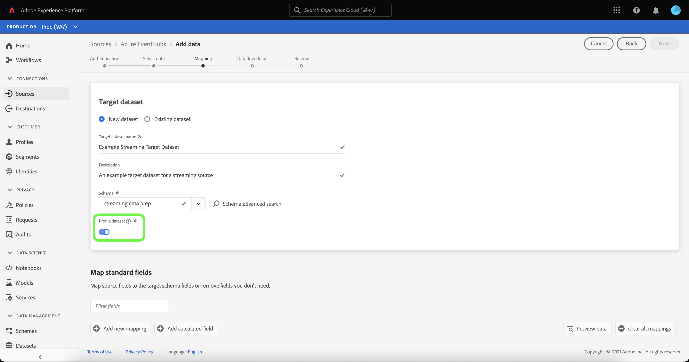
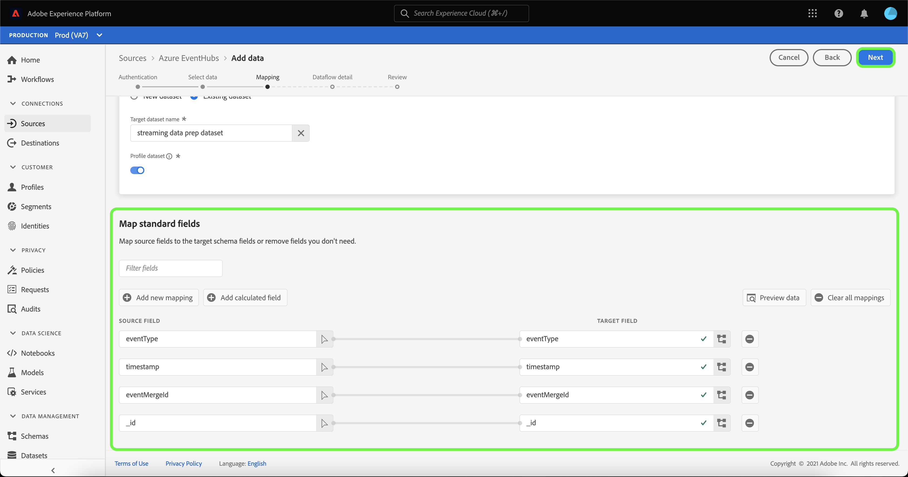

# Creare un flusso di dati in streaming per un’origine di archiviazione cloud nell’interfaccia utente

Un flusso di dati è un’attività pianificata che recupera e acquisisce dati da un’origine a un set di dati Adobe Experience Platform. Questo tutorial descrive come creare un flusso di dati in streaming per un’origine di archiviazione cloud nell’interfaccia utente.

Prima di provare questa esercitazione, è necessario stabilire una connessione valida e autenticata tra l’account di archiviazione cloud e Platform. Se non disponi già di una connessione autenticata, consulta una delle seguenti esercitazioni per informazioni sull’autenticazione degli account di archiviazione cloud in streaming:

- [[!DNL Amazon Kinesis]](../../../ui/create/cloud-storage/kinesis.md)
- [[!DNL Azure Event Hubs]](../../../ui/create/cloud-storage/eventhub.md)
- [[!DNL Google PubSub]](../../../ui/create/cloud-storage/google-pubsub.md)

## Introduzione

Questo tutorial richiede una buona conoscenza dei seguenti componenti di Adobe Experience Platform:

- [Flussi dati](../../../../../dataflows/home.md): i flussi di dati sono una rappresentazione dei processi di dati che spostano i dati in Platform. I flussi di dati sono configurati tra diversi servizi, dalle origini, alle [!DNL Identity Service], a [!DNL Profile], e a [!DNL Destinations].
- [Preparazione dati](../../../../../data-prep/home.md): la preparazione dati consente ai data engineer di mappare, trasformare e convalidare i dati da e verso Experience Data Model (XDM). La preparazione dati viene visualizzata come un passaggio &quot;Mappa&quot; nei processi di acquisizione dati, incluso il flusso di lavoro di acquisizione CSV.
- [[!DNL Experience Data Model (XDM)] Sistema](../../../../../xdm/home.md): il quadro standardizzato mediante il quale [!DNL Experience Platform] organizza i dati sull’esperienza del cliente.
   - [Nozioni di base sulla composizione dello schema](../../../../../xdm/schema/composition.md): scopri gli elementi di base degli schemi XDM, compresi i principi chiave e le best practice nella composizione dello schema.
   - [Esercitazione sull’editor di schemi](../../../../../xdm/tutorials/create-schema-ui.md): scopri come creare schemi personalizzati utilizzando l’interfaccia utente dell’Editor di schema.
- [[!DNL Real-Time Customer Profile]](../../../../../profile/home.md): fornisce un profilo consumer unificato e in tempo reale basato su dati aggregati provenienti da più origini.

## Aggiungi dati

>[!NOTE]
>
>Puoi creare un solo flusso di dati di origine per gruppo di consumer per un determinato hub eventi.

Dopo aver creato l’autenticazione dell’account di archiviazione cloud in streaming, il **[!UICONTROL Seleziona dati]** viene visualizzata un’interfaccia che consente di selezionare il flusso di dati da portare su Platform.

- La parte sinistra dell’interfaccia è un browser che ti consente di visualizzare i flussi di dati disponibili all’interno del tuo account;
- La parte destra dell’interfaccia consente di visualizzare in anteprima fino a 100 righe di dati da un file JSON.

Seleziona il flusso di dati che desideri utilizzare, quindi fai clic su **[!UICONTROL Scegli file]** per caricare uno schema di esempio.

>[!TIP]
>
>Se i dati sono conformi a XDM, puoi saltare il caricamento di uno schema di esempio e selezionare **[!UICONTROL Successivo]** per procedere.

Una volta caricato lo schema, l’interfaccia di anteprima si aggiorna e mostra un’anteprima dello schema caricato. L’interfaccia di anteprima consente di esaminare il contenuto e la struttura di un file. È inoltre possibile utilizzare [!UICONTROL Campo di ricerca] per accedere a elementi specifici dallo schema.

Al termine, seleziona **[!UICONTROL Successivo]**.

## Mappatura

Il **[!UICONTROL Mappatura]** viene visualizzato un passaggio che fornisce un’interfaccia per mappare i dati di origine su un set di dati di Platform.

Scegli un set di dati per i dati in entrata da acquisire in. Puoi utilizzare un set di dati esistente o crearne uno nuovo.

### Nuovo set di dati

Per acquisire dati in un nuovo set di dati, seleziona **[!UICONTROL Nuovo set di dati]** e immetti un nome e una descrizione per il set di dati nei campi forniti. Per aggiungere uno schema, puoi immettere un nome di schema esistente nel **[!UICONTROL Seleziona schema]** . In alternativa, è possibile selezionare **[!UICONTROL Ricerca avanzata schema]** per cercare uno schema appropriato.

Il [!UICONTROL Seleziona schema] viene visualizzata una finestra che fornisce un elenco degli schemi disponibili tra cui scegliere. Seleziona uno schema dall’elenco per aggiornare la barra a destra in modo da visualizzare i dettagli specifici dello schema selezionato, incluse le informazioni sull’abilitazione o meno dello schema per [!DNL Profile].

Dopo aver identificato e selezionato lo schema da utilizzare, seleziona **[!UICONTROL Fine]**.

Il [!UICONTROL Set di dati di destinazione] La pagina viene aggiornata con lo schema selezionato visualizzato come parte del set di dati. Durante questo passaggio, puoi abilitare il set di dati per [!DNL Profile] e creare una visualizzazione olistica degli attributi e dei comportamenti di un’entità. I dati di tutti i set di dati abilitati verranno inclusi in [!DNL Profile] e le modifiche vengono applicate quando salvi il flusso di dati.

Attiva/disattiva **[!UICONTROL Set di dati profilo]** per abilitare il set di dati di destinazione per [!DNL Profile].

### Set di dati esistente

Per acquisire dati in un set di dati esistente, seleziona **[!UICONTROL Set di dati esistente]**, quindi seleziona l’icona del set di dati.

Il **[!UICONTROL Seleziona set di dati]** viene visualizzata una finestra di dialogo che fornisce un elenco dei set di dati disponibili tra cui scegliere. Seleziona un set di dati dall’elenco per aggiornare la barra a destra e visualizzare i dettagli specifici del set di dati selezionato, comprese le informazioni sulla possibilità di abilitare il set di dati per [!DNL Profile].

Dopo aver identificato e selezionato il set di dati da utilizzare, seleziona **[!UICONTROL Fine]**.

Dopo aver selezionato il set di dati, seleziona la [!DNL Profile] attiva per abilitare il set di dati per [!DNL Profile].

### Mappare i campi standard

Una volta stabilito il set di dati e lo schema, il **[!UICONTROL Mappare i campi standard]** viene visualizzata l&#39;interfaccia, che consente di configurare manualmente i campi di mappatura per i dati.

>[!TIP]
>
>Platform fornisce consigli intelligenti per campi mappati automaticamente in base allo schema o al set di dati di destinazione selezionato. Puoi regolare manualmente le regole di mappatura in base ai tuoi casi d’uso.

In base alle tue esigenze, puoi scegliere di mappare i campi direttamente o utilizzare le funzioni di preparazione dati per trasformare i dati sorgente in modo da derivare valori calcolati o calcolati. Per i passaggi completi sull’utilizzo dell’interfaccia mapper e dei campi calcolati, vedi la [Guida dell’interfaccia utente per la preparazione dati](../../../../../data-prep/ui/mapping.md).

Una volta mappati i dati di origine, seleziona **[!UICONTROL Successivo]**.

## Dettagli del flusso di dati

Il **[!UICONTROL Dettagli del flusso di dati]** viene visualizzato un passaggio che consente di denominare e fornire una breve descrizione del nuovo flusso di dati.

Immetti i valori per il flusso di dati e seleziona **[!UICONTROL Successivo]**.

### Revisione

Il **[!UICONTROL Revisione]** viene visualizzato un passaggio che consente di rivedere il nuovo flusso di dati prima di crearlo. I dettagli sono raggruppati nelle seguenti categorie:

- **[!UICONTROL Connessione]**: visualizza il nome dell’account, il tipo di origine e altre informazioni specifiche dell’origine di archiviazione cloud in streaming che si sta utilizzando.
- **[!UICONTROL Assegnare set di dati e mappare i campi]**: visualizza il set di dati e lo schema di destinazione utilizzati per il flusso di dati.

Dopo aver rivisto il flusso di dati, seleziona **[!UICONTROL Fine]** e lascia un po’ di tempo per creare il flusso di dati.

## Monitorare ed eliminare il flusso di dati

Una volta creato il flusso di dati di archiviazione cloud in streaming, puoi monitorare i dati che vengono acquisiti tramite di esso. Per ulteriori informazioni sul monitoraggio e l’eliminazione dei flussi di dati in streaming, consulta l’esercitazione su [monitoraggio dei flussi di dati in streaming](../../monitor-streaming.md).

## Passaggi successivi

Seguendo questa esercitazione, hai creato correttamente un flusso di dati per inviare dati da un’origine di archiviazione cloud. I dati in arrivo possono ora essere utilizzati da servizi Platform a valle come [!DNL Real-Time Customer Profile] e [!DNL Data Science Workspace]. Per ulteriori informazioni, consulta i seguenti documenti:

- [Panoramica di [!DNL Real-Time Customer Profile]](../../../../../profile/home.md)
- [Panoramica di [!DNL Data Science Workspace]](../../../../../data-science-workspace/home.md)