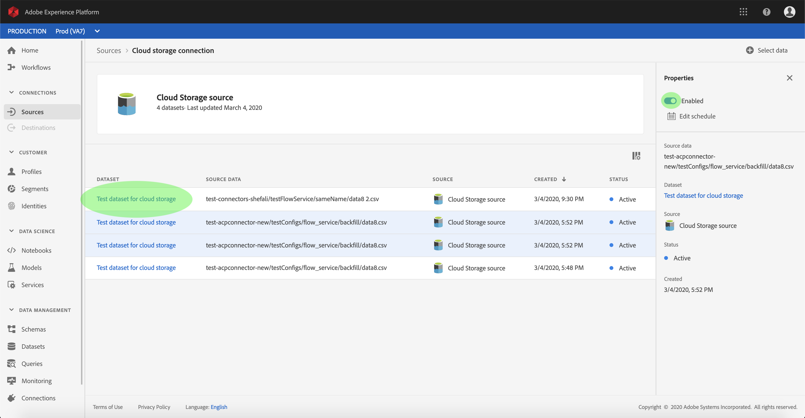

# Configurare un flusso di dati per un connettore di streaming per l&#39;archiviazione cloud nell&#39;interfaccia utente

Un flusso di dati è un&#39;attività pianificata che recupera e trasferisce dati da un&#39;origine a un [!DNL Platform] set di dati. Questa esercitazione fornisce i passaggi per configurare un nuovo flusso di dati utilizzando il connettore di base per l&#39;archiviazione cloud.

## Introduzione

Questa esercitazione richiede una conoscenza approfondita dei seguenti componenti del  Adobe Experience Platform:

- [Sistema](../../../../../xdm/home.md)XDM (Experience Data Model): Il framework standard con cui [!DNL Experience Platform] organizzare i dati relativi all&#39;esperienza del cliente.
   - [Nozioni di base sulla composizione](../../../../../xdm/schema/composition.md)dello schema: Scoprite i componenti di base degli schemi XDM, inclusi i principi chiave e le procedure ottimali nella composizione dello schema.
   - [Esercitazione](../../../../../xdm/tutorials/create-schema-ui.md)sull&#39;Editor di schema: Scoprite come creare schemi personalizzati utilizzando l&#39;interfaccia utente dell&#39;Editor di schema.
- [Profilo](../../../../../profile/home.md)cliente in tempo reale: Fornisce un profilo di consumo unificato e in tempo reale basato su dati aggregati provenienti da più origini.

Inoltre, questa esercitazione richiede che sia già stato creato un connettore di archiviazione cloud. Un elenco di esercitazioni per la creazione di diversi connettori di archiviazione cloud nell&#39;interfaccia utente è disponibile nella panoramica [dei connettori](../../../../home.md)sorgente.

## Seleziona dati

Dopo aver creato il connettore di archiviazione cloud, viene visualizzato il passaggio *Seleziona dati* , che fornisce un&#39;interfaccia per selezionare il flusso da cui si desidera inviare i dati.

## Mappatura dei campi dati su uno schema XDM

Viene visualizzato il passaggio *Mapping* , che fornisce un&#39;interfaccia interattiva per mappare i dati di origine a un [!DNL Platform] dataset.

Scegliere un set di dati in entrata in cui assimilare i dati. È possibile utilizzare un set di dati esistente o crearne uno nuovo.

**Utilizzare un dataset esistente**

Per assimilare i dati in un dataset esistente, selezionare **[!UICONTROL Use existing dataset]**, quindi fare clic sull&#39;icona del dataset.

Viene visualizzata la finestra di dialogo _Seleziona set di dati_ . Trovare il set di dati che si desidera utilizzare, selezionarlo, quindi fare clic **[!UICONTROL Continue]**.

**Utilizza un nuovo set di dati**

Per assimilare i dati in un nuovo dataset, selezionare **[!UICONTROL Create new dataset]** e immettere un nome e una descrizione per il dataset nei campi forniti. Selezionare quindi lo schema da utilizzare nel menu a discesa.

## Denominazione del flusso di dati

Viene visualizzato il *[!UICONTROL Dataflow detail]* passaggio che consente di assegnare un nome e una breve descrizione al nuovo flusso di dati.

Immettete i valori per il flusso di dati e fate clic su **[!UICONTROL Next]**.

### Controllare il flusso di dati

Viene visualizzato il passaggio *Revisione* , che consente di rivedere il nuovo flusso di dati prima della creazione. I dettagli sono raggruppati nelle seguenti categorie:

- *[!UICONTROL Source details]*: Mostra il tipo di origine e altri dettagli relativi all&#39;origine.
- *[!UICONTROL Target details]*: Mostra il set di dati in cui vengono acquisiti i dati di origine, incluso lo schema a cui il set di dati aderisce.

Dopo aver rivisto il flusso di dati, fai clic su **[!UICONTROL Finish]** e consenti la creazione del flusso di dati.

## Monitorare ed eliminare il flusso di dati

Una volta creato il flusso di dati per l&#39;archiviazione cloud, potete monitorare i dati che vengono acquisiti tramite di esso. Per ulteriori informazioni sul monitoraggio e l’eliminazione dei flussi di dati, consulta l’esercitazione sul [monitoraggio dei flussi](../../../../../ingestion/quality/monitor-data-flows.md)di dati.

## Passaggi successivi

Seguendo questa esercitazione, hai creato con successo un flusso di dati per l&#39;inserimento di dati da un archivio cloud esterno e hai acquisito informazioni sul monitoraggio dei set di dati. I dati in entrata possono ora essere utilizzati dai [!DNL Platform] servizi a valle come [!DNL Real-time Customer Profile] e [!DNL Data Science Workspace]. Per ulteriori informazioni, consulta i documenti seguenti:

- [Panoramica del profilo cliente in tempo reale](../../../../../profile/home.md)
- [Panoramica di Analysis Workspace](../../../../../data-science-workspace/home.md)

## Appendice

Le sezioni seguenti forniscono informazioni aggiuntive sull&#39;utilizzo dei connettori di origine.

### Disattivazione di un flusso di dati

Quando un flusso di dati viene creato, diventa immediatamente attivo e i dati vengono acquisiti in base alla pianificazione specificata. Puoi disattivare un flusso di dati attivo in qualsiasi momento seguendo le istruzioni riportate di seguito.

Nell’area di *[!UICONTROL Sources]* lavoro, fate clic sulla **[!UICONTROL Browse]** scheda. Quindi, fare clic sul nome della connessione di base associata al flusso di dati attivo che si desidera disattivare.

Viene *[!UICONTROL Source activity]* visualizzata la pagina. Selezionate il flusso di dati attivo dall’elenco per aprire la colonna *Proprietà* sul lato destro dello schermo, che contiene un pulsante di **[!UICONTROL Enabled]** attivazione/disattivazione. Fate clic sull’interruttore per disattivare il flusso di dati. La stessa opzione può essere utilizzata per riattivare un flusso di dati dopo che è stato disabilitato.

### Attivare i dati in entrata per la [!DNL Profile] popolazione

I dati in entrata provenienti dal connettore di origine possono essere utilizzati per arricchire e compilare [!DNL Real-time Customer Profile] i dati. Per ulteriori informazioni sulla compilazione [!DNL Real-time Customer Profile] dei dati, consulta l’esercitazione sulla popolazione [di](../../profile.md)profili.
