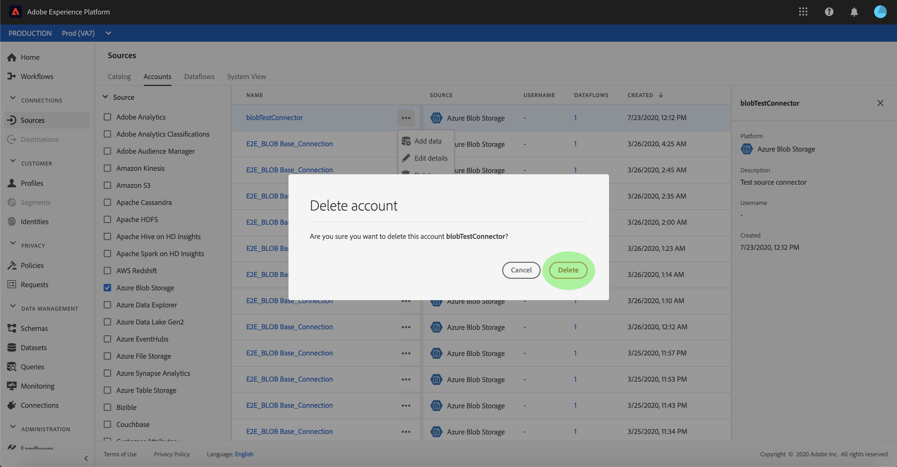

# Elimina account di connessione di origine

I connettori di origini in Adobe Experience Platform consentono di acquisire dati di origine esterna in base a una pianificazione. Questa esercitazione descrive i passaggi da seguire per eliminare gli account da **[!UICONTROL Sorgenti]** Workspace.

## Introduzione

Questo tutorial richiede una buona conoscenza dei seguenti componenti di Adobe Experience Platform:

- [[!DNL Experience Data Model (XDM)] Sistema](../../../xdm/home.md): il quadro standardizzato mediante il quale [!DNL Experience Platform] organizza i dati sull’esperienza del cliente.
   - [Nozioni di base sulla composizione dello schema](../../../xdm/schema/composition.md): scopri gli elementi di base degli schemi XDM, compresi i principi chiave e le best practice nella composizione dello schema.
   - [Esercitazione sull’editor di schemi](../../../xdm/tutorials/create-schema-ui.md): scopri come creare schemi personalizzati utilizzando l’interfaccia utente dell’Editor di schema.
- [[!DNL Real-Time Customer Profile]](../../../profile/home.md): fornisce un profilo consumer unificato e in tempo reale basato su dati aggregati provenienti da più origini.

## Eliminare gli account tramite l’interfaccia utente

>[!TIP]
>
>Prima di eliminare l’account di origine, devi eliminare tutti i flussi di dati esistenti associati all’account di origine. Per eliminare i flussi di dati esistenti, consulta l’esercitazione su [eliminazione dei flussi di dati di origine nell’interfaccia utente](./delete.md).

Accedi a [Adobe Experience Platform](https://platform.adobe.com) e quindi seleziona **[!UICONTROL Sorgenti]** dalla barra di navigazione a sinistra per accedere al **[!UICONTROL Sorgenti]** Workspace. Il **[!UICONTROL Catalogo]** Nella schermata vengono visualizzate diverse origini per le quali è possibile creare account e flussi di dati con. Ogni origine mostra il numero di account e flussi di dati esistenti ad essi associati.

Seleziona **[!UICONTROL Account]** per accedere a **[!UICONTROL Account]** pagina.

Viene visualizzato un elenco degli account esistenti. In questa pagina è disponibile un elenco di informazioni ordinabili per gli account esistenti, ad esempio origine, nome utente, flussi di dati associati e data di creazione. Seleziona la **icona funnel** in alto a sinistra per ordinare.

Il pannello di ordinamento viene visualizzato sul lato sinistro dello schermo e contiene un elenco delle sorgenti disponibili. È possibile selezionare più origini utilizzando la funzione di ordinamento.

Seleziona l’origine a cui desideri accedere e individua l’account da eliminare dall’elenco degli account nell’interfaccia principale. Nell’esempio, l’origine selezionata è **[!DNL Azure Blob Storage]** e il nome dell’account è **[!UICONTROL blobTestConnector]**. Quando si selezionano più origini dal pannello di ordinamento, vengono visualizzati per primi gli account creati più di recente, poiché l’elenco è ordinato in base alla data di creazione.

Selezionare l&#39;account che si desidera eliminare.

Il **[!UICONTROL Proprietà]** viene visualizzato sul lato destro della schermata, contenente informazioni relative all’account selezionato.

Seleziona i puntini di sospensione (`...`) accanto al nome dell&#39;account che si desidera eliminare. Viene visualizzato un pannello a comparsa che fornisce le opzioni per **[!UICONTROL Aggiungi dati]**, **[!UICONTROL Modifica dettagli]**, e **[!UICONTROL Elimina]**. Seleziona **[!UICONTROL Elimina]** per eliminare l’account.

Viene visualizzata una finestra di dialogo di conferma finale, seleziona **[!UICONTROL Elimina]** per completare il processo.

## Passaggi successivi

Seguendo questa esercitazione, hai utilizzato correttamente il **[!UICONTROL Sorgenti]** per eliminare gli account esistenti.

Per i passaggi su come eseguire queste operazioni a livello di programmazione utilizzando [!DNL Flow Service] API, fai riferimento al tutorial su [eliminazione di connessioni tramite l’API del servizio Flusso](../../tutorials/api/delete.md)
