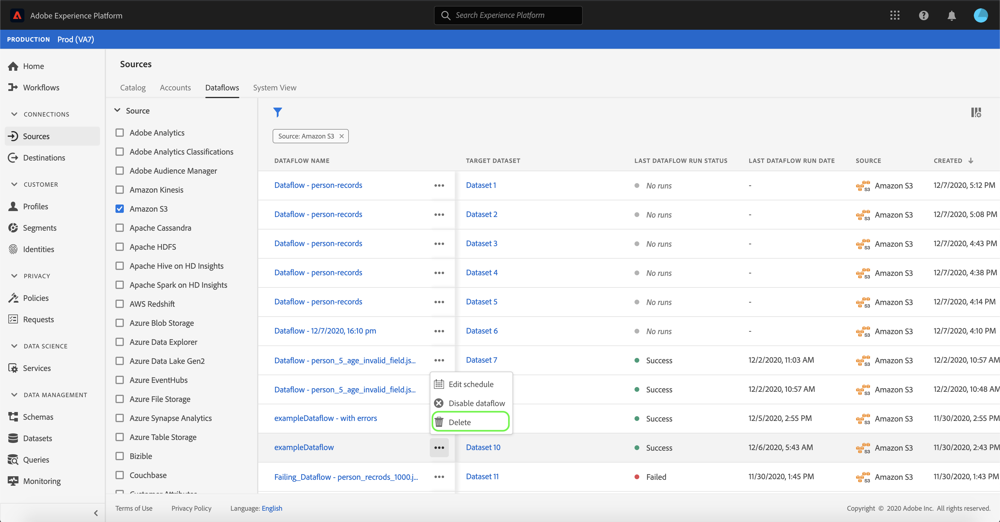

# Eliminare i flussi di dati nell’interfaccia utente

Il [!UICONTROL Sorgenti] workspace consente di eliminare i flussi di dati batch e in streaming esistenti che contengono errori o sono diventati obsoleti.

Questa esercitazione fornisce i passaggi per eliminare i flussi di dati utilizzando [!UICONTROL Sorgenti] Workspace.

## Introduzione

Questo tutorial richiede una buona conoscenza dei seguenti componenti di Adobe Experience Platform:

- [Sorgenti](../../home.md): [!DNL Experience Platform] consente di acquisire dati da varie origini e allo stesso tempo di strutturare, etichettare e migliorare i dati in arrivo tramite [!DNL Platform] servizi.
- [Sandbox](../../../sandboxes/home.md): [!DNL Experience Platform] fornisce sandbox virtuali che permettono di suddividere un singolo [!DNL Platform] in ambienti virtuali separati, per facilitare lo sviluppo e l’evoluzione delle applicazioni di esperienza digitale.

## Elimina flussi di dati

In [Interfaccia utente Experience Platform](https://platform.adobe.com), seleziona **[!UICONTROL Sorgenti]** dalla barra di navigazione a sinistra per accedere al [!UICONTROL Sorgenti] e quindi selezionare **[!UICONTROL Flussi dati]** dall’intestazione in alto.

Il **[!UICONTROL Flussi dati]** viene visualizzata. In questa pagina è riportato un elenco di flussi di dati visualizzabili, con informazioni sul set di dati di destinazione, l’origine, il nome dell’account e la data di creazione.

Seleziona l’icona del filtro () in alto a sinistra per avviare il pannello di ordinamento.

Il pannello di ordinamento fornisce un elenco di tutte le origini. È possibile selezionare più origini dall&#39;elenco per accedere a una selezione filtrata di flussi di dati associati alle origini selezionate.

Seleziona l’origine con cui desideri lavorare per visualizzare un elenco dei flussi di dati esistenti. Dopo aver identificato il flusso di dati che desideri eliminare, seleziona i puntini di sospensione (`...`) accanto al nome del flusso di dati.

Viene visualizzato un menu a discesa che fornisce le opzioni per modificare la pianificazione del flusso di dati, disabilitarlo o eliminarlo completamente.

Seleziona **[!UICONTROL Elimina]** per eliminare il flusso di dati.

Viene visualizzata una finestra di dialogo di conferma finale. Seleziona **[!UICONTROL Elimina]** per completare il processo.

Dopo alcuni istanti, nella parte inferiore della schermata viene visualizzata una casella di conferma per confermare l’eliminazione.

## Passaggi successivi

Seguendo questa esercitazione, hai utilizzato correttamente il [!UICONTROL Sorgenti] per eliminare un flusso di dati esistente.

Guarda il tutorial su [eliminazione dei flussi di dati tramite l’API Servizio flusso](../../tutorials/api/delete-dataflows.md) per i passaggi su come eseguire queste operazioni a livello di programmazione utilizzando le chiamate API.
