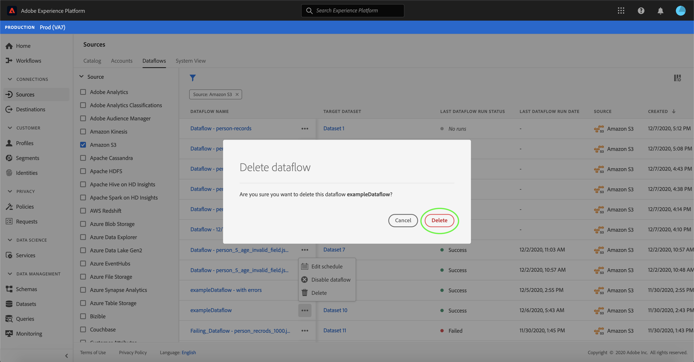

# Eliminare i flussi di dati nell’interfaccia utente

L’ [!UICONTROL Sources] area di lavoro consente di eliminare i flussi di dati in batch e in streaming esistenti che contengono errori o che sono diventati obsoleti.

Questa esercitazione fornisce i passaggi per eliminare i flussi di dati dall&#39;area di [!UICONTROL Sources] lavoro.

## Introduzione

Questa esercitazione richiede una buona conoscenza dei seguenti componenti di Adobe Experience Platform:

- [Origini](../../home.md): [!DNL Experience Platform] consente l&#39;acquisizione di dati da varie origini, fornendo al contempo la possibilità di strutturare, etichettare e migliorare i dati in arrivo tramite [!DNL Platform] i servizi.
- [Sandbox](../../../sandboxes/home.md): [!DNL Experience Platform] fornisce sandbox virtuali che dividono una singola [!DNL Platform] istanza in ambienti virtuali separati per sviluppare e sviluppare applicazioni per esperienze digitali.

## Eliminare i flussi di dati

Nell’interfaccia utente [del Experience Platform](https://platform.adobe.com), selezionate **[!UICONTROL Sources]** dalla navigazione a sinistra per accedere all’ [!UICONTROL Sources] area di lavoro, quindi selezionate **[!UICONTROL Dataflows]** dall’intestazione superiore.

Viene **[!UICONTROL Dataflows]** visualizzata la pagina. In questa pagina è presente un elenco di flussi di dati visualizzabili, con informazioni sul set di dati di destinazione, l’origine, il nome account e la data di creazione.

Selezionate l’icona del filtro (iconafiltro) in alto a sinistra per avviare il pannello di ordinamento.

Il pannello di ordinamento fornisce un elenco di tutte le origini. È possibile selezionare più origini dall&#39;elenco per accedere a una selezione filtrata di flussi di dati associati alle origini specifiche selezionate.

Selezionate l&#39;origine con cui desiderate lavorare per visualizzare un elenco dei relativi flussi di dati esistenti. Una volta identificato il flusso di dati da eliminare, selezionate le ellissi (`...`) accanto al nome del flusso di dati.

Viene visualizzato un menu a discesa che fornisce opzioni per modificare la pianificazione del flusso di dati, disattivare il flusso di dati o eliminarlo completamente.

Selezionare **[!UICONTROL Delete]** per eliminare il flusso di dati.

Viene visualizzata una finestra di dialogo di conferma finale. Selezionare **[!UICONTROL Delete]** per completare il processo.

Dopo alcuni istanti, nella parte inferiore dello schermo viene visualizzata una casella di conferma per confermare l’avvenuta eliminazione.

## Passaggi successivi

Seguendo questa esercitazione, l&#39;area di lavoro [!UICONTROL Sources] è stata utilizzata per eliminare un flusso di dati esistente.

Per informazioni su come eseguire queste operazioni a livello di programmazione tramite le chiamate API, vedere l&#39;esercitazione sull&#39; [eliminazione dei flussi di dati tramite l&#39;API](../../tutorials/api/delete-dataflows.md) del servizio di flusso.