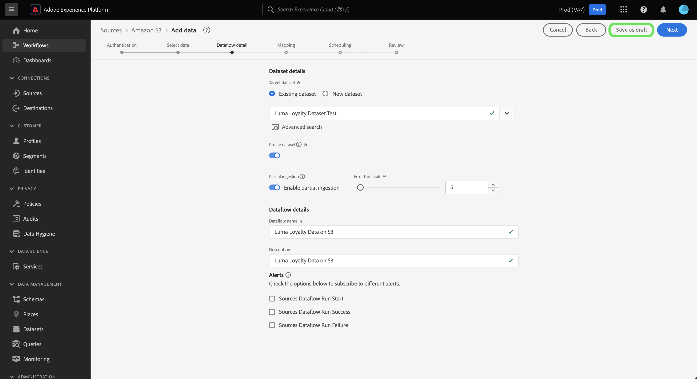

# Flussi di dati bozza nell’interfaccia utente

Per salvare l’avanzamento del flusso di lavoro di acquisizione dei dati non completati, imposta il flusso di dati su uno stato di bozza. Puoi riprendere e completare i flussi di dati bozza in un secondo momento.

Questo documento descrive come salvare i flussi di dati quando si utilizza l’area di lavoro origini nell’interfaccia utente di Adobe Experience Platform.

## Introduzione

Questo documento richiede una buona conoscenza dei seguenti componenti di Adobe Experience Platform:

* [Sorgenti](../../home.md): un Experience Platform consente di acquisire dati da varie origini, consentendoti allo stesso tempo di strutturare, etichettare e migliorare i dati in arrivo tramite i servizi di Platform.

## Salvare un flusso di dati come bozza

Puoi mettere in pausa l’avanzamento della creazione del flusso di dati in qualsiasi momento dopo aver selezionato i dati da portare in Platform.

Ad esempio, per salvare l’avanzamento durante il passaggio dei dettagli del flusso di dati, seleziona **[!UICONTROL Salva come bozza]**.

Una volta salvata la bozza, verrai indirizzato alla pagina dell’account, dove puoi visualizzare un elenco dei flussi di dati esistenti, incluse le bozze.

>[!TIP]
>
>I flussi di dati bozza non saranno abilitati e il loro stato sarà impostato su `draft`.

Per continuare sulla bozza, selezionate i puntini di sospensione (`...`) accanto al nome del flusso di dati, quindi seleziona **[!UICONTROL Aggiorna flusso di dati]**.

>[!NOTE]
>
>Se la bozza include informazioni sulla programmazione, la finestra a discesa fornisce anche l&#39;opzione **[!UICONTROL Modifica pianificazione]**.

### Accedere alle bozze dal catalogo di origine

Puoi accedere ai flussi di dati bozza anche tramite il catalogo dei flussi di dati. Seleziona **[!UICONTROL Flussi dati]** dall’intestazione in alto per accedere al catalogo dei flussi di dati. Da qui, individua la bozza dall’elenco dei flussi di dati esistenti nell’organizzazione, seleziona i puntini di sospensione (`...`) accanto al nome, quindi selezionare **[!UICONTROL Aggiorna flusso di dati]**.

## Pubblicare il flusso di dati della bozza

Viene visualizzata di nuovo la [!UICONTROL Aggiungi dati] passaggio del flusso di lavoro sorgenti, in cui puoi riconfermare il formato dei dati e continuare a progredire nel flusso di dati.

Una volta confermati la formattazione, il delimitatore e il tipo di compressione dei dati, seleziona **[!UICONTROL Successivo]** per procedere.

Quindi, conferma i dettagli del flusso di dati. Utilizza l’interfaccia dei dettagli del flusso di dati per aggiornare le configurazioni relative a nome, descrizione, acquisizione parziale, impostazioni di diagnostica degli errori e preferenze degli avvisi del flusso di dati.

Una volta completate le configurazioni, seleziona **[!UICONTROL Successivo]** per procedere.

Il [!UICONTROL Mappatura] viene visualizzato il passaggio. Durante questo passaggio, puoi riconfigurare le configurazioni di mappatura del flusso di dati. Per una guida completa sulle funzioni di preparazione dei dati utilizzate per la mappatura, visita [guida all’interfaccia utente per la preparazione dei dati](../../../data-prep/ui/mapping.md).

Dopo aver completato la riconfigurazione della mappatura, seleziona **[!UICONTROL Successivo]** per procedere.

Utilizza il [!UICONTROL Pianificazione] per stabilire una pianificazione di acquisizione per il flusso di dati. Puoi impostare la frequenza di acquisizione su `once`, `minute`, `hour`, `day`, o `week`. Al termine, seleziona **[!UICONTROL Successivo]** per procedere.

Infine, rivedi i dettagli del flusso di dati e seleziona **[!UICONTROL Fine]** per pubblicare la bozza.

Dopo il salvataggio e la pubblicazione di una bozza, il flusso di dati verrà attivato e non sarà più possibile ripristinarlo come bozza.

## Passaggi successivi

Seguendo questa esercitazione, hai imparato a salvare l’avanzamento e impostare un flusso di dati come bozza. Per ulteriori informazioni sulle origini, visitare il [panoramica sulle origini](../../home.md).