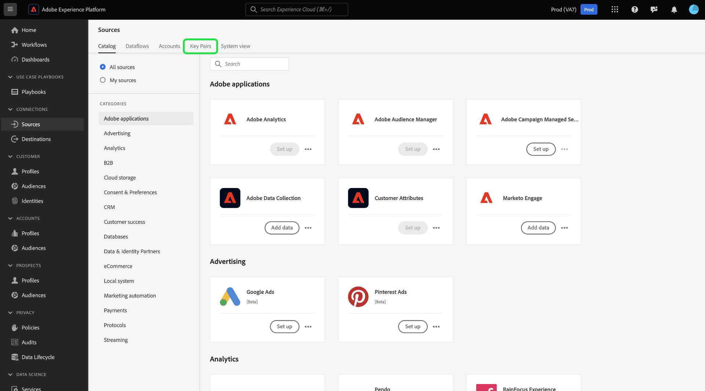

# Acquisire dati crittografati nell’interfaccia utente delle origini

>[!AVAILABILITY]
>
>Il supporto per l’acquisizione di dati crittografati nell’interfaccia utente di origine è in versione beta e potrebbe non essere disponibile per la tua organizzazione. La funzione e la documentazione sono soggette a modifiche.

Puoi acquisire cartelle e file di dati crittografati in Adobe Experience Platform utilizzando origini batch di archiviazione cloud. Con l’acquisizione di dati crittografati, puoi sfruttare meccanismi di crittografia asimmetrica per trasferire in modo sicuro i dati batch in Experience Platform. I meccanismi di crittografia asimmetrica supportati sono PGP e GPG.

Leggi questa guida per scoprire come acquisire dati crittografati con origini batch di archiviazione cloud utilizzando l’interfaccia utente.

## Introduzione

Prima di continuare con questa esercitazione, leggi i seguenti documenti per comprendere meglio le funzioni e i concetti di questo Experience Platform.

* [Origini](../../home.md): utilizza le origini in Experience Platform per acquisire dati da un&#39;applicazione Adobe o da un&#39;origine dati di terze parti.
* [Flussi dati](../../../dataflows/home.md): i flussi dati sono rappresentazioni di processi di dati che spostano i dati in Experience Platform. Puoi utilizzare l’area di lavoro origini per creare flussi di dati che acquisiscono dati da una determinata origine a Experience Platform.
* [Sandbox](../../../sandboxes/home.md): utilizza le sandbox in Experience Platform per creare partizioni virtuali tra le istanze Experience Platform e creare ambienti dedicati allo sviluppo o alla produzione.

### Profilo di alto livello

* Crea una coppia di chiavi di crittografia utilizzando l’area di lavoro origini nell’interfaccia utente di Experience Platform.
   * Facoltativamente, puoi anche creare una coppia di chiavi di verifica dei segni personalizzata per fornire un ulteriore livello di sicurezza ai dati crittografati.
* Utilizza la chiave pubblica della coppia di chiavi di crittografia per crittografare i dati.
* Inserisci i dati crittografati nell’archiviazione cloud. Durante questo passaggio, devi anche assicurarti di disporre di un file di esempio dei tuoi dati nell’archiviazione cloud che possa essere utilizzato come riferimento per mappare i dati di origine su uno schema Experience Data Model (XDM).
* Utilizza l’origine del batch di archiviazione cloud e avvia il processo di acquisizione dei dati nell’area di lavoro origini nell’interfaccia utente di Experience Platform.
* Durante il processo di creazione della connessione di origine, fornisci l’ID della chiave che corrisponde alla chiave pubblica utilizzata per crittografare i dati.
   * Se hai utilizzato anche il meccanismo di coppia di chiavi per la verifica dei segni, devi fornire anche l’ID della chiave per la verifica dei segni che corrisponde ai dati crittografati.
* Procedi ai passaggi di creazione del flusso di dati.

## Creare una coppia di chiavi di crittografia {#create-an-encryption-key-pair}

>[!CONTEXTUALHELP]
>id="platform_sources_encrypted_encryptionKeyId"
>title="ID chiave di crittografia"
>abstract="Specificare l&#39;ID della chiave di crittografia corrispondente alla chiave di crittografia utilizzata per crittografare i dati di origine."

>[!BEGINSHADEBOX]

**Che cos&#39;è una coppia di chiavi di crittografia?**

Una coppia di chiavi di crittografia è un meccanismo di crittografia asimmetrico costituito da una chiave pubblica e da una chiave privata. La chiave pubblica viene utilizzata per crittografare i dati e la chiave privata per decrittografarli.

Puoi creare la coppia di chiavi di crittografia tramite l’interfaccia utente di Experience Platform. Una volta generata, riceverai una chiave pubblica e un ID di chiave corrispondente. Utilizza la chiave pubblica per crittografare i dati e quindi utilizza l’ID della chiave per confermare la tua identità quando stai acquisendo i dati crittografati. La chiave privata viene automaticamente trasferita in Experience Platform, dove viene archiviata in un archivio protetto e verrà utilizzata solo quando i dati sono pronti per la decrittografia.

>[!ENDSHADEBOX]

Nell&#39;interfaccia utente di Platform, passa all&#39;area di lavoro origini e seleziona [!UICONTROL Coppie di chiavi] dall&#39;intestazione superiore.

Viene visualizzata una pagina in cui sono elencate le coppie di chiavi di crittografia esistenti nell&#39;organizzazione. Questa pagina fornisce informazioni su titolo, ID, tipo, algoritmo di crittografia, scadenza e stato di una determinata chiave. Per creare una nuova coppia di chiavi, selezionare **[!UICONTROL Crea chiave]**.

Scegliere quindi il tipo di chiave che si desidera impostare. Per creare una chiave di crittografia, selezionare **[!UICONTROL Chiave di crittografia]**, quindi selezionare **[!UICONTROL Continua]**.

Fornisci un titolo e una passphrase per la chiave di crittografia. La passphrase rappresenta un ulteriore livello di protezione per le chiavi di crittografia. Al momento della creazione, Experience Platform memorizza la passphrase in un archivio protetto diverso dalla chiave pubblica. Specificare una stringa non vuota come passphrase. Al termine, selezionare **[!UICONTROL Crea]**.

In caso di esito positivo, viene visualizzata una nuova finestra in cui viene visualizzata la nuova chiave di crittografia, con titolo, chiave pubblica e ID della chiave. Utilizza il valore della chiave pubblica per crittografare i dati. In un passaggio successivo, utilizzerai l’ID chiave per dimostrare la tua identità al momento dell’acquisizione dei dati crittografati durante il processo di creazione del flusso di dati.

Per visualizzare le informazioni su una chiave di crittografia esistente, selezionare i puntini di sospensione (`...`) accanto al titolo della chiave. Seleziona **[!UICONTROL Dettagli chiave]** per visualizzare la chiave pubblica e l&#39;ID chiave. In alternativa, per eliminare la chiave di crittografia, selezionare **[!UICONTROL Elimina]**.

### Creare una chiave di verifica della firma {#create-a-sign-verification-key}

>[!CONTEXTUALHELP]
>id="platform_sources_encrypted_signVerificationKeyId"
>title="ID chiave di verifica firma"
>abstract="Fornisci l’ID della chiave di verifica della firma che corrisponde ai dati di origine crittografati e firmati."

>[!BEGINSHADEBOX]

**Che cos&#39;è una chiave di verifica della firma?**

Una chiave di verifica del segno è un altro meccanismo di crittografia che coinvolge una chiave privata e una chiave pubblica. In questo caso, puoi creare la coppia di chiavi di verifica della firma e utilizzare la chiave privata per firmare e fornire un ulteriore livello di crittografia ai dati. A questo punto condividerai con Experience Platform la chiave pubblica corrispondente. Durante l’acquisizione, Experience Platform utilizzerà la chiave pubblica per verificare la firma associata alla chiave privata.

>[!ENDSHADEBOX]

Per creare una chiave di verifica della firma, selezionare **[!UICONTROL Firma chiave di verifica]** nella finestra di selezione del tipo di chiave, quindi selezionare **[!UICONTROL Continua]**.

Quindi, fornisci un titolo e una chiave PGP con codifica [!DNL Base64] come chiave pubblica, quindi seleziona **[!UICONTROL Crea]**.

In caso di esito positivo, viene visualizzata una nuova finestra in cui viene visualizzata la nuova chiave di verifica del segno, inclusi il titolo e l&#39;ID della chiave.

## Acquisire dati crittografati {#ingest-encrypted-data}

>[!CONTEXTUALHELP]
>id="platform_sources_encrypted_isFileEncrypted"
>title="Il file è crittografato?"
>abstract="Seleziona questo pulsante di attivazione/disattivazione se acquisisci un file già crittografato."

>[!CONTEXTUALHELP]
>id="platform_sources_encrypted_sampleFile"
>title="Selezionare file di esempio"
>abstract="Per creare una mappatura, è necessario acquisire un file di esempio durante l’acquisizione di dati crittografati."

Puoi acquisire dati crittografati utilizzando le seguenti origini batch di archiviazione cloud:

* [[!DNL Amazon S3]](../ui/create/cloud-storage/s3.md)
* [[!DNL Azure Blob]](../ui/create/cloud-storage/blob.md)
* [[!DNL Azure Data Lake Storage Gen2]](../ui/create/cloud-storage/adls-gen2.md)
* [[!DNL Azure File Storage]](../ui/create/cloud-storage/azure-file-storage.md)
* [[!DNL Data Landing Zone]](../ui/create/cloud-storage/data-landing-zone.md)
* [[!DNL FTP]](../ui/create/cloud-storage/ftp.md)
* [[!DNL Google Cloud Storage]](../ui/create/cloud-storage/google-cloud-storage.md)
* [[!DNL HDFS]](../ui/create/cloud-storage/hdfs.md)
* [[!DNL Oracle Object Storage]](../ui/create/cloud-storage/oracle-object-storage.md)
* [[!DNL SFTP]](../ui/create/cloud-storage/sftp.md)

Autenticazione con l’origine dell’archiviazione cloud desiderata. Durante il passaggio di selezione dei dati del flusso di lavoro, seleziona il file o la cartella crittografati che desideri acquisire e quindi abilita l&#39;interruttore **[!UICONTROL Il file è crittografato]**.

Quindi, seleziona un file di esempio dai dati di origine. Poiché i dati sono crittografati, Experience Platform richiederà un file di esempio per creare uno schema XDM da mappare ai dati di origine.

Dopo aver selezionato il file di esempio, configura le impostazioni dei dati, ad esempio il formato di dati, il delimitatore e il tipo di compressione corrispondenti. Attendere alcuni minuti per il rendering completo dell&#39;interfaccia di anteprima, quindi selezionare **[!UICONTROL Salva]**.

Da qui, utilizza il menu a discesa per selezionare il titolo della chiave pubblica dell’ID della chiave pubblica che corrisponde alla chiave pubblica utilizzata per crittografare i dati.

Se hai utilizzato anche la coppia di chiavi di verifica della firma per fornire un ulteriore livello di crittografia, quindi abilita l’interruttore della chiave di verifica della firma e in modo simile, utilizza il menu a discesa per selezionare l’ID della chiave di verifica della firma che corrisponde alla chiave utilizzata per crittografare i dati.

Al termine, seleziona **[!UICONTROL Avanti]**.

Completa i passaggi rimanenti nel flusso di lavoro sorgenti per completare la creazione del flusso di dati.

* [Fornisci i dettagli del flusso di dati e del set di dati](../ui/dataflow/batch/cloud-storage.md#provide-dataflow-details)
* [Mappare i dati di origine su uno schema XDM](../ui/dataflow/batch/cloud-storage.md#map-data-fields-to-an-xdm-schema)
* [Configurare una pianificazione di acquisizione per il flusso di dati](../ui/dataflow/batch/cloud-storage.md#schedule-ingestion-runs)
* [Verifica il flusso di dati](../ui/dataflow/batch/cloud-storage.md#review-your-dataflow)

Puoi continuare a [apportare aggiornamenti al flusso di dati](../ui/update-dataflows.md) una volta creato correttamente.

## Passaggi successivi

Una volta letto questo documento, puoi acquisire i dati crittografati dall’origine del batch di archiviazione cloud ad Experience Platform. Per informazioni su come acquisire dati crittografati utilizzando le API, leggere la guida in [acquisizione di dati crittografati tramite l&#39;API [!DNL Flow Service] API](../api/encrypt-data.md). Per informazioni generali sulle origini in Experience Platform, leggere la [panoramica sulle origini](../../home.md).
