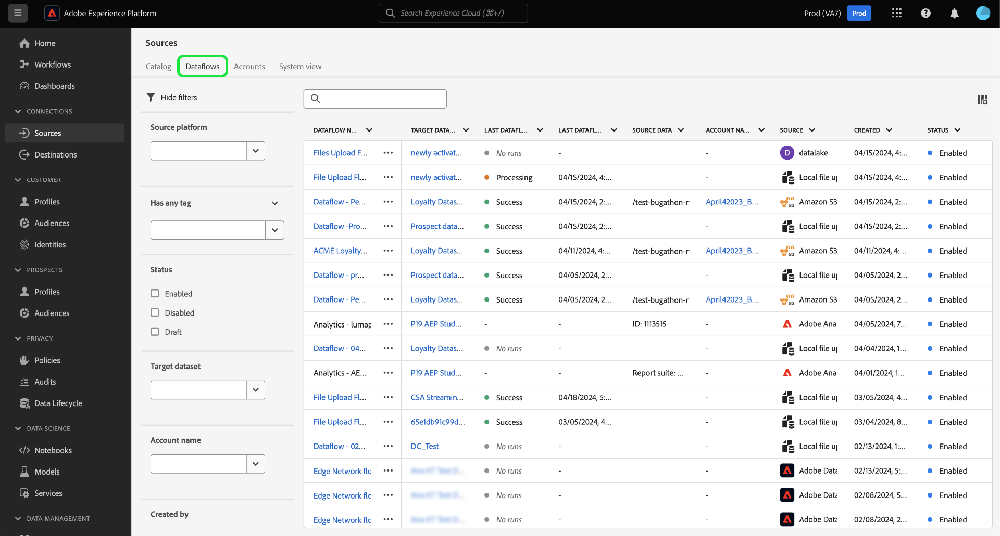
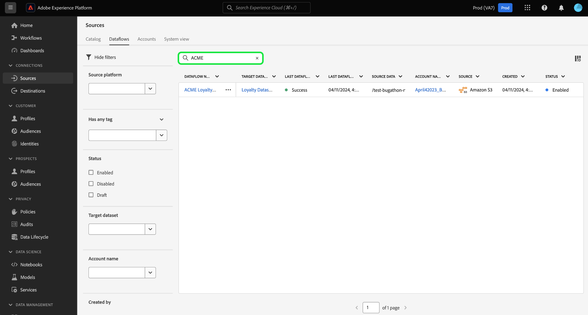

# Filtrare gli oggetti sorgente nell’interfaccia utente

Utilizza gli strumenti di filtro, ricerca e azione in linea nell’interfaccia utente di Adobe Experience Platform per semplificare il flusso di lavoro nel [!UICONTROL Sorgenti] workspace

* Utilizza le funzionalità di filtro e ricerca per navigare tra gli account e i flussi di dati di origine all’interno dell’organizzazione.
* Utilizza le azioni in linea per modificare le impostazioni di configurazione applicate ai flussi di dati e migliorare i flussi di lavoro organizzativi. Puoi utilizzare le azioni in linea per applicare tag, impostare avvisi o creare processi di acquisizione su richiesta.

## Introduzione

Prima di utilizzare gli strumenti di navigazione degli oggetti nell&#39;area di lavoro origini, è utile conoscere le seguenti funzioni e concetti di Experience Platform:

* [Sorgenti](../../home.md): utilizza le origini in Experienci Platform per acquisire i dati da un’applicazione Adobe o da un’origine dati di terze parti.
* [Tag amministrativi](../../../administrative-tags/overview.md): utilizza i tag amministrativi per applicare parole chiave di metadati agli oggetti e abilitare la ricerca per trovare tale oggetto all’interno dell’ecosistema Experienci Platform.
* [Avvisi](../../../observability/home.md): utilizza gli avvisi per ricevere notifiche che forniscono un aggiornamento sullo stato di oggetti come i flussi di dati di origine.
* [Flussi dati](../../../dataflows/home.md): i flussi di dati sono rappresentazioni dei processi di dati che spostano i dati in Experienci Platform. Puoi utilizzare l’area di lavoro origini per creare flussi di dati che acquisiscono dati da una determinata origine a Experienci Platform.
* [Set di dati](../../../catalog/datasets/user-guide.md): un set di dati è un costrutto di archiviazione e gestione per una raccolta di dati, in genere una tabella, che contiene uno schema (colonne) e dei campi (righe).
* [Sandbox](../../../sandboxes/home.md): utilizza le sandbox in Experienci Platform per creare partizioni virtuali tra le istanze Experienci Platform e creare ambienti dedicati allo sviluppo o alla produzione.

## Filtrare i flussi di dati di origine {#filter-sources-dataflows}

Nell’interfaccia utente di Experienci Platform, seleziona **[!UICONTROL Sorgenti]** nel menu di navigazione a sinistra, quindi seleziona **[!UICONTROL Flussi dati]** dall’intestazione in alto.

Per impostazione predefinita, il menu dei filtri viene visualizzato a sinistra dell’interfaccia. Per nascondere il menu, seleziona **[!UICONTROL Nascondi filtri]**.

Puoi filtrare i flussi di dati di origine in base ai seguenti parametri:

| Filtro | Descrizione |
| --- | --- |
| [Piattaforma sorgente](#filter-dataflows-by-source-platform) | Filtra i flussi di dati in base all’origine con cui sono stati creati. |
| [Tag](#filter-dataflows-by-tags) | Filtra i flussi di dati in base ai tag applicati. |
| [Stato](#filter-dataflows-by-status) | Filtra i flussi di dati in base al loro stato corrente. |
| [Set di dati di destinazione](#filter-dataflows-by-target-dataset) | Filtra i flussi di dati in base al set di dati di destinazione con cui sono stati creati. |
| [Nome account](#filter-dataflows-by-account-name) | Filtra i flussi di dati in base al nome dell’account a cui corrispondono. |
| [Creato da](#filter-dataflows-by-user) | Filtra i flussi di dati in base a chi li ha creati. |
| [Data di creazione](#filter-dataflows-by-creation-date) | Filtra i flussi di dati in base alla data di creazione. |
| [Data di modifica](#filter-dataflows-by-modification-date) | Filtra i flussi di dati in base alla data dell’ultimo aggiornamento. |

### Filtrare i flussi di dati per piattaforma sorgente {#filter-dataflows-by-source-platform}

Utilizza il [!UICONTROL Piattaforma sorgente] per filtrare i flussi di dati in base al tipo di origine. È possibile digitare una determinata origine o utilizzare il menu a discesa per visualizzare un elenco di origini nel catalogo. Puoi anche filtrare per diverse origini per una determinata query. Ad esempio, puoi selezionare [!DNL Amazon S3], [!DNL Azure Data Lake Storage Gen2], e [!DNL Google Cloud Storage] per aggiornare il catalogo e visualizzare solo i flussi di dati creati con le origini selezionate.

### Filtrare i flussi di dati per tag {#filter-dataflows-by-tags}

Utilizza il pannello tag per filtrare i flussi di dati in base ai rispettivi tag.

Seleziona **[!UICONTROL Ha qualsiasi tag]** quindi seleziona i tag da filtrare utilizzando il menu a discesa. Utilizza questa impostazione per filtrare i flussi di dati che presentano i tag selezionati.

Seleziona **[!UICONTROL Ha tutti i tag]** quindi seleziona i tag da filtrare utilizzando il menu a discesa. Utilizza questa impostazione per filtrare i flussi di dati che presentano tutti i tag selezionati.

### Filtrare i flussi di dati per stato {#filter-dataflows-by-status}

Puoi filtrare per stato utilizzando [!UICONTROL Stato] pannello.

| Stato | Descrizione |
| --- | --- |
| Abilitata | Seleziona **[!UICONTROL Abilitato]** per filtrare la visualizzazione e visualizzare solo i flussi di dati attivi. |
| Disabilitata | Seleziona **[!UICONTROL Disabilitato]** per filtrare la visualizzazione e visualizzare solo i flussi di dati disattivati. |
| Bozza | Seleziona **[!UICONTROL Bozza]** per filtrare la vista e visualizzare solo i flussi di dati in modalità bozza. |

### Filtrare i flussi di dati per set di dati di destinazione {#filter-dataflows-by-target-dataset}

Seleziona **[!UICONTROL Set di dati di destinazione]** per accedere a un menu a discesa di tutti i set di dati di destinazione. Quindi, seleziona un set di dati di destinazione per filtrare la vista e visualizzare solo i flussi di dati creati utilizzando i set di dati di destinazione specificati.

### Filtrare i flussi di dati per nome account {#filter-dataflows-by-account-name}

Seleziona **[!UICONTROL Nome account]** per accedere a un menu a discesa di tutti gli account. Quindi, seleziona un account per filtrare la visualizzazione e visualizzare i flussi di dati creati dall’account selezionato.

### Filtrare i flussi di dati per utente {#filter-dataflows-by-user}

Utilizza il [!UICONTROL Creato da] per filtrare i flussi di dati in base all’utente che li ha creati o aggiornati per ultimo. Seleziona il menu a discesa, quindi seleziona il nome utente in base al quale filtrare i flussi di dati.

### Filtrare i flussi di dati per data di creazione {#filter-dataflows-by-creation-date}

Puoi filtrare i flussi di dati in base alle date di creazione. In [!UICONTROL Data di creazione] configurare una data di inizio e una data di fine per creare una finestra dell&#39;intervallo di tempo e filtrare la visualizzazione in modo da visualizzare solo i flussi di dati creati all&#39;interno di tale finestra.

Puoi configurare l’intervallo di tempo immettendo la data di inizio e di fine. In alternativa, seleziona l’icona del calendario e utilizza il calendario per configurare le date.

Puoi anche seguire gli stessi passaggi, ma filtrare i flussi di dati in base alla data dell’ultima modifica, anziché in base alla data di creazione.

### Filtrare i flussi di dati per data di modifica {#filter-dataflows-by-modification-date}

Allo stesso modo, puoi applicare gli stessi principi e filtrare il flusso di dati in base alle rispettive date di modifica. Utilizza il **[!UICONTROL Data di modifica]** per configurare un particolare intervallo di tempo e filtrare la vista in modo da visualizzare solo i flussi di dati che sono stati modificati durante tale periodo.

### Combinare filtri {#combine-filters}

Puoi combinare diversi filtri per ampliare o restringere la ricerca. Nell’esempio seguente, viene applicato un filtro per cercare:

* Flussi di dati creati utilizzando [!DNL Amazon S3] sorgente.
* Flussi di dati che contengono **[!DNL ACME]** tag.
* Flussi di dati attualmente abilitati.
* Flussi di dati creati utilizzando [!DNL Loyalty Dataset B2C] set di dati.
* Flussi di dati creati tra il 4/1/2024 e il 4/19/2024.

Per rimuovere tutti i filtri, seleziona **[!UICONTROL Cancella tutto]**.

## Filtra account di origine {#filter-sources-accounts}

Nell’interfaccia utente di Experienci Platform, seleziona [!UICONTROL Sorgenti] nel menu di navigazione a sinistra, quindi seleziona **[!UICONTROL Account]** dall’intestazione in alto. Puoi filtrare gli account di origine in base all’origine con cui sono stati creati o all’utente che li ha creati.

## Cerca account e flussi di dati {#search-for-accounts-and-dataflows}

Puoi accelerare l’efficienza utilizzando la barra di ricerca per passare immediatamente a un account o a un flusso di dati specifico.

>[!BEGINTABS]

>[!TAB Cerca flussi di dati]

Utilizza la barra di ricerca nel [!UICONTROL Flussi dati] per trovare un flusso di dati specifico. Puoi cercare un flusso di dati utilizzando il suo nome o la sua descrizione.

>[!TAB Cerca account]

Utilizza la barra di ricerca nel [!UICONTROL Account] per trovare un account specifico. Puoi cercare un account utilizzando il suo nome o la sua descrizione.

>[!ENDTABS]

## Azioni in linea per i flussi di dati di origine {#inline-actions-for-sources-dataflows}

Seleziona i puntini di sospensione (`...`) accanto al nome di un flusso di dati per un elenco di azioni in linea che puoi utilizzare per apportare modifiche al flusso di dati.

| Azioni in linea | Descrizione |
| --- | --- |
| [!UICONTROL Modifica pianificazione] | Seleziona **[!UICONTROL Modifica pianificazione]** per aggiornare la pianificazione dell’acquisizione del flusso di dati. Non è possibile modificare un flusso di dati impostato sull’acquisizione una tantum. |
| [!UICONTROL Disattiva flusso di dati] | Seleziona **[!UICONTROL Disattiva flusso di dati]** per disattivare un’esecuzione del flusso di dati. Questa opzione non elimina il flusso di dati. |
| [!UICONTROL Visualizza nel monitoraggio] | Seleziona **[!UICONTROL Visualizza nel monitoraggio]** per visualizzare le metriche e lo stato del flusso di dati nel dashboard di monitoraggio. Per ulteriori informazioni, consulta la guida su [monitoraggio dei flussi di dati di origine](../../../dataflows/ui/monitor-sources.md). |
| [!UICONTROL Elimina] | Seleziona **[!UICONTROL Elimina]** per eliminare il flusso di dati. |
| [!UICONTROL Esegui su richiesta] | Seleziona **[!UICONTROL Esegui su richiesta]** per attivare una singola iterazione di un’esecuzione del flusso di dati. Per ulteriori informazioni, consulta la guida su [creazione di un’esecuzione del flusso di dati su richiesta](../ui/on-demand-ingestion.md). |
| [!UICONTROL Iscriviti agli avvisi] | Seleziona **[!UICONTROL Iscriviti agli avvisi]** per visualizzare una finestra popup di avvisi a cui è possibile iscriversi: <ul><li>Inizio esecuzione flusso di dati origini: selezionare questo avviso per ricevere una notifica all&#39;inizio dell&#39;esecuzione del flusso di dati su richiesta.</li><li>Esecuzione del flusso di dati di origine completata: seleziona questo avviso per ricevere una notifica al termine dell’esecuzione del flusso di dati su richiesta.</li><li>Errore esecuzione flusso di dati origini: selezionare questo avviso quando l&#39;esecuzione del flusso di dati su richiesta non riesce a causa di errori.</li></ul> Per ulteriori informazioni, consulta la guida su [abbonamento ad avvisi per flussi di dati di origini](../ui/alerts.md). |
| [!UICONTROL Aggiungi al pacchetto] | Seleziona **[!UICONTROL Aggiungi al pacchetto]** per aggiungere il flusso di dati a un pacchetto ed esportarlo per l’utilizzo in una sandbox diversa. Durante questo passaggio, puoi creare un nuovo pacchetto o aggiungere il flusso di dati a un pacchetto esistente. Per informazioni, consulta la guida su [strumenti sandbox](../../../sandboxes/ui/sandbox-tooling.md). |
| [!UICONTROL Gestione tag] | Seleziona **[!UICONTROL Gestione tag]** per aggiungere o rimuovere tag dal flusso di dati. Utilizzare i tag per gestire le tassonomie dei metadati e classificare gli oggetti business per semplificare l&#39;individuazione e la classificazione. Per ulteriori informazioni, consulta la guida su [gestione dei tag](../../../administrative-tags/ui/managing-tags.md). |

## Passaggi successivi

Dopo aver letto questo documento, hai imparato a spostarti tra le pagine dei flussi di dati e degli account di origine. Per ulteriori informazioni sulle origini, leggere [panoramica sulle origini](../../home.md).
