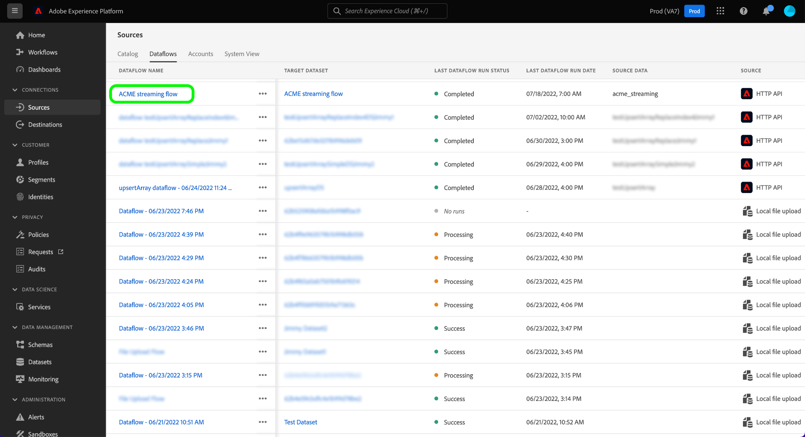

# Monitorare i flussi di dati per le origini di streaming nell’interfaccia utente

Questa esercitazione descrive i passaggi per monitorare i flussi di dati per le origini di streaming tramite [!UICONTROL Sorgenti] Workspace.

## Introduzione

Questo tutorial richiede una buona conoscenza dei seguenti componenti di Adobe Experience Platform:

* [Flussi dati](../../../dataflows/home.md): i flussi di dati sono una rappresentazione dei processi di dati che spostano i dati in Platform. I flussi di dati sono configurati tra servizi diversi, consentendo di spostare i dati dai connettori di origine ai set di dati di destinazione, a [!DNL Identity] e [!DNL Profile], e a [!DNL Destinations].
   * [Il flusso di dati viene eseguito](../../notifications.md): le esecuzioni dei flussi di dati sono i processi pianificati ricorrenti in base alla configurazione della frequenza dei flussi di dati selezionati.
* [Sorgenti](../../home.md): un Experience Platform consente di acquisire dati da varie origini, consentendoti allo stesso tempo di strutturare, etichettare e migliorare i dati in arrivo tramite i servizi di Platform.
* [Sandbox](../../../sandboxes/home.md): Experienci Platform fornisce sandbox virtuali che permettono di suddividere una singola istanza Platform in ambienti virtuali separati, utili per le attività di sviluppo e aggiornamento delle applicazioni di esperienza digitale.

## Monitorare i flussi di dati per le origini di streaming

Nell’interfaccia utente di Platform, seleziona **[!UICONTROL Sorgenti]** dalla barra di navigazione a sinistra per accedere al [!UICONTROL Sorgenti] Workspace. Il [!UICONTROL Catalogo] Nella schermata vengono visualizzate diverse origini per le quali è possibile creare un account con.

Per visualizzare i flussi di dati esistenti per le origini di streaming, seleziona **[!UICONTROL Flussi dati]** dall’intestazione in alto.

Il [!UICONTROL Flussi dati] Questa pagina contiene un elenco di tutti i flussi di dati esistenti nell’organizzazione, incluse informazioni sui dati di origine, il nome account e lo stato di esecuzione del flusso di dati.

Seleziona il nome del flusso di dati che desideri visualizzare.

La tabella seguente contiene ulteriori informazioni sugli stati di esecuzione del flusso di dati:

| Stato | Descrizione |
| ------ | ----------- |
| Completato | Il `Completed` lo stato indica che tutti i record per l’esecuzione del flusso di dati corrispondente sono stati elaborati entro il periodo di un’ora. A `Completed` Lo stato può comunque contenere errori nelle esecuzioni del flusso di dati. |
| Success (Operazione riuscita) | Il `Success` lo stato indica che tutti i record per l’esecuzione del flusso di dati corrispondente sono stati elaborati entro il periodo di un’ora e che non sono stati rilevati errori durante l’esecuzione del flusso di dati. |
| Elaborazione | Il `Processing` Lo stato indica che un flusso di dati non è ancora attivo. Questo stato si verifica spesso subito dopo la creazione di un nuovo flusso di dati. |
| Errore | Il `Error` lo stato indica che il processo di attivazione di un flusso di dati è stato interrotto. |
| Nessuna esecuzione | Il `No runs` Lo stato indica che il flusso di dati è stato creato ma non è stata avviata alcuna esecuzione del flusso di dati. |

Il [!UICONTROL Attività flusso di dati] mostra informazioni specifiche sul flusso di dati in streaming. Il banner superiore contiene il numero cumulativo di record acquisiti e di record non riusciti per tutti i flussi di dati in streaming eseguiti nell’intervallo di date selezionato.

Per impostazione predefinita, i dati visualizzati contengono i tassi di acquisizione degli ultimi sette giorni. Seleziona **[!UICONTROL Ultimi 7 giorni]** per regolare l&#39;intervallo di tempo dei record visualizzati.

Viene visualizzata una finestra a comparsa del calendario che fornisce opzioni per intervalli di tempo di acquisizione alternativi. Puoi configurare l’intervallo di tempo di esecuzione del flusso di dati per visualizzare le esecuzioni del flusso dei sette giorni precedenti o degli ultimi 30 giorni. In alternativa, puoi configurare il calendario interattivo per impostare un intervallo di tempo personalizzato. Al termine, seleziona **[!UICONTROL Applica]**.

Nella metà inferiore della pagina vengono visualizzate informazioni sul numero di record ricevuti, acquisiti e non riusciti per esecuzione del flusso. Ogni esecuzione di flusso viene registrata in una finestra oraria.

### Metriche di esecuzione del flusso di dati {#dataflow-run-metrics}

>[!CONTEXTUALHELP]
>id="platform_sources_dataflow_records_received"
>title="Record ricevuti"
>abstract="La metrica Record ricevuti indica il conteggio totale dei record ricevuti nel flusso di dati."
>text="Learn more in documentation"

>[!CONTEXTUALHELP]
>id="platform_sources_dataflow_records_ingested"
>title="Record acquisiti"
>abstract="La metrica Record acquisiti indica il numero totale di record acquisiti nel Data Lake."
>text="Learn more in documentation"

>[!CONTEXTUALHELP]
>id="platform_sources_dataflow_records_failed"
>title="Record con errori"
>abstract="La metrica Record con errori indica il conteggio totale dei record che non sono stati acquisiti nel Data Lake a causa di errori nei dati."
>text="Learn more in documentation"

>[!CONTEXTUALHELP]
>id="platform_sources_dataflow_records_warnings"
>title="Record con avvertenze"
>abstract="La metrica Record con avvertenze indica il numero totale di record acquisiti che presentano avvertenze relative alla trasformazione della mappatura. Tutti gli errori di trasformazione della mappatura sono segnalati come avvertenze; le righe acquisite parzialmente sono considerate corrette con un’avvertenza."
>text="Learn more in documentation"

Ogni singola esecuzione del flusso di dati mostra i seguenti dettagli:

* **[!UICONTROL Avvio esecuzione flusso di dati]**: ora di inizio dell’esecuzione del flusso di dati.
* **[!UICONTROL Tempo di elaborazione]**: tempo necessario all’elaborazione del flusso di dati.
* **[!UICONTROL Record ricevuti]**: numero totale di record ricevuti nel flusso di dati da un connettore di origine.
* **[!UICONTROL Record acquisiti]**: numero totale di record acquisiti in [!DNL Data Lake].
* **[!UICONTROL Record con avvisi]**: numero totale di record con avvisi acquisiti. Tutti gli errori di trasformazione dei mapper vengono segnalati come avvisi e le righe parzialmente acquisite vengono etichettate come `success` con un avviso. **Nota**: il supporto per l’acquisizione di record con avvertenze è disponibile solo per le origini di streaming.
* **[!UICONTROL Record non riusciti]**: numero di record non acquisiti in [!DNL Data Lake] a causa di errori nei dati.
* **[!UICONTROL Tasso di acquisizione]**: tasso di successo dei record acquisiti in [!DNL Data Lake]. Questa metrica è applicabile quando [!UICONTROL Acquisizione parziale] è abilitato.
* **[!UICONTROL Stato]**: rappresenta lo stato del flusso di dati: [!UICONTROL Completato] o [!UICONTROL Elaborazione]. [!UICONTROL Completato] significa che tutti i record per l’esecuzione del flusso di dati corrispondente sono stati elaborati entro il periodo di un’ora. [!UICONTROL Elaborazione] significa che l’esecuzione del flusso di dati non è ancora terminata.

Il [!UICONTROL Panoramica sull’esecuzione del flusso di dati] La pagina contiene informazioni aggiuntive sul flusso di dati, ad esempio l’ID di esecuzione del flusso di dati corrispondente, il set di dati di destinazione e l’ID organizzazione.

Un’esecuzione del flusso con errori contiene anche [!UICONTROL Errori di esecuzione del flusso di dati] , che mostra l&#39;errore particolare che ha portato all&#39;esecuzione non riuscita, nonché il numero totale di record che hanno avuto esito negativo.

### Visualizza record con avvisi {#warnings}

[!UICONTROL Record con avvisi] visualizza un elenco di avvisi di trasformazione del mapper che si sono verificati durante l&#39;esecuzione del flusso. Le righe parzialmente acquisite sono considerate riuscite e vengono aggiunte avvertenze se vengono rilevati errori di trasformazione del mapper.

Per impostazione predefinita, tutti gli errori di trasformazione dei mapper vengono considerati come avvisi, ad eccezione dei seguenti:

* Errori di sintassi
* Riferimenti ad attributi inesistenti
* Mancata corrispondenza tra i tipi di dati XDM

Per visualizzare la diagnostica degli errori, seleziona **[!UICONTROL Anteprima diagnostica errori]**.

Il [!UICONTROL Anteprima diagnostica errori] consente di visualizzare in anteprima fino a 100 errori e/o avvisi relativi all’esecuzione del flusso di dati. Da qui, puoi anche scaricare il manifesto dell’errore di acquisizione per ulteriori informazioni, utilizzando [!DNL Data Access] API.

## Passaggi successivi

Seguendo questa esercitazione, hai utilizzato correttamente il [!UICONTROL Sorgenti] Workspace per monitorare i flussi di dati in streaming e identificare gli errori che hanno portato a flussi di dati non riusciti. Per ulteriori informazioni, consulta i seguenti documenti:

* [Panoramica sulle origini](../../home.md)
* [Panoramica dei flussi di dati](../../../dataflows/home.md)
