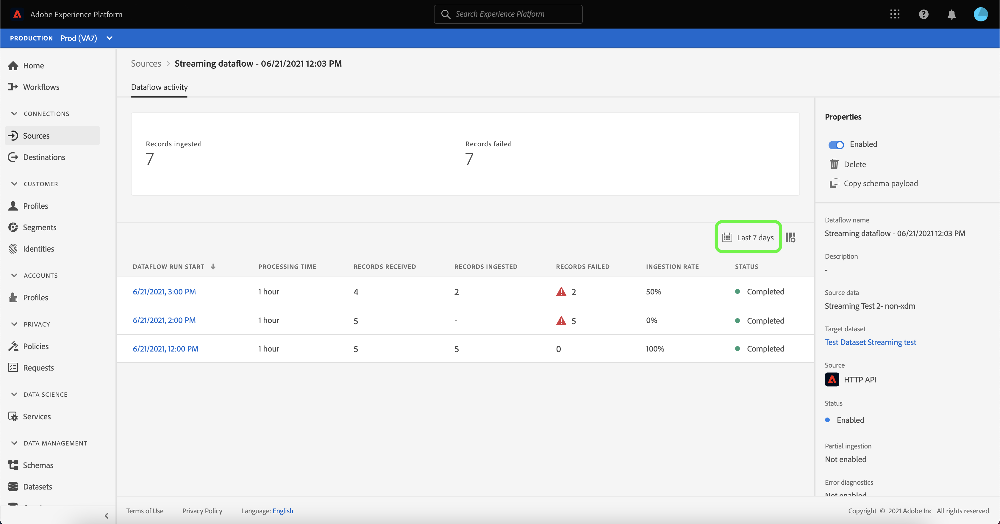

# Monitorare i flussi di dati per le sorgenti di streaming nell’interfaccia utente

Questa esercitazione descrive i passaggi per il monitoraggio dei flussi di dati per le sorgenti di streaming utilizzando l&#39;area di lavoro [!UICONTROL Sorgenti].

## Introduzione

Questa esercitazione richiede una buona comprensione dei seguenti componenti di Adobe Experience Platform:

* [Flussi di dati](../../../dataflows/home.md): I flussi di dati sono una rappresentazione dei processi di trasferimento dei dati in Platform. I flussi di dati sono configurati su diversi servizi e consentono di spostare i dati dai connettori di origine ai set di dati di destinazione, a [!DNL Identity] e [!DNL Profile] e a [!DNL Destinations].
   * [Il flusso di dati viene eseguito](../../notifications.md): Le esecuzioni dei flussi di dati sono i processi pianificati ricorrenti in base alla configurazione della frequenza dei flussi di dati selezionati.
* [Origini](../../home.md): L’Experience Platform consente di acquisire dati da varie sorgenti e allo stesso tempo di strutturare, etichettare e migliorare i dati in arrivo tramite i servizi Platform.
* [Sandbox](../../../sandboxes/home.md): Experience Platform fornisce sandbox virtuali che suddividono una singola istanza di Platform in ambienti virtuali separati per sviluppare e sviluppare applicazioni di esperienza digitale.

## Monitorare i flussi di dati per le sorgenti in streaming

Nell’interfaccia utente di Platform, seleziona **[!UICONTROL Origini]** dalla barra di navigazione a sinistra per accedere all’area di lavoro [!UICONTROL Origini]. La schermata [!UICONTROL Catalogo] visualizza una varietà di sorgenti con cui è possibile creare un account.

Per visualizzare i flussi di dati esistenti per le origini di streaming, seleziona **[!UICONTROL Dataflows]** dall&#39;intestazione superiore.

La pagina [!UICONTROL Dataflows] contiene un elenco di tutti i flussi di dati esistenti nell&#39;organizzazione, incluse informazioni sui relativi dati di origine, nome account e stato di esecuzione del flusso di dati.

Selezionare il nome del flusso di dati che si desidera visualizzare.

La tabella seguente contiene ulteriori informazioni sugli stati di esecuzione del flusso di dati:

| Stato | Descrizione |
| ------ | ----------- |
| Completato | Lo stato `Completed` indica che tutti i record per l&#39;esecuzione del flusso di dati corrispondente sono stati elaborati entro un periodo di un&#39;ora. Lo stato `Completed` può comunque contenere errori nelle esecuzioni del flusso di dati. |
| Elaborazione | Lo stato `Processing` indica che un flusso di dati non è ancora attivo. Questo stato viene spesso rilevato immediatamente dopo la creazione di un nuovo flusso di dati. |
| Errore | Lo stato `Error` indica che il processo di attivazione di un flusso di dati è stato interrotto. |

La pagina [!UICONTROL Attività flusso di dati] visualizza informazioni specifiche sul flusso di dati in streaming. Il banner superiore contiene il numero cumulativo di record acquisiti e di record non riusciti per tutti i flussi di dati in streaming eseguiti nell’intervallo di date selezionato.

La metà inferiore della pagina visualizza informazioni sul numero di record ricevuti, acquisiti e non riusciti, per esecuzione di flusso. Ogni esecuzione di flusso viene registrata in una finestra oraria.

Ogni singola esecuzione di un flusso di dati mostra i seguenti dettagli:

* **[!UICONTROL Inizio]** esecuzione flusso di dati: Data di inizio dell&#39;esecuzione del flusso di dati.
* **[!UICONTROL Tempo]** di elaborazione: Il tempo necessario all’elaborazione del flusso di dati.
* **[!UICONTROL Record ricevuti]**: Numero totale di record ricevuti nel flusso di dati da un connettore di origine.
* **[!UICONTROL Record inseriti]**: Il conteggio totale dei record acquisiti in  [!DNL Data Lake].
* **[!UICONTROL Record non riusciti]**: Il numero di record in cui non sono stati acquisiti  [!DNL Data Lake] a causa di errori nei dati.
* **[!UICONTROL Tasso]** di ingestione: Tasso di successo dei record acquisiti in  [!DNL Data Lake]. Questa metrica è applicabile quando è abilitato [!UICONTROL Acquisizione parziale].
* **[!UICONTROL Stato]**: Rappresenta lo stato in cui si trova il flusso di dati: Completato   o  [!UICONTROL Elaborazione].  Completato significa che tutti i record per l’esecuzione del flusso di dati corrispondente sono stati elaborati nell’arco di un’ora.  L’elaborazione indica che l’esecuzione del flusso di dati non è ancora stata completata.

Per impostazione predefinita, i dati visualizzati contengono i tassi di acquisizione degli ultimi sette giorni. Selezionare **[!UICONTROL Ultimi 7 giorni]** per regolare l&#39;intervallo di tempo dei record visualizzati.

Viene visualizzata una finestra a comparsa del calendario che fornisce le opzioni per l’inserimento di intervalli di tempo alternativi. Selezionare **[!UICONTROL Ultimi 30 giorni]**, quindi selezionare **[!UICONTROL Applica]**.

Per visualizzare i dettagli di un’esecuzione di un flusso di dati specifico, compresi i relativi errori, selezionare l’ora di inizio dell’esecuzione dall’elenco.

La pagina [!UICONTROL Panoramica sull’esecuzione del flusso di dati] contiene informazioni aggiuntive sul flusso di dati, ad esempio l’ID di esecuzione del flusso di dati corrispondente, il set di dati di destinazione e l’ID organizzazione IMS.

Un&#39;esecuzione di flusso con errori contiene anche il pannello [!UICONTROL Errori di esecuzione del flusso di dati], che visualizza il particolare errore che ha causato il fallimento dell&#39;esecuzione, nonché il conteggio totale dei record con errore.

## Passaggi successivi

Seguendo questa esercitazione, hai utilizzato correttamente l&#39;area di lavoro [!UICONTROL Origini] per monitorare i flussi di dati in streaming e identificare gli errori che hanno portato a eventuali flussi di dati non riusciti. Per ulteriori informazioni, consulta i seguenti documenti:

* [Panoramica delle origini](../../home.md)
* [Panoramica dei dataflows](../../../dataflows/home.md)