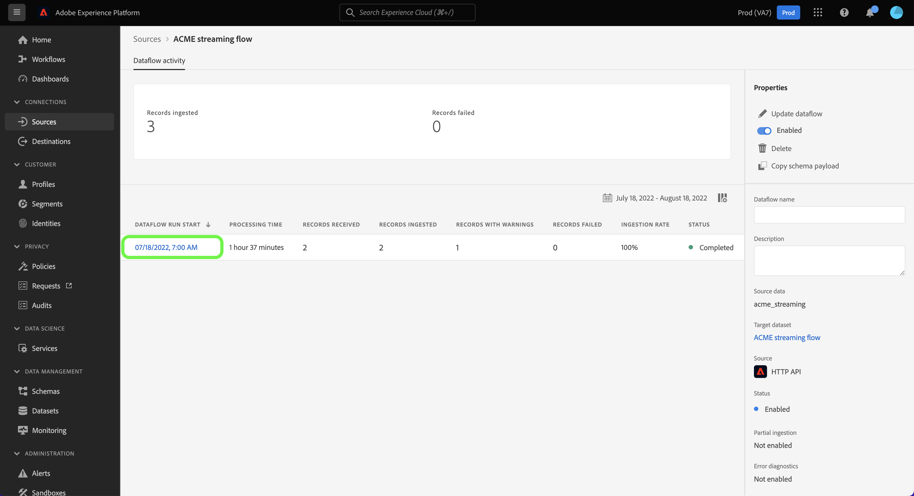

# Monitorare i flussi di dati per le origini di streaming nella interfaccia

In questo esercitazione vengono illustrati i passaggi per monitorare i flussi di dati per le origini di flusso utilizzando l&#39;area [!UICONTROL di lavoro Sorgenti] .

## Introduzione

Questo esercitazione richiede una conoscenza pratica dei seguenti componenti del Adobe Experience Platform:

* [Flussi](../../../dataflows/home.md) di dati: i flussi di dati sono una rappresentazione di processi di dati che spostano i dati tra Experience Platform. I flussi di dati sono configurati tra diversi servizi, aiutando a spostare i dati dai connettori di origine ai set di dati destinazione, a [!DNL Identity] e [!DNL Profile], e a [!DNL Destinations].
   * [Esecuzioni](../../notifications.md) del flusso di dati: le esecuzioni del flusso di dati sono i processi pianificati ricorrenti in base alla configurazione della frequenza dei flussi di dati selezionati.
* [Origini](../../home.md): Experience Platform consente di acquisire dati da varie origini e allo stesso tempo di strutturare, etichettare e migliorare i dati in arrivo tramite i servizi Experience Platform.
* [Sandbox](../../../sandboxes/home.md): Experience Platform fornisce sandbox virtuali che suddividono una singola istanza Experience Platform in ambienti virtuali separati, utili per le attività di sviluppo e aggiornamento delle applicazioni di esperienza digitale.

## Monitorare i flussi di dati per le origini di streaming

Nell&#39;interfaccia utente di Experience Platform, seleziona **[!UICONTROL Origini]** dalla barra di navigazione a sinistra per accedere all&#39;area di lavoro [!UICONTROL Origini]. Nella schermata [!UICONTROL Catalogo] sono visualizzate diverse origini per le quali è possibile creare un account con.

Per visualizzare i flussi di dati esistenti per le origini di streaming, seleziona **[!UICONTROL Flussi di dati]** dall&#39;intestazione superiore.

La [!UICONTROL pagina Flussi] di dati contiene un elenco di tutti i flussi di dati esistenti nell&#39;organizzazione, incluse informazioni sui dati di origine, il nome account e lo stato di esecuzione del flusso di dati.

Selezionare il nome del flusso di dati che si desidera visualizzare.

La tabella seguente contiene ulteriori informazioni sugli stati di esecuzione del flusso di dati:

| Stato | Descrizione |
| ------ | ----------- |
| Completata | Lo `Completed` stato indica che tutti i record per l&#39;esecuzione del flusso di dati corrispondente sono stati elaborati entro il periodo di un&#39;ora. Uno `Completed` stato può ancora contenere errori nelle esecuzioni del flusso di dati. |
| Operazione riuscita | Lo `Success` stato indica che tutti i record per l&#39;esecuzione del flusso di dati corrispondente sono stati elaborati entro il periodo di un&#39;ora e che non si sono verificati errori durante il corso dell&#39;esecuzione del flusso di dati. |
| Elaborazione | Lo `Processing` stato indica che un flusso di dati non è ancora attivo. Questo stato si verifica spesso immediatamente dopo la creazione di un nuovo flusso di dati. |
| Errore | Lo `Error` stato indica che il processo di attivazione di un flusso di dati è stato interrotto. |
| Nessuna esecuzione | Lo stato `No runs` indica che il flusso di dati è stato creato ma non è stata avviata alcuna esecuzione del flusso di dati. |

La pagina [!UICONTROL Attività flusso di dati] visualizza informazioni specifiche sul flusso di dati in streaming. Il banner superiore contiene il numero cumulativo di record acquisiti e di record non riusciti per tutti i flussi di dati in streaming eseguiti nell’intervallo di date selezionato.

Per impostazione predefinita, i dati visualizzati contengono i tassi di acquisizione degli ultimi sette giorni. Seleziona **[!UICONTROL Ultimi 7 giorni]** per regolare l&#39;intervallo di tempo dei record visualizzati.

Viene visualizzata una finestra di finestra a comparsa del calendario che offre opzioni per intervalli di tempo alternativi per l&#39;inserimento. È possibile configurare l&#39;intervallo di runtime del flusso di dati per visualizzare le corse del flusso dei sette giorni precedenti o degli ultimi 30 giorni. In alternativa, configura il calendario interattivo per impostare un intervallo di tempo personalizzato a tua scelta. Al termine, selezionare **[!UICONTROL Applica]**.

Nella metà inferiore della pagina vengono visualizzate informazioni sul numero di record ricevuti, acquisiti e non riusciti per esecuzione del flusso. Ogni flusso eseguito viene registrato all&#39;interno di una finestra oraria.

### Metriche di esecuzione del flusso di dati {#dataflow-run-metrics}

>[!CONTEXTUALHELP]
>id="platform_sources_dataflow_records_received"
>title="Record ricevuti"
>abstract="La metrica Record ricevuti indica il conteggio totale dei record ricevuti nel flusso di dati."
>text="Learn more in documentation"

>[!CONTEXTUALHELP]
>id="platform_sources_dataflow_records_ingested"
>title="Record acquisiti"
>abstract="La metrica Record acquisiti indica il numero totale di record acquisiti nel Data Lake."
>text="Learn more in documentation"

>[!CONTEXTUALHELP]
>id="platform_sources_dataflow_records_failed"
>title="Record con errori"
>abstract="La metrica Record con errori indica il conteggio totale dei record che non sono stati acquisiti nel Data Lake a causa di errori nei dati."
>text="Learn more in documentation"

>[!CONTEXTUALHELP]
>id="platform_sources_dataflow_records_warnings"
>title="Record con avvertenze"
>abstract="La metrica Record con avvertenze indica il numero totale di record acquisiti che presentano avvertenze relative alla trasformazione della mappatura. Tutti gli errori di trasformazione della mappatura sono segnalati come avvertenze; le righe acquisite parzialmente sono considerate corrette con un’avvertenza"
>text="Learn more in documentation"

Ogni singola esecuzione del flusso di dati mostra i seguenti dettagli:

* **[!UICONTROL Avvio]** esecuzione del flusso di dati: l&#39;ora in cui è iniziata l&#39;esecuzione del flusso di dati.
* **[!UICONTROL Tempo di elaborazione]**: la quantità di tempo necessaria per l&#39;elaborazione del flusso di dati.
* **[!UICONTROL Record ricevuti]**: il numero totale di record ricevuti nel flusso di dati da un connettore di origine.
* **[!UICONTROL Record inseriti]**: il conteggio totale dei record inseriti in [!DNL Data Lake].
* **[!UICONTROL Record con avvisi]**: il conteggio totale dei record con avvertenze che sono stati inseriti. Tutti gli errori di trasformazione del mapper vengono segnalati come avvisi e le righe parzialmente inserite vengono etichettate come `success` avvertenze. **Nota**: il supporto per l&#39;acquisizione di record con avvisi è disponibile solo per le origini di streaming.
* **[!UICONTROL Record non riusciti]**: il numero di record che non sono stati inseriti a [!DNL Data Lake] causa di errori nei dati.
* **[!UICONTROL Tasso]** di ingestione: il tasso di successo dei record inseriti in [!DNL Data Lake]. Questa metrica è applicabile quando [!UICONTROL l&#39;inserimento] parziale è abilitato.
* **[!UICONTROL Stato]**: rappresenta lo stato in cui si trova il flusso di dati: [!UICONTROL completato] o [!UICONTROL in elaborazione]. [!UICONTROL Completato] significa che tutti i record per l&#39;esecuzione del flusso di dati corrispondente sono stati elaborati entro il periodo di un&#39;ora. [!UICONTROL Elaborazione] significa che l&#39;esecuzione del flusso di dati non è ancora terminata.

La pagina Panoramica] dell&#39;esecuzione [!UICONTROL del flusso di dati contiene informazioni aggiuntive sul flusso di dati, ad esempio l&#39;ID di esecuzione del flusso di dati corrispondente, destinazione set di dati e l&#39;ID organizzazione.

Un&#39;esecuzione del flusso con errori contiene anche il [!UICONTROL pannello Errori] di esecuzione del flusso di dati, che visualizza l&#39;errore specifico che ha portato all&#39;errore dell&#39;esecuzione, nonché il conteggio totale dei record non riusciti.

### Visualizza record con avvertenze {#warnings}

[!UICONTROL Record con avvisi] visualizza un elenco di avvisi di trasformazione mappatore che si sono verificati durante l&#39;esecuzione del flusso. Le righe parzialmente inserite sono considerate riuscite e vengono aggiunte avvertenze se vengono rilevati errori di trasformazione del mapper.

Per impostazione predefinita, tutti gli errori di trasformazione del mapper vengono considerati come avvisi, tranne se sono i seguenti:

* Errori di sintassi
* Riferimenti ad attributi inesistenti
* Mancata corrispondenza tra i tipi di dati XDM

Per visualizzare la diagnostica degli errori, selezionare **[!UICONTROL Anteprima diagnostica errori]**.

La [!UICONTROL finestra di anteprima] della diagnostica Errore consente di visualizzare in anteprima fino a 100 errori e/o avvisi relativi all&#39;esecuzione del flusso di dati. Da qui, è anche possibile scaricare il manifesto dell&#39;errore di inserimento per ulteriori informazioni, utilizzando l&#39;API [!DNL Data Access] .

## Passaggi successivi

Seguendo questa esercitazione, hai utilizzato correttamente l&#39;area di lavoro [!UICONTROL Origini] per monitorare i flussi di dati in streaming e identificare gli errori che hanno portato a flussi di dati non riusciti. Per ulteriori informazioni, consulta i seguenti documenti:

* [Panoramica sulle origini](../../home.md)
* [Panoramica dei flussi di dati](../../../dataflows/home.md)
