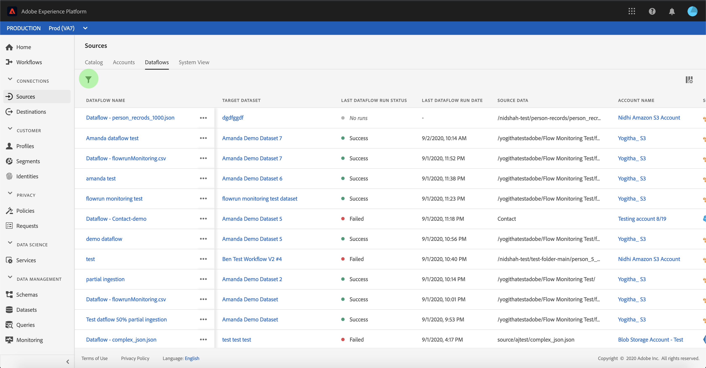

# Monitorare gli account e i flussi di dati nell&#39;interfaccia utente

I connettori di origine in Adobe Experience Platform consentono di trasferire i dati esternamente originati su base programmata. Questa esercitazione fornisce i passaggi per visualizzare gli account e i flussi di dati esistenti dall&#39; *[!UICONTROL Sources]* area di lavoro.

## Introduzione

Questa esercitazione richiede una buona conoscenza dei seguenti componenti di Adobe Experience Platform:

- [Sistema](../../../xdm/home.md)XDM (Experience Data Model): Il framework standard con cui [!DNL Experience Platform] organizzare i dati relativi all&#39;esperienza del cliente.
   - [Nozioni di base sulla composizione](../../../xdm/schema/composition.md)dello schema: Scoprite i componenti di base degli schemi XDM, inclusi i principi chiave e le procedure ottimali nella composizione dello schema.
   - [Esercitazione](../../../xdm/tutorials/create-schema-ui.md)sull&#39;Editor di schema: Scoprite come creare schemi personalizzati utilizzando l&#39;interfaccia utente dell&#39;Editor di schema.
- [Profilo](../../../profile/home.md)cliente in tempo reale: Fornisce un profilo di consumo unificato e in tempo reale basato su dati aggregati provenienti da più origini.

## Monitorare gli account

Accedete ad [Adobe Experience Platform](https://platform.adobe.com) , quindi selezionate **[!UICONTROL Sources]** dalla barra di navigazione a sinistra per accedere all&#39; *[!UICONTROL Sources]* area di lavoro. Nella *[!UICONTROL Catalog]* schermata sono visualizzate diverse origini per le quali è possibile creare account e flussi di dati. Ogni origine mostra il numero di account e di flussi di dati esistenti ad essi associati.

Selezionate *[!UICONTROL Accounts]* dall&#39;intestazione superiore per visualizzare gli account esistenti.

Vengono *[!UICONTROL Accounts]* visualizzate le pagine. In questa pagina è presente un elenco di account visualizzabili, con informazioni sull’origine, il nome utente, il numero di flussi di dati e la data di creazione.

Selezionate l’icona funnel in alto a sinistra per avviare la finestra di ordinamento.

Il pannello di ordinamento consente di accedere agli account da un&#39;origine specifica. Selezionate la fonte con cui desiderate lavorare e selezionate l’account dall’elenco a destra.

Dalla *[!UICONTROL Accounts]* pagina è possibile visualizzare un elenco dei flussi di dati esistenti o dei set di dati di destinazione associati all&#39;account a cui si è effettuato l&#39;accesso.

## Monitorare i flussi di dati

È possibile accedere ai flussi di dati direttamente dalla *[!UICONTROL Catalog]* pagina senza visualizzarli *[!UICONTROL Accounts]*. Selezionate *[!UICONTROL Dataflows]* dall’intestazione superiore per visualizzare un elenco dei flussi di dati esistenti.

Viene visualizzato un elenco dei flussi di dati esistenti. In questa pagina è presente un elenco di flussi di dati visualizzabili, con informazioni sull’origine, il nome utente, il numero di flussi di dati e lo stato. Selezionate l’icona funnel in alto a sinistra per ordinare i dati.

Viene visualizzato il pannello di ordinamento. Selezionate la sorgente a cui desiderate accedere dal menu di scorrimento e selezionate il flusso di dati dall’elenco a destra.

La *[!UICONTROL Dataflow activity]* pagina contiene dettagli sul numero di record acquisiti e di record non riusciti, nonché informazioni sullo stato del flusso di dati e sui tempi di elaborazione. Selezionate l’icona del calendario sopra il flusso di dati per regolare l’intervallo di tempo dei record di assimilazione.

Il calendario consente di visualizzare i diversi intervalli di tempo per i record acquisiti. Potete scegliere una delle due opzioni predefinite *[!UICONTROL Last 7 days]* o *[!UICONTROL Last 30 days]*. In alternativa, potete impostare un intervallo di tempo personalizzato utilizzando il calendario. Selezionare l&#39;intervallo di tempo desiderato e selezionare **[!UICONTROL Apply]** per continuare.

Per impostazione predefinita, *[!UICONTROL Dataflow activity]* visualizza il *[!UICONTROL Properties]* pannello associato al flusso di dati. Selezionare l&#39;esecuzione del flusso dall&#39;elenco per visualizzare i metadati associati, incluse le informazioni sul relativo ID di esecuzione univoco.

Selezionate **[!UICONTROL Dataflow run start]** per accedere al *[!UICONTROL Dataflow run overview]*.

Vengono *[!UICONTROL Dataflow run overview]* visualizzate le informazioni sul flusso di dati, inclusi i metadati, *[!UICONTROL Partial ingestion]* lo stato e l&#39;assegnazione *[!UICONTROL Error threshold]*. L’intestazione superiore include anche un *[!UICONTROL Error summary]*. Il *[!UICONTROL Error summary]* contiene l&#39;errore di livello principale specifico che mostra in quale fase il processo di assimilazione ha rilevato un errore.

Fare riferimento alla tabella seguente per i codici di errore che è possibile visualizzare nella *[!UICONTROL Error summary]*.

| Codice errore | Messaggio di errore |
| ---------- | ----------- |
| `CONNECTOR-1001-500` | &quot;Si è verificato un problema con l&#39;attività di copia.&quot; |
| `CONNECTOR-2001-500` | &quot;Si è verificato un problema durante la copia dall&#39;origine del Experience Platform  al dataset.&quot; |
| `CONNECTOR-3001-500` | &quot;Si è verificato un problema con il provider di flusso durante la creazione del batch utilizzando l&#39;API di caricamento in blocco.&quot; |

La metà inferiore dello schermo contiene informazioni su *[!UICONTROL Dataflow run errors]*. Da qui, potete anche visualizzare i file acquisiti, visualizzare in anteprima e scaricare la diagnostica degli errori, oppure scaricare il file manifesto.

Nella *[!UICONTROL Dataflow run errors]* sezione vengono visualizzati i *[!UICONTROL Error code]*, il numero di record con errore e le informazioni che descrivono l&#39;errore.

Selezionate **[!UICONTROL Preview error diagnostics]** per visualizzare ulteriori informazioni sull’errore di inserimento.

Viene visualizzato il *[!UICONTROL Error diagnostics preview]* pannello. In questa schermata vengono visualizzate informazioni specifiche relative all&#39;errore di assimilazione, inclusi *[!UICONTROL File name]*, *[!UICONTROL Error code]*, il nome della colonna in cui si è verificato l&#39;errore e una descrizione dell&#39;errore.

Questa sezione include anche un&#39;anteprima della colonna che contiene l&#39;errore.

> [!IMPORTANT] Per abilitare *[!UICONTROL Error diagnostics preview]* è necessario attivare *[!UICONTROL Partial ingestion]* e *[!UICONTROL Error diagnostics]* durante la configurazione di un flusso di dati. In questo modo il sistema potrà eseguire la scansione di tutti i record acquisiti durante l&#39;esecuzione del flusso.

Dopo aver visualizzato l&#39;anteprima degli errori, potete selezionare **[!UICONTROL Download]** dall&#39;interno del pannello di panoramica delle esecuzioni dei dati *[]* UICONTROL per accedere alla diagnostica completa degli errori e scaricare il file manifesto. Per ulteriori informazioni, consultate i documenti sulla diagnostica [degli](../../../ingestion/batch-ingestion/partial.md#retrieve-errors) errori e [il download dei metadati](../../../ingestion/batch-ingestion/partial.md#download-metadata) .

Per ulteriori informazioni sul monitoraggio dei flussi di dati e sull’assimilazione, consulta l’esercitazione sul [monitoraggio dei flussi di dati](../../../ingestion/quality/monitor-data-flows.md).

## Passaggi successivi

Seguendo questa esercitazione, è stato possibile accedere agli account e ai flussi di dati esistenti dall&#39; *[!UICONTROL Sources]* area di lavoro. I dati in entrata possono ora essere utilizzati dai [!DNL Platform] servizi a valle come [!DNL Real-time Customer Profile] e [!DNL Data Science Workspace]. Per ulteriori informazioni, consulta i documenti seguenti:

- [Panoramica del profilo cliente in tempo reale](../../../profile/home.md)
- [Panoramica di Analysis Workspace](../../../data-science-workspace/home.md)