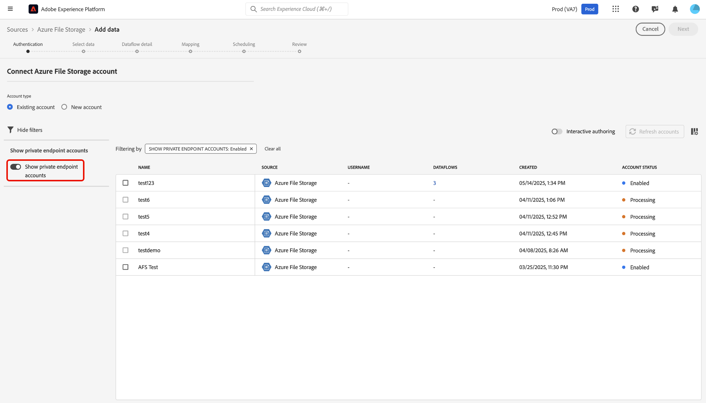

# Usa [!DNL Azure Private Link] per le origini nell&#39;interfaccia utente

>[!AVAILABILITY]
>
>Questa funzione è in versione beta ed è attualmente supportata solo per le seguenti sorgenti:
>
>* [[!DNL Azure Blob Storage]](../../connectors/cloud-storage/blob.md)
>* [[!DNL ADLS Gen2]](../../connectors/cloud-storage/adls-gen2.md)
>* [[!DNL Azure File Storage]](../../connectors/cloud-storage/azure-file-storage.md)
>* [[!DNL Snowflake]](../../connectors/databases/snowflake.md)

È possibile utilizzare la funzionalità [!DNL Azure Private Link] per creare endpoint privati per le origini Adobe Experience Platform a cui connettersi. Connetti in modo sicuro le origini a una rete virtuale utilizzando indirizzi IP privati, eliminando la necessità di IP pubblici e riducendo la superficie di attacco.Semplifica la configurazione della rete eliminando la necessità di configurazioni complesse di firewall o Network Address Translation, garantendo al contempo che il traffico dati raggiunga solo i servizi approvati.

Leggi questa guida per scoprire come utilizzare l’area di lavoro origini nell’interfaccia utente di Experience Platform per creare e utilizzare un endpoint privato.

## Creare un endpoint privato

Per iniziare a utilizzare [!DNL Azure Private Link], passa al catalogo *[!UICONTROL Sources]* dell&#39;interfaccia utente di Experience Platform e seleziona **[!UICONTROL Private endpoints]** dal menu delle schede nell&#39;area di lavoro Sources.

Utilizza l’interfaccia per visualizzare informazioni sugli endpoint privati esistenti, come il loro ID, la sorgente associata e lo stato corrente. Per creare un nuovo endpoint privato, selezionare **[!UICONTROL Crea endpoint privato]**.

Scegliere quindi l&#39;origine desiderata e immettere i valori per le proprietà seguenti:

| Proprietà | Descrizione |
| --- | --- |
| `name` | Nome dell’endpoint privato. |
| `subscriptionId` | ID associato all&#39;abbonamento [!DNL Azure]. Per ulteriori informazioni, leggere la guida di [!DNL Azure] in [recupero degli ID sottoscrizione e tenant da  [!DNL Azure Portal]](https://learn.microsoft.com/en-us/azure/azure-portal/get-subscription-tenant-id). |
| `resourceGroupName` | Il nome del gruppo di risorse in [!DNL Azure]. Un gruppo di risorse contiene risorse correlate per una soluzione [!DNL Azure]. Per ulteriori informazioni, leggere la guida di [!DNL Azure] in [gestione dei gruppi di risorse](https://learn.microsoft.com/en-us/azure/azure-resource-manager/management/manage-resource-groups-portal). |
| `resourceGroup` | Nome della risorsa. In [!DNL Azure] una risorsa fa riferimento a istanze quali macchine virtuali, applicazioni Web e database. Per ulteriori informazioni, leggere la guida di [!DNL Azure] in [informazioni sul gestore delle risorse [!DNL Azure] ](https://learn.microsoft.com/en-us/azure/azure-resource-manager/management/overview). |
| `fqdns` | I nomi di dominio completi per l’origine. **NOTA**: questa proprietà è necessaria solo quando si utilizza l&#39;origine [!DNL Snowflake]. |

{style="table-layout:auto"}

Al termine, selezionare **[!UICONTROL Invia]**.

### Approvare un endpoint privato

Un endpoint appena creato rimane in sospeso finché non viene approvato da un amministratore.

Per approvare una richiesta di endpoint privato per le origini [!DNL Azure Blob] e [!DNL Azure Data Lake Gen2], accedere a [!DNL Azure Portal]. Nel menu di navigazione a sinistra, selezionare **[!DNL Data storage]**, quindi passare alla scheda **[!DNL Security + networking]** e scegliere **[!DNL Networking]**. Quindi, seleziona **[!DNL Private endpoints]** per visualizzare un elenco di endpoint privati associati al tuo account e ai relativi stati di connessione correnti. Per approvare una richiesta in sospeso, selezionare l&#39;endpoint desiderato e fare clic su **[!DNL Approve]**.

## Creare un account con un endpoint privato

Passa al catalogo delle origini e seleziona un’origine che supporti gli endpoint privati. Quindi, crea un nuovo account con la tua origine e, durante l&#39;autenticazione dell&#39;account, seleziona l&#39;opzione **[!UICONTROL Endpoint privato]**. Fornisci le credenziali di autenticazione dell&#39;origine, quindi seleziona **[!UICONTROL Connetti all&#39;origine]**. Attendi alcuni minuti per stabilire la connessione.

>[!NOTE]
>
>Se l&#39;opzione [!UICONTROL Endpoint privato] è abilitata, Experience Platform controlla se esiste un endpoint privato approvato per l&#39;origine selezionata. Se non viene trovato alcun endpoint approvato, non sarà possibile stabilire una connessione.

Passare quindi all&#39;interfaccia dell&#39;[!UICONTROL account esistente] dell&#39;origine. Utilizzare questa interfaccia per visualizzare un elenco degli account esistenti e dei relativi stati corrispondenti. È possibile selezionare l&#39;icona filtro  per visualizzare solo gli account abilitati per la connessione a un endpoint privato.

Selezionare l&#39;account che si desidera utilizzare, quindi abilitare **[!UICONTROL Authoring interattivo]**. Questa opzione attiva [!UICONTROL Interactive Authoring], una funzionalità di [!DNL Azure] che consente di verificare le connessioni, sfogliare gli elenchi delle cartelle e visualizzare in anteprima i dati. Per le connessioni degli endpoint privati è necessario abilitare [!UICONTROL l&#39;authoring interattivo]. Questo interruttore non può essere disattivato manualmente, ma automaticamente dopo 60 minuti.

[!UICONTROL L&#39;attivazione dell&#39;authoring interattivo] richiede alcuni minuti. Una volta abilitata l&#39;impostazione, seleziona **[!UICONTROL Successivo]** per procedere al passaggio successivo e selezionare i dati da acquisire.

## Passaggi successivi

Dopo aver creato correttamente un endpoint privato, puoi creare connessioni di origine e flussi di dati e acquisire dati utilizzando endpoint privati. Per informazioni su come creare flussi di dati nell’interfaccia utente, leggi le seguenti guide:

* [Creare un flusso di dati per un’origine di archiviazione cloud](../ui/dataflow/batch/cloud-storage.md)
* [Creare un flusso di dati per un’origine di database](../ui/dataflow/databases.md)
