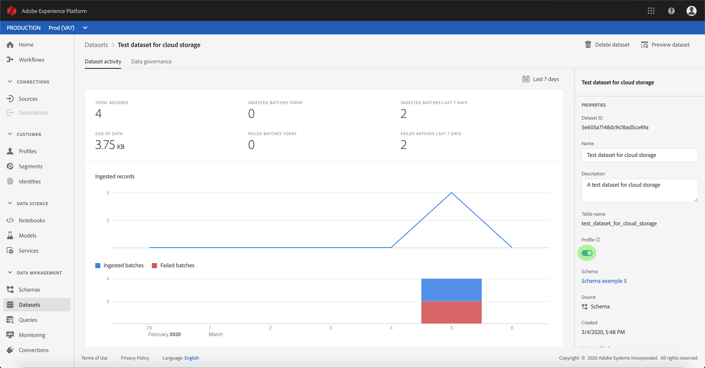

# Attivare i dati di origine in entrata per compilare i profili cliente

I dati in entrata provenienti dal connettore di origine possono essere utilizzati per arricchire e compilare i dati del profilo cliente in tempo reale.

## Introduzione

Questa esercitazione richiede una buona conoscenza dei seguenti componenti di Adobe Experience Platform:

- [Sistema](../../../xdm/home.md)XDM (Experience Data Model): Il framework standardizzato tramite il quale Experience Platform organizza i dati sull&#39;esperienza dei clienti.
   - [Nozioni di base sulla composizione](../../../xdm/schema/composition.md)dello schema: Scoprite i componenti di base degli schemi XDM, inclusi i principi chiave e le procedure ottimali nella composizione dello schema.
   - [Esercitazione](../../../xdm/tutorials/create-schema-ui.md)sull&#39;Editor di schema: Scoprite come creare schemi personalizzati utilizzando l&#39;interfaccia utente dell&#39;Editor di schema.
- [Profilo](../../../profile/home.md)cliente in tempo reale: Fornisce un profilo di consumo unificato e in tempo reale basato su dati aggregati provenienti da più origini.

Inoltre, questa esercitazione richiede che sia già stato creato e configurato un connettore di origine.  Un elenco di esercitazioni per la creazione di diversi connettori nell’interfaccia utente è disponibile nella panoramica [dei connettori](../../home.md)sorgente.

## Compilazione dei dati del profilo cliente in tempo reale

Per arricchire i profili dei clienti, lo schema di origine del set di dati di destinazione deve essere compatibile per l&#39;uso nel profilo cliente in tempo reale. Uno schema compatibile soddisfa i seguenti requisiti:

- Lo schema ha almeno un attributo specificato come proprietà identity.
- Lo schema presenta una proprietà identity definita come identità primaria.
- Esiste una mappatura all&#39;interno del flusso di dati in cui l&#39;identità primaria è un attributo di destinazione.

Nell&#39;area di lavoro Origini, fare clic sulla scheda **Sfoglia** per elencare le connessioni di base. Nell’elenco visualizzato, individuate la connessione che contiene il flusso di dati con cui desiderate compilare i profili. Fate clic sul nome della connessione per accedere ai relativi dettagli.

Viene visualizzata la schermata dell&#39;attività ** Origine della connessione, in cui sono visualizzati i set di dati in cui la connessione sta trasferendo i dati di origine. Fare clic sul nome del set di dati che si desidera abilitare per il profilo.

Viene visualizzata la schermata Attività ** DataSet. La colonna *Proprietà* sul lato destro della schermata mostra i dettagli del dataset, include uno switch **Profilo** e un collegamento allo schema a cui il dataset aderisce. Fate clic sul nome dello schema per visualizzarne la composizione.

Viene visualizzato l&#39;Editor ** schema, che mostra la struttura dello schema nel quadro centrale. All&#39;interno del quadro, selezionare il campo da impostare come identità principale. Nella scheda Proprietà ** campo visualizzata, selezionare la casella di controllo **Identità** , quindi l&#39;identità **** principale. Infine, selezionare uno spazio dei nomi **** Identità appropriato, quindi fare clic su **Applica**.

Fare clic sull&#39;oggetto di primo livello della struttura dello schema e viene visualizzata la colonna Proprietà ** schema. Attivate lo schema per il profilo attivando lo switch **Profilo** . Fate clic su **Salva** per finalizzare le modifiche.

Ora che lo schema è abilitato per Profilo, tornare alla schermata Attività ** DataSet e abilitare il dataset per Profilo facendo clic sull&#39;opzione **Profilo** all&#39;interno della colonna *Proprietà* .

Con lo schema e il set di dati abilitati per il profilo, i dati acquisiti in tale set di dati ora popoleranno anche i profili dei clienti.

>[!NOTE] I dati esistenti in un dataset abilitato di recente non vengono utilizzati dal profilo

## Passaggi successivi

Seguendo questa esercitazione, hai attivato correttamente i dati in entrata per la popolazione Profilo. Per ulteriori informazioni, consulta la panoramica [Profilo cliente](../../../profile/home.md)in tempo reale.