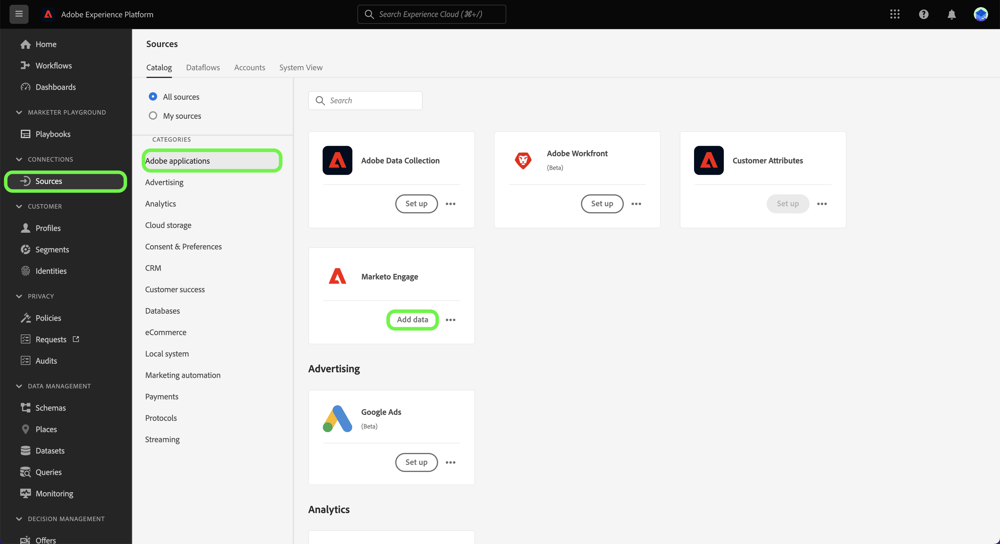
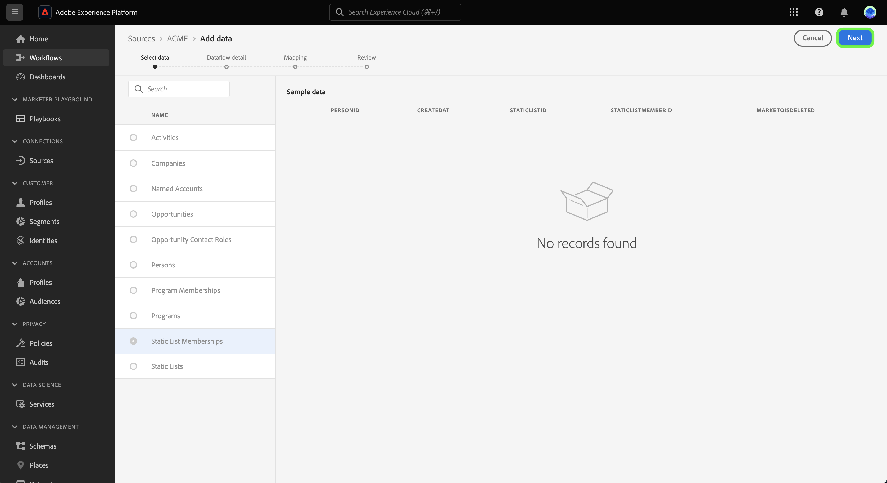

# Creare un flusso di dati di origini utilizzando i modelli nell’interfaccia utente {#create-a-sources-dataflow-using-templates-in-the-ui}

>[!CONTEXTUALHELP]
>id="platform_sources_marketo_mapping"
>title="Modelli per origini nell’interfaccia di Platform"
>abstract="I modelli includono risorse generate automaticamente come schemi, set di dati, identità, regole di mappatura, spazi dei nomi delle identità e flussi di dati che è possibile utilizzare per importare dati da un’origine all’Experience Platform. Puoi aggiornare le risorse generate automaticamente per la personalizzazione in base ai tuoi casi d’uso."

>[!IMPORTANT]
>
>I modelli sono in versione beta e sono supportati dalle seguenti origini:
>
>* [[!DNL Marketo Engage]](../../connectors/adobe-applications/marketo/marketo.md)
>* [[!DNL Microsoft Dynamics]](../../connectors/crm/ms-dynamics.md)
>* [[!DNL Salesforce]](../../connectors/crm/salesforce.md)
>
>La documentazione e le funzionalità sono soggette a modifiche.

Adobe Experience Platform fornisce modelli preconfigurati che puoi utilizzare per accelerare il processo di acquisizione dei dati. I modelli includono risorse generate automaticamente come schemi, set di dati, identità, regole di mappatura, spazi dei nomi delle identità e flussi di dati che è possibile utilizzare per importare dati da un’origine all’Experience Platform.

Con i modelli, puoi:

* Riduci il time-to-value dell’acquisizione accelerando la creazione di modelli di risorse.
* Riduci al minimo gli errori che possono verificarsi durante il processo manuale di acquisizione dei dati.
* Aggiorna le risorse generate automaticamente in qualsiasi momento in base ai tuoi casi d’uso.

Il seguente tutorial illustra i passaggi da seguire per utilizzare i modelli nell’interfaccia utente di Platform.

## Guida introduttuva

Questo tutorial richiede una buona conoscenza dei seguenti componenti di Experience Platform:

* [Sorgenti](../../home.md): un Experience Platform consente di acquisire dati da varie origini, consentendoti allo stesso tempo di strutturare, etichettare e migliorare i dati in arrivo tramite i servizi di Platform.
* [[!DNL Experience Data Model (XDM)] Sistema](../../../xdm/home.md): framework standardizzato tramite il quale Experienci Platform organizza i dati sull’esperienza del cliente.
* [Sandbox](../../../sandboxes/home.md): Experienci Platform fornisce sandbox virtuali che permettono di suddividere una singola istanza Platform in ambienti virtuali separati, utili per le attività di sviluppo e aggiornamento delle applicazioni di esperienza digitale.

## Utilizzare i modelli nell’interfaccia utente di Platform {#use-templates-in-the-platform-ui}

>[!CONTEXTUALHELP]
>id="platform_sources_templates_accounttype"
>title="Selezionare il tipo di azienda"
>abstract="Seleziona il tipo di azienda appropriato per il tuo caso d’uso. L’accesso può variare a seconda dell’account di abbonamento Real-time Customer Data Platform."
>additional-url="https://experienceleague.adobe.com/docs/experience-platform/rtcdp/intro/rtcdp-intro/overview.html?lang=it" text="Panoramica di Real-Time CDP"

Nell’interfaccia utente di Platform, seleziona **[!UICONTROL Sorgenti]** dalla barra di navigazione a sinistra per accedere al [!UICONTROL Sorgenti] e visualizzare un catalogo delle origini disponibili in Experienci Platform.

Utilizza il *[!UICONTROL Categorie]* per filtrare le sorgenti per categoria. In alternativa, immettere un nome di origine nella barra di ricerca per trovare un&#39;origine specifica dal catalogo.

Vai a [!UICONTROL applicazioni Adobe] categoria per visualizzare [!DNL Marketo Engage] scheda sorgente e quindi selezionare [!UICONTROL Aggiungi dati] per iniziare.

Viene visualizzata una finestra pop-up con la possibilità di sfogliare i modelli o utilizzare schemi e set di dati esistenti.

* **Sfoglia modelli**: i modelli di origini creano automaticamente schemi, identità, set di dati e flussi di dati con le relative regole di mappatura. Puoi personalizzare queste risorse in base alle esigenze.
* **Usa le risorse esistenti**: acquisisci i dati utilizzando i set di dati e gli schemi esistenti creati. Se necessario, puoi anche creare nuovi set di dati e schemi.

Per utilizzare le risorse generate automaticamente, seleziona **[!UICONTROL Sfoglia modelli]** e quindi seleziona **[!UICONTROL Seleziona]**.

### Autenticazione

Viene visualizzato il passaggio di autenticazione, in cui viene richiesto di creare un nuovo account o di utilizzare un account esistente.

>[!BEGINTABS]

>[!TAB Usa un account esistente]

Per utilizzare un account esistente, seleziona [!UICONTROL Account esistente] quindi selezionare l&#39;account che si desidera utilizzare dall&#39;elenco visualizzato.

>[!TAB Crea un nuovo account]

Per creare un nuovo account, seleziona **[!UICONTROL Nuovo account]** e quindi fornire i dettagli della connessione di origine e le credenziali di autenticazione dell&#39;account. Al termine, seleziona **[!UICONTROL Connetti all&#39;origine]** e lascia un po’ di tempo per stabilire la nuova connessione.

>[!ENDTABS]

### Seleziona modelli

Con l’account autenticato, ora puoi selezionare il modello da utilizzare per il flusso di dati.

+++[!DNL Marketo Engage] modelli Nella tabella seguente sono illustrati i modelli disponibili per [!DNL Marketo Engage] sorgente.

| [!DNL Marketo Engage] modelli | Descrizione |
| --- | --- |
| Attività | Il modello Attività acquisisce istantanee basate su eventi di attività quali interazioni e-mail, interazioni con siti web e chiamate di vendita. |
| Aziende | Il modello Aziende acquisisce i dettagli dell&#39;account aziendale, ad esempio informazioni sul firmware aziendale, sulla posizione e sulla fatturazione. |
| Account denominati | Il modello Conti denominati acquisisce i dettagli dei conti che sono stati determinati come conti target da perseguire. |
| Opportunità | Il modello Opportunità acquisisce i dettagli dell&#39;opportunità di business quali tipo, fase di vendita e conti correlati. |
| Ruoli contatto opportunità | Il modello Ruoli contatto opportunità acquisisce i dettagli sui ruoli dei lead associati a una particolare opportunità. |
| Persone | Il modello Persone acquisisce attributi per le singole persone, ad esempio dettagli demografici, informazioni di contatto e preferenze di consenso. |
| Iscrizioni al programma | Il modello Iscrizioni al programma acquisisce i dettagli dei contatti associati a una campagna aziendale, include cadenze di crescita e risposte di contatto. |
| Programmi | Il modello Programmi acquisisce i dettagli della campagna aziendale come stato, canali, timeline e costi. |
| Appartenenze a elenchi statici | Il modello Appartenenze a elenchi statici acquisisce le relazioni tra gli utenti e la loro appartenenza a elenchi statici. |
| Elenchi statici | Il modello Elenco statico acquisisce elenchi di persone con istanze per casi d’uso specifici. |

{style="table-layout:auto"}

+++

+++[!DNL Salesforce] Modelli B2B La tabella seguente illustra i modelli B2B disponibili per [!DNL Salesforce] sorgente.

| [!DNL Salesforce] Modelli B2B | Descrizione |
| --- | --- |
| Relazione contatto account | Il modello Relazione contatto account acquisisce la relazione tra un contatto e uno o più account. |
| Account | Il modello Account acquisisce i dettagli dell&#39;account aziendale, ad esempio informazioni sul firmware aziendale, sull&#39;ubicazione e sulla fatturazione. |
| Membri della campagna | Il modello Membri della campagna acquisisce la relazione tra un singolo lead o contatto e uno specifico [!DNL Salesforce] campagna. |
| Campagne | Il modello Campagne acquisisce i dettagli dell’account aziendale, ad esempio informazioni sul firmware aziendale, sulla posizione e sulla fatturazione. |
| Contatti | Il modello Contatto acquisisce gli attributi dei contatti, ad esempio i dettagli demografici, le informazioni di contatto e le entità aziendali correlate. |
| Lead | Il modello Lead acquisisce gli attributi dei lead, ad esempio i dettagli demografici, le informazioni di contatto e le entità aziendali correlate. |
| Opportunità | Il modello Opportunità acquisisce i dettagli dell&#39;opportunità di business quali tipo, fase di vendita e account correlato. |
| Ruoli contatto opportunità | Il modello Ruoli contatto opportunità acquisisce i dettagli sui ruoli dei lead associati a una particolare opportunità. |

{style="table-layout:auto"}

+++

+++[!DNL Salesforce] Modelli B2C Nella tabella seguente sono illustrati i modelli B2C disponibili per [!DNL Salesforce] sorgente.

| [!DNL Salesforce] Modelli B2C | Descrizione |
| --- | --- |
| Contatto | Il modello Contatto acquisisce gli attributi dei contatti, ad esempio i dettagli demografici, le informazioni di contatto e le entità aziendali correlate. |
| Lead | Il modello di lead acquisisce gli attributi dei lead, ad esempio i dettagli demografici, le informazioni di contatto e le entità aziendali correlate. |

{style="table-layout:auto"}

+++

+++[!DNL Microsoft Dynamics] Modelli B2B La tabella seguente illustra i modelli B2B disponibili per [!DNL Microsoft Dynamics] sorgente.

| [!DNL Microsoft Dynamics] Modelli B2B | Descrizione |
| --- | --- |
| Account | Il modello Account acquisisce i dettagli dell&#39;account aziendale, ad esempio informazioni sul firmware aziendale, sull&#39;ubicazione e sulla fatturazione. |
| Campagne | Il modello Campagne acquisisce i dettagli dell’account aziendale, ad esempio informazioni sul firmware aziendale, sulla posizione e sulla fatturazione. |
| Contatti | Il modello Contatto acquisisce gli attributi dei contatti, ad esempio i dettagli demografici, le informazioni di contatto e le entità aziendali correlate. |
| Lead | Il modello Lead acquisisce gli attributi dei lead, ad esempio i dettagli demografici, le informazioni di contatto e le entità aziendali correlate. |
| Elenco marketing | Il modello Elenco di marketing acquisisce un gruppo di clienti esistenti o potenziali creati per una campagna di marketing o altre finalità di vendita. |
| Membri di elenco marketing | I membri dell’elenco di marketing acquisiscono i dettagli di qualsiasi tipo di record cliente, ad esempio lead, account o contatti, in un elenco di marketing. |
| Opportunità | Il modello Opportunità acquisisce i dettagli dell&#39;opportunità di business quali tipo, fase di vendita e account correlato. |
| Ruoli contatto opportunità | Il modello Ruoli contatto opportunità acquisisce i dettagli sui ruoli dei lead associati a una particolare opportunità. |

{style="table-layout:auto"}

+++

+++[!DNL Microsoft Dynamics] Modelli B2C Nella tabella seguente sono illustrati i modelli B2C disponibili per [!DNL Microsoft Dynamics] sorgente.

| [!DNL Microsoft Dynamics] Modelli B2C | Descrizione |
| --- | --- |
| Contatto | Il modello Contatto acquisisce gli attributi dei contatti, ad esempio i dettagli demografici, le informazioni di contatto e le entità aziendali correlate. |
| Lead | Il modello di lead acquisisce gli attributi dei lead, ad esempio i dettagli demografici, le informazioni di contatto e le entità aziendali correlate. |

{style="table-layout:auto"}

+++

A seconda del tipo di azienda selezionato, viene visualizzato un elenco di modelli. Seleziona l’icona di anteprima  accanto al nome di un modello per visualizzare in anteprima i dati di esempio del modello.

Viene visualizzata la finestra di anteprima che consente di esplorare e controllare i dati di esempio dal modello. Al termine, seleziona **[!UICONTROL Capito]**.

Quindi, seleziona dall’elenco il modello da utilizzare. Puoi selezionare più modelli e creare più flussi di dati contemporaneamente. Tuttavia, un modello può essere utilizzato solo una volta per account. Dopo aver selezionato i modelli, seleziona **[!UICONTROL Fine]** e attendi alcuni istanti per generare le risorse.

Se selezioni uno o più elementi parziali dall’elenco dei modelli disponibili, tutti gli schemi B2B e gli spazi dei nomi di identità verranno comunque generati per garantire che le relazioni B2B tra gli schemi siano configurate correttamente.

>[!NOTE]
>
>I modelli già utilizzati verranno disattivati dalla selezione.

### Imposta una pianificazione

Il [!DNL Microsoft Dynamics] e [!DNL Salesforce] entrambe le origini supportano la pianificazione dei flussi di dati.

Utilizza l’interfaccia di pianificazione per configurare una pianificazione di acquisizione per i flussi di dati. Imposta la frequenza di acquisizione su **Una volta** per creare un’acquisizione unica.

In alternativa, puoi impostare la frequenza di acquisizione su **Minuto**, **Hour**, **Giorno**, o **Settimana**. Se pianifichi il flusso di dati per più acquisizioni, imposta un intervallo di tempo per stabilire un intervallo di tempo tra ogni acquisizione. Ad esempio, una frequenza di acquisizione impostata su **Hour** e un intervallo impostato su **15** significa che il flusso di dati è pianificato per acquisire i dati ogni **15 ore**.

Durante questo passaggio, puoi anche abilitare **retrocompilazione** e definisci una colonna per l’acquisizione incrementale dei dati. La retrocompilazione viene utilizzata per acquisire i dati storici, mentre la colonna definita per l’acquisizione incrementale consente di distinguere i nuovi dati dai dati esistenti.

Una volta completata la configurazione della pianificazione di acquisizione, seleziona **[!UICONTROL Fine]**.

### Esaminare le risorse {#review-assets}

>[!CONTEXTUALHELP]
>id="platform_sources_templates_review"
>title="Esamina le risorse generate automaticamente"
>abstract="La generazione di tutte le risorse può richiedere fino a cinque minuti. Se scegli di uscire dalla pagina, una notifica ti chiederà di tornare una volta completate le risorse. Puoi esaminare le risorse generate e configurare ulteriormente il flusso di dati in qualsiasi momento."

Il [!UICONTROL Rivedere le risorse dei modelli] In questa pagina vengono visualizzate le risorse generate automaticamente come parte del modello. In questa pagina puoi visualizzare gli schemi, i set di dati, gli spazi dei nomi delle identità e i flussi di dati generati automaticamente associati alla connessione sorgente. La generazione di tutte le risorse può richiedere fino a cinque minuti. Se scegli di uscire dalla pagina, una notifica ti chiederà di tornare una volta completate le risorse. Puoi esaminare le risorse generate e configurare ulteriormente il flusso di dati in qualsiasi momento.

Per impostazione predefinita, i flussi di dati generati automaticamente sono impostati su uno stato di bozza per consentire ulteriori personalizzazioni nelle configurazioni, ad esempio le regole di mappatura o le frequenze pianificate. Seleziona i puntini di sospensione (`...`) accanto al nome del flusso di dati, quindi seleziona **[!UICONTROL Anteprima mappature]** per visualizzare i set di mappatura creati per il flusso di dati della bozza.

Viene visualizzata una pagina di anteprima che consente di esaminare la relazione di mappatura tra i campi dei dati di origine e i campi dello schema di destinazione. Dopo aver visualizzato le mappature del flusso di dati. Seleziona **[!UICONTROL Capito.]**

Puoi aggiornare i flussi di dati in qualsiasi momento dopo l’esecuzione. Seleziona i puntini di sospensione (`...`) accanto al nome del flusso di dati, quindi seleziona **[!UICONTROL Aggiorna flusso di dati]**. Viene visualizzata la pagina del flusso di lavoro delle origini, in cui è possibile aggiornare i dettagli del flusso di dati, incluse le impostazioni per l’acquisizione parziale, la diagnostica degli errori, le notifiche di avviso e la mappatura del flusso di dati.

Puoi utilizzare la vista dell’editor schema per apportare aggiornamenti allo schema generato automaticamente. Visita la guida su [utilizzo dell’editor schema](../../../xdm/tutorials/create-schema-ui.md) per ulteriori informazioni.

>[!TIP]
>
>Puoi accedere al flusso di dati della bozza tramite [!UICONTROL Flussi dati] pagina catalogo nell&#39;area di lavoro origini. Seleziona **[!UICONTROL Flussi dati]** dall’intestazione in alto, quindi seleziona dall’elenco il flusso di dati che desideri aggiornare.
>
>

### Pubblicare il flusso di dati

Inizia il processo di pubblicazione passando dal flusso di lavoro origini. Dopo aver selezionato [!UICONTROL Aggiorna flusso di dati], si viene indirizzati al *[!UICONTROL Aggiungi dati]* passaggio del flusso di lavoro. Seleziona **[!UICONTROL Avanti]** per procedere.

Quindi, conferma i dettagli del flusso di dati e configura le impostazioni per la diagnostica degli errori, l’acquisizione parziale e le notifiche di avviso. Al termine, seleziona **[!UICONTROL Successivo]**.

>[!NOTE]
>
>Puoi selezionare **[!UICONTROL Salva come bozza]** in qualsiasi momento per interrompere e salvare le modifiche apportate al flusso di dati.

Viene visualizzato il passaggio di mappatura. Durante questo passaggio, puoi riconfigurare le configurazioni di mappatura del flusso di dati. Per una guida completa sulle funzioni di preparazione dei dati utilizzate per la mappatura, visita [guida all’interfaccia utente per la preparazione dei dati](../../../data-prep/ui/mapping.md).

Infine, rivedi i dettagli del flusso di dati e seleziona **[!UICONTROL Salva e acquisisci]** per pubblicare la bozza.

## Passaggi successivi

Seguendo questa esercitazione, hai creato flussi di dati e risorse come schemi, set di dati e spazi dei nomi delle identità utilizzando i modelli. Per informazioni generali sulle origini, visitare il [panoramica sulle origini](../../home.md).

## Avvisi e notifiche {#alerts-and-notifications}

I modelli sono supportati dagli avvisi di Adobe Experience Platform e puoi utilizzare il pannello notifiche per ricevere aggiornamenti sullo stato delle risorse e anche tornare alla pagina di revisione.

Seleziona l’icona di notifica nell’intestazione superiore dell’interfaccia utente di Platform, quindi seleziona l’avviso di stato per visualizzare le risorse da rivedere.

Puoi aggiornare le impostazioni degli avvisi dei modelli per ricevere notifiche e-mail e in-Platform sullo stato dei flussi di dati. Per ulteriori informazioni sulla configurazione degli avvisi, consulta la guida su [sottoscrivere avvisi per i flussi di dati di origine](../ui/alerts.md).