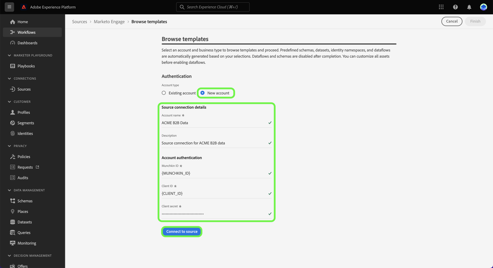

# Creare un flusso di dati di origini utilizzando i modelli nell’interfaccia utente {#create-a-sources-dataflow-using-templates-in-the-ui}

>[!CONTEXTUALHELP]
>id="platform_sources_marketo_mapping"
>title="Modelli per le fonti in Experience Platform interfaccia"
>abstract="I modelli includono risorse generate automaticamente come schemi, set di dati, identità, regole di mappatura, spazi dei nomi delle identità e flussi di dati che è possibile utilizzare per importare dati da un’origine all’Experience Platform. Puoi aggiornare le risorse generate automaticamente per la personalizzazione in base ai tuoi casi d’uso."

>[!IMPORTANT]
>
>I modelli sono in versione beta e sono supportati dalle seguenti origini:
>
>* [[!DNL Marketo Engage]](../../connectors/adobe-applications/marketo/marketo.md)
>* [[!DNL Microsoft Dynamics]](../../connectors/crm/ms-dynamics.md)
>* [[!DNL Salesforce]](../../connectors/crm/salesforce.md)
>
>La documentazione e le funzionalità sono soggette a modifiche.

Adobe Experience Platform fornisce modelli preconfigurati che puoi utilizzare per accelerare il processo di acquisizione dei dati. I modelli includono risorse generate automaticamente come schemi, set di dati, identità, regole di mappatura, spazi dei nomi delle identità e flussi di dati che puoi utilizzare per importare dati da un’origine ad Experience Platform.

Con i modelli puoi:

* Riduci il time-to-value dell&#39;inserimento accelerando la creazione di risorsa templatizzate.
* Ridurre al minimo gli errori che possono verificarsi durante il processo di inserimento manuale dei dati.
* Aggiorna le risorse generate automaticamente in qualsiasi momento per adattarle ai tuoi casi d&#39;uso.

Il seguente tutorial descrive come utilizzare i modelli nell’interfaccia utente di Experience Platform.

## Guida introduttuva

Questo esercitazione richiede una conoscenza pratica dei seguenti componenti del Experience Platform:

* [Origini](../../home.md): Experience Platform consente di inserire dati da varie origini, offrendo al contempo la possibilità di strutturare, etichettare e migliorare i dati in entrata utilizzando Experience Platform servizi.
* [[!DNL Experience Data Model (XDM)] Sistema](../../../xdm/home.md): il framework standardizzato con cui Experience Platform organizza esperienza del cliente dati.
* [Sandbox](../../../sandboxes/home.md): Experience Platform fornisce sandbox virtuali che suddividono un singolo Experience Platform istanza in ambienti virtuali separati per aiutare a sviluppare ed evolvere applicazioni di esperienza digitale.

## Utilizzare i modelli nella Experience Platform interfaccia {#use-templates-in-the-platform-ui}

>[!CONTEXTUALHELP]
>id="platform_sources_templates_accounttype"
>title="Selezionare il tipo di azienda"
>abstract="Seleziona il tipo di azienda appropriato per il tuo caso d’uso. L’accesso può variare a seconda dell’account di abbonamento Real-time Customer Data Platform."
>additional-url="https://experienceleague.adobe.com/docs/experience-platform/rtcdp/intro/rtcdp-intro/overview.html?lang=it" text="Panoramica di Real-Time CDP"

Nell&#39;interfaccia utente di Experience Platform, seleziona **[!UICONTROL Origini]** dal menu di navigazione a sinistra per accedere all&#39;area di lavoro [!UICONTROL Origini] e visualizzare un catalogo delle origini disponibili in Experience Platform.

Utilizza il menu *[!UICONTROL Categorie]* per filtrare le origini per categoria. In alternativa, immettere un nome di origine nella barra di ricerca per trovare un&#39;origine specifica dal catalogo.

Vai alla categoria [!UICONTROL Applicazioni Adobe] per visualizzare la scheda di origine [!DNL Marketo Engage], quindi seleziona [!UICONTROL Aggiungi dati] per iniziare.

Viene visualizzata una finestra pop-up con la possibilità di sfogliare i modelli o utilizzare schemi e set di dati esistenti.

* **Sfoglia modelli**: i modelli di origine creano automaticamente schemi, identità, set di dati e flussi di dati con le relative regole di mappatura. Puoi personalizzare queste risorse in base alle esigenze.
* **Usa la mia risorse** esistente: inserire i dati utilizzando i set di dati e gli schemi esistenti creati dall&#39;utente. Se necessario, puoi anche creare nuovi set di dati e schemi.

Per utilizzare i risorse generati automaticamente, selezionare **[!UICONTROL Sfoglia modelli]** , quindi selezionare **[!UICONTROL Seleziona]**.

### Autenticazione

Viene visualizzato il passaggio di autenticazione, in cui viene richiesto di creare un nuovo account o di utilizzare un account esistente.

>[!BEGINTABS]

>[!TAB Usa un account esistente]

Per utilizzare un account esistente, selezionare [!UICONTROL account] esistente e quindi selezionare il account che si desidera utilizzare dall&#39;elenco visualizzato.

>[!TAB Crea una nuova account]

Per creare una nuova account, selezionare **[!UICONTROL Nuovo account]**, quindi fornire i dettagli della connessione di origine e le account credenziali di autenticazione. Al termine, selezionare **[!UICONTROL Connetti all&#39;origine]** e attendere un po&#39; di tempo per stabilire la nuova connessione.

>[!ENDTABS]

### Seleziona i modelli

Una volta autenticato il account, è ora possibile selezionare il modello che si desidera like utilizzare per il flusso di dati.

+++[!DNL Marketo Engage] Modelli
Nella tabella seguente vengono illustrati i modelli disponibili per l&#39;origine [!DNL Marketo Engage] .

| [!DNL Marketo Engage] Modelli | Descrizione |
| --- | --- |
| Attività | Il modello Attività acquisisce istantanee basate su eventi di attività quali interazioni tramite posta elettronica, interazioni con siti Web e chiamate di vendita. |
| Aziende | Il modello Società acquisisce dettagli di account aziendali come informazioni firmografiche sulla società, posizione e informazioni fatturazione. |
| Account nominativi | Il modello Conti denominati acquisisce i dettagli dei conti che sono stati determinati come conti target da perseguire. |
| Opportunità | Il modello Opportunità acquisisce i dettagli dell&#39;opportunità di business quali tipo, fase di vendita e conti correlati. |
| Ruoli contatto opportunità | Il modello Ruoli contatto opportunità acquisisce dettagli sui ruoli per i lead associati a una determinata opportunità. |
| Persone | Il modello Persone acquisisce attributi per singole persone come dettagli demografici, informazioni di contatto e preferenze di consenso. |
| Iscrizione al programma | Il modello Iscrizioni al programma acquisisce i dettagli per i contatti associati a una campagna aziendale, include cadenze di nurture e risposte ai contatti. |
| Programmi | Il modello Programmi acquisisce i dettagli like lo stato, i canali, le tempistiche e i costi delle campagne aziendali. |
| Appartenenze a elenchi statici | Il modello Appartenenze a elenchi statici acquisisce le relazioni tra gli utenti e la loro appartenenza a elenchi statici. |
| Elenchi statici | Il modello Elenco statico acquisisce elenchi di persone con istanze per casi d’uso specifici. |

{style="table-layout:auto"}

+++

+++[!DNL Salesforce] modelli B2B
La tabella seguente illustra i modelli B2B disponibili per l&#39;origine [!DNL Salesforce].

| [!DNL Salesforce] B2B modelli | Descrizione |
| --- | --- |
| Relazione di contatto dell&#39;account | Il modello Relazione contatto account acquisisce la relazione tra un contatto e uno o più account. |
| Account | Il modello Account acquisisce i dettagli dell&#39;account aziendale, ad esempio informazioni sul firmware aziendale, sull&#39;ubicazione e sulla fatturazione. |
| Membri Campaign | Il modello Membri Campaign cattura la relazione tra un singolo lead o contatto e una campagna specifica [!DNL Salesforce] . |
| Campagne | Il modello Campagne acquisisce dettagli di account aziendali come informazioni aziendali, posizione e informazioni fatturazione. |
| Contatti | Il modello Contatto acquisisce gli attributi dei contatti, ad esempio i dettagli demografici, le informazioni di contatto e le entità aziendali correlate. |
| Lead | Il modello Lead acquisisce gli attributi dei lead, ad esempio i dettagli demografici, le informazioni di contatto e le entità aziendali correlate. |
| Opportunità | Il modello Opportunità acquisisce i dettagli dell&#39;opportunità di business quali tipo, fase di vendita e account correlato. |
| Ruoli contatto opportunità | Il modello Ruoli contatto opportunità acquisisce i dettagli sui ruoli dei lead associati a una particolare opportunità. |

{style="table-layout:auto"}

+++

+++[!DNL Salesforce] modelli B2C
La tabella seguente illustra i modelli B2C disponibili per l&#39;origine [!DNL Salesforce].

| [!DNL Salesforce] modelli B2C | Descrizione |
| --- | --- |
| Contatto | Il modello Contatto acquisisce gli attributi per i contatti come i dettagli demografici, le informazioni di contatto e le entità aziendali correlate. |
| Lead | Il modello di lead acquisisce gli attributi dei lead, ad esempio i dettagli demografici, le informazioni di contatto e le entità aziendali correlate. |

{style="table-layout:auto"}

+++

+++[!DNL Microsoft Dynamics] modelli B2B
La tabella seguente illustra i modelli B2B disponibili per l&#39;origine [!DNL Microsoft Dynamics].

| [!DNL Microsoft Dynamics] modelli B2B | Descrizione |
| --- | --- |
| Account | Il modello Account acquisisce i dettagli dell&#39;account aziendale, ad esempio informazioni sul firmware aziendale, sull&#39;ubicazione e sulla fatturazione. |
| Campagne | Il modello Campagne acquisisce i dettagli dell’account aziendale, ad esempio informazioni sul firmware aziendale, sulla posizione e sulla fatturazione. |
| Contatti | Il modello Contatto acquisisce gli attributi dei contatti, ad esempio i dettagli demografici, le informazioni di contatto e le entità aziendali correlate. |
| Lead | Il modello Lead acquisisce gli attributi dei lead, ad esempio i dettagli demografici, le informazioni di contatto e le entità aziendali correlate. |
| Elenco marketing | Il modello Elenco di marketing acquisisce un gruppo di clienti esistenti o potenziali creati per una campagna di marketing o altre finalità di vendita. |
| Membri di elenco marketing | Membri elenco marketing acquisisce i dettagli di qualsiasi tipo di record cliente, ad esempio lead, account o contatti, in un elenco marketing. |
| Opportunità | Il modello Opportunità acquisisce dettagli di opportunità aziendali come tipo, fase di vendita e account correlati. |
| Ruoli di contatto opportunità | Il modello Ruoli contatto opportunità acquisisce dettagli sui ruoli per i lead associati a una determinata opportunità. |

{style="table-layout:auto"}

+++

+++[!DNL Microsoft Dynamics] modelli B2C
La tabella seguente illustra i modelli B2C disponibili per l&#39;origine [!DNL Microsoft Dynamics].

| [!DNL Microsoft Dynamics] modelli B2C | Descrizione |
| --- | --- |
| Contatto | Il modello Contatto acquisisce gli attributi per i contatti come i dettagli demografici, le informazioni di contatto e le entità aziendali correlate. |
| Lead | Il modello di lead acquisisce gli attributi dei lead, ad esempio i dettagli demografici, le informazioni di contatto e le entità aziendali correlate. |

{style="table-layout:auto"}

+++

A seconda del tipo di attività selezionato, viene visualizzato un elenco di modelli. Selezionate l&#39;icona  di anteprima accanto al nome di un modello per visualizzare in anteprima i dati di esempio dal modello.

Viene visualizzata la finestra di anteprima che consente di esplorare ed esaminare i dati di esempio del modello. Al termine, seleziona **[!UICONTROL Capito]**.

Quindi, seleziona dall’elenco il modello da utilizzare. Puoi selezionare più modelli e creare più flussi di dati contemporaneamente. Tuttavia, un modello può essere utilizzato solo una volta per account. Dopo aver selezionato i modelli, seleziona **[!UICONTROL Fine]** e attendi alcuni istanti per la generazione delle risorse.

Se selezioni uno o più elementi parziali dall’elenco dei modelli disponibili, tutti gli schemi B2B e gli spazi dei nomi di identità verranno comunque generati per garantire che le relazioni B2B tra gli schemi siano configurate correttamente.

>[!NOTE]
>
>I modelli già utilizzati verranno disattivati dalla selezione.

### Imposta una pianificazione

Sia le origini che le [!DNL Microsoft Dynamics] [!DNL Salesforce] origini supportano la pianificazione dei flussi di dati.

Utilizza l’interfaccia di pianificazione per configurare una pianificazione di acquisizione per i flussi di dati. Imposta la frequenza di acquisizione su **Una volta** per creare un&#39;acquisizione unica.

In alternativa, è possibile impostare la frequenza di inserimento su **Minuti**, **Ora**, **Giorno** o **Settimana**. Se programmare il flusso di dati per più inserimenti, è necessario impostare un intervallo per stabilire un intervallo di tempo tra ogni assimilazione. Ad esempio, una frequenza di inserimento impostata su **Hour** e un intervallo impostato su **15** significa che il flusso di dati è pianificato per l&#39;inserimento dei dati ogni **15 ore**.

Durante questo passaggio, puoi anche abilitare **il backfill** e definire una colonna per l&#39;assimilazione incrementale dei dati. Il backfill viene utilizzato per inserire dati cronologici, mentre la colonna definita per l&#39;inserimento incrementale consente di differenziare i nuovi dati dai dati esistenti.

Dopo aver completato la configurazione del programmare di inserimento, selezionare **[!UICONTROL Fine]**.

### Esaminare le risorse {#review-assets}

>[!CONTEXTUALHELP]
>id="platform_sources_templates_review"
>title="Esamina le risorse generate automaticamente"
>abstract="La generazione di tutte le risorse può richiedere fino a cinque minuti. Se scegli di uscire dalla pagina, una notifica ti chiederà di tornare una volta completate le risorse. Puoi esaminare le risorse generate e configurare ulteriormente il flusso di dati in qualsiasi momento."

Nella pagina [!UICONTROL Esamina risorse modello] sono visualizzate le risorse generate automaticamente come parte del modello. In questa pagina puoi visualizzare gli schemi, i set di dati, gli spazi dei nomi delle identità e i flussi di dati generati automaticamente associati alla connessione sorgente. La generazione di tutte le risorse può richiedere fino a cinque minuti. Se scegli di uscire dalla pagina, una notifica ti chiederà di tornare una volta completate le risorse. Puoi esaminare le risorse generate e configurare ulteriormente il flusso di dati in qualsiasi momento.

Per impostazione predefinita, i flussi di dati generati automaticamente sono impostati su uno stato bozza per consentire un&#39;ulteriore personalizzazione delle configurazioni, ad esempio le regole di mappatura o le frequenze pianificate. Selezionare i puntini di sospensione (`...`) accanto al nome del flusso di dati, quindi selezionare **[!UICONTROL Anteprima mappature per visualizzare i set di]** mappature creati per la bozza di flusso di dati.

Viene visualizzata una pagina di anteprima che consente di esaminare la relazione di mappatura tra i campi dei dati di origine e i campi dello schema di destinazione. Dopo aver visualizzato le mappature del flusso di dati. Seleziona **[!UICONTROL Ottenuto.]**

È possibile aggiornare i flussi di dati in qualsiasi momento dopo l&#39;esecuzione. Selezionare i puntini di sospensione (`...`) accanto al nome del flusso di dati, quindi selezionare **[!UICONTROL Aggiorna flusso]** di dati. Si viene indirizzati alla pagina workflow origini in cui è possibile aggiornare i dettagli del flusso di dati, incluse le impostazioni per l&#39;assimilazione parziale, la diagnostica degli errori e le notifiche di avviso, nonché la mappatura del flusso di dati.

È possibile utilizzare la visualizzazione editor dello schema per aggiornare lo schema generato automaticamente. Per ulteriori informazioni, consulta la guida sull&#39;utilizzo [della editor](../../../xdm/tutorials/create-schema-ui.md) dello schema.

>[!TIP]
>
>Puoi accedere al flusso di dati bozza tramite la pagina del catalogo [!UICONTROL Flussi di dati] nell&#39;area di lavoro origini. Seleziona **[!UICONTROL Flussi dati]** dall&#39;intestazione superiore, quindi seleziona dall&#39;elenco il flusso di dati che desideri aggiornare.
>
>

### Pubblicare il flusso di dati

Inizia il processo di pubblicazione passando dal flusso di lavoro origini. Dopo aver selezionato [!UICONTROL Flusso di dati di aggiornamento], si passa al passaggio *[!UICONTROL Aggiungi dati]* del flusso di lavoro. Seleziona **[!UICONTROL Avanti]** per procedere.

Quindi, conferma i dettagli del flusso di dati e configura le impostazioni per la diagnostica degli errori, l’acquisizione parziale e le notifiche di avviso. Al termine, selezionare **[!UICONTROL Avanti]**.

>[!NOTE]
>
>Puoi selezionare **[!UICONTROL Salva come bozza]** in qualsiasi momento per interrompere e salvare le modifiche apportate al flusso di dati.

Viene visualizzato il passaggio di mappatura. Durante questa fase, puoi riconfigurare le configurazioni di mappatura del flusso di dati. Per una guida completa sulle funzioni di preparazione dei dati utilizzate per la mappatura, visita la guida](../../../data-prep/ui/mapping.md) interfaccia alla preparazione dei [dati.

Infine, rivedi i dettagli del flusso di dati e quindi seleziona **[!UICONTROL Salva e assimila]** per pubblicare la bozza.

## Passaggi successivi

Seguendo questa esercitazione, hai creato flussi di dati e risorse come schemi, set di dati e spazi dei nomi delle identità utilizzando i modelli. Per informazioni generali sulle origini, visita la [panoramica delle origini](../../home.md).

## Avvisi e notifiche {#alerts-and-notifications}

I modelli sono supportati dagli avvisi di Adobe Experience Platform e puoi utilizzare il pannello notifiche per ricevere aggiornamenti sullo stato delle risorse e anche tornare alla pagina di revisione.

Selezionare l&#39;icona notifica nell&#39;intestazione superiore dell Experience Platform interfaccia, quindi selezionare l&#39;avviso di stato per visualizzare il risorse che si desidera esaminare.

Puoi aggiornare le impostazioni degli avvisi dei modelli per ricevere notifiche sia e-mail che Experience Platform sullo stato dei flussi di dati. Per ulteriori informazioni sulla configurazione degli avvisi, consulta la guida su [sottoscrivere avvisi per i flussi di dati di origine](../ui/alerts.md).