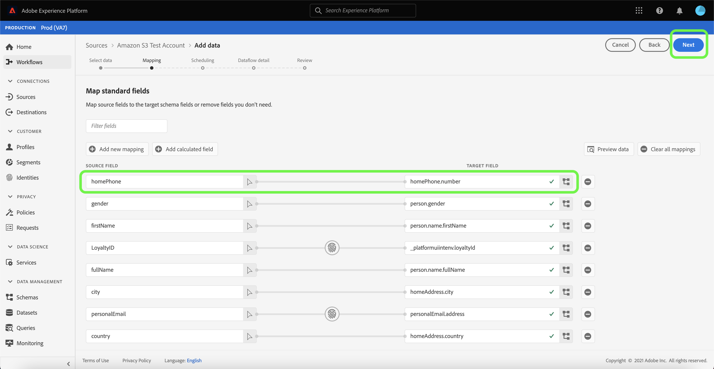

# Aggiornare i flussi di dati nell’interfaccia utente

Questa esercitazione descrive come aggiornare un flusso di dati sorgente esistente, incluse informazioni sulla modifica di una pianificazione e della mappatura del flusso di dati, utilizzando l’ area di lavoro [!UICONTROL Sources] .

## Introduzione

Questa esercitazione richiede una buona comprensione dei seguenti componenti di Adobe Experience Platform:

- [Origini](../../home.md): L’Experience Platform consente di acquisire dati da varie sorgenti e allo stesso tempo di strutturare, etichettare e migliorare i dati in arrivo tramite i servizi Platform.
- [Sandbox](../../../sandboxes/home.md): Experience Platform fornisce sandbox virtuali che suddividono una singola istanza di Platform in ambienti virtuali separati per sviluppare e sviluppare applicazioni di esperienza digitale.

## Modifica mappatura

>[!NOTE]
>
>La funzione di mappatura della modifica non è attualmente supportata per le seguenti origini: Adobe Analytics, Adobe Audience Manager, API HTTP e [!DNL Marketo Engage].

Nell’interfaccia utente di Platform, seleziona **[!UICONTROL Sources]** dal menu di navigazione a sinistra per accedere all’area di lavoro [!UICONTROL Sources]. Seleziona **[!UICONTROL Dataflows]** dall’intestazione superiore per visualizzare un elenco dei flussi di dati esistenti.

La pagina [!UICONTROL Dataflows] contiene un elenco di tutti i flussi di dati esistenti, incluse informazioni sullo stato di esecuzione, la data dell’ultima esecuzione e il nome dell’account.

Seleziona l&#39;icona del filtro  in alto a sinistra per avviare il pannello di ordinamento.

Il pannello di ordinamento fornisce un elenco di tutte le origini disponibili. È possibile selezionare più di un’origine dall’elenco per accedere a una selezione filtrata di flussi di dati appartenenti a origini diverse.

Seleziona l’origine con cui desideri lavorare per visualizzare un elenco dei relativi flussi di dati esistenti. Una volta identificato il flusso di dati che si desidera aggiornare, selezionare i puntini di sospensione (`...`) accanto al nome dell&#39;account.

Viene visualizzato un menu a discesa che fornisce le opzioni per aggiornare il flusso di dati selezionato. Da qui puoi scegliere di aggiornare i set di mappatura e la pianificazione dell’acquisizione di un flusso di dati. Puoi anche selezionare le opzioni per controllare il flusso di dati nel dashboard di monitoraggio, nonché disabilitare o eliminare il flusso di dati.

Seleziona **[!UICONTROL Edit source]** per aggiornare la mappatura.

Viene visualizzato il passaggio [!UICONTROL Add data] . Seleziona il formato di dati appropriato per controllare il contenuto dei dati selezionati, quindi seleziona **[!UICONTROL Next]** per procedere.

La pagina [!UICONTROL Mapping] offre un’interfaccia che consente di aggiungere e rimuovere set di mappature associati al set di dati.

>[!TIP]
>
>Gli aggiornamenti di mappatura vengono applicati solo alle esecuzioni del flusso di dati pianificate in futuro.

Seleziona **[!UICONTROL Add new mapping]** per aggiungere un nuovo set di mappature.

Quindi, immetti l&#39;attributo del campo di origine appropriato e i valori del campo XDM di destinazione appropriati per completare il set di mappatura aggiuntivo. Selezionare **[!UICONTROL Next]** per continuare.

Viene visualizzato il passaggio [!UICONTROL Scheduling] , che consente di aggiornare la pianificazione dell’acquisizione del flusso di dati e di acquisire automaticamente i dati di origine selezionati con le mappature aggiornate.

>[!NOTE]
>
>Non è possibile aggiornare i set di mappatura per i flussi di dati pianificati per l’inserimento una tantum e l’ora di inizio è passata.

Nella pagina [!UICONTROL Dataflow detail] puoi fornire un nome e una descrizione aggiornati per il flusso di dati e riconfigurare la soglia di errore del flusso di dati.

Dopo aver fornito i valori aggiornati, seleziona **[!UICONTROL Next]**.

Viene visualizzato il passaggio **[!UICONTROL Review]** , che consente di rivedere il flusso di dati prima di aggiornarlo.

Dopo aver rivisto il flusso di dati, seleziona **[!UICONTROL Finish]** e lascia che sia necessario un po&#39; di tempo per il flusso di dati con i nuovi set di mappatura da creare.

## Modifica pianificazione

Per modificare la pianificazione di acquisizione di un flusso di dati esistente, seleziona i puntini di sospensione (`...`) accanto al nome di un flusso di dati, quindi seleziona **[!UICONTROL Edit schedule]** dal menu a discesa.

La finestra di dialogo **[!UICONTROL Edit schedule]** offre le opzioni per aggiornare la frequenza di acquisizione e la frequenza di intervallo del flusso di dati. Una volta impostati i valori di frequenza e intervallo aggiornati, selezionare **[!UICONTROL Save]**.

>[!NOTE]
>
>Non è possibile ripianificare un flusso di dati pianificato per l’inserimento una tantum.

| Pianificazione | Descrizione |
| ---------- | ----------- |
| Frequenza | Frequenza con cui il flusso di dati raccoglie i dati. I valori accettabili per la modifica della pianificazione della frequenza per un flusso di dati già esistente includono: `minute`, `hour`, `day` o `week`. |
| Intervallo | L&#39;intervallo indica il periodo tra due esecuzioni di flusso consecutive. Il valore dell&#39;intervallo deve essere un numero intero diverso da zero e deve essere maggiore o uguale a `15`. |

Dopo alcuni istanti, nella parte inferiore dello schermo viene visualizzata una casella di conferma per confermare l’avvenuto aggiornamento.

## Passaggi successivi

Seguendo questa esercitazione, hai utilizzato correttamente l’ area di lavoro [!UICONTROL Sources] per aggiornare la pianificazione dell’acquisizione e i set di mappatura del flusso di dati.

Per i passaggi su come eseguire queste operazioni a livello di programmazione utilizzando l’ API [!DNL Flow Service], fai riferimento all’esercitazione sull’ [aggiornamento dei flussi di dati tramite l’API del servizio di flusso](../../tutorials/api/update-dataflows.md).
