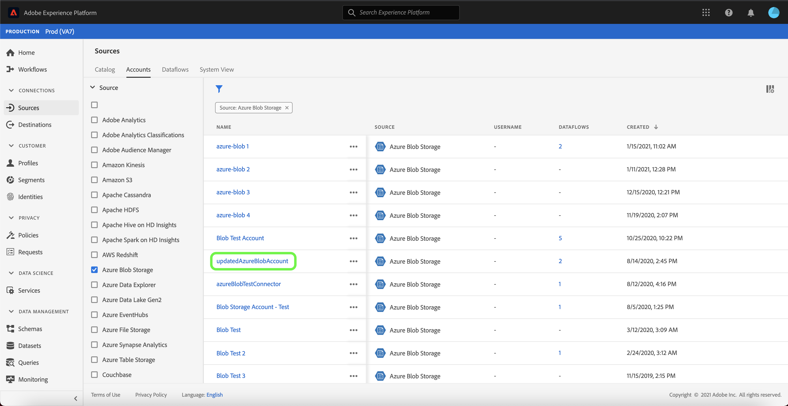

# Aggiornare i dettagli dell’account nell’interfaccia utente

In alcuni casi, potrebbe essere necessario aggiornare i dettagli di un account di origini esistente. L’area di lavoro [!UICONTROL Sources] consente di aggiungere, modificare ed eliminare i dettagli di una connessione batch o in streaming esistente, inclusi nome, descrizione e credenziali.

L’area di lavoro [!UICONTROL Sources] consente inoltre di modificare la pianificazione dei flussi di dati batch, per aggiornarne la frequenza di acquisizione e la frequenza dell’intervallo.

Questa esercitazione fornisce passaggi per aggiornare i dettagli e le credenziali di un account esistente dall&#39;area di lavoro [!UICONTROL Sources] e per aggiornare la pianificazione dell&#39;acquisizione di un flusso di dati.

## Introduzione

Questa esercitazione richiede una buona comprensione dei seguenti componenti di Adobe Experience Platform:

- [Origini](../../home.md): Experience Platform consente di acquisire dati da varie sorgenti e allo stesso tempo di strutturare, etichettare e migliorare i dati in arrivo tramite i servizi di Platform.
- [Sandbox](../../../sandboxes/home.md): Experience Platform fornisce sandbox virtuali che suddividono una singola istanza di Platform in ambienti virtuali separati per sviluppare e sviluppare applicazioni di esperienza digitale.

## Aggiorna account

Accedi all’ [Interfaccia utente di Experience Platform](https://platform.adobe.com) e seleziona **[!UICONTROL Sources]** dal menu di navigazione a sinistra per accedere all’area di lavoro [!UICONTROL Sources]. Seleziona **[!UICONTROL Accounts]** dall&#39;intestazione superiore per visualizzare gli account esistenti.

Viene visualizzata la pagina **[!UICONTROL Accounts]** . In questa pagina è presente un elenco di account visualizzabili, che include informazioni sulla loro origine, nome utente, numero di flussi di dati e data di creazione.

Seleziona l&#39;icona del filtro  in alto a sinistra per avviare il pannello di ordinamento.

Il pannello di ordinamento fornisce un elenco di tutte le origini. È possibile selezionare più di un&#39;origine dall&#39;elenco per accedere a una selezione filtrata di account associati a origini diverse.

Selezionare l&#39;origine con cui si desidera lavorare per visualizzare un elenco dei relativi account esistenti. Una volta identificato l&#39;account che si desidera aggiornare, selezionare i puntini di sospensione (`...`) accanto al nome dell&#39;account.

Viene visualizzato un menu a discesa che fornisce le opzioni per **[!UICONTROL Add data]**, **[!UICONTROL Edit details]** e **[!UICONTROL Delete]**. Seleziona **[!UICONTROL Edit details]** dal menu per aggiornare il tuo account.

La finestra di dialogo **[!UICONTROL Edit account details]** consente di aggiornare il nome, la descrizione e le credenziali di autenticazione di un account. Dopo aver aggiornato le informazioni desiderate, seleziona **[!UICONTROL Save]**.

Dopo alcuni istanti, nella parte inferiore dello schermo viene visualizzata una casella di conferma per confermare l’avvenuto aggiornamento.

## Modifica pianificazione

Puoi modificare la pianificazione dell’acquisizione di un flusso di dati dalla pagina **[!UICONTROL Accounts]** . Dall&#39;elenco degli account, selezionare l&#39;account contenente il flusso di dati che si desidera riprogrammare.

Viene visualizzata la pagina dei flussi di dati. Questa pagina contiene un elenco dei flussi di dati esistenti associati all’account selezionato. Selezionare i puntini di sospensione (`...`) accanto al flusso di dati che si desidera riprogrammare.

Viene visualizzato un menu a discesa che fornisce le opzioni per **[!UICONTROL Edit schedule]**, **[!UICONTROL Enable dataflow]**, **[!UICONTROL View in monitoring]** e **[!UICONTROL Delete]**. Seleziona **[!UICONTROL Edit schedule]** dal menu.

La finestra di dialogo **[!UICONTROL Edit schedule]** offre le opzioni per aggiornare la frequenza di acquisizione e la frequenza di intervallo del flusso di dati. Una volta impostati i valori di frequenza e intervallo aggiornati, selezionare **[!UICONTROL Save]**.

| Pianificazione | Descrizione |
| ---------- | ----------- |
| Frequenza | Frequenza con cui il flusso di dati raccoglie i dati. I valori accettabili per la modifica della pianificazione della frequenza per un flusso di dati già esistente includono: `minute`, `hour`, `day` o `week`. |
| Intervallo | L&#39;intervallo indica il periodo tra due esecuzioni di flusso consecutive. Il valore dell&#39;intervallo deve essere un numero intero diverso da zero e deve essere maggiore o uguale a `15`. |

Dopo alcuni istanti, nella parte inferiore dello schermo viene visualizzata una casella di conferma per confermare l’avvenuto aggiornamento.

## Passaggi successivi

Seguendo questa esercitazione, hai utilizzato correttamente l’ area di lavoro [!UICONTROL Sources] per aggiornare le informazioni sull’account e modificare la pianificazione del flusso di dati.

Per informazioni su come eseguire queste operazioni a livello di programmazione utilizzando l’ API [!DNL Flow Service], fai riferimento all’esercitazione sull’ [aggiornamento delle informazioni di connessione tramite l’API del servizio di flusso](../../tutorials/api/update.md).