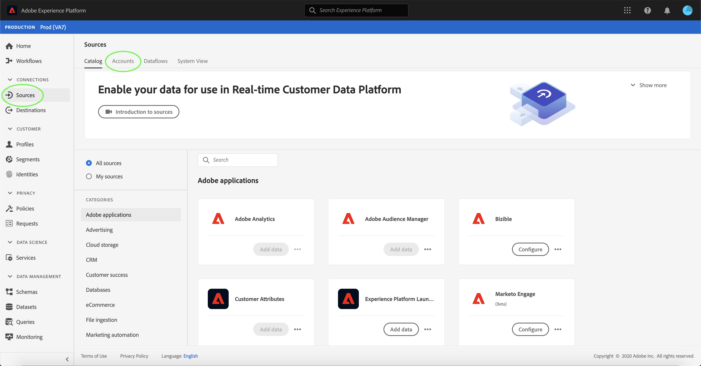
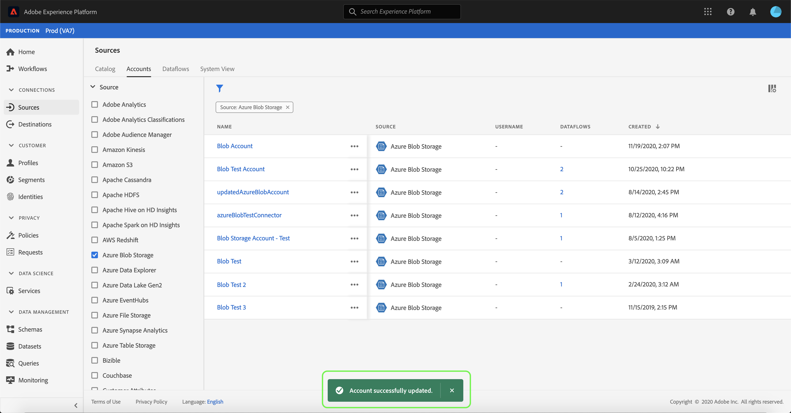

# Aggiornamento dei dettagli dell’account nell’interfaccia utente

In alcuni casi, potrebbe essere necessario aggiornare i dettagli di un conto origini esistente. L&#39;area di lavoro [!UICONTROL Sources] consente di aggiungere, modificare ed eliminare i dettagli di una connessione batch o streaming esistente, inclusi il nome, la descrizione e le credenziali.

Questa esercitazione fornisce i passaggi per aggiornare i dettagli e le credenziali di un account esistente dall&#39;area di lavoro [!UICONTROL Sources].

## Introduzione

Questo tutorial richiede una buona conoscenza dei seguenti componenti di Adobe Experience Platform:

- [Origini](../../home.md): Experience Platform consente di acquisire dati da varie origini e allo stesso tempo di strutturare, etichettare e migliorare i dati in arrivo tramite i servizi di Platform.
- [Sandbox](../../../sandboxes/home.md): Experience Platform fornisce sandbox virtuali che suddividono una singola istanza Platform in ambienti virtuali separati, utili per le attività di sviluppo e aggiornamento delle applicazioni di esperienza digitale.

## Aggiorna account

Accedi all&#39;[interfaccia utente Experience Platform](https://platform.adobe.com), quindi seleziona **[!UICONTROL Origini]** dal menu di navigazione a sinistra per accedere all&#39;area di lavoro [!UICONTROL Origini]. Seleziona **[!UICONTROL Account]** dall&#39;intestazione superiore per visualizzare gli account esistenti.

Viene visualizzata la pagina **[!UICONTROL Account]**. In questa pagina è riportato un elenco di account visualizzabili, con informazioni sulla loro origine, nome utente, numero di flussi di dati e data di creazione.

Seleziona l&#39;icona del filtro  in alto a sinistra per avviare il pannello di ordinamento.

Il pannello di ordinamento fornisce un elenco di tutte le origini. È possibile selezionare più origini dall&#39;elenco per accedere a una selezione filtrata di account associati a origini diverse.

Seleziona l’origine con cui vuoi lavorare per visualizzare un elenco dei suoi account esistenti. Dopo aver identificato l&#39;account da aggiornare, selezionare i puntini di sospensione (`...`) accanto al nome dell&#39;account.

Viene visualizzato un menu a discesa che fornisce le opzioni per **[!UICONTROL Aggiungere dati]**, **[!UICONTROL Modificare i dettagli]** e **[!UICONTROL Eliminare]**. Seleziona **[!UICONTROL Modifica dettagli]** dal menu per aggiornare l&#39;account.

Aggiornamento 

La finestra di dialogo **[!UICONTROL Modifica dettagli account]** consente di aggiornare il nome, la descrizione e le credenziali di autenticazione di un account. Dopo aver aggiornato le informazioni desiderate, selezionare **[!UICONTROL Salva]**.

Dopo alcuni istanti, nella parte inferiore della schermata viene visualizzata una casella di conferma per confermare la riuscita dell’aggiornamento.

## Passaggi successivi

Seguendo questa esercitazione, hai utilizzato correttamente l&#39;area di lavoro [!UICONTROL Sources] per aggiornare le informazioni di un account di origine esistente.

Per i passaggi su come eseguire queste operazioni a livello di programmazione utilizzando l&#39;API [!DNL Flow Service], fare riferimento al tutorial su [aggiornamento delle informazioni di connessione tramite l&#39;API del servizio Flusso](../../tutorials/api/update.md).
