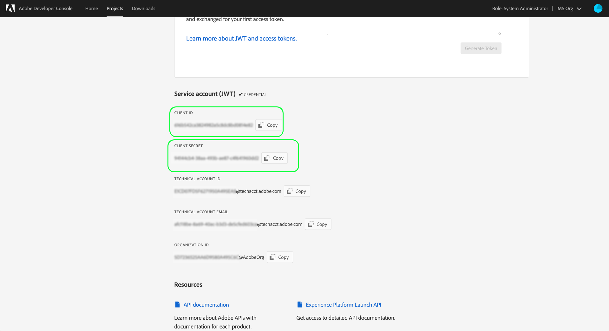

# Guida introduttiva all’API di Reactor

Per utilizzare l’[API di Reactor](https://www.adobe.io/experience-platform-apis/references/reactor/), ogni richiesta deve includere le seguenti intestazioni di autenticazione:

* `Authorization: Bearer {ACCESS_TOKEN}`
* `x-api-key: {API_KEY}`
* `x-gw-ims-org-id: {ORG_ID}`

Questa guida illustra come utilizzare Adobe Developer Console per raccogliere i valori per ciascuna di queste intestazioni, in modo da poter iniziare a effettuare chiamate all’API di Reactor.

## Accesso degli sviluppatori a Adobe Experience Platform

Prima di poter generare i valori di autenticazione per l’API di Reactor, devi disporre dell’accesso ad Experience Platform come sviluppatore. Per ottenere l’accesso come sviluppatore, segui i passaggi iniziali descritti nel [tutorial sull’autenticazione per Experience Platform](https://www.adobe.com/go/platform-api-authentication-en). Una volta completato il passaggio &quot;Accesso utente guadagno&quot;, torna a questa esercitazione per generare le credenziali specifiche dell’API del reattore.

## Generare le credenziali di accesso

Utilizzando Adobe Developer Console, è necessario generare le tre credenziali di accesso seguenti:

* `{ORG_ID}`
* `{API_KEY}`
* `{ACCESS_TOKEN}`

Una volta generati, l’ID organizzazione IMS (`{ORG_ID}`) e la chiave API (`{API_KEY}`) possono essere riutilizzati nelle chiamate API future. Il token di accesso (`{ACCESS_TOKEN}`) è invece temporaneo e deve essere rigenerato ogni 24 ore.

I passaggi per generare questi valori sono descritti in dettaglio di seguito.

### Configurazione una tantum

Vai a [Adobe Developer Console](https://www.adobe.com/go/devs_console_ui) e accedi con il tuo Adobe ID. Quindi, segui i passaggi descritti nel tutorial su come [creare un progetto vuoto](https://developer.adobe.com/developer-console/docs/guides/projects/projects-empty/), nella documentazione di Developer Console.

Dopo aver creato un progetto, seleziona **Add API** (Aggiungi API) nella schermata **Project Overview** (Panoramica progetto).


Viene visualizzata la schermata **Add an API** (Aggiungi un’API). Seleziona **Experience Platform Reactor API** dall’elenco delle API disponibili prima di selezionare **Next** (Avanti).


Nella schermata successiva viene richiesto di creare una credenziale JSON Web Token (JWT) per generare una nuova coppia di chiavi o caricare una tua chiave pubblica. Per questo tutorial, seleziona l’opzione **Generate a key pair** (Genera una coppia di chiavi), quindi seleziona **Generate keypair** (Genera coppia di chiavi) in basso a destra.


La schermata successiva conferma che la coppia di chiavi è stata generata correttamente; nel computer viene automaticamente scaricata una cartella compressa contenente un certificato pubblico e una chiave privata. La chiave privata è necessaria in un passaggio successivo per generare un token di accesso.

Seleziona **Next** (Avanti) per continuare.


Nella schermata successiva viene richiesto di selezionare uno o più profili di prodotto da associare all’integrazione API.

>[!NOTE]
>
>I profili di prodotto sono gestiti dalla tua organizzazione tramite Adobe Admin Console e contengono set specifici di autorizzazioni per le funzioni granulari. I profili di prodotto e le relative autorizzazioni possono essere gestiti solo da utenti con privilegi di amministratore all’interno della tua organizzazione. Se non sei sicuro dei profili di prodotto da selezionare per l’API, contatta l’amministratore.

Seleziona i profili di prodotto desiderati dall’elenco, quindi seleziona **Save configured API** (Salva API configurata) per completare la registrazione dell’API.


Una volta aggiunta l’API al progetto, la pagina del progetto viene nuovamente visualizzata nella pagina Experience Platform Reactor API. Da qui, scorri verso il basso fino alla sezione **Service Account (JWT)** (Account di servizio (JWT)), che fornisce le seguenti credenziali di accesso necessarie in tutte le chiamate all’API di Reactor:

* **CLIENT ID**: l’ID client è il valore `{API_KEY}` obbligatorio che deve essere fornito nell’intestazione `x-api-key`.
* **ORGANIZATION ID**: l’ID organizzazione è il valore `{ORG_ID}` che deve essere utilizzato nell’intestazione `x-gw-ims-org-id`.


### Autenticazione per ogni sessione

Ora che disponi dei valori `{API_KEY}` e `{ORG_ID}`, nel passaggio finale verrà generato un valore `{ACCESS_TOKEN}`.

>[!NOTE]
>
>Questi token scadono dopo 24 ore. Se utilizzi questa integrazione per un’applicazione, è consigliabile ottenere il token Bearer a livello di programmazione dall’interno dell’applicazione.

È possibile generare i token di accesso in due modi, a seconda del caso d’uso:

* [Generare i token manualmente](#manual)
* [Generare i token a livello di programmazione](#program)

#### Generare manualmente i token di accesso {#manual}

Apri la chiave privata scaricata in precedenza in un editor di testo o in un browser e copiane il contenuto. Quindi, torna a Developer Console e incolla la chiave privata nella sezione **Generate access token** (Genera token di accesso) della pagina API di Reactor per il progetto prima di selezionare **Generate Token** (Genera token).


Viene generato un nuovo token di accesso, e un pulsante consente di copiarlo negli Appunti. Questo valore viene utilizzato per l’intestazione `Authorization` richiesta e deve essere fornito nel formato `Bearer {ACCESS_TOKEN}`.


#### Generare i token di accesso a livello di programmazione {#program}

Se utilizzi l’integrazione per un’applicazione, puoi generare in modo programmatico i token di accesso tramite richieste API. Per eseguire questa operazione, è necessario ottenere i seguenti valori:

* ID client (`{API_KEY}`)
* Segreto client (`{SECRET}`)
* Un token web JSON (`{JWT}`)

L’ID client e il segreto possono essere ottenuti dalla pagina principale del progetto, come descritto nel [passaggio precedente](#one-time-setup).



Per ottenere le credenziali JWT, passa a **Service Account (JWT)** (Account di servizio JWT) nel menu di navigazione a sinistra, quindi seleziona la scheda **Generate JWT** (Genera JWT). In questa pagina, in **Generate custom JWT** (Genera JWT personalizzato), incolla il contenuto della chiave privata nella casella di testo, quindi seleziona **Generate Token** (Genera token).


Il JWT generato viene visualizzato di seguito al termine dell’elaborazione, insieme a un comando cURL di esempio che puoi eventualmente utilizzare per testare il token. Utilizza il pulsante **Copy** per copiare il token negli Appunti.


Una volta raccolte le credenziali, puoi integrare la chiamata API riportata di seguito nell’applicazione per generare in modo programmatico i token di accesso.

**Richiesta**

La richiesta deve inviare un payload `multipart/form-data`, fornendo le credenziali di autenticazione come mostrato di seguito:

```shell
curl -X POST \
  https://ims-na1.adobelogin.com/ims/exchange/jwt/ \
  -H 'Content-Type: multipart/form-data' \
  -F 'client_id={API_KEY}' \
  -F 'client_secret={SECRET}' \
  -F 'jwt_token={JWT}'
```

**Risposta**

In caso di esito positivo, la risposta restituisce un nuovo token di accesso, oltre al numero di secondi rimasti fino alla scadenza.

```json
{
  "token_type": "bearer",
  "access_token": "{ACCESS_TOKEN}",
  "expires_in": 86399999
}
```

| Proprietà | Descrizione |
| :-- | :-- |
| `access_token` | Valore del token di accesso appena generato. Questo valore viene utilizzato per l’intestazione `Authorization` richiesta e deve essere fornito nel formato `Bearer {ACCESS_TOKEN}`. |
| `expires_in` | Tempo rimanente alla scadenza del token, in millisecondi. Una volta scaduto il token, è necessario generarne uno nuovo. |

{style="table-layout:auto"}

## Passaggi successivi

Seguendo i passaggi descritti in questo tutorial, dovresti disporre di valori validi per `{ORG_ID}`, `{API_KEY}` e `{ACCESS_TOKEN}`. Ora puoi testare questi valori utilizzandoli in una semplice richiesta cURL all’API di Reactor.

Per prima cosa, prova ad effettuare una chiamata API per [elencare tutte le aziende](./endpoints/companies.md#list).

>[!NOTE]
>
>Se nell’organizzazione non è presente alcuna azienda, la risposta sarà lo stato HTTP 404 (Non trovato). Purché non venga restituito un errore 403 (proibito), le credenziali di accesso sono valide e funzionanti.

Una volta confermato il funzionamento delle credenziali di accesso, continua a esplorare il resto della documentazione sull’API per scoprirne le numerose funzionalità.

## Risorse aggiuntive

Librerie JWT e SDK: [https://jwt.io/](https://jwt.io/)

Sviluppo di API con Postman: [https://www.postman.com/](https://www.postman.com/)
