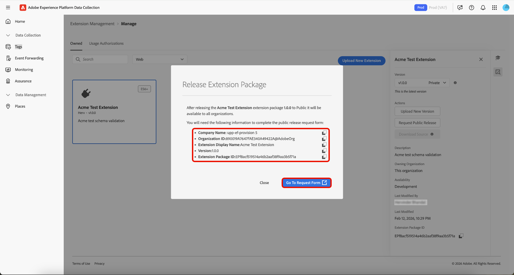

# Gestione delle estensioni tag

Adobe Experience Platform consente di gestire le estensioni **[!UICONTROL Owned]**. Puoi caricare nuove estensioni, distribuire nuove versioni e rilasciarle con disponibilità pubblica o privata.

## Gestire un’estensione  {#manage-extension}

Dopo aver preparato il pacchetto di estensione localmente, utilizza **[!UICONTROL Extension Management]** nell&#39;interfaccia utente di Data Collection per caricarlo, convalidarlo e rilasciare le versioni tramite la disponibilità di **Sviluppo**, **Privato** e **Pubblico**. Puoi quindi installare l’estensione su una proprietà e utilizzarla per il test.

### Caricare un&#39;estensione {#upload-extension}

Per caricare un&#39;estensione, passa all&#39;interfaccia utente di Data Collection e seleziona **[!UICONTROL Extension Management]** dal menu di navigazione a sinistra. Da qui, selezionare la scheda **[!UICONTROL Owned]**. Questa scheda mostra tutte le estensioni di tua proprietà o della tua organizzazione. Sono separati per piattaforma e puoi vedere quali estensioni hai su ogni piattaforma (Web, Mobile e Edge) utilizzando il menu a discesa. Seleziona **[!UICONTROL Upload New Extension]**.

Nella pagina **Carica nuova estensione**, seleziona **[!UICONTROL Select Extension Folder]**, passa alla cartella contenente l&#39;estensione, seleziona la cartella, quindi seleziona **[!UICONTROL Upload]**.

Confermare il numero di file che verranno caricati selezionando **[!UICONTROL Upload]**.

Viene visualizzato il numero di file che verranno caricati, inclusi il nome dell’estensione e la versione. È possibile eseguire un **[!UICONTROL Dry Run]** che scaricherà un file zip nel computer locale per l&#39;ispezione. Seleziona **[!UICONTROL Validate & Upload]**.

La conferma che l&#39;estensione è stata caricata ed elaborata correttamente viene visualizzata insieme all&#39;**ID pacchetto estensione**. Seleziona **[!UICONTROL Close]** per tornare alla scheda **[!UICONTROL Owned]** in cui è visualizzata l&#39;estensione.

Si è tornati alla scheda [!UICONTROL Owned] in cui è visualizzata l&#39;estensione aggiornata.

>[!IMPORTANT]
>
>Le estensioni vengono caricate nella disponibilità di **Sviluppo**. Le estensioni nella disponibilità di **Sviluppo** non possono essere condivise finché non vengono rilasciate nella disponibilità di **Privato**.

### Rilasciare un’estensione {#release-extension}

Per rilasciare l’estensione affinché sia disponibile privatamente, seleziona l’estensione per visualizzare il pannello informazioni a destra. Qui puoi vedere i seguenti dettagli dell’estensione:

* **Versione** - Mostra la versione più recente e lo stato in cui si trova attualmente. Puoi utilizzare il menu a discesa per visualizzare la cronologia delle versioni dell’estensione.
* **Azioni** - Consente di **[!UICONTROL Upload New Version]** dell&#39;estensione e **[!UICONTROL Release To Private]**.
* **ID pacchetto di estensione** - Visualizzato in basso. Questo cambierà a seconda della versione selezionata.

Seleziona **[!UICONTROL Release To Private]**, quindi seleziona di nuovo **[!UICONTROL Release To Private]** per confermare la versione.

La conferma viene ricevuta dopo che l&#39;estensione è stata rilasciata correttamente per la disponibilità **Privato**. La disponibilità aggiornata può essere visualizzata nel pannello a destra.

>[!NOTE]
>
>Una volta rilasciata l&#39;estensione a **Privato**, sarà disponibile per essere condivisa con altre organizzazioni.

Per rilasciare l&#39;estensione alla disponibilità **Pubblico**, seleziona **[!UICONTROL Request Public Release]** dal pannello di destra.

La schermata **[!UICONTROL Release Extension Package]** fornisce i dettagli che saranno richiesti nel modulo di richiesta, con un&#39;opzione per copiare i dettagli. Seleziona **[!UICONTROL Go To Request Form]**.

Viene aperta una nuova scheda del browser contenente il modulo di richiesta. Copiare e incollare le informazioni dalla schermata **[!UICONTROL Release Extension Package]** nei campi pertinenti. Inviare il modulo compilato per la revisione. Riceverai una notifica una volta che l&#39;estensione sarà stata resa pubblica.

## Condividere pacchetti di estensione con altre organizzazioni {#share-extension}

>[!NOTE]
>
>I pacchetti di estensione devono avere una versione privata o pubblica per essere condivisi tramite [!UICONTROL Usage Authorizations]. Le versioni contrassegnate come Disponibilità di sviluppo non sono idonee per la condivisione e non verranno visualizzate nel menu a discesa Autorizzazione. Ciò si applica anche se è già stata condivisa una versione precedente (ad esempio, 1.0.0). Le versioni più recenti (ad esempio, 1.0.1) devono essere rese almeno private prima di poter essere autorizzate o installate dalle organizzazioni riceventi.
>
>Tutte le indicazioni relative alla condivisione di pacchetti di estensione privati si applicano anche se successivamente scegli di renderli pubblici. Le stesse considerazioni su visibilità, controllo delle versioni, sicurezza, compatibilità, supporto e documentazione rimangono rilevanti indipendentemente dallo stato di disponibilità del pacchetto.

**[!UICONTROL Usage Authorizations]** è una funzionalità potente che consente di condividere in modo sicuro pacchetti di estensione privati con partner attendibili senza renderli disponibili pubblicamente nel catalogo delle estensioni. Utilizza questa funzione per creare un ponte sicuro tra le organizzazioni, consentendoti di sfruttare il codice di estensione personalizzato dell’altra organizzazione mantenendo al contempo la privacy e il controllo sulle soluzioni proprietarie.

Le organizzazioni spesso sviluppano estensioni specializzate personalizzate in base ai propri requisiti aziendali specifici. Queste estensioni possono contenere logica proprietaria, integrazioni personalizzate o configurazioni sensibili che non devono essere rese pubbliche. Le autorizzazioni di utilizzo risolvono questo problema consentendo:

* **Condivisione selettiva**: condividere estensioni private solo con organizzazioni partner attendibili.
* **Privacy mantenuta**: escludi dal catalogo pubblico il codice di estensione riservato.
* **Sviluppo collaborativo**: consente ai partner attendibili di beneficiare delle soluzioni personalizzate.
* **Accesso controllato**: mantieni il controllo completo su chi può accedere e utilizzare le estensioni private.

Il processo di condivisione coinvolge due partecipanti chiave:

1. **Organizzazione di condivisione**: l&#39;organizzazione proprietaria e condivisa del pacchetto di estensione privato
2. **Organizzazione di ricezione**: l&#39;organizzazione attendibile che ottiene l&#39;accesso all&#39;estensione condivisa

Quando viene condivisa una versione privata, l’organizzazione ricevente ottiene l’accesso a tale versione specifica, creando una connessione diretta tra le due organizzazioni. Se una versione più recente viene successivamente resa privata, sarà disponibile anche per l’organizzazione ricevente senza richiedere alcun passaggio aggiuntivo da parte loro.

### Creare un’autorizzazione per l’utilizzo del pacchetto di estensione {#package-usage-authorization}

Per condividere un&#39;estensione, passa all&#39;interfaccia utente di Data Collection e seleziona **[!UICONTROL Extension Management]** dal menu di navigazione a sinistra. Da qui, selezionare la scheda **[!UICONTROL Usage Authorizations]**.

In questo caso, viene visualizzato un elenco delle autorizzazioni condivise esistenti organizzate in due categorie:

* **Condiviso con questa organizzazione**: estensioni condivise con te da altre organizzazioni.
* **Condiviso con altre organizzazioni**: estensioni condivise con altre organizzazioni.

Seleziona **[!UICONTROL Add Authorization]**.

![La scheda [!UICONTROL Usage Authorizations] mostra un elenco di estensioni condivise con questa organizzazione, evidenziando [!UICONTROL Add Authorization]](../images/shared-extensions/add-authorization.png)

>[!IMPORTANT]
>
>È necessario ottenere **`Organization ID`** dell&#39;organizzazione di destinazione come proprietario dell&#39;organizzazione. Non è possibile eseguire ricerche per nome nelle organizzazioni.

Selezionare **[!UICONTROL Platform]** per il quale si desidera autorizzare un&#39;estensione dal menu a discesa. È possibile condividere **[!UICONTROL Web]**, **[!UICONTROL Mobile]** e **[!UICONTROL Edge]** estensioni.

Quindi, seleziona **[!UICONTROL Extension]** che desideri condividere dalle estensioni disponibili nel menu a discesa. L’elenco mostra le estensioni di proprietà dell’organizzazione e il loro stato di disponibilità. Le estensioni la cui versione più recente è disponibile in **Sviluppo** non verranno visualizzate in questo elenco.

Immettere l&#39;ID dell&#39;organizzazione ricevente, quindi selezionare **[!UICONTROL Save]**.

![È stata immessa la pagina [!UICONTROL Create extension package usage authorization] che mostra un&#39;estensione selezionata e l&#39;ID organizzazione Adobe, evidenziando [!UICONTROL Save]](../images/shared-extensions/save-authorization.png)

Si è tornati alla scheda [!UICONTROL Usage Authorizations] in cui è possibile visualizzare l&#39;estensione nell&#39;elenco **[!UICONTROL Shared with other orgs]**. Lo stato visualizzato **In attesa di approvazione** fino a quando l&#39;organizzazione ricevente non approva l&#39;autorizzazione, nel qual caso verrà aggiornato a **Approvato**.

![La scheda [!UICONTROL Usage Authorizations] mostra un elenco di estensioni condivise con altre organizzazioni, evidenziando la nuova autorizzazione](../images/shared-extensions/new-authorization.png)

>[!TIP]
>
>È inoltre possibile condividere le estensioni direttamente da **[!UICONTROL Extension Catalog]** selezionando il menu (⋯) nella scheda delle estensioni, quindi selezionando l&#39;opzione di condivisione dal menu.

Quando un&#39;autorizzazione è attiva, l&#39;estensione condivisa visualizza un contrassegno ***Condivisione*** nel catalogo che indica che è condivisa con altre organizzazioni.

![La scheda [!UICONTROL Catalog] che mostra l&#39;estensione condivisa con il badge](../images/shared-extensions/sharing-badge.png)

### Autorizzare e gestire le estensioni condivise {#manage-shared-extension}

>[!NOTE]
>
>In qualità di organizzazione ricevente, puoi approvare o rifiutare solo le estensioni condivise. Non è possibile gestire o modificare i dettagli dell’autorizzazione, in quanto sono controllati dall’organizzazione che condivide.

Per autorizzare un&#39;estensione condivisa per la tua organizzazione, passa all&#39;interfaccia utente di Data Collection e seleziona **[!UICONTROL Extension Management]** dal menu di navigazione a sinistra, quindi seleziona la scheda **[!UICONTROL Usage Authorizations]**.

Puoi visualizzare un elenco di estensioni condivise, incluse quelle **In attesa di approvazione** nella sezione **[!UICONTROL Shared with this org]**. Selezionare l&#39;estensione da approvare, quindi selezionare **[!UICONTROL Approve]**.

![La scheda [!UICONTROL Usage Authorizations] mostra un elenco di estensioni condivise con questa organizzazione con l&#39;estensione in attesa di approvazione selezionata, evidenziando [!UICONTROL Approve]](../images/shared-extensions/approve-authorization.png)

>[!NOTE]
>
>È inoltre possibile rifiutare una richiesta nella scheda **[!UICONTROL Usage Authorizations]** se l&#39;estensione condivisa non è più richiesta dall&#39;organizzazione.

Selezionare **[!UICONTROL OK]** nella finestra di dialogo **[!UICONTROL Authorization Usages]**.

![Finestra di dialogo [!UICONTROL Authorization Usages], evidenziazione di [!UICONTROL OK]](../images/shared-extensions/confirmation.png)

Sei tornato alla scheda [!UICONTROL Usage Authorizations] dove puoi vedere che l&#39;estensione ora mostra uno stato **Approvato**.

![La scheda [!UICONTROL Usage Authorizations] mostra un elenco di estensioni condivise con questa organizzazione, evidenziando l&#39;estensione con lo stato Approvato](../images/shared-extensions/approved-authorization.png)

Una volta approvata l’autorizzazione, l’estensione è disponibile nel catalogo e può essere installata e utilizzata come qualsiasi altra estensione. L&#39;estensione condivisa visualizza un contrassegno ***Ricezione*** che indica che si tratta di un&#39;estensione condivisa con te da un&#39;altra organizzazione.

![La scheda [!UICONTROL Catalog] che mostra l&#39;estensione condivisa con il badge &quot;Ricezione&quot;](../images/shared-extensions/receiving-badge.png)

### Revoca delle autorizzazioni {#revoke-authorization}

In qualità di organizzazione proprietaria, è possibile eliminare un’autorizzazione in qualsiasi momento, indipendentemente dal suo stato corrente (In attesa di approvazione, Rifiutata o Approvata).

**Se l&#39;estensione non è mai stata resa pubblica:**

* Qualsiasi versione privata già installata dall’organizzazione ricevente continuerà a essere visualizzata nell’elenco delle estensioni installate.
* Se l’organizzazione ricevente non ha mai installato l’estensione, questa non verrà più visualizzata in nessuna parte dell’interfaccia.

**Se l&#39;estensione è stata resa pubblica:**

* Tutte le versioni private installate dall’organizzazione ricevente rimangono visibili nell’elenco delle estensioni installate.
* Se non hanno mai installato la tua versione privata, vedranno comunque l’ultima versione pubblica nel loro catalogo e potranno installarla.
* Puoi anche effettuare il downgrade dalla versione privata alla versione pubblica più recente, se lo desideri.

Quando revochi un’autorizzazione, l’organizzazione ricevente mantiene alcuni diritti per proteggere le implementazioni esistenti:

* **Utilizzo continuato**: l&#39;organizzazione ricevente può continuare a utilizzare qualsiasi versione privata già installata, anche dopo la revoca dell&#39;accesso.
* **Protezione compilazione**: se l&#39;organizzazione ricevente ha installato la versione privata 1.0.0 e successivamente si rilascia la versione privata 1.0.1, non vedrà la versione più recente ma potrà continuare a generare la versione 1.0.0 senza interruzioni.
* **Aggiornamenti futuri**: se successivamente rendi pubblica l&#39;estensione (ad esempio, rilasciando pubblicamente la versione 2.0.0), l&#39;organizzazione ricevente può eseguire l&#39;aggiornamento dalla versione privata 1.0.0 direttamente alla nuova versione pubblica 2.0.0.

>[!IMPORTANT]
>
>La revoca dell’autorizzazione non interrompe le build o le implementazioni esistenti. Le organizzazioni riceventi mantengono l&#39;accesso a tutte le versioni private già installate per garantire la Business Continuity.

## Passaggi successivi {#next-steps}

Questo documento illustra come utilizzare la funzione di estensione condivisa in Experience Platform. Per informazioni sullo sviluppo di estensioni, consulta la [guida utente per lo sviluppo di estensioni](./getting-started.md).

Per una panoramica di alto livello sullo sviluppo delle estensioni in Experience Platform, consulta la [documentazione sulla panoramica](./overview.md).
