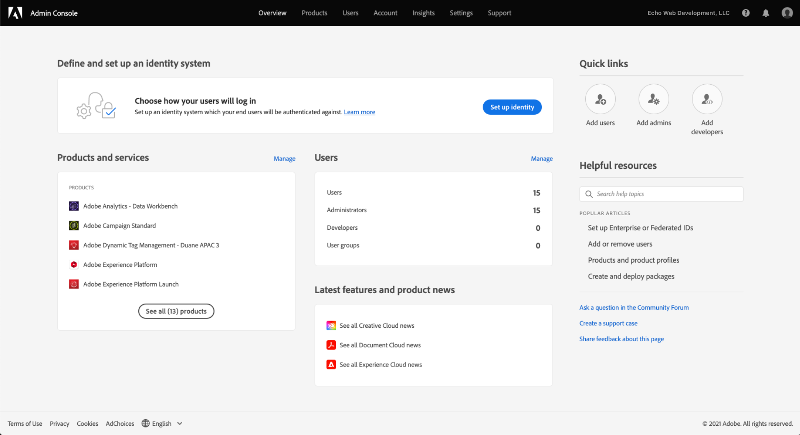
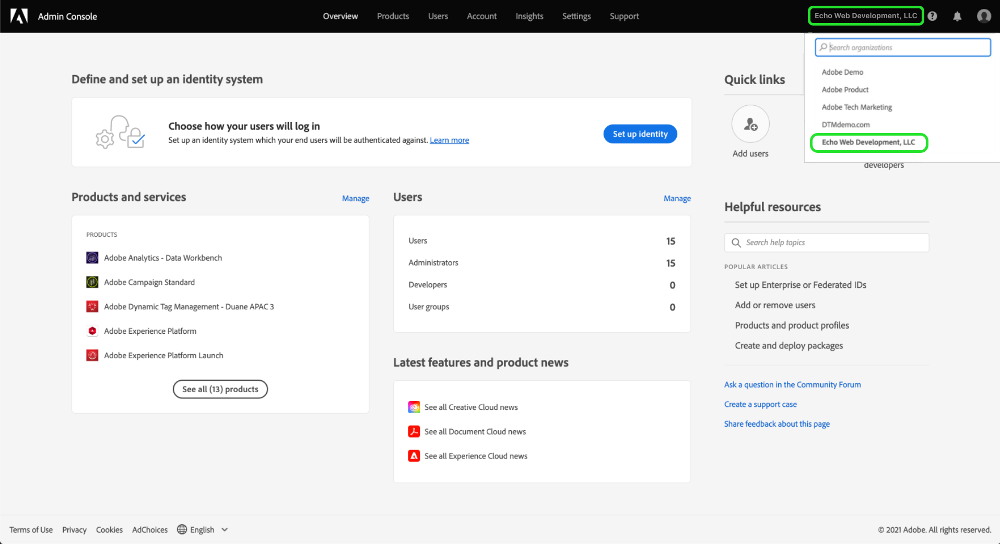

# Concedere l’accesso agli utenti

>[!NOTE]
>
>Adobe Experience Platform Launch è stato classificato come una suite di tecnologie di raccolta dati in Adobe Experience Platform. Di conseguenza, sono state introdotte diverse modifiche terminologiche nella documentazione del prodotto. Consulta questo [documento](../../term-updates.md) come riferimento consolidato delle modifiche terminologiche.

Prima di iniziare a usare l’extension_package, è necessario fornire a ogni membro del gruppo un proprio account utente e le relative autorizzazioni. Puoi eseguire questa operazione in [Adobe Admin Console](https://adminconsole.adobe.com/).

Questo documento descrive i passaggi da seguire per concedere l’accesso ad Adobe Experience Platform tramite Admin Console.

## Prerequisiti 

Per questa guida si presuppone che chi legge sia un Amministratore dell’organizzazione designato da Admin Console. Per ulteriori informazioni su Admin Console e sull’assegnazione dei ruoli, consulta le seguenti risorse:

* [Guida utente per l’amministrazione](https://helpx.adobe.com/it/enterprise/administering/user-guide.html?topic=/enterprise/administering/morehelp/introduction.ug.js): informazioni su tutte le funzioni di Admin Console
* [Ruoli di amministrazione Enterprise](https://helpx.adobe.com/it/enterprise/using/admin-roles.html): informazioni sui diversi tipi di ruolo di amministrazione. Per quanto riguarda la presente guida, si presuppone che chi legge sia un Amministratore dell’organizzazione.

## Scegliere l’organizzazione

L’amministratore dell’organizzazione Adobe Experience Cloud deve effettuare l’accesso ad [Admin Console](https://adminconsole.adobe.com/). La prima schermata è Panoramica.

Potresti avere accesso a più organizzazioni (Org). Per aggiungere la funzionalità tag all’organizzazione corretta, seleziona il nome dell’organizzazione visualizzato nell’angolo in alto a destra dello schermo. Quindi, dall’elenco a discesa, scegli l’organizzazione in cui desideri utilizzare i tag.

## Creare un profilo prodotto

Un profilo prodotto è un gruppo. Quando si assegnano specifici diritti a un profilo prodotto, questi vengono applicati a tutti gli utenti inclusi nel profilo.

Scegli il collegamento **[!UICONTROL Prodotti]** in alto ed **[!UICONTROL Experience Cloud]** a sinistra. Se l’interfaccia utente di raccolta dati non è elencata, i clienti devono contattare il team del proprio account e i partner devono inviare un’e-mail <ExchangeTechEC@adobe.com>.

La schermata precedente mostra un profilo di esempio; potresti non averne ancora uno. Per crearne uno, seleziona **[!UICONTROL Nuovo profilo]**. Nella schermata **Crea nuovo profilo**, aggiungi un **nome profilo** (ad esempio, Test raccolta dati) ed eventualmente una **descrizione**, quindi fai clic su **[!UICONTROL Salva]**:

Il profilo di prodotto viene aggiunto all’organizzazione. Ora devi aggiungere degli utenti al profilo di prodotto.

## Assegnare utenti al profilo prodotto

Il profilo prodotto mostra 0 (zero) per **Utenti autorizzati** e **Amministratori**. Fai clic sul nome del profilo prodotto creato (Test raccolta dati, nel nostro esempio).

Seleziona la scheda **[!UICONTROL Utenti]**. Qui è possibile cercare gli utenti con Adobe ID esistenti tramile il relativo indirizzo e-mail oppure aggiungere nuovi utenti a questo profilo di prodotto. Seleziona il collegamento **[!UICONTROL Aggiungi utente]**.

Immetti un nome, un gruppo di utenti o un indirizzo e-mail nel campo di testo appropriato. Se possibile, si consiglia di includere un nome e un cognome. Seleziona **[!UICONTROL Salva]** per aggiungere l’utente.

Dopo aver aggiunto al profilo prodotto tutti gli utenti necessari, aggiungeremo le relative autorizzazioni. Fai clic sulla scheda **[!UICONTROL Autorizzazioni]**. Nella schermata Autorizzazioni sono visualizzate le sezioni per le **[!UICONTROL Proprietà]**, **[!UICONTROL Diritti azienda]** e **[!UICONTROL Diritti proprietà]**. Seleziona **[!UICONTROL Modifica]**.

Per creare estensioni, il team deve disporre almeno delle seguenti autorizzazioni:

* “Gestisci proprietà” dal gruppo dell’azienda.
* “Gestisci estensioni”, “Gestisci ambienti” e “Sviluppa” dal gruppo della proprietà.

Puoi creare altri profili di prodotto con diritti più limitati in un secondo momento, ma per ora seleziona semplicemente **[!UICONTROL + Aggiungi tutto]** sia per **Diritti azienda** che per **Diritti proprietà**. Assicurati di selezionare **[!UICONTROL Salva]** per ciascuno di essi.

Finora abbiamo scelto l’organizzazione appropriata, creato un profilo prodotto, aggiunto gli utenti al profilo prodotto e assegnato le autorizzazioni.

Questa operazione completa la configurazione richiesta in Admin Console. Tutti i membri del gruppo configurati come utenti possono ora accedere all’[interfaccia utente di Data Collection](https://launch.adobe.com/).

## Confermare il provisioning

Dopo aver fornito all’azienda l’accesso ai tag e aver impostato gli utenti come descritto sopra, dovresti poter accedere all’ambiente di produzione dall’[interfaccia utente di Data Collection](https://launch.adobe.com/). Se hai effettuato il provisioning dei tag e hai completato i passaggi in Admin Console descritti qui sopra, ma non riesci ancora ad accedere all’interfaccia utente di Data Collection, contatta l’assistenza Adobe.
