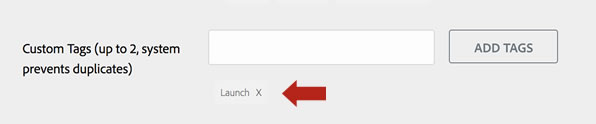

# Creare un’inserzione in Exchange per un’estensione

>[!NOTE]
>
>Adobe Experience Platform Launch è stato classificato come una suite di tecnologie di raccolta dati in Adobe Experience Platform. Di conseguenza, sono state introdotte diverse modifiche terminologiche nella documentazione del prodotto. Consulta questo [documento](../../term-updates.md) come riferimento consolidato delle modifiche terminologiche.

Adobe Experience Platform dispone di un singolo catalogo unificato in cui gli utenti possono visualizzare le estensioni tag disponibili per l’installazione. Questo catalogo è disponibile all’interno del prodotto e contiene estensioni di tre tipi:

1. **Estensioni pubbliche**: si tratta di estensioni completate progettate per l’utilizzo in produzione da parte di qualsiasi utente.
1. **Estensioni private**: si tratta di estensioni completate progettate per la produzione, ma sviluppate da altri utenti della tua azienda e disponibili solo per gli utenti della tua azienda.
1. **Estensioni di sviluppo**: queste estensioni sono in fase di sviluppo attivo e sono disponibili solo all’interno dell’azienda e solo su una proprietà specificamente designata come proprietà di sviluppo.

Separata dalle estensioni nel catalogo dei prodotti, le estensioni pubbliche hanno anche elenchi nella [Experience Cloud Exchange App Marketplace](https://exchange.adobe.com/apps/browse/ec).

Queste consentono agli sviluppatori di estensioni di pubblicare descrizioni delle funzionalità, fornire collegamenti per supporto aggiuntivo o documentazione, e presentare le estensioni a potenziali utenti che potrebbero non essere a conoscenza della società o della funzionalità dell’estensione. Nel Marketplace, all’estensione è associata un’inserzione pubblica che può essere visualizzata senza che l’utente sia autenticato su Platform. Per le estensioni pubbliche, la creazione di questo elenco di Exchange è un passaggio obbligatorio.

>[!TIP]
>
>Quando l&#39;elenco di Exchange viene pubblicato, viene aggiunto automaticamente un collegamento al contenuto dell&#39;elenco che consente ai clienti e ai potenziali clienti di fare clic su e `Connect with publisher` per ulteriori informazioni su prodotti e servizi. L&#39;indirizzo e-mail del contatto non viene visualizzato in quanto questi messaggi verranno inoltrati dal sistema Exchange.

Se non disponi di una società che possa caricare e testare il pacchetto di estensione, registrati per il programma Exchange e inizia a creare un’inserzione. Questo attiverà la creazione di un account aziendale (richiede un po’ di tempo, al termine riceverai un’e-mail) che puoi utilizzare per caricare e testare l’estensione. Anche in questo caso, gli elenchi di Exchange sono necessari solo per le estensioni pubbliche.

Se disponi già di un account aziendale o se non hai bisogno di un elenco di Exchange (solo per estensioni private), puoi saltare il resto del passaggio e procedere a [caricamento e test dell&#39;estensione](./upload-and-test.md).

## Creare un’inserzione

>[!NOTE]
>
>Il seguente processo descrive come creare l’inserzione di un’applicazione nel programma Adobe Exchange. Questo è il termine utilizzato per le varie integrazioni ed estensioni in Adobe Experience Platform.

1. Accedi al [sito Exchange Partner](https://partners.adobe.com/exchangeprogram/experiencecloud). Una volta effettuato l’accesso, fai clic sul collegamento **App Manager** accanto al tuo nome.
1. Seleziona la scheda **Crea nuova applicazione**, quindi seleziona **Crea nuova app** per una soluzione personalizzata oppure scegli un modello applicabile.
1. Specifica le informazioni della tua inserzione. Per informazioni dettagliate su App Manager, consulta il [articolo](https://adobeexchangeec.zendesk.com/hc/en-us/articles/360024197931). Le informazioni sull’inserzione devono spiegare chiaramente a cosa serve l’estensione e perché è utile. L’inserzione funge da spazio marketing per la tua app. Puoi promuovere la tua estensione con descrizioni chiare, collegamenti alle pagine di destinazione sul tuo sito, collegamenti alla documentazione, indirizzi e-mail per l’assistenza e così via. Anche se lo spazio nelle visualizzazioni delle estensioni è limitato, l’inserzione in Exchange offre l’opportunità di promuovere sia la tua estensione che la tua azienda. Di seguito sono riportati alcuni suggerimenti per promuovere meglio l’estensione:
   - **Icona app** - Assicurati che l&#39;icona per l&#39;elenco di Exchange abbia le dimensioni appropriate, 512 x 512 per png o 1:1 per jpg.

      >[!NOTE]
      >
      >Si tratta di un formato di file diverso da quello utilizzato nel codice dell’estensione. L’estensione stessa conterrà come [icona](../manifest.md) un file svg.

   - **Immagine in primo piano** - Ottieni attenzione utilizzando un&#39;immagine che può rimanere isolata e mostrerà il tuo marchio ed evidenziare la tua applicazione. L’immagine in primo piano verrà visualizzata con i collegamenti condivisi per la tua inserzione in Exchange o nei post pubblicati su di essa sui social media. Deve quindi essere una rappresentazione modello del tuo marchio.
   - **Logo dell’editore dell’app**: questo è il logo aziendale; assicurati che l’icona abbia le dimensioni appropriate, pari a 1280 x 720 oppure 2560 x 1440 (16:9) in formato png o jpg.
   - **Istruzioni di configurazione**: informa i clienti su come configurare l’estensione Adobe Experience Platform. Assicurati che siano ben chiare le impostazioni e i passaggi successivi richiesti quando viene visualizzata la [vista di configurazione](../configuration.md), subito dopo l’installazione dell’estensione in una proprietà.
   - **Tag**: nella prima pagina di modifica dell’inserzione, assicurati di includere la parola “Launch” nel campo “Tag personalizzati”. In questo modo l’inserzione verrà visualizzata nelle ricerche di tag nel marketplace Exchange:
      
   - **Sandbox**: l’accesso alle soluzioni Adobe avviene tramite un account Sandbox in cui puoi accedere a una versione completamente funzionante di Adobe Experience Platform. Gli account Sandbox sono richiesti quando si crea l’inserzione dell’applicazione. Nella sezione **Connessioni**, seleziona le connessioni specifiche valide per l’applicazione creata (estensione tag); quando premi **Salva** se necessario verrà generata la richiesta sandbox.
1. Invia l’inserzione. Il team di Adobe Exchange esaminerà l’applicazione e fornirà feedback nel caso siano necessari aggiornamenti. Se al momento dell’invio dell’inserzione contrassegni la casella **Pubblica subito**, l’applicazione verrà pubblicata non appena verrà approvata. Se desideri pubblicare l’applicazione in un secondo momento, lascia deselezionata questa opzione; dopo che l’inserzione dell’estensione sarà stata approvata, accanto ad essa, nella pagina dell’inserzione della tua app (o estensione), verrà visualizzato un pulsante blu **Pubblica**.

### Creare un’inserzione efficace

Le [linee guida per l’invio delle app](https://partners.adobe.com/exchangeprogram/experiencecloud/build/ec-exchange.html) contengono informazioni dettagliate su come creare un’inserzione convincente.

#### Dopo l’invio dell’inserzione Exchange

Dopo l’invio, il team Adobe Exchange esaminerà l’applicazione e la approverà o fornirà commenti in merito a eventuali modifiche da apportare. Questo processo è descritto nelle linee guida per l’invio delle app.

Se non disponi di un login per il sito di Exchange, assicurati che il tuo indirizzo e-mail sia registrato per il programma Exchange seguendo le istruzioni riportate nella [guida alla registrazione per il programma](https://partners.adobe.com/content/mcp/us/en/home/reg-guide.html). Ogni utente deve associare la propria e-mail all’account partner della propria azienda. Per eventuali domande su questo processo, invia un’e-mail a <ExchangeHelpEC@adobe.com>.

#### Aggiornare l’inserzione Exchange dopo l’approvazione iniziale

Se hai aggiornato l&#39;estensione, o semplicemente se desideri aggiornare l&#39;inserzione su Exchange, accedi al [portale Partner](https://partners.adobe.com/exchangeprogram/experiencecloud) e fai clic sul pulsante App Manager accanto al tuo nome. Seleziona quindi l’applicazione e segui il flusso descritto qui sopra per la creazione dell’inserzione. Dopo il nuovo invio, il team Adobe Exchange controllerà e approverà le modifiche oppure risponderà con eventuali commenti in merito alle modifiche necessarie.

## Collegare il pacchetto di estensione all’inserzione

Dopo aver approvato e reso pubblicamente disponibile l’inserzione, ti consigliamo di fornire un collegamento all’inserzione pubblica nel campo `exchange_url` del file `extension.json` all’interno del pacchetto di estensione.  Questo creerà un collegamento &quot;Ulteriori informazioni&quot; all’interno del catalogo delle estensioni dei tag in modo che gli utenti all’interno del prodotto possano trovare la tua inserzione ed è composto da informazioni aggiuntive.
