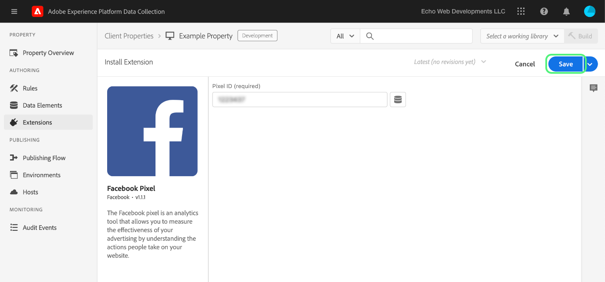

# Caricare e implementare test end-to-end

>[!NOTE]
>
>Con il suo rebranding, Adobe Experience Platform Launch viene riproposto come una suite di tecnologie per la raccolta dati all’interno di Experience Platform. Di conseguenza, sono state introdotte diverse modifiche terminologiche nella documentazione del prodotto. Consulta questo [documento](../../term-updates.md) come riferimento consolidato delle modifiche terminologiche.

Per testare le estensioni dei tag in Adobe Experience Platform, utilizza l'API tags e/o gli strumenti della riga di comando per caricare i pacchetti di estensione. Quindi, utilizza l’interfaccia utente di raccolta dati per installare il pacchetto di estensione in una proprietà ed esercitarne le funzionalità all’interno di una libreria di tag e di una build.

Questo documento illustra come implementare test end-to-end per l’estensione.

>[!NOTE]
>
>Questa guida presuppone che si stia utilizzando macOS con Node.js e npm installati e disponibili.

## Convalidare l’estensione {#validate}

Una volta che il team è soddisfatto delle prestazioni dell'estensione e dei risultati visualizzati nello strumento [Sandbox](https://www.npmjs.com/package/@adobe/reactor-sandbox#running-the-sandbox), dovresti essere pronto per caricare il pacchetto di estensione nei tag.

Prima di caricarlo, verifica la presenza di eventuali campi o impostazioni obbligatori. Ad esempio, rivedere il [manifesto di estensione](../manifest.md), la [configurazione di estensione](../configuration.md), le [visualizzazioni](../web/views.md) e i [moduli di libreria](../web/format.md) (almeno) sono buone pratiche.

Un esempio specifico è il file del logo: aggiungi una riga `"iconPath": "example.svg",` al file `extension.json` e includi il file di immagine del logo nel progetto. Percorso relativo dell'icona che verrà visualizzata per l'estensione. Non deve iniziare con una barra. Deve fare riferimento a un file SVG con estensione `.svg`. L’SVG dovrebbe apparire normalmente quando viene eseguito il rendering quadrato e può essere ridimensionato dall’interfaccia utente. Per ulteriori informazioni, consulta l’ [Come scalare l’articolo SVG](https://css-tricks.com/scale-svg/) .

>[!NOTE]
>
>Per le estensioni pubbliche, includi un elemento in `extension.json` con un collegamento all’inserzione su Exchange. Il [manifesto dell’estensione](../manifest.md) deve includere una voce come questa: `"exchangeUrl":"https://www.adobeexchange.com/experiencecloud.details.12345.html"` che punta all’URL dell’inserzione su Exchange.

## Creare un’integrazione Adobe I/O {#integration}

Per utilizzare l’API o gli strumenti della riga di comando, è necessario un account tecnico con Adobe I/O. Devi creare l’account tecnico nella console I/O e quindi utilizzare lo strumento Uploader per caricare il pacchetto di estensione.

Per informazioni sulla creazione di un account tecnico da utilizzare con i tag in Adobe Experience Platform, consulta la guida [Access Tokens](https://developer.adobelaunch.com/api/guides/access_tokens/) .

>[!IMPORTANT]
>
>Per creare un’integrazione in Adobe I/O è necessario essere un amministratore o uno sviluppatore dell’organizzazione Experience Cloud.

Se non è possibile creare un'integrazione, è probabile che non si disponga delle autorizzazioni corrette. Sarà necessario un amministratore organizzazione per completare i passaggi necessari o per assegnarti come sviluppatore.

## Caricare il pacchetto dell’estensione {#upload}

Ora che disponi delle credenziali, sei pronto per testare il pacchetto di estensione end-to-end.

La prima volta che carichi il pacchetto di estensione, questo viene posto in stato `development`. Ciò significa che è visibile solo per la tua organizzazione e solo con una proprietà contrassegnata per lo sviluppo dell'estensione.

Utilizza la riga di comando per eseguire il seguente comando all'interno della directory che contiene il pacchetto .zip.

```bash
npx @adobe/reactor-uploader
```

`npx` consente di scaricare ed eseguire un pacchetto npm senza installarlo sul computer. Questo è il modo più semplice per eseguire lo strumento Uploader.

Il caricatore richiede di inserire diverse informazioni. L’ID dell’account tecnico, la chiave API e altri bit di informazioni possono essere recuperati dalla console Adobe I/O. Passa alla [pagina Integrations](https://console.adobe.io/integrations) (Integrazioni) nella console di I/O. Seleziona l'organizzazione corretta dal menu a discesa, trova l'integrazione corretta e seleziona **[!UICONTROL Visualizza]**.

- Percorso della chiave privata: /path/to/private.key. Si tratta del luogo in cui è stata salvata la chiave privata di cui al punto 2 qui sopra.
- ID dell’organizzazione: Copia e incolla questo dalla pagina di panoramica della console I/O che hai lasciato aperta in precedenza.
- ID account tecnico: Copia e incolla questo dalla console I/O.
- Chiave API: Copia e incolla questo dalla console I/O.
- Qual è il segreto del cliente? Copia e incolla questo dalla console I/O.
- Percorso del file extension_package da caricare: /path/to/extension_package.zip. Se richiami lo strumento Uploader dalla directory che contiene il pacchetto .zip, non occorre digitarne il persorso: è sufficiente selezionarlo dall’elenco.

Il pacchetto dell’estensione verrà quindi caricato e lo strumento Uploader ti fornirà l’ID del file extension_package.

>[!NOTE]
>
>Durante il caricamento o l'applicazione di patch, il pacchetto dell'estensione viene posto in uno stato "in sospeso" mentre il sistema lo estrae in modo asincrono e lo implementa. Durante questo processo, puoi controllare l' `extension_package` ID per il suo stato utilizzando l'API e nell'interfaccia utente di raccolta dati. Nel catalogo verrà visualizzata una scheda delle estensioni contrassegnata come In sospeso.

>[!NOTE]
>
>Se prevedi di eseguire spesso il caricatore, inserire tutte queste informazioni in ogni momento può essere un fardello. È inoltre possibile trasmetterle come argomenti dalla riga di comando. Per ulteriori informazioni, consulta la sezione sugli [argomenti della riga di comando](https://www.npmjs.com/package/@adobe/reactor-uploader#command-line-arguments) nella documentazione NPM.

## Creare una proprietà di sviluppo {#property}

Dopo aver effettuato l’accesso all’interfaccia utente Raccolta dati, viene visualizzata la schermata Proprietà . Una proprietà è un contenitore per i tag da distribuire e può essere utilizzata in uno o più siti.


Al primo accesso non verranno visualizzate proprietà sullo schermo. Per crearne una, fai clic su **Nuova proprietà**. Immetti un nome e un URL. Utilizza l'URL del sito di test o la pagina in cui testerai l'estensione. Questo campo di dominio può essere utilizzato da alcune estensioni o da una condizione che utilizza l'estensione Core.

>[!NOTE]
>
>`localhost` non funziona come valore URL. Utilizza invece qualsiasi valore fittizio per il test se utilizzi un URL `localhost`. Ad esempio, example.com.

Per utilizzare questa proprietà per il test di sviluppo dell'estensione, devi espandere gli **OPTIONS AVANZATI** e assicurati di selezionare la casella **Configura per lo sviluppo dell'estensione**.


Seleziona **Salva** in basso per salvare la nuova proprietà.

Viene visualizzata la schermata Proprietà . Fai clic sul nome della proprietà appena creata. Viene visualizzata la schermata Panoramica proprietà. Fornisce collegamenti a ogni area del sistema con i collegamenti di navigazione globali nella colonna a sinistra.

## Installare l’estensione {#install-extension}

Per installare l'estensione in questa proprietà, seleziona il collegamento **Estensioni** nei collegamenti di navigazione principali nella colonna a sinistra. L'estensione **Core** viene visualizzata nella schermata **Installed** . L'estensione Core contiene tutte le funzionalità di gestione tag nella raccolta dati.


Per aggiungere l'estensione, seleziona la scheda **Catalogo** .


Il catalogo presenta le icone delle schede di ogni estensione disponibile. Se l’estensione non viene visualizzata nel catalogo, accertati di aver completato i passaggi descritti in precedenza nelle sezioni Configurazione della console di amministrazione di Adobe e Creazione del pacchetto di estensione . Il pacchetto di estensione potrebbe anche apparire in sospeso se Platform non ha completato l’elaborazione iniziale.

Se hai seguito i passaggi precedenti e non vedi ancora un pacchetto di estensione in sospeso o non riuscito nel catalogo, devi controllare lo stato del pacchetto di estensione direttamente utilizzando l'API. Per informazioni su come effettuare la chiamata API appropriata, leggi [Recupera un pacchetto di estensione](https://developer.adobelaunch.com/api/reference/1.0/extension_packages/fetch/) nella documentazione API.

Al termine dell'elaborazione del pacchetto di estensione, seleziona **Installa** nella parte inferiore della scheda.


Viene visualizzata la schermata di configurazione (purché l'estensione sia presente). Aggiungi le informazioni necessarie per configurare l'estensione e fai clic sul collegamento blu **Salva**, in basso. L'esempio della schermata di configurazione qui mostrato utilizza l'estensione Facebook che richiede un Pixel ID.



A questo punto viene visualizzata a schermata delle estensioni **installate**, con l’estensione Core e l’estensione personalizzata.


## Creare risorse per testare l’estensione {#resources}

Le estensioni offrono nuove funzionalità agli utenti di Adobe Experience Platform. In genere vengono visualizzate in Elementi dati o nel Generatore di regole.

### Elementi dati

Lo scopo degli elementi dati tag è aiutare gli utenti a mantenere valori costanti. Ogni elemento dati rappresenta una mappatura o un puntatore verso dati sorgente. Un singolo elemento dati è una variabile che può essere mappata su stringhe di query, URL, valori di cookie, variabili JavaScript e così via. Seleziona **Elementi dati** dalla barra di navigazione a sinistra e **Crea nuovo elemento dati**.


Le estensioni possono definire i tipi di elementi dati necessari per il funzionamento dell’estensione o semplicemente per comodità degli utenti. Quando un'estensione fornisce tipi di elementi dati, questi vengono visualizzati in un elenco a discesa per gli utenti nella schermata **Crea elemento dati** :


Quando un utente seleziona l'estensione dal menu a discesa **Estensione**, il menu a discesa **Tipo di elemento dati** viene compilato con tutti i tipi di elementi dati forniti dall'estensione. L’utente può quindi mappare ogni elemento dati al relativo valore sorgente. Gli elementi dati possono essere utilizzati quando si creano regole nell’evento di modifica dell’elemento dati o nell’evento Codice personalizzato per attivare una regola da eseguire. Un elemento dati può essere utilizzato anche nella condizione Elemento dati o in altre condizioni, eccezioni o azioni in una regola.

Una volta creato l’elemento dati (impostandone la mappatura), gli utenti possono fare riferimento ai dati sorgente semplicemente facendo riferimento a tale elemento dati. Se la sorgente del valore cambia (in seguito alla riprogettazione del sito, ecc.) gli utenti devono solo aggiornare la mappatura una volta nell’interfaccia utente di raccolta dati e tutti gli elementi dati riceveranno automaticamente il nuovo valore sorgente.

### Regole

Seleziona il collegamento **Regole** nel menu di navigazione a sinistra, quindi **Crea nuova regola**.


Innanzitutto, inserisci un nome descrittivo per la regola. La schermata **Crea regola** è impostata come un'istruzione `if-then`.


Se si verifica un evento, le condizioni vengono rispettate e non ci sono eccezioni, l’azione viene attivata. Lo stesso flusso esiste nelle estensioni in cui è possibile creare o riutilizzare eventi, condizioni, eccezioni, elementi dati o azioni.

Utilizzando l'esempio di estensione Facebook, aggiungi un evento per ogni volta che una pagina viene caricata sul sito di test.


La `Window Loaded` **Tipo evento** assicura che ogni volta che una pagina viene caricata sul sito di test questa regola venga attivata. Seleziona **Mantieni modifiche**. In questo esempio, ignora **Conditions** come regola deve essere attivata per qualsiasi pagina del sito di test.

In **AZIONI** selezionare **Aggiungi**. Viene visualizzata la schermata **Configurazione azione**.Quindi devi scegliere l'estensione a cui applicare la regola e l'azione da eseguire quando la regola viene attivata. Seleziona **Facebook Pixel** dall'elenco a discesa **Estensione** e **Invia visualizzazione pagina** dall'elenco a discesa **Tipo azione**. Seleziona **Mantieni modifiche**, quindi **Salva** nella seguente schermata **Modifica regola**.


Durante il test dell'estensione, seleziona tutti gli eventi, le condizioni e così via pertinenti. fornito dall’estensione in un numero qualsiasi di regole.

## Pubblicare le modifiche {#publish}

Nell'area di navigazione principale, fai clic su **Pubblicazione**, quindi sul collegamento **Aggiungi nuova libreria**:


Una libreria è un insieme di istruzioni che definiscono il modo in cui estensioni, elementi dati e regole interagiscono tra loro e con il sito web. Le librerie vengono compilate in build. Una libreria può contenere tutte le modifiche che l’utente potrà fare o testare contemporaneamente.

Nella schermata **Crea libreria** , aggiungi un nome nel campo di testo **Nome** . I tag forniscono un ambiente di sviluppo predefinito denominato **Sviluppo**. Seleziona **Sviluppo** dall'elenco a discesa **Ambiente**. Per semplicità, aggiungi tutte le risorse disponibili. Seleziona **Aggiungi tutte le risorse modificate**, quindi seleziona **Salva**.

>[!NOTE]
>
>Quando si aggiunge una risorsa a una libreria, viene creata un'istantanea della risorsa nel momento esatto e viene aggiunta alla libreria. Quando si apportano modifiche alle risorse in un secondo momento (ad esempio, a seguito di correzioni da apportare), si deve anche aggiornare la libreria per includere le modifiche più recenti alle risorse. Il pulsante **Aggiungi tutte le risorse modificate** è utile anche a questo scopo.


Ora che tutte le modifiche sono state incluse nella libreria appena creata (denominata **dev** nell'esempio fornito), seleziona **Salva e genera in sviluppo**.


Al termine del processo di compilazione, accanto al nome della libreria viene visualizzato un indicatore verde **success** .


La libreria tag viene ora pubblicata e può essere utilizzata. La pagina di test deve utilizzare la libreria appena creata per testare il comportamento della pagina per l’utente finale in un browser.

## Installare i tag in un sito di test {#install-data-collection-tags}

Le istruzioni di installazione sono disponibili nella scheda Ambienti . Questa pagina visualizza tutti gli ambienti disponibili e consente di crearne di più. Quando la libreria è stata pubblicata nell'ambiente di sviluppo, seleziona l'icona della casella nella colonna **INSTALL** nella riga **Sviluppo**.


Viene visualizzata la finestra di dialogo **Istruzioni di installazione Web** per l&#39;ambiente di sviluppo. Seleziona l’icona Copia per copiare l’intero tag `<script>`.


Completa l&#39;installazione inserendo questo singolo tag `<script>` all&#39;interno della sezione `<head>` del documento o del modello di sito. Quindi, visita il sito di test per esaminare il comportamento della libreria di tag pubblicati.

## Test {#test}

Di seguito è riportato un elenco di comandi console utili per convalidare l’estensione nella pagina o nel sito di prova.

- `_satellite.setDebug(true);` consentirà la modalità di debug e di generare utili istruzioni di registrazione nella console.
- L&#39;oggetto `_satellite._container` contiene informazioni utili sulla libreria distribuita, compresi dettagli su Build, Data Elements, Rules ed Extensions inclusi.

L&#39;obiettivo di questo test è quello di verificare la funzionalità della libreria distribuita e garantire che il pacchetto di estensione si comporti come previsto dopo essere stato implementato in una libreria.

Se occorre apportare delle modifiche al pacchetto di estensione, il processo di iterazione è simile a quello di sviluppo.

1. Apporta le modifiche al codice nel progetto..
1. Convalida le modifiche con lo strumento Sandbox.
1. Utilizza lo strumento Packager per creare un nuovo pacchetto .zip.
1. Utilizza lo strumento Uploader per caricare il nuovo pacchetto .zip. Il processo segue le stesse istruzioni di prima per quanto riguarda il caricamento iniziale. Tuttavia, poiché esiste già un pacchetto di estensione di tale nome in modalità di sviluppo, questo nuovo pacchetto sovrascrive la versione precedente invece di crearne una nuova.

   >[!NOTE]
   >
   >Gli argomenti possono essere passati sulla riga di comando per risparmiare tempo evitando l&#39;immissione ripetuta delle credenziali. Per ulteriori informazioni, consulta la [documentazione sul caricatore di reattori](https://www.npmjs.com/package/@adobe/reactor-uploader).
1. Il passaggio di installazione può essere ignorato quando si aggiorna un pacchetto esistente.
1. Modifica risorse: se la configurazione di uno qualsiasi dei componenti dell’estensione è stata modificata, dovrai aggiornare tali risorse nell’interfaccia utente Raccolta dati.
1. Aggiungi le modifiche più recenti alla libreria e genera di nuovo.
1. Completare un altro ciclo di test.

<!--
## Document {#document}

Your [exchange listing](./create-listing.md) is a great place for marketing and support information for your extension, but our tags [Help Docs](https://experienceleague.adobe.com/docs/launch/using/overview.html) are used every day by our customers. We encourage you to submit a pull request to [add your extension documentation](https://github.com/AdobeDocs/launch.en/blob/master/help/extension-reference/3rd-party-extensions.md) into the tags user docs. Open source docs for the win! 🚀
-->
