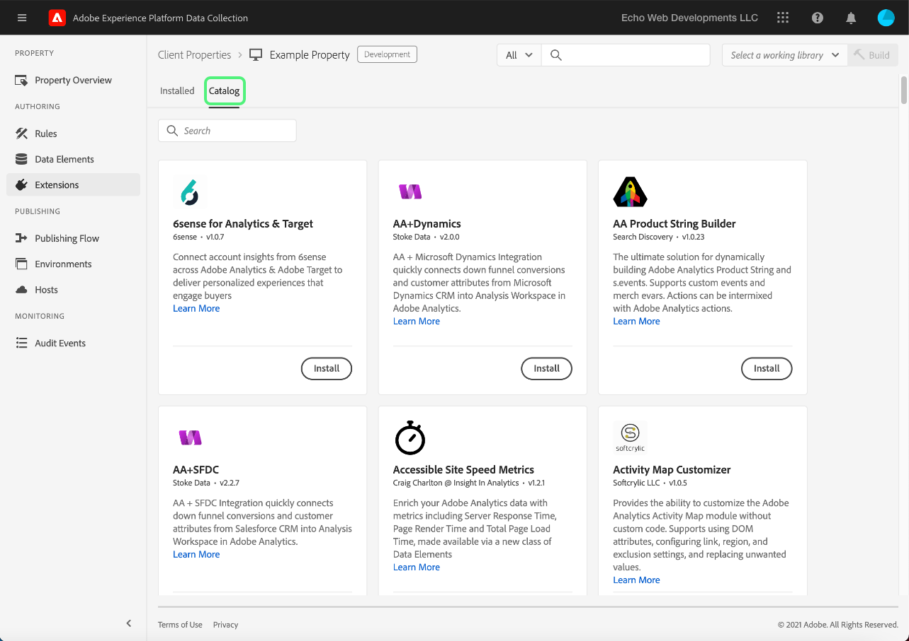

# Caricare e implementare test end-to-end

>[!NOTE]
>
>Adobe Experience Platform Launch è stato classificato come una suite di tecnologie di raccolta dati in Adobe Experience Platform. Di conseguenza, sono state introdotte diverse modifiche terminologiche nella documentazione del prodotto. Consulta questo [documento](../../term-updates.md) come riferimento consolidato delle modifiche terminologiche.

Per testare le estensioni dei tag in Adobe Experience Platform, utilizza l’API dei tag e/o strumenti per riga di comando per caricare i pacchetti di estensione. Quindi, utilizza l’interfaccia utente di Data Collection per installare il pacchetto di estensione in una proprietà ed esercitarne le funzionalità all’interno di una libreria tag e di una build.

Questo documento illustra come implementare test end-to-end per l’estensione.

>[!NOTE]
>
>Questa guida presuppone che si stia utilizzando macOS con Node.js e npm installati e disponibili.

## Convalidare l’estensione {#validate}

Una volta che il team è soddisfatto delle prestazioni dell’estensione e dei risultati visualizzati nello strumento [Sandbox](https://www.npmjs.com/package/@adobe/reactor-sandbox#running-the-sandbox), il pacchetto di estensione dovrebbe essere pronto per essere caricato sui tag.

Prima di caricarlo, verifica la presenza di eventuali campi o impostazioni obbligatori. Ad esempio, è consigliabile rivedere (come minimo) il [manifesto dell’estensione](../manifest.md), la [configurazione dell’estensione](../configuration.md), le [viste](../web/views.md) e i [moduli libreria](../web/format.md).

Un esempio specifico è il file del logo: aggiungi una riga `"iconPath": "example.svg",` al file `extension.json` e includi il file di immagine del logo nel progetto. Percorso relativo dell’icona che verrà visualizzata per l’estensione. Non deve iniziare con una barra. Deve fare riferimento a un file SVG con estensione `.svg`. Il file SVG deve apparire corretto quando viene riprodotto con proporzioni quadrate e può essere ridimensionato dall’interfaccia utente. Per ulteriori informazioni, consulta l’articolo su [come ridimensionare i file SVG](https://css-tricks.com/scale-svg/).

>[!NOTE]
>
>Per le estensioni pubbliche, includi un elemento in `extension.json` con un collegamento all’inserzione su Exchange. Il [manifesto dell’estensione](../manifest.md) deve includere una voce come questa: `"exchangeUrl":"https://www.adobeexchange.com/experiencecloud.details.12345.html"` che punta all’URL dell’inserzione su Exchange.

## Creare un’integrazione Adobe I/O {#integration}

Per utilizzare l’API o strumenti per riga di comando, è necessario un account tecnico per Adobe I/O. Devi creare l’account tecnico nella console I/O e quindi utilizzare lo strumento Uploader per caricare il pacchetto di estensione.

Per informazioni sulla creazione di un account tecnico da utilizzare con i tag in Adobe Experience Platform, consulta la guida [Token di accesso](https://developer.adobelaunch.com/api/guides/access_tokens/).

>[!IMPORTANT]
>
>Per creare un’integrazione in Adobe I/O è necessario essere un amministratore o uno sviluppatore dell’organizzazione Experience Cloud.

Se non è possibile creare un’integrazione, è probabile che non si disponga delle autorizzazioni corrette. In tal caso, un amministratore dell’organizzazione dovrà completare i passaggi necessari oppure dovrà assegnarti il ruolo di sviluppatore.

## Caricare il pacchetto dell’estensione {#upload}

Ora che disponi delle credenziali, sei pronto per testare il pacchetto di estensione end-to-end.

La prima volta che carichi il pacchetto di estensione, questo viene posto in stato `development`. Ciò significa che è visibile solo per la tua organizzazione e solo con una proprietà contrassegnata per lo sviluppo dell’estensione.

Utilizza la riga di comando per eseguire il seguente comando all’interno della directory che contiene il pacchetto .zip.

```bash
npx @adobe/reactor-uploader
```

`npx` consente di scaricare ed eseguire un pacchetto npm senza installarlo sul computer. Questo è il modo più semplice per eseguire lo strumento Uploader.

Nello strumento Uploader è necessario inserire diverse informazioni. L’ID dell’account tecnico, la chiave API e altre informazioni possono essere recuperati dalla console di Adobe I/O. Passa alla [pagina Integrations](https://console.adobe.io/integrations) (Integrazioni) nella console di I/O. Seleziona l’organizzazione adatta dal menu a discesa, individua l’integrazione corretta e seleziona **[!UICONTROL Visualizza]**.

- Percorso della chiave privata: /path/to/private.key. Si tratta del luogo in cui è stata salvata la chiave privata di cui al punto 2 qui sopra.
- ID dell’organizzazione: è disponibile nella pagina di panoramica della console di I/O lasciata aperta in precedenza; usa Copia/Incolla.
- ID account tecnico: è disponibile nella console I/O; usa Copia/Incolla.
- Chiave API: è disponibile nella console I/O; usa Copia/Incolla.
- Segreto cliente: è disponibile nella console I/O; usa Copia/Incolla.
- Percorso del file extension_package da caricare: /path/to/extension_package.zip. Se richiami lo strumento Uploader dalla directory che contiene il pacchetto .zip, non occorre digitarne il persorso: è sufficiente selezionarlo dall’elenco.

Il pacchetto dell’estensione verrà quindi caricato e lo strumento Uploader ti fornirà l’ID del file extension_package.

>[!NOTE]
>
>Durante il caricamento o l&#39;applicazione di patch, il pacchetto dell&#39;estensione viene posto in uno stato &quot;in sospeso&quot; mentre il sistema lo estrae in modo asincrono e lo implementa. Durante questo processo, puoi controllare lo stato dell’ID `extension_package` utilizzando l’API e nell’interfaccia utente di Data Collection. Nel catalogo verrà visualizzata una scheda di estensioni contrassegnata come In sospeso.

>[!NOTE]
>
>Se pensi di dover eseguire spesso lo strumento di caricamento, inserire tutte queste informazioni ogni volta può risultare laborioso. È possibile trasmettere questi elementi anche come argomenti dalla riga di comando. Per ulteriori informazioni, consulta la sezione sugli [argomenti della riga di comando](https://www.npmjs.com/package/@adobe/reactor-uploader#command-line-arguments) nella documentazione NPM.

## Creare una proprietà di sviluppo {#property}

Dopo aver effettuato l’accesso all’interfaccia utente di Data Collection, viene visualizzata la schermata Proprietà. Una proprietà è un contenitore per i tag da distribuire e può essere utilizzata in uno o più siti.


Al primo accesso non viene visualizzate alcuna proprietà. Per crearne una, fai clic su **Nuova proprietà**. Immetti un nome e un URL. Utilizza l’URL del sito di test o la pagina in cui testerai l’estensione. Questo campo di dominio può essere utilizzato da alcune estensioni o da una condizione tramite l’estensione Core.

>[!NOTE]
>
>`localhost` non funziona come valore URL. Se utilizzi un URL `localhost`, utilizza piuttosto un valore fittizio per il test. Ad esempio, example.com.

Per utilizzare questa proprietà per il test di sviluppo delle estensioni, espandi le **Opzioni avanzate** e assicurati di selezionare la casella **Configura per lo sviluppo delle estensioni**.


Seleziona **Salva** in basso per salvare la nuova proprietà.

Viene visualizzata la schermata Proprietà. Fai clic sul nome della proprietà appena creata. Viene visualizzata la schermata Panoramica proprietà. Fornisce collegamenti a ogni area del sistema con i collegamenti di navigazione globali nella colonna a sinistra.

## Installare l’estensione {#install-extension}

Per installare l’estensione in questa proprietà, seleziona il collegamento **Estensioni**, nell’area di navigazione principale nella colonna sinistra. L’estensione **Core** viene visualizzata nella schermata **Installato**. L’estensione Core contiene tutte le funzionalità per la gestione dei tag disponibili in Data Collection.


Per aggiungere la tua estensione, seleziona la scheda **Catalogo**.



Il catalogo presenta le icone delle schede di ogni estensione disponibile. Se l’estensione non viene visualizzata nel catalogo, assicurati di aver completato i passaggi descritti nelle sezioni precedenti sull’impostazione di Adobe Admin Console e sulla creazione del pacchetto di estensione. Se Platform non ha completato l’elaborazione iniziale, il pacchetto di estensione potrebbe essere visualizzato come In sospeso.

Se hai seguito i passaggi precedenti e non vedi ancora un pacchetto di estensione in sospeso o non riuscito nel catalogo, controlla lo stato del pacchetto di estensione direttamente utilizzando l’API. Per informazioni su come effettuare la chiamata API appropriata, leggi [Recuperare un pacchetto di estensione](https://developer.adobelaunch.com/api/reference/1.0/extension_packages/fetch/) nella documentazione dell’API.

Al termine dell’elaborazione del pacchetto di estensione, seleziona **Installa** nella parte inferiore della scheda.


Viene visualizzata la schermata di configurazione (se presente nell’estensione). Aggiungi le informazioni necessarie per configurare l&#39;estensione e fai clic sul collegamento blu **Salva**, in basso. L’esempio della schermata di configurazione qui mostrato utilizza l’estensione Facebook che richiede un ID Pixel.


A questo punto viene visualizzata a schermata delle estensioni **installate**, con l’estensione Core e l’estensione personalizzata.


## Creare risorse per testare l’estensione {#resources}

Le estensioni offrono nuove funzionalità agli utenti di Adobe Experience Platform. In genere vengono visualizzate in Elementi dati o nel Generatore di regole.

### Elementi dati

Lo scopo degli elementi dati tag è aiutare gli utenti a mantenere i valori. Ogni elemento dati rappresenta una mappatura o un puntatore verso dati sorgente. Un singolo elemento dati è una variabile che può essere mappata su stringhe di query, URL, valori di cookie, variabili JavaScript e così via. Seleziona **Elementi dati** dalla barra di navigazione a sinistra e quindi **Crea nuovo elemento dati**.


Le estensioni possono definire i tipi di elementi dati necessari per il funzionamento dell’estensione o semplicemente per comodità degli utenti. Quando un’estensione fornisce tipi di elementi dati, questi vengono visualizzati agli utenti in un elenco a discesa nella schermata **Crea elemento dati**:


Quando un utente seleziona l’estensione dal menu a discesa **Estensione**, il menu a discesa **Tipo di elemento dati** viene compilato con i tipi di elemento dati fornito dall’estensione. L’utente può quindi mappare ogni elemento dati al relativo valore sorgente. Gli elementi dati possono essere utilizzati quando si creano regole nell’evento di modifica dell’elemento dati o nell’evento Codice personalizzato per attivare una regola da eseguire. Un elemento dati può essere utilizzato anche nella Condizione elemento dati o in altre Condizioni, Eccezioni o Azioni in una regola.

Una volta creato l’elemento dati (impostandone la mappatura), gli utenti possono fare riferimento ai dati sorgente semplicemente facendo riferimento a tale elemento dati. Se la sorgente del valore cambia (in seguito alla riprogettazione del sito, ecc.) gli utenti dovranno aggiornare la mappatura solo una volta nell’interfaccia di Data Collection e tutti gli elementi dati riceveranno automaticamente il nuovo valore sorgente.

### Regole

Seleziona il collegamento **Regole** nell’area di navigazione a sinistra, quindi **Crea nuova regola**.


Innanzitutto, inserisci un nome descrittivo per la regola. La schermata **Crea regola** è impostata come un’istruzione `if-then`.


Se si verifica un evento, le condizioni vengono rispettate e non ci sono eccezioni, l’azione viene attivata. Lo stesso flusso esiste nelle estensioni in cui è possibile creare o riutilizzare eventi, condizioni, eccezioni, elementi dati o azioni.

Utilizzando l’esempio dell’estensione Facebook, aggiungi un evento per ogni volta che una pagina viene caricata sul sito di test.


Il **Tipo evento** `Window Loaded` assicura che la regola venga attivata ogni volta che una pagina viene caricata sul sito di test. Seleziona **Mantieni modifiche**. In questo esempio, ignora **Condizioni** dato che la regola deve essere attivata per qualsiasi pagina del sito di test.

In **Azioni** seleziona **Aggiungi**. Viene visualizzata la schermata **Configurazione azione**. Quindi devi scegliere l’estensione a cui applicare la regola e l’azione da eseguire quando la regola viene attivata. Seleziona **Facebook Pixel** dall’elenco a discesa **Estensione** e **Invia visualizzazione pagina** dall’elenco a discesa **Tipo azione**. Seleziona **Mantieni modifiche**, quindi **Salva** nella seguente schermata **Modifica regola**.


Durante il test dell’estensione, seleziona tutti gli eventi, le condizioni e così via pertinenti. fornito dall’estensione in un numero qualsiasi di regole.

## Pubblicare le modifiche {#publish}

Nell&#39;area di navigazione principale, fai clic su **Pubblicazione**, quindi sul collegamento **Aggiungi nuova libreria**:


Una libreria è un insieme di istruzioni che definiscono il modo in cui estensioni, elementi dati e regole interagiscono tra loro e con il sito web. Le librerie vengono compilate in build. Una libreria può contenere tutte le modifiche che l’utente potrà fare o testare contemporaneamente.

Nella schermata **Crea libreria**, aggiungi un nome nel campo di testo **Nome**. I tag forniscono un ambiente di sviluppo predefinito denominato **Sviluppo**. Seleziona **Sviluppo** dall’elenco a discesa **Ambiente**. Per semplicità, aggiungi tutte le risorse disponibili. Seleziona **Aggiungi tutte le risorse modificate**, quindi seleziona **Salva**.

>[!NOTE]
>
>Quando si aggiunge una risorsa a una libreria, viene creata un&#39;istantanea della risorsa nel momento esatto e viene aggiunta alla libreria. Quando si apportano modifiche alle risorse in un secondo momento (ad esempio, a seguito di correzioni da apportare), si deve anche aggiornare la libreria per includere le modifiche più recenti alle risorse. Il pulsante **Aggiungi tutte le risorse modificate** è utile anche a questo scopo.


Ora che tutte le modifiche sono state incluse nella libreria appena creata (denominata **dev** nell’esempio fornito), seleziona **Salva e genera in sviluppo**.


Al termine del processo di generazione, accanto al nome della libreria compare un indicatore verde di **operazione riuscita**.


La libreria di tag è ora pubblicata e può essere utilizzata. La pagina di test deve utilizzare la libreria appena creata per testare il comportamento della pagina per l’utente finale in un browser.

## Installare i tag in un sito di test {#install-data-collection-tags}

Le istruzioni di installazione sono disponibili nella scheda Ambienti. Questa pagina visualizza tutti gli ambienti disponibili e consente di crearne altri. Poiché la libreria è stata pubblicata nell’ambiente di sviluppo, seleziona l’icona della casella nella colonna **Installa**, alla riga **Sviluppo**.


La **Istruzioni di installazione web** viene visualizzata la finestra di dialogo per l&#39;ambiente di sviluppo. Seleziona l’icona Copia per copiare l’intero tag `<script>`.


Per completare l’installazione, inserisci questo singolo tag `<script>` nella sezione `<head>` del documento o del modello del sito. Quindi, visita il sito di test per esaminare il comportamento della libreria di tag pubblicata.

## Test {#test}

Di seguito è riportato un elenco di comandi console utili per convalidare l’estensione nella pagina o nel sito di prova.

- `_satellite.setDebug(true);` abiliterà la modalità di debug e presenterà utili istruzioni di registrazione nella console.
- L’oggetto `_satellite._container` contiene informazioni utili sulla libreria implementata, inclusi i dettagli relativi a build, elementi dati, regole ed estensioni.

L’obiettivo di questo test è quello di verificare la funzionalità della libreria implementata e garantire che il pacchetto di estensione si comporti come previsto dopo essere stato compilato in una libreria.

Se occorre apportare delle modifiche al pacchetto di estensione, il processo di iterazione è simile a quello di sviluppo.

1. Apporta le modifiche al codice nel progetto..
1. Convalida le modifiche con lo strumento Sandbox.
1. Utilizza lo strumento Packager per creare un nuovo pacchetto .zip.
1. Utilizza lo strumento Uploader per caricare il nuovo pacchetto .zip. Il processo segue le stesse istruzioni riportate per il caricamento iniziale. Tuttavia, poiché esiste già un pacchetto di estensione con tale nome in modalità di sviluppo, questo nuovo pacchetto sovrascrive la versione precedente invece di crearne una nuova.

   >[!NOTE]
   >
   >Gli argomenti possono essere passati sulla riga di comando per risparmiare tempo, evitando di immettere più volte le credenziali. Per ulteriori informazioni, consulta la [documentazione sullo strumento Uploader di Reactor](https://www.npmjs.com/package/@adobe/reactor-uploader).
1. Quando si aggiorna un pacchetto esistente, il passaggio di installazione può essere saltato.
1. Modifica le risorse: se la configurazione di uno dei componenti dell’estensione è stata modificata, dovrai aggiornare tali risorse nell’interfaccia utente di Data Collection.
1. Aggiungi le modifiche più recenti alla libreria e procedi di nuovo alla sua generazione.
1. Completa un altro ciclo di test.
